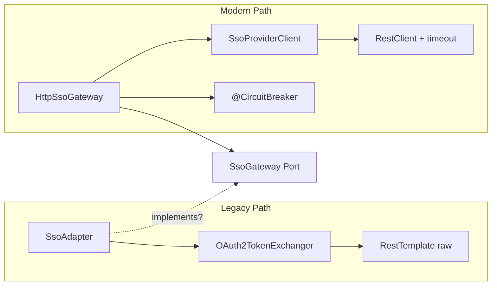
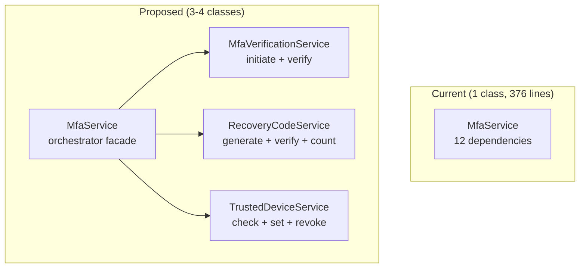

# Comparison Analysis: Auth-Service Optimization Approaches

> Phase 4 — So sánh các giải pháp cho mỗi optimization item dựa trên research findings.

---

## 1. OPT-01: SwitchDomain Authorization Bypass (P0)

### Approaches Compared

| Approach | Mô tả | Pros | Cons | Fit |
|----------|--------|------|------|-----|
| **A: UserDomainPort check** | Tạo port mới, query DB cho membership | Clean Architecture compliant, explicit | Thêm 1 port + adapter | ⭐ Best |
| B: @PreAuthorize SpEL | Spring Security method-level check | Framework-native | Tight coupling với Spring Security | Good |
| C: Hibernate Filter | Auto-scope queries | Transparent | Over-engineering cho 1 endpoint | Overkill |

**Decision**: **Approach A** — Tạo `UserDomainPort.existsByUserIdAndDomainCode(userId, domainCode): Boolean`

### Research Evidence (OWASP)
- Pattern: "Never trust an ID provided by the client" → `findByIdAndTenantId` thay vì `findById`
- `repository.findByUserIdAndDomainCode()` → nếu null → `PermissionDeniedException`

---

## 2. OPT-NEW: Legacy SSO Cleanup (P1)

### Current State — Dual Implementation



### Approaches

| Approach | Mô tả | Risk | Effort |
|----------|--------|------|--------|
| **A: Migrate SsoAdapter → use SsoGateway** | SsoAdapter inject SsoGateway thay vì OAuth2TokenExchanger | Low | Medium |
| B: Merge SsoAdapter logic into HttpSsoGateway | Di chuyển JIT provisioning logic | Medium | High |
| C: Delete SsoAdapter, use HttpSsoGateway directly | Remove abstraction layer | High (break callers) | Low |

**Decision**: **Approach A** — Giữ SsoAdapter cho orchestration logic (JIT provisioning, audit), nhưng delegate HTTP calls thông qua SsoGateway port thay vì OAuth2TokenExchanger trực tiếp. Sau đó xóa OAuth2TokenExchanger.

---

## 3. OPT-04: Permission Cache Invalidation (P1)

### Approaches

| Approach | Cache stampede risk | Precision | Complexity |
|----------|-------------------|-----------|------------|
| A: Full cache clear (hiện tại) | ⚠️ HIGH | ❌ Broad | Low |
| **B: Targeted key eviction** | ✅ LOW | ✅ Precise | Medium |
| C: Short TTL only (no Kafka) | ✅ None | ⚠️ Eventually consistent | Low |

**Decision**: **Approach B** — Parse Kafka JSON message → extract `userId` + `domainId` → evict specific cache keys `permissions:{userId}:{domainId}` + `roles:{userId}:{domainId}`.

### Implementation Notes
- Event format: `{"userId": 123, "domainId": 456, "action": "ROLE_ASSIGNED"}`
- Fallback: nếu parse fail → full cache clear (graceful degradation)
- Safety net: TTL on all cache entries (30s for permissions, 60s for roles)

---

## 4. OPT-06: MfaService SRP Split (P2)

### Current vs Proposed



### Approaches

| Approach | Classes | Effort | Risk |
|----------|---------|--------|------|
| A: Keep as-is | 1 | None | Tech debt accumulates |
| **B: Extract RecoveryCodeService only** | 2 | Low | ✅ Minimal |
| C: Full split (4 services) | 4 | High | Interface changes |

**Decision**: **Approach B (incremental)** — Chỉ extract `RecoveryCodeService` trước. MfaService giảm từ 376 → ~300 lines, deps giảm từ 12 → 10.

---

## 5. OPT-07: Async Audit Logging (P2)

### Approaches

| Approach | Data Loss Risk | Performance Gain | Complexity |
|----------|---------------|-----------------|------------|
| A: Sync (hiện tại) | ❌ None | ❌ Blocks request | Low |
| **B: @TransactionalEventListener + @Async** | ⚠️ Low (crash window) | ✅ Non-blocking | Medium |
| C: Outbox Pattern | ❌ None (at-least-once) | ✅ Non-blocking | High |

**Decision**: **Approach B** — Sử dụng `@TransactionalEventListener(phase = AFTER_COMMIT)` + `@Async("auditExecutor")` với bounded thread pool. Không dùng outbox pattern (over-engineering cho audit — audit không yêu cầu exactly-once).

### Key Config
```kotlin
@Bean("auditExecutor")
fun auditExecutor(): TaskExecutor = ThreadPoolTaskExecutor().apply {
    corePoolSize = 2
    maxPoolSize = 5
    queueCapacity = 100
    setRejectedExecutionHandler(CallerRunsPolicy()) // fallback sync
}
```

---

## 6. OPT-08: Password History Query (P2)

### Approaches

| Approach | SQL Generated | Memory | DB Load |
|----------|-------------|--------|---------|
| A: `findAll().take(N)` (hiện tại) | `SELECT * FROM password_history WHERE user_id = ?` | **ALL records** | Full scan |
| **B: `findTopNByUserIdOrderByCreatedAtDesc`** | `SELECT * FROM ... ORDER BY created_at DESC LIMIT N` | **N records** | Index scan |

**Decision**: **Approach B** — Thay đổi duy nhất trong `PasswordHistoryRepository`:
```kotlin
fun findTop5ByUserIdOrderByCreatedAtDesc(userId: Long): List<PasswordHistoryEntity>
```

### Pre-requisite
- Index: `idx_password_history_user_created` trên `(user_id, created_at DESC)` — verify đã tồn tại

---

## 7. OPT-09: PKCE Support (P3)

### Research Conclusion
Spring Security **auto-enables PKCE** khi `client-authentication-method: none`.

**Decision**: **Config-only change** — Không cần code mới, chỉ thêm client registration config:
```yaml
spring.security.oauth2.client.registration.spa-client:
  client-authentication-method: none  # triggers PKCE
```

**Deferred**: Chỉ cần khi có SPA/mobile client sử dụng OAuth2 flow trực tiếp.

---

## 8. OPT-13: QR Code Endpoint (P3)

### Research Conclusion
Library `dev.samstevens.totp:1.7.1` **đã có sẵn** trong dependencies và cung cấp `QrGenerator` + `ZxingPngQrGenerator`.

**Decision**: Thêm endpoint `GET /api/auth/mfa/totp/qr-code` trả về Base64 data URI.

---

## Gap Analysis Summary

| Item | Gap Score | Resolution Strategy |
|------|-----------|-------------------|
| OPT-01 | **CRITICAL** — No authorization check | Create UserDomainPort + query |
| OPT-NEW | **HIGH** — Dual SSO implementation | Migrate SsoAdapter → SsoGateway, delete OAuth2TokenExchanger |
| OPT-04 | **HIGH** — Stale permissions | Targeted cache eviction via parsed Kafka events |
| OPT-06 | **MED** — SRP violation | Extract RecoveryCodeService incrementally |
| OPT-07 | **MED** — Sync audit blocks request | @TransactionalEventListener + @Async |
| OPT-08 | **MED** — Unnecessary data load | findTopN derived query |
| OPT-09 | **LOW** — Missing PKCE | Config-only (auto-enabled by Spring) |
| OPT-13 | **LOW** — No QR endpoint | Use existing lib |

---

> **Next step**: Phase 5 (Business Analysis) → Phase 6 (Technical Spec)
