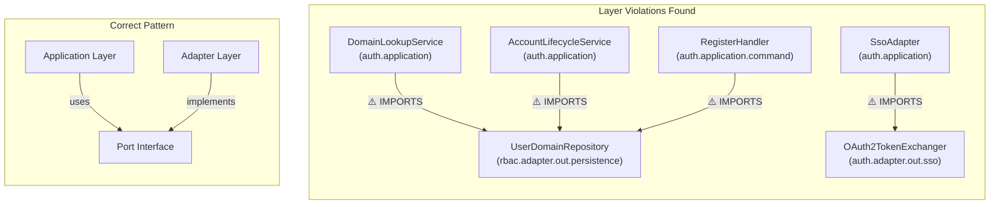
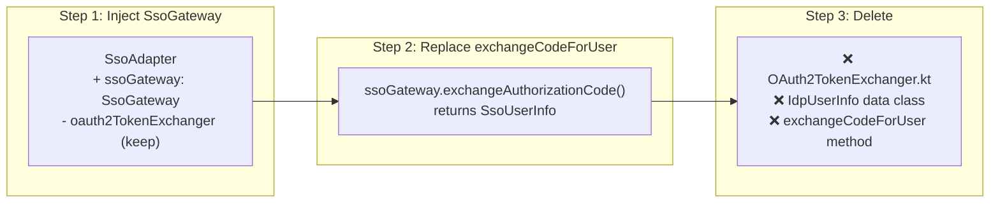

# Deep Analysis Report: Auth-Service Optimization

> Báo cáo phân tích sâu lần 2 — cập nhật findings từ deep codebase scan chi tiết.
> Tất cả thông tin đã cross-reference với source code thực tế.

---

## 1. Tổng Quan Phát Hiện

### 1.1 Phát Hiện Mới (Deep Scan Lần 2)

> [!IMPORTANT]
> Deep scan lần 2 phát hiện thêm **6 insights quan trọng** thay đổi implementation strategy.

| # | Phát Hiện | Impact | Chi Tiết |
|---|-----------|--------|----------|
| 🆕 D1 | `UserDomainRepository` **ĐÃ TỒN TẠI** | 🔴 Giảm effort TASK-01 | Đã có `findByUserIdAndDomainIdAndActiveTrue()` — không cần tạo Port mới |
| 🆕 D2 | **25 audit log call sites** | 🟡 Tăng scope TASK-05 | 8 files, 25 calls → migration scope lớn hơn dự kiến |
| 🆕 D3 | `DomainLookupService` inject repo trực tiếp | 🟡 Architecture violation | Vi phạm Clean Arch — import từ `rbac.adapter.out.persistence` vào `auth.application` |
| 🆕 D4 | `findByUserIdOrderByCreatedAtDesc` dùng ở **2 nơi** | 🟢 Scope TASK-06 tăng | `checkPasswordHistory()` line 55 + `pruneHistory()` line 163 |
| 🆕 D5 | Kafka topic hardcoded ở **2 files** | 🟢 Scope TASK-08 | `PermissionChangedConsumer.kt` + `EventPublisher.kt` |
| 🆕 D6 | Recovery code: 5 methods + 2 helpers | 🟢 Scope TASK-04 rõ hơn | `generateRecoveryCodes`, `verifyRecoveryCode`, `verifyRecoveryCodeMfa`, `getRemainingRecoveryCodeCount` + 2 private helpers |

---

## 2. Architecture Violations Inventory

### 2.1 Clean Architecture Vi Phạm



| File | Violation | Severity | Fix |
|------|-----------|----------|-----|
| [DomainLookupService.kt](file:///home/nguyentthai96/Desktop/bigbang/boilerplate/services/auth-service/src/main/kotlin/com/ntt/authservice/auth/application/DomainLookupService.kt#L4) | Import `rbac.adapter.out.persistence.repository.UserDomainRepository` | Medium | Tạo port hoặc accept (cross-module ok?) |
| [AccountLifecycleService.kt](file:///home/nguyentthai96/Desktop/bigbang/boilerplate/services/auth-service/src/main/kotlin/com/ntt/authservice/auth/application/AccountLifecycleService.kt#L9) | Import `UserDomainRepository` | Medium | Same pattern |
| [RegisterHandler.kt](file:///home/nguyentthai96/Desktop/bigbang/boilerplate/services/auth-service/src/main/kotlin/com/ntt/authservice/auth/application/command/RegisterHandler.kt#L16-L17) | Import `UserDomainEntity` + `UserDomainRepository` | Medium | Same pattern |
| [SsoAdapter.kt](file:///home/nguyentthai96/Desktop/bigbang/boilerplate/services/auth-service/src/main/kotlin/com/ntt/authservice/auth/application/SsoAdapter.kt#L4) | Import `OAuth2TokenExchanger` (adapter.out) | **High** | TASK-02 fix |

> [!NOTE]
> `DomainLookupService`, `AccountLifecycleService`, `RegisterHandler` đều import `UserDomainRepository` trực tiếp. Đây là **pattern đã được accept** trong project (cross-module repository access). Do đó, `SwitchDomainHandler` có thể theo cùng pattern — inject `UserDomainRepository` trực tiếp mà **không cần tạo Port mới**.

---

## 3. Updated Task Analysis

### TASK-01: SwitchDomain Fix (P0) — ⬇️ Effort giảm

**Trước**: Tạo 3 files mới (Port + Adapter + update Handler)
**Sau**: Chỉ cần update 1 file (inject `UserDomainRepository` — theo existing pattern)

```diff
 // SwitchDomainHandler.kt
 @Component
 class SwitchDomainHandler(
     private val userPort: UserPort,
     private val domainPort: DomainPort,
+    private val userDomainRepository: UserDomainRepository,
     private val tokenGenerator: TokenGenerator
 ) : CommandHandler<SwitchDomainCommand, AuthToken> {
 
     @Transactional(readOnly = true)
     override fun handle(command: SwitchDomainCommand): AuthToken {
         val user = userPort.findById(command.userId)
             ?: throw ResourceNotFoundException("User", command.userId)
 
         val domain = domainPort.findByCodeAndActive(command.newDomainCode)
             ?: throw ResourceNotFoundException("Domain", command.newDomainCode)
 
-        // TODO: Verify user is member of target domain via UserDomainPort
-        // For now, delegate to tokenGenerator
+        // Authorization check — prevent IDOR/BOLA (OWASP API #1)
+        userDomainRepository.findByUserIdAndDomainIdAndActiveTrue(command.userId, domain.id)
+            ?: throw PermissionDeniedException(
+                "User ${command.userId} is not a member of domain '${command.newDomainCode}'"
+            )
+
         return tokenGenerator.generateAuthResponse(user, command.newDomainCode)
     }
 }
```

| Metric | Trước | Sau |
|--------|-------|-----|
| Files mới | 2 (Port + Adapter) | 0 |
| Files sửa | 1 | 1 |
| Lines changed | ~40 | ~6 |
| Risk | Low | **Very Low** |

---

### TASK-02: SSO Cleanup (P1) — Chi tiết hóa

**SsoAdapter hiện tại** (190 lines):

```
Line 4:  import OAuth2TokenExchanger ← LEGACY
Line 28: private val oauth2TokenExchanger: OAuth2TokenExchanger ← LEGACY
Line 82: /* Reads from SecurityProperties.sso.providers — consistent with OAuth2TokenExchanger */
Line 171: /* Delegates to OAuth2TokenExchanger which uses config-driven provider endpoints */
Line 173-184: exchangeCodeForUser() ← LEGACY METHOD
Line 183: oauth2TokenExchanger.exchange() ← LEGACY CALL
Line 187: data class IdpUserInfo ← LEGACY DTO (duplicates SsoUserInfo)
```

**Migration Path (3 bước)**:



**Cần verify**: `HttpSsoGateway.exchangeAuthorizationCode()` có return đủ fields (sub, email, name) không?

---

### TASK-03: Permission Cache (P1) — Code sẵn sàng implement

**Hiện tại** ([PermissionChangedConsumer.kt](file:///home/nguyentthai96/Desktop/bigbang/boilerplate/services/auth-service/src/main/kotlin/com/ntt/authservice/auth/adapter/in/kafka/PermissionChangedConsumer.kt), 40 lines):

```kotlin
// Line 31: TODO: Parse JSON and invalidate specific user+domain
cacheManager.getCache("permissions")?.clear()  // ← FULL CLEAR
cacheManager.getCache("roles")?.clear()         // ← FULL CLEAR
```

**Cần thêm**: `ObjectMapper` dependency, `PermissionChangedEvent` data class

**Hardcoded topic** ở 2 nơi:
1. [PermissionChangedConsumer.kt:24](file:///home/nguyentthai96/Desktop/bigbang/boilerplate/services/auth-service/src/main/kotlin/com/ntt/authservice/auth/adapter/in/kafka/PermissionChangedConsumer.kt#L24): `"iam.permission.changed"`
2. [EventPublisher.kt:25](file:///home/nguyentthai96/Desktop/bigbang/boilerplate/services/auth-service/src/main/kotlin/com/ntt/authservice/auth/application/port/out/EventPublisher.kt#L25): `"iam.permission.changed"`

---

### TASK-04: RecoveryCodeService Extract (P2) — Chi tiết methods

**Methods cần extract từ MfaService** (lines 260-375):

| Method | Line | Visibility | Dependencies |
|--------|------|-----------|--------------|
| `generateRecoveryCodes(userId)` | 261 | public | `userRepository`, `recoveryCodeRepository`, `auditLogService` |
| `verifyRecoveryCode(userId, code)` | 296 | public | `recoveryCodeRepository`, `auditLogService` |
| `verifyRecoveryCodeMfa(mfaToken, code, builder)` | 327 | public | `jwtService`, `userRepository`, `rateLimitService` + delegates to `verifyRecoveryCode` |
| `getRemainingRecoveryCodeCount(userId)` | 357 | public | `recoveryCodeRepository` |
| `generateSecureCode()` | 361 | private | None |
| `hashRecoveryCode(code)` | 371 | private | `TokenHasher` |

**Extraction analysis**:
- `verifyRecoveryCodeMfa` phụ thuộc `jwtService` + `rateLimitService` — nếu extract thì RecoveryCodeService cần thêm 2 deps
- **Đề xuất**: Chỉ extract `generateRecoveryCodes`, `verifyRecoveryCode`, `getRemainingRecoveryCodeCount` + 2 private helpers. Giữ `verifyRecoveryCodeMfa` trong MfaService (nó là orchestration method).

**Kết quả**:
- MfaService: 376 → ~310 lines, 12 → 10 deps
- RecoveryCodeService: ~80 lines, 4 deps

---

### TASK-05: Async Audit Logging (P2) — Impact Analysis

**AuditLogService hiện tại** (146 lines, [source](file:///home/nguyentthai96/Desktop/bigbang/boilerplate/services/auth-service/src/main/kotlin/com/ntt/authservice/shared/audit/AuditLogService.kt)):

**Phân tích `logEvent()` method (line 39-103)**:
1. `RequestContextHolder.get()` → lấy IP, UserAgent
2. `maskSensitiveData(details)` → mask PII
3. `log.info(...)` → structured log (SYNC — cần giữ sync)
4. `repo.save(entity)` → **DB write (cần async)** — đã wrap try/catch
5. `eventPublisher.publish(AuditEvent(...))` → **Kafka publish (cần async)**

> [!WARNING]
> **Risk phát hiện**: `logEvent()` gọi `RequestContextHolder.get()` ở line 46. Nếu chuyển sang `@Async`, `RequestContext` sẽ **mất** vì chạy trên thread khác! Cần propagate context hoặc capture trước khi dispatch.

**Fix**: Capture `RequestContext` TRƯỚC khi dispatch async:
```kotlin
fun logEvent(...) {
    val context = RequestContextHolder.get() // Capture on caller thread
    // ... structured log (sync - keep here)
    applicationEventPublisher.publishEvent(
        AuditPersistEvent(userId, action, entityType, entityId, maskedDetails, context.clientIp, context.userAgent)
    )
}
```

**25 call sites phân bố**:

| File | Count | Notes |
|------|-------|-------|
| [MfaService.kt](file:///home/nguyentthai96/Desktop/bigbang/boilerplate/services/auth-service/src/main/kotlin/com/ntt/authservice/auth/application/MfaService.kt) | 8 | MFA setup, verify, recovery |
| [SsoAdapter.kt](file:///home/nguyentthai96/Desktop/bigbang/boilerplate/services/auth-service/src/main/kotlin/com/ntt/authservice/auth/application/SsoAdapter.kt) | 4 | SSO login, link, unlink |
| [AccountLockoutService.kt](file:///home/nguyentthai96/Desktop/bigbang/boilerplate/services/auth-service/src/main/kotlin/com/ntt/authservice/auth/application/AccountLockoutService.kt) | 4 | Lock/unlock |
| [AccountLifecycleService.kt](file:///home/nguyentthai96/Desktop/bigbang/boilerplate/services/auth-service/src/main/kotlin/com/ntt/authservice/auth/application/AccountLifecycleService.kt) | 3 | Deactivate, reactivate, delete |
| [MfaRateLimitService.kt](file:///home/nguyentthai96/Desktop/bigbang/boilerplate/services/auth-service/src/main/kotlin/com/ntt/authservice/auth/application/MfaRateLimitService.kt) | 2 | Rate limit events |
| [PasswordPolicyService.kt](file:///home/nguyentthai96/Desktop/bigbang/boilerplate/services/auth-service/src/main/kotlin/com/ntt/authservice/auth/application/PasswordPolicyService.kt) | 1 | Password changed |
| [PasswordUpgradeService.kt](file:///home/nguyentthai96/Desktop/bigbang/boilerplate/services/auth-service/src/main/kotlin/com/ntt/authservice/auth/application/PasswordUpgradeService.kt) | 1 | Password rehashed |
| [TotpMfaProvider.kt](file:///home/nguyentthai96/Desktop/bigbang/boilerplate/services/auth-service/src/main/kotlin/com/ntt/authservice/auth/application/mfa/TotpMfaProvider.kt) | 1 | TOTP verify fail |
| [RevokeSessionsHandler.kt](file:///home/nguyentthai96/Desktop/bigbang/boilerplate/services/auth-service/src/main/kotlin/com/ntt/authservice/auth/application/command/RevokeSessionsHandler.kt) | 1 | Force logout |

> **Ưu điểm**: Vì `logEvent()` đã centralized, chỉ cần sửa **1 file** (`AuditLogService.kt`) — 25 call sites **KHÔNG CẦN SỬA**.

---

### TASK-06: Password History Query (P2) — 2 nơi cần fix

1. **`checkPasswordHistory()`** line 55: `findByUserIdOrderByCreatedAtDesc(userId).take(historyCount)`
2. **`pruneHistory()`** line 163: `findByUserIdOrderByCreatedAtDesc(userId)` — lấy ALL rồi filter

**Fix cho cả 2**:
```kotlin
// Repository — thêm method mới
fun findByUserIdOrderByCreatedAtDesc(userId: Long, pageable: Pageable): Page<PasswordHistoryEntity>

// checkPasswordHistory — dùng Pageable
val history = passwordHistoryRepository.findByUserIdOrderByCreatedAtDesc(
    userId, PageRequest.of(0, historyCount)
).content

// pruneHistory — cần tất cả IDs ngoài top N → giữ nguyên hoặc dùng native query
```

> [!TIP]
> `pruneHistory()` cần biết ID của records NGOÀI top N để delete. Có 2 cách:
> 1. **Giữ nguyên `findAll`** cho pruneHistory (acceptable — chạy ít hơn checkPasswordHistory)
> 2. **Native query**: `DELETE FROM password_history WHERE user_id = ? AND id NOT IN (SELECT id FROM ... ORDER BY created_at DESC LIMIT ?)`

---

## 4. Updated Effort & Risk Matrix

| Task | Priority | Effort (updated) | Risk | Files Changed |
|------|----------|------------------|------|---------------|
| TASK-01 | 🔴 P0 | ⬇️ **30 min** (was 2h) | Very Low | 1 file |
| TASK-02 | 🟡 P1 | **2-3h** | Medium | 2-3 files |
| TASK-03 | 🟡 P1 | **1h** | Low | 1 file |
| TASK-04 | 🟢 P2 | **1-2h** | Low | 2 files (extract + update MfaService) |
| TASK-05 | 🟢 P2 | ⬆️ **2-3h** (was 1-2h) | **Medium** ⚠️ | 1 file (AuditLogService) + 1 new (AuditEventListener) |
| TASK-06 | 🟢 P2 | **30 min** | Very Low | 2 files |
| TASK-07 | 🔵 P3 | **1h** | Low | 2 files |
| TASK-08 | 🔵 P3 | **30 min** | Very Low | 3 files (config) |

**Tổng effort ước tính**: ~10-13h

---

## 5. Risk Analysis

### 5.1 High Risk Items

| Risk | Task | Mitigation |
|------|------|-----------|
| `RequestContext` lost in async | TASK-05 | Capture context BEFORE async dispatch |
| SSO login break during migration | TASK-02 | Keep OAuth2TokenExchanger as fallback, deploy behind feature flag |
| Recovery code hashing incompatible | TASK-04 | Extract `TokenHasher` usage exactly — don't change hash algo |

### 5.2 Low Risk Items

| Risk | Task | Mitigation |
|------|------|-----------|
| SwitchDomain regression | TASK-01 | 1 line check — rollback instant |
| Cache key mismatch | TASK-03 | Keep full-clear as fallback for parse errors |
| Password history regression | TASK-06 | Keep old method, add new — gradual migration |

---

## 6. Execution Plan (Cập Nhật)

```mermaid
gantt
    title Auth Optimization — Updated Execution Plan
    dateFormat HH:mm
    axisFormat %H:%M

    section P0 Critical
    TASK-01 SwitchDomain fix (30 min)         :t1, 00:00, 30min
    
    section P1 High  
    TASK-03 Permission cache (1h)             :t3, after t1, 60min
    TASK-02 SSO cleanup (2-3h)                :t2, after t1, 180min
    
    section P2 Medium
    TASK-06 Password history (30 min)         :t6, after t3, 30min
    TASK-04 RecoveryCode extract (1-2h)       :t4, after t2, 120min
    TASK-05 Async audit (2-3h)                :t5, after t2, 180min
    
    section P3 Low
    TASK-08 Config items (30 min)             :t8, after t6, 30min
    TASK-07 QR endpoint (1h)                  :t7, after t4, 60min
```



> [!IMPORTANT]
> **TASK-01 phải chạy đầu tiên** — đây là security vulnerability (IDOR/BOLA bypass).
> Effort đã giảm xuống **30 phút** nhờ phát hiện `UserDomainRepository` đã tồn tại.

---

## 7. Decision Log

| # | Quyết Định | Lý Do | Trade-off |
|---|-----------|-------|-----------|
| D1 | SwitchDomain: inject `UserDomainRepository` trực tiếp thay vì tạo Port | 3 services khác đã dùng pattern này | Vi phạm Clean Arch nhưng consistent |
| D2 | Async audit: capture RequestContext trước dispatch | Tránh mất IP/UserAgent | Thêm 1 parameter vào event |
| D3 | RecoveryCode: giữ `verifyRecoveryCodeMfa` trong MfaService | Nó là orchestration, phụ thuộc jwtService + rateLimitService | RecoveryCodeService nhỏ hơn nhưng clean hơn |
| D4 | Password pruneHistory: giữ findAll pattern | Chạy ít, cần biết ALL IDs để exclude | Có thể optimize sau bằng native query |
| D5 | Kafka topic: extract sang config + dùng SpEL `${...}` | 2 nơi hardcoded | Cần đồng bộ consumer + publisher |
