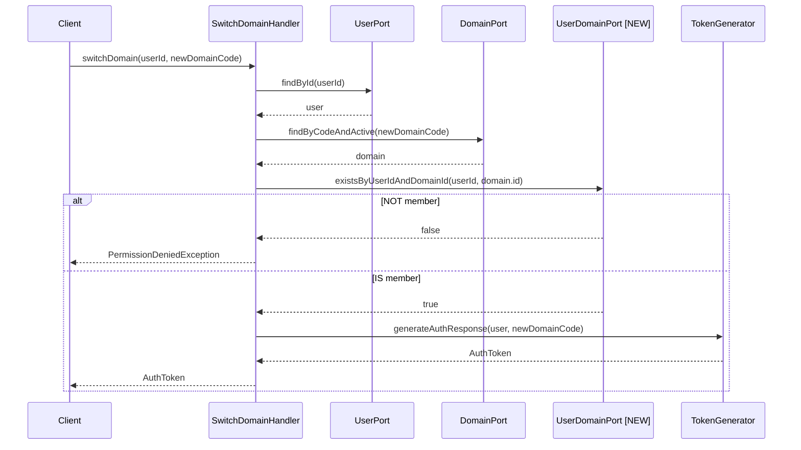
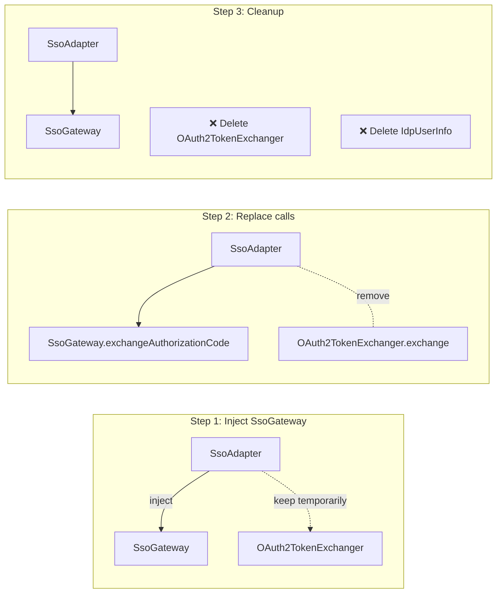

# Technical Specification: Auth-Service Optimization

> Phase 6 — Đặc tả kỹ thuật chi tiết cho tất cả optimization items.
> Agent-ready — mỗi task có đủ context để implement trực tiếp.

---

## 1. Architecture Overview

### Current State vs Target State

```mermaid
graph TB
    subgraph "CURRENT STATE"
        direction TB
        SDH[SwitchDomainHandler<br>❌ No domain membership check]
        SA[SsoAdapter<br>⚠️ Uses OAuth2TokenExchanger directly]
        OTE[OAuth2TokenExchanger<br>❌ Raw RestTemplate, no timeout]
        HSG[HttpSsoGateway<br>✅ @CircuitBreaker + timeout]
        PCC[PermissionChangedConsumer<br>⚠️ Full cache clear]
        MFS[MfaService<br>⚠️ 376 lines, 12 deps]
        ALS[AuditLogService<br>⚠️ Synchronous]
        PPS[PasswordPolicyService<br>⚠️ findAll+take]
    end

    subgraph "TARGET STATE"
        direction TB
        SDH2[SwitchDomainHandler<br>✅ UserDomainPort check]
        SA2[SsoAdapter<br>✅ Uses SsoGateway port]
        HSG2[HttpSsoGateway<br>✅ Only SSO HTTP impl]
        PCC2[PermissionChangedConsumer<br>✅ Targeted eviction]
        MFS2[MfaService + RecoveryCodeService<br>✅ SRP compliant]
        ALS2[AuditLogService<br>✅ Async events]
        PPS2[PasswordPolicyService<br>✅ findTopN]
    end
```



---

## 2. Implementation Tasks

### TASK-01: Fix SwitchDomain Authorization Bypass (P0 — CRITICAL)

**File**: [SwitchDomainHandler.kt](file:///home/nguyentthai96/Desktop/bigbang/boilerplate/services/auth-service/src/main/kotlin/com/ntt/authservice/auth/application/command/SwitchDomainHandler.kt)

**Sequence Diagram**:


**Step 1 — Create UserDomainPort**:
```kotlin
// auth/application/port/out/UserDomainPort.kt
package com.ntt.authservice.auth.application.port.out

/**
 * Port for checking user-domain membership.
 * Prevents IDOR/BOLA attacks on domain switching.
 */
interface UserDomainPort {
    fun existsByUserIdAndDomainId(userId: Long, domainId: Long): Boolean
}
```

**Step 2 — Create JPA Adapter**:
```kotlin
// auth/adapter/out/persistence/JpaUserDomainAdapter.kt
@Component
class JpaUserDomainAdapter(
    private val userDomainRepository: UserDomainRepository
) : UserDomainPort {
    override fun existsByUserIdAndDomainId(userId: Long, domainId: Long): Boolean =
        userDomainRepository.existsByUserIdAndDomainId(userId, domainId)
}
```

**Step 3 — Update SwitchDomainHandler**:
```kotlin
@Component
class SwitchDomainHandler(
    private val userPort: UserPort,
    private val domainPort: DomainPort,
    private val userDomainPort: UserDomainPort, // NEW
    private val tokenGenerator: TokenGenerator
) : CommandHandler<SwitchDomainCommand, AuthToken> {

    @Transactional(readOnly = true)
    override fun handle(command: SwitchDomainCommand): AuthToken {
        val user = userPort.findById(command.userId)
            ?: throw ResourceNotFoundException("User", command.userId)

        val domain = domainPort.findByCodeAndActive(command.newDomainCode)
            ?: throw ResourceNotFoundException("Domain", command.newDomainCode)

        // Authorization check — prevent IDOR/BOLA
        if (!userDomainPort.existsByUserIdAndDomainId(command.userId, domain.id)) {
            throw PermissionDeniedException(
                "User ${command.userId} is not a member of domain '${command.newDomainCode}'"
            )
        }

        return tokenGenerator.generateAuthResponse(user, command.newDomainCode)
    }
}
```

**Test**: Cross-domain test — User from Domain A tries switching to Domain B → should get 403.

**Impact**: LOW — Thêm dependency mới, không thay đổi interface.

---

### TASK-02: Cleanup Legacy SSO Path (P1)

**Files affected**:
- [SsoAdapter.kt](file:///home/nguyentthai96/Desktop/bigbang/boilerplate/services/auth-service/src/main/kotlin/com/ntt/authservice/auth/application/SsoAdapter.kt) — **MODIFY**: Inject `SsoGateway` thay vì `OAuth2TokenExchanger`
- [OAuth2TokenExchanger.kt](file:///home/nguyentthai96/Desktop/bigbang/boilerplate/services/auth-service/src/main/kotlin/com/ntt/authservice/auth/adapter/out/sso/OAuth2TokenExchanger.kt) — **DELETE** after migration
- `IdpUserInfo` (inner class in SsoAdapter) — **DELETE**: Dùng `SsoUserInfo` từ `SsoGateway`

**Migration Path**:



**Key changes in SsoAdapter**:
```kotlin
// BEFORE (legacy):
private val tokenExchanger: OAuth2TokenExchanger
// ...
val result = tokenExchanger.exchange(provider, code, redirectUri, clientId, clientSecret)
val idpUser = IdpUserInfo(sub = result.sub, email = result.email, name = result.name)

// AFTER (modern):
private val ssoGateway: SsoGateway
// ...
val ssoUser = ssoGateway.exchangeAuthorizationCode(provider, code, redirectUri)
// ssoUser already has externalId, email, name, avatarUrl, provider
```

**Impact**: MEDIUM — SsoAdapter callers are unaffected (same public interface). Internal delegation changes.

---

### TASK-03: Permission Cache Targeted Invalidation (P1)

**File**: [PermissionChangedConsumer.kt](file:///home/nguyentthai96/Desktop/bigbang/boilerplate/services/auth-service/src/main/kotlin/com/ntt/authservice/auth/adapter/in/kafka/PermissionChangedConsumer.kt)

```kotlin
// Define event DTO
data class PermissionChangedEvent(
    val userId: Long?,
    val domainId: Long?,
    val action: String?
)

@KafkaListener(topics = ["\${app.kafka.topics.permission-changed:iam.permission.changed}"], groupId = "auth-service")
fun onPermissionChanged(message: String) {
    log.info("Received permission change event: {}", message)

    try {
        val event = objectMapper.readValue(message, PermissionChangedEvent::class.java)

        if (event.userId != null && event.domainId != null) {
            // Targeted invalidation
            val permKey = "permissions:${event.userId}:${event.domainId}"
            val roleKey = "roles:${event.userId}:${event.domainId}"
            cacheManager.getCache("permissions")?.evict(permKey)
            cacheManager.getCache("roles")?.evict(roleKey)
            log.info("Targeted cache invalidation: userId={}, domainId={}", event.userId, event.domainId)
        } else {
            // Fallback: full invalidation when payload is incomplete
            cacheManager.getCache("permissions")?.clear()
            cacheManager.getCache("roles")?.clear()
            log.warn("Full cache invalidation — incomplete event payload")
        }
    } catch (ex: Exception) {
        // Graceful degradation: full clear on parse error
        cacheManager.getCache("permissions")?.clear()
        cacheManager.getCache("roles")?.clear()
        log.error("Failed to parse permission event, falling back to full invalidation: {}", ex.message, ex)
    }
}
```

**Impact**: LOW — Same Kafka topic, better precision.

---

### TASK-04: Extract RecoveryCodeService (P2)

**Source**: [MfaService.kt](file:///home/nguyentthai96/Desktop/bigbang/boilerplate/services/auth-service/src/main/kotlin/com/ntt/authservice/auth/application/MfaService.kt) (extract recovery-related methods)

**New file**: `auth/application/RecoveryCodeService.kt`

**Methods to extract**:
- `generateRecoveryCodes(userId: Long): List<String>`
- `verifyRecoveryCode(userId: Long, code: String): Boolean`
- `getRecoveryCodeCount(userId: Long): Int`
- `regenerateRecoveryCodes(userId: Long): List<String>`

**Dependencies moved out of MfaService**:
- `recoveryCodeRepository: MfaRecoveryCodeRepository`
- `TokenHasher` (for code hashing)

**Impact**: LOW — MfaService delegates to RecoveryCodeService. No interface changes for callers.

---

### TASK-05: Async Audit Logging (P2)

**File**: [AuditLogService.kt](file:///home/nguyentthai96/Desktop/bigbang/boilerplate/services/auth-service/src/main/kotlin/com/ntt/authservice/shared/audit/AuditLogService.kt)

**Approach**: Domain event → `@TransactionalEventListener(phase = AFTER_COMMIT)` → `@Async("auditExecutor")`

```kotlin
// 1. Define audit event
data class AuditEvent(
    val userId: Long,
    val action: AuditAction,
    val resourceType: String,
    val resourceId: String,
    val details: String?
)

// 2. Publisher (in AuditLogService)
fun logEvent(userId: Long, action: AuditAction, resourceType: String, resourceId: String, details: String? = null) {
    eventPublisher.publishEvent(AuditEvent(userId, action, resourceType, resourceId, details))
}

// 3. Listener (new class)
@Component
class AuditEventListener(private val auditLogRepository: AuditLogRepository) {
    @Async("auditExecutor")
    @TransactionalEventListener(phase = TransactionPhase.AFTER_COMMIT)
    fun handleAuditEvent(event: AuditEvent) {
        auditLogRepository.save(AuditLogEntity.from(event))
    }
}
```

**Impact**: MEDIUM — Audit writes no longer block request. CallerRunsPolicy as fallback.

---

### TASK-06: Password History Query Optimization (P2)

**File**: `PasswordHistoryRepository.kt`

```kotlin
// BEFORE:
fun findByUserIdOrderByCreatedAtDesc(userId: Long): List<PasswordHistoryEntity>
// Usage: .take(historyCount) — loads ALL then truncates in memory

// AFTER (add new method, keep old for backward compat):
fun findTop5ByUserIdOrderByCreatedAtDesc(userId: Long): List<PasswordHistoryEntity>
// Spring Data generates: SELECT ... ORDER BY created_at DESC LIMIT 5
```

**File**: [PasswordPolicyService.kt](file:///home/nguyentthai96/Desktop/bigbang/boilerplate/services/auth-service/src/main/kotlin/com/ntt/authservice/auth/application/PasswordPolicyService.kt) line 55-57

```kotlin
// BEFORE:
val history = passwordHistoryRepository.findByUserIdOrderByCreatedAtDesc(userId).take(historyCount)

// AFTER (dynamic N using Pageable):
val history = passwordHistoryRepository.findByUserIdOrderByCreatedAtDesc(
    userId, PageRequest.of(0, historyCount)
).content
```

**Impact**: LOW — Performance improvement, no behavior change.

---

### TASK-07: QR Code Endpoint (P3)

**New endpoint**: `GET /api/auth/mfa/totp/qr-code`

```kotlin
// In CqrsAuthController (or new MfaController)
@GetMapping("/mfa/totp/qr-code")
fun getTotpQrCode(@AuthenticationPrincipal user: UserPrincipal): ResponseEntity<Map<String, String>> {
    val qrDataUri = totpService.generateQrCode(user.email, user.totpSecret)
    return ResponseEntity.ok(mapOf("qrCode" to qrDataUri))
}

// In TotpService
fun generateQrCode(email: String, secret: String): String {
    val qrData = QrData.Builder()
        .label(email)
        .secret(secret)
        .issuer(securityProperties.totp.issuer)
        .algorithm(HashingAlgorithm.SHA1)
        .digits(6)
        .period(30)
        .build()
    val generator = ZxingPngQrGenerator()
    val imageData = generator.generate(qrData)
    return Utils.getDataUriForImage(imageData, generator.getImageMimeType())
}
```

**Impact**: LOW — New additive endpoint.

---

### TASK-08: Config Items (P3)

**8a. PKCE Support** — Config only:
```yaml
# application.yml
spring.security.oauth2.client.registration:
  spa-client:
    client-authentication-method: none  # auto-enables PKCE
```

**8b. Kafka Topic Config** — Extract hardcoded topic:
```yaml
app.kafka.topics:
  permission-changed: iam.permission.changed
```

**Impact**: LOW — Config changes only.

---

## 3. Execution Order

```mermaid
gantt
    title Auth-Service Optimization Execution Plan
    dateFormat X
    axisFormat %s

    section P0 Critical
    TASK-01 SwitchDomain fix        :t1, 0, 2
    
    section P1 High
    TASK-02 SSO cleanup             :t2, after t1, 3
    TASK-03 Permission cache        :t3, after t1, 2
    
    section P2 Medium
    TASK-04 RecoveryCodeService     :t4, after t2, 2
    TASK-05 Async audit             :t5, after t2, 2
    TASK-06 Password history query  :t6, after t2, 1
    
    section P3 Low
    TASK-07 QR code endpoint        :t7, after t4, 1
    TASK-08 Config items            :t8, after t4, 1
```



**Execution Rules**:
1. **TASK-01 FIRST** — Security fix, no dependencies
2. **TASK-02, TASK-03 after TASK-01** — P1 items, can be parallel
3. **TASK-04, 05, 06 after TASK-02** — P2 items, TASK-02 affects shared code
4. **TASK-07, 08 last** — P3 items, independent

---

## 4. Agent Implementation Notes

### Pre-requisites
- [ ] Run `gitnexus_impact` trước khi sửa bất kỳ symbol nào
- [ ] Verify `UserDomainRepository` hoặc equivalent tồn tại trong rbac module
- [ ] Run tests trước và sau mỗi task

### Constraints
- Clean Architecture: port → adapter direction
- Constructor injection only (no @Autowired)
- RFC 7807 ProblemDetail cho error responses
- Audit log mọi security-relevant actions
- Vietnamese cho documentation, English cho code

### Files to NOT modify
- `HttpSsoGateway.kt` — đã hoàn thiện
- `HttpClientConfig.kt` — đã hoàn thiện
- `application-core-resilience.yml` — đã hoàn thiện

### Dependencies to add
- Không cần thêm dependency mới (tất cả lib đã có sẵn)
