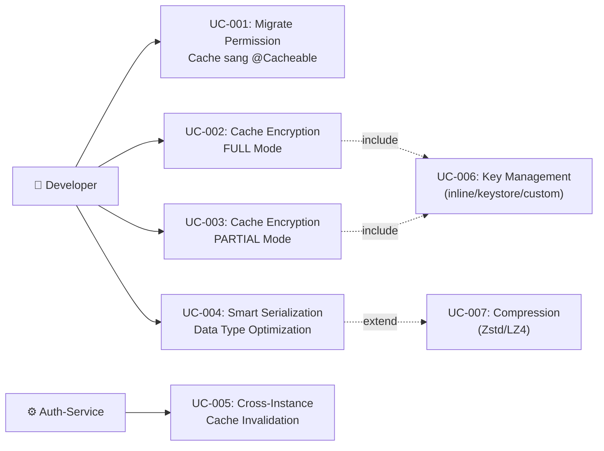

# Tài liệu phân tích nghiệp vụ: Cache Starter Migration & Upgrade

> Phân tích nghiệp vụ chi tiết — chia nhỏ theo use case, đặc tả ngữ nghĩa từng chức năng.

---

## 1. Tổng quan (Overview)

### 1.1 Bối cảnh nghiệp vụ (Business Context)
Auth-service là microservice xác thực và phân quyền trung tâm cho toàn bộ hệ thống NTT Platform. Hệ thống cache permissions, roles, session tokens trong Redis để giảm latency cho mỗi request. Hiện tại:
1. **Code duplication**: Custom cache code (~300 LOC) trùng lặp với `base-cache-starter` platform library
2. **Security risk**: PII data (email, phone) và sensitive data (session tokens) lưu plaintext trong Redis — vi phạm chính sách security at rest
3. **Operational gap**: Không có cache metrics (hit/miss/eviction), không có cross-instance L1 invalidation — gây stale permission data

### 1.2 Mục tiêu (Objectives)

| # | Mục tiêu | KPI đo lường | Độ ưu tiên |
|---|---------|-------------|-----------|
| O-01 | Xóa custom cache code, migrate sang base-cache-starter | Xóa ~300 LOC, 5 files deleted | High |
| O-02 | Encrypt sensitive cache data at rest (FULL mode) | 100% session/token caches encrypted | High |
| O-03 | Encrypt PII fields selectively (PARTIAL mode) | 100% PII fields encrypted via @CacheEncrypt | Medium |
| O-04 | Thêm compression cho large cache entries | Payload giảm ≥ 2x cho entries > 1KB | Low |
| O-05 | Smart serialization per data type | Type-aware serialization cho 9 data types | Low |

### 1.3 Phạm vi (Scope)

| In Scope | Out of Scope |
|----------|-------------|
| Migration auth-service sang base-cache-starter | Migration các service khác (account-service, system-admin-service) |
| Encryption modes: NONE, FULL, PARTIAL | Key rotation mechanism (deferred — interface supports it) |
| @CacheEncrypt annotation cho field-level encrypt | Database-level encryption |
| Per-cache encryption/compression/serialization config | Protobuf/Kryo custom serialization formats |
| Compression: Zstd L3 + LZ4 optional | Brotli/GZIP (quá chậm cho cache) |
| SmartCacheSerializer with type detection | Schema evolution / versioning |
| CacheEncryptionKeyProvider (inline + keystore + custom) | Cloud KMS integration (deferred) |

### 1.4 Stakeholders & Actors

| Actor | Loại | Mô tả | Tương tác chính |
|-------|------|--------|----------------|
| Developer | Primary | Sử dụng @Cacheable + config YAML để cache data | Cấu hình cache per-name, annotate fields |
| Platform Team | Primary | Phát triển và maintain base-cache-starter | Implement encryption/compression engines |
| Security Auditor | Secondary | Verify encryption compliance | Review cache encryption config, audit Redis data |
| Ops/SRE | Secondary | Monitor cache metrics, manage encryption keys | Grafana dashboards, key rotation |
| Auth-Service | External System | Consumer of base-cache-starter | @Cacheable annotations, CacheManager injection |
| Redis | External System | L2 cache storage | Store encrypted/compressed cache entries |

---

## 2. Use Case Diagram (tổng quan)

---

## 3. Danh sách Use Case (Use Case Index)

| UC-ID | Tên Use Case | Actor | Nhóm chức năng | Độ ưu tiên | Trạng thái |
|-------|-------------|-------|----------------|-----------|-----------|
| UC-001 | Migrate Permission Cache sang @Cacheable | Developer, Auth-Service | Migration | High | Draft |
| UC-002 | Cache Encryption — FULL Mode | Developer, Platform Team | Security | High | Draft |
| UC-003 | Cache Encryption — PARTIAL Mode (Field-Level) | Developer, Platform Team | Security | Medium | Draft |
| UC-004 | Smart Serialization — Data Type Optimization | Developer, Platform Team | Performance | Low | Draft |
| UC-005 | Cross-Instance Cache Invalidation | Auth-Service, Redis | Infrastructure | High | Draft |

---

## 4. Đặc tả Use Case chi tiết

### UC-001: Migrate Permission Cache sang @Cacheable

#### 4.1 Thông tin chung

| Mục | Nội dung |
|-----|----------|
| **Mã** | UC-001 |
| **Tên** | Migrate Permission Cache sang Spring @Cacheable |
| **Mô tả ngữ nghĩa** | Hiện tại auth-service có 3 custom cache implementations (CaffeinePermissionCache, MultiTierPermissionCache, InMemoryPermissionCache) + PermissionCache port interface — tổng ~300 LOC. Cần đơn giản hóa bằng cách xóa toàn bộ custom code, dùng `@Cacheable` annotation trên query handlers + `base-cache-starter` TwoLevelCacheManager. GIÁ TRỊ: Giảm maintenance burden, loại bỏ @Primary conflict, standardize cache pattern across platform. |
| **Actor** | Developer (cấu hình), Auth-Service (runtime) |
| **Trigger** | Developer migrate code + deploy auth-service mới |
| **Độ ưu tiên** | High |
| **Tần suất** | One-time migration + runtime: mỗi API request cần permission check |
| **Nhóm chức năng** | Migration |

#### 4.2 Điều kiện

| Loại | Mô tả |
|------|--------|
| **Pre-conditions** | base-cache-starter dependency đã có trong build.gradle.kts. Redis server available. CacheProperties configured in application.yml. |
| **Post-conditions (Success)** | Custom cache files deleted (5 files). @Cacheable on GetPermissionsHandler + GetUserRolesHandler. TwoLevelCacheManager as @Primary CacheManager. Cache behavior identical (L1→L2→DB). |
| **Post-conditions (Failure)** | Rollback — re-enable custom cache implementations. No data loss (cache is ephemeral). |
| **Invariants** | Permission check latency must not increase. Cache hit ratio must remain ≥ existing level. |

#### 4.3 Luồng chính (Basic Flow)

| Step | Actor Action | System Response | Data | Ghi chú |
|------|-------------|----------------|------|---------|
| 1 | User gọi API cần authorization | JwtAuthFilter validates JWT, extracts userId + tenantId | JWT token | Standard auth flow |
| 2 | Handler cần permissions | `@Cacheable(cacheNames=["permissions"], keyGenerator="baseCacheKeyGenerator")` triggered | userId, tenantId | Spring AOP intercept |
| 3 | — | TwoLevelCacheManager checks L1 (Caffeine) | Cache key | In-process, ~ns latency |
| 4a | — (L1 hit) | Return cached permissions from L1 | `List<String>` | Fast path |
| 4b | — (L1 miss) | TwoLevelCache checks L2 (Redis) | Cache key → Redis GET | ~1-5ms latency |
| 5a | — (L2 hit) | Deserialize, populate L1, return | JSON → `List<String>` | L1 warmed |
| 5b | — (L2 miss) | Execute DB query via handler | JPA query | Slowest path |
| 6 | — | Store result in L1 + L2 | Serialize → Redis SET + Caffeine PUT | TTL applied |
| 7 | — | Return permissions to caller | `List<String>` | Done |

#### 4.4 Luồng thay thế (Alternative Flows)

##### AF-001: Redis unavailable
- **Trigger**: Tại Step 4b khi Redis connection timeout/error
- **Steps**:
  1. TwoLevelCache catches exception, logs WARN
  2. Falls through to DB query (Step 5b)
  3. Stores result in L1 only (Caffeine)
- **Rejoin**: Step 7 — return permissions

##### AF-002: Cache config uses L1-only mode
- **Trigger**: Khi `app.cache.l2.enabled=false` hoặc Redis not configured
- **Steps**:
  1. TwoLevelCacheManager creates L1-only cache
  2. Skip all L2 operations
- **Rejoin**: Step 4a or 5b

#### 4.5 Luồng ngoại lệ (Exception Flows)

##### EF-001: Serialization failure on L2 read
- **Trigger**: Tại Step 5a khi deserialization fails (schema change, corrupted data)
- **Error**: `SerializationException` — cache entry corrupt
- **Handling**:
  1. Log WARN: "Cache L2 deserialization failed for key={}, evicting stale entry"
  2. Evict stale entry from L2
  3. Fall through to DB query (Step 5b)
- **Post-condition**: Stale entry removed, fresh data from DB

##### EF-002: DB query fails
- **Trigger**: Tại Step 5b khi database unreachable
- **Error**: `DataAccessException`
- **Handling**:
  1. Propagate exception to caller
  2. Handler returns 503 Service Unavailable
- **Post-condition**: Request fails, no cache update

#### 4.6 Quy tắc nghiệp vụ (Business Rules)

| BR-ID | Quy tắc | Mô tả chi tiết | Validation |
|-------|---------|----------------|-----------|
| BR-001 | Permission cache TTL | L1: 30 seconds (maximumSize=1000), L2: 30 minutes | CacheProperties per-cache config |
| BR-002 | Targeted eviction on permission change | Khi Kafka event "permission changed for user X" → evict only that user's cache key, not all | PermissionChangedConsumer uses CacheManager.evict(key) |
| BR-003 | Key format | `permissions::{userId}:{tenantId}` | baseCacheKeyGenerator |
| BR-004 | Delete files | AbstractTwoTierCache, CaffeinePermissionCache, MultiTierPermissionCache, InMemoryPermissionCache, PermissionCache port | 5 files removed |

#### 4.7 Yêu cầu phi chức năng (cho UC này)

| Loại | Yêu cầu | Target |
|------|---------|--------|
| Performance | Permission lookup latency (L1 hit) | < 1ms (P95) |
| Performance | Permission lookup latency (L2 hit) | < 10ms (P95) |
| Availability | Cache degradation when Redis down | L1-only mode, no error to client |
| Concurrency | Concurrent permission lookups | Caffeine handles thread-safely |

#### 4.8 Mockup / Wireframe Description

N/A — backend-only feature, no UI.

---

### UC-002: Cache Encryption — FULL Mode

#### 4.1 Thông tin chung

| Mục | Nội dung |
|-----|----------|
| **Mã** | UC-002 |
| **Tên** | Cache Encryption FULL Mode |
| **Mô tả ngữ nghĩa** | Khi lưu session data, token metadata, hoặc sensitive data vào Redis cache, toàn bộ serialized value phải được mã hóa AES-256-GCM trước khi store. L1 (Caffeine) giữ plaintext (in-process memory, an toàn). L2 (Redis) chứa ciphertext. GIÁ TRỊ: Data at rest protection, GDPR compliance, defense-in-depth nếu Redis bị compromise. |
| **Actor** | Developer (configure), SmartCacheSerializer (runtime) |
| **Trigger** | Cache PUT operation on a cache configured with encryption.mode=FULL |
| **Độ ưu tiên** | High |
| **Tần suất** | Mỗi cache write/read operation cho encrypted caches |
| **Nhóm chức năng** | Security |

#### 4.2 Điều kiện

| Loại | Mô tả |
|------|--------|
| **Pre-conditions** | `app.cache.encryption.enabled=true`, secret key configured (inline/keystore), cache name configured with `encryption.mode=FULL` |
| **Post-conditions (Success)** | Redis L2 stores ciphertext (3-byte header `0xCA 0xCE 0x01` + IV + encrypted payload). L1 stores plaintext object. |
| **Post-conditions (Failure)** | If encryption fails → skip cache, log ERROR, return data from DB directly |
| **Invariants** | Encryption key must be available at startup. Data integrity guaranteed by GCM authentication tag. |

#### 4.3 Luồng chính (Basic Flow)

| Step | Actor Action | System Response | Data | Ghi chú |
|------|-------------|----------------|------|---------|
| 1 | Application puts value to cache | SmartCacheSerializer.serialize() called | Object value | Spring Cache abstraction |
| 2 | — | Serialize object → JSON bytes | ObjectMapper.writeValueAsBytes() | Type-aware |
| 3 | — | Check if compression enabled + payload > threshold | Raw bytes | Threshold default: 1024 |
| 4 | — | (Optional) Compress payload via CacheCompressor | Zstd/LZ4 compressed bytes | Skip if < threshold |
| 5 | — | AesGcmCacheEncryptor.encrypt(bytes) | Generate 12-byte random IV, encrypt with AES-256-GCM | AES-NI hardware acceleration |
| 6 | — | Prepend magic header: `0xCA 0xCE 0x01` + IV + ciphertext | Final byte array | 3-byte header for format detection |
| 7 | — | Store in Redis L2 | SET cache:key encrypted_bytes | With TTL |
| 8 | — | Store plaintext in L1 (Caffeine) | Original object | No encryption for L1 |

#### 4.4 Luồng thay thế (Alternative Flows)

##### AF-001: Read path — encrypted cache hit
- **Trigger**: Cache GET on encrypted cache name
- **Steps**:
  1. L1 miss → read from L2
  2. Detect magic header `0xCA 0xCE` → encrypted entry
  3. AesGcmCacheEncryptor.decrypt(ciphertext)
  4. (Optional) Detect compression magic bytes → decompress
  5. Deserialize JSON bytes → object
  6. Populate L1 with plaintext object
- **Rejoin**: Return object to caller

#### 4.5 Luồng ngoại lệ (Exception Flows)

##### EF-001: Encryption key missing at startup
- **Trigger**: `app.cache.encryption.enabled=true` but no key configured
- **Error**: `CacheEncryptionException` — "Encryption enabled but no key provider configured"
- **Handling**:
  1. Bean creation fails → application fails to start (fail-fast)
  2. Log ERROR with remediation: "Set app.cache.encryption.secret-key or configure keystore"
- **Post-condition**: Application does not start — intentional fail-fast for security

##### EF-002: Decryption failure (wrong key after rotation)
- **Trigger**: Tại read path khi decryption fails (key mismatch)
- **Error**: `AEADBadTagException` — GCM auth tag mismatch
- **Handling**:
  1. Log WARN: "Cache decryption failed for key={}, evicting stale entry"
  2. Evict entry from L2
  3. Fall through to DB query
- **Post-condition**: Stale encrypted entry removed, fresh data loaded

#### 4.6 Quy tắc nghiệp vụ (Business Rules)

| BR-ID | Quy tắc | Mô tả chi tiết | Validation |
|-------|---------|----------------|-----------|
| BR-005 | L1 KHÔNG encrypt | Caffeine L1 giữ plaintext — in-process memory, không cần encrypt | Encryption chỉ áp dụng cho RedisSerializer trong L2 |
| BR-006 | Fail-fast nếu key missing | Application KHÔNG start nếu encryption enabled mà không có key | Startup validation in CacheEncryptionAutoConfiguration |
| BR-007 | AES-256-GCM only | Algorithm cố định — không cho phép AES-CBC (not authenticated) | Configuration validation |
| BR-008 | Random IV per entry | Mỗi encrypt operation tạo 12-byte random IV mới | SecureRandom |

#### 4.7 Yêu cầu phi chức năng (cho UC này)

| Loại | Yêu cầu | Target |
|------|---------|--------|
| Performance | Encryption overhead per entry | < 50μs for 1KB payload (AES-NI) |
| Security | Encryption algorithm | AES-256-GCM (authenticated encryption) |
| Security | IV uniqueness | Random 12-byte IV per encrypt operation |
| Reliability | Graceful degradation | Decryption failure → evict + reload from DB |

#### 4.8 Mockup / Wireframe Description

N/A — infrastructure-level feature, no UI.

---

### UC-003: Cache Encryption — PARTIAL Mode (Field-Level)

#### 4.1 Thông tin chung

| Mục | Nội dung |
|-----|----------|
| **Mã** | UC-003 |
| **Tên** | Cache Encryption PARTIAL Mode (Field-Level) |
| **Mô tả ngữ nghĩa** | Khi cache user profile hoặc mixed-sensitivity data, chỉ encrypt PII fields (email, phone) trong khi giữ non-sensitive fields (userId, roles) plaintext. GIÁ TRỊ: Minimized encryption overhead, PII compliance, non-sensitive fields vẫn queryable/debuggable in Redis CLI. |
| **Actor** | Developer (annotate fields), SmartCacheSerializer (runtime) |
| **Trigger** | Cache PUT on a cache configured with encryption.mode=PARTIAL |
| **Độ ưu tiên** | Medium |
| **Tần suất** | Mỗi cache write/read cho partial-encrypted caches |
| **Nhóm chức năng** | Security |

#### 4.2 Điều kiện

| Loại | Mô tả |
|------|--------|
| **Pre-conditions** | Encryption enabled. Cache configured with `encryption.mode=PARTIAL`. Data class fields annotated with `@CacheEncrypt`. |
| **Post-conditions (Success)** | Redis stores: `{"userId": 1, "email": "ENC:base64...", "phone": "ENC:base64...", "roles": ["ADMIN"]}` |
| **Post-conditions (Failure)** | If annotation scan fails → store plaintext, log WARN |
| **Invariants** | Only String fields support @CacheEncrypt annotation |

#### 4.3 Luồng chính (Basic Flow)

| Step | Actor Action | System Response | Data | Ghi chú |
|------|-------------|----------------|------|---------|
| 1 | Application puts POJO value to cache | SmartCacheSerializer detects PARTIAL mode | Object value | Mode from CacheProperties |
| 2 | — | Serialize object to JSON Map (not bytes) | Map<String, Any?> | Jackson ObjectMapper |
| 3 | — | Reflection scan: find fields with @CacheEncrypt | List of annotated field names | Cached after first scan |
| 4 | — | For each annotated field: encrypt String value → `"ENC:" + Base64(ciphertext)` | Encrypted field values | AES-GCM per field |
| 5 | — | Serialize modified Map to JSON bytes | Final byte array | Non-sensitive fields untouched |
| 6 | — | Store in Redis L2 | JSON with mixed encrypted/plaintext fields | |
| 7 | — | Store plaintext object in L1 | Original object | No encryption for L1 |

#### 4.4 Luồng thay thế (Alternative Flows)

##### AF-001: Object has no @CacheEncrypt fields
- **Trigger**: Tại Step 3 khi reflection scan finds 0 annotated fields
- **Steps**: Skip encryption entirely, serialize as plaintext JSON (optimize — no scan overhead on subsequent calls due to caching)
- **Rejoin**: Step 5 → store plaintext

#### 4.5 Luồng ngoại lệ (Exception Flows)

##### EF-001: Non-String field annotated with @CacheEncrypt
- **Trigger**: Tại Step 3 khi annotated field is not String type
- **Error**: Log WARN: "@CacheEncrypt only supports String fields, skipping field: {fieldName}"
- **Handling**: Skip that field, process remaining annotated fields
- **Post-condition**: Partial encryption applied (non-String fields stored plaintext)

#### 4.6 Quy tắc nghiệp vụ (Business Rules)

| BR-ID | Quy tắc | Mô tả chi tiết | Validation |
|-------|---------|----------------|-----------|
| BR-009 | PARTIAL mode chỉ cho POJO/data class | Primitives (String, Number, Boolean) không support PARTIAL — fallback to FULL | Type check at serialization time |
| BR-010 | @CacheEncrypt chỉ support String fields | Encrypt String → Base64 prefix `"ENC:"` | Reflection type check |
| BR-011 | Annotation scan result cached | Reflection scan chỉ chạy 1 lần per data class, cache kết quả | ConcurrentHashMap<Class, List<Field>> |

#### 4.7 Yêu cầu phi chức năng (cho UC này)

| Loại | Yêu cầu | Target |
|------|---------|--------|
| Performance | Overhead for PARTIAL mode vs plaintext | < 2-8% latency increase |
| Performance | Reflection scan (first call) | < 1ms, cached thereafter |
| Security | Encrypted field format | `ENC:` prefix + Base64(IV + ciphertext + tag) |

#### 4.8 Mockup / Wireframe Description

N/A — backend-only feature.

---

### UC-004: Smart Serialization — Data Type Optimization

#### 4.1 Thông tin chung

| Mục | Nội dung |
|-----|----------|
| **Mã** | UC-004 |
| **Tên** | Smart Serialization Data Type Optimization |
| **Mô tả ngữ nghĩa** | Tùy theo loại data, hệ thống tự động chọn serialization strategy tối ưu thay vì luôn dùng Jackson JSON. String values → raw UTF-8, Numbers → ASCII digits, Booleans → 1 byte, Objects → JSON. GIÁ TRỊ: Reduce Redis memory footprint, improve serialization speed for simple types. |
| **Actor** | SmartCacheSerializer (automatic, runtime) |
| **Trigger** | Any cache PUT/GET operation |
| **Độ ưu tiên** | Low |
| **Tần suất** | Every cache operation |
| **Nhóm chức năng** | Performance |

#### 4.2 Điều kiện

| Loại | Mô tả |
|------|--------|
| **Pre-conditions** | SmartCacheSerializer configured as default serializer in TwoLevelCacheManager |
| **Post-conditions (Success)** | Data stored in optimal format. Magic byte header enables correct deserialization. |
| **Post-conditions (Failure)** | Fallback to JSON for unrecognized types |
| **Invariants** | Deserialization must always produce original value regardless of format used |

#### 4.3 Luồng chính (Basic Flow)

| Step | Actor Action | System Response | Data | Ghi chú |
|------|-------------|----------------|------|---------|
| 1 | Application puts value to cache | SmartCacheSerializer.serialize(value) | Any object | |
| 2 | — | Detect data type | Type classification | String, Number, Boolean, Object, List, Set, Map, etc. |
| 3a | — (String) | UTF-8 bytes directly | `value.toByteArray(UTF_8)` | Most compact for strings |
| 3b | — (Number) | ASCII representation | `value.toString().toByteArray(UTF_8)` | Human-readable in Redis |
| 3c | — (Boolean) | 1 byte: 0x01 (true) / 0x00 (false) | Single byte | Minimal |
| 3d | — (Object/List/Set/Map) | Jackson JSON serialization | `objectMapper.writeValueAsBytes(value)` | Default format |
| 4 | — | Apply compression if enabled + payload > threshold | Compressed bytes | Zstd/LZ4 |
| 5 | — | Apply encryption if configured | Encrypted bytes | Per-cache mode |
| 6 | — | Store in Redis with format metadata | Final bytes | Magic byte header |

#### 4.5 Luồng ngoại lệ (Exception Flows)

##### EF-001: Unknown type
- **Trigger**: Object type not in known type list
- **Error**: None — graceful
- **Handling**: Fallback to Jackson JSON serialization, log DEBUG
- **Post-condition**: Object stored as JSON

#### 4.6 Quy tắc nghiệp vụ (Business Rules)

| BR-ID | Quy tắc | Mô tả chi tiết | Validation |
|-------|---------|----------------|-----------|
| BR-012 | Default format là JSON | Readable, debuggable via Redis CLI | SerializationFormat.JSON |
| BR-013 | Per-cache format override | Each cache name can configure serialization format in YAML | CacheProperties.NamedCacheConfig |
| BR-014 | Compression chỉ apply khi payload > threshold | Default threshold: 1024 bytes | CacheCompressor.threshold |
| BR-015 | Magic byte header per format | Format auto-detected on read via first N bytes | Magic byte protocol defined in technical spec |

#### 4.7 Yêu cầu phi chức năng (cho UC này)

| Loại | Yêu cầu | Target |
|------|---------|--------|
| Performance | Serialization overhead for simple types (String, Number) | Near-zero (direct bytes) |
| Performance | Compression for >1KB payloads | ≥ 2x size reduction |
| Reliability | Format detection accuracy | 100% — magic byte headers are deterministic |

#### 4.8 Mockup / Wireframe Description

N/A — infrastructure-level feature.

---

### UC-005: Cross-Instance Cache Invalidation

#### 4.1 Thông tin chung

| Mục | Nội dung |
|-----|----------|
| **Mã** | UC-005 |
| **Tên** | Cross-Instance Cache Invalidation |
| **Mô tả ngữ nghĩa** | Khi instance A evict cache entry (ví dụ do Kafka event "permission changed"), tất cả instances khác phải đồng bộ evict L1 cache cùng entry đó. Tránh tình trạng stale permission data trên các instances khác. GIÁ TRỊ: Data consistency across scaled instances, prevent stale permission authorization decisions. |
| **Actor** | Auth-Service instances (runtime), Redis Pub/Sub (infrastructure) |
| **Trigger** | Kafka event "permission changed" hoặc manual cache eviction |
| **Độ ưu tiên** | High |
| **Tần suất** | Mỗi khi permission/role thay đổi trong system — daily to weekly |
| **Nhóm chức năng** | Infrastructure |

#### 4.2 Điều kiện

| Loại | Mô tả |
|------|--------|
| **Pre-conditions** | Redis Pub/Sub available. CacheInvalidationPublisher + CacheInvalidationListener configured. Multiple auth-service instances running. |
| **Post-conditions (Success)** | All instances have evicted the target cache entry from L1 within seconds. |
| **Post-conditions (Failure)** | Pub/Sub failure → only local instance evicts. Other instances serve stale data until L1 TTL expires (30s). |
| **Invariants** | L2 (Redis) eviction is immediate and authoritative. L1 sync is best-effort. |

#### 4.3 Luồng chính (Basic Flow)

| Step | Actor Action | System Response | Data | Ghi chú |
|------|-------------|----------------|------|---------|
| 1 | Kafka consumer receives "permission changed" event | PermissionChangedConsumer triggered | userId, tenantId | @KafkaListener |
| 2 | — | Call `cacheManager.getCache("permissions")?.evict(key)` | Cache key | Spring CacheManager API |
| 3 | — | TwoLevelCache.evict() → evict L1 (Caffeine) + L2 (Redis) | DEL cache key | Local eviction |
| 4 | — | CacheInvalidationPublisher publishes to Redis Pub/Sub | JSON message: `{cacheName, key}` | Channel: `cache:invalidation:auth` |
| 5 | — | Other instances: CacheInvalidationListener receives message | Pub/Sub subscription | MessageListener |
| 6 | — | Other instances: `cache.evictLocal(key)` — evict L1 only | Caffeine invalidate | L2 already handled by Step 3 |

#### 4.5 Luồng ngoại lệ (Exception Flows)

##### EF-001: Redis Pub/Sub unavailable
- **Trigger**: Tại Step 4 khi Redis publish fails
- **Error**: `RedisConnectionException`
- **Handling**:
  1. Log WARN: "Cache invalidation broadcast failed, other instances may serve stale data"
  2. Local eviction (Step 3) still succeeds
  3. Other instances rely on L1 TTL (30s) for natural expiry
- **Post-condition**: Local instance has fresh data. Others eventually consistent via TTL.

#### 4.6 Quy tắc nghiệp vụ (Business Rules)

| BR-ID | Quy tắc | Mô tả chi tiết | Validation |
|-------|---------|----------------|-----------|
| BR-016 | Pub/Sub channel per service | `cache:invalidation:auth` — isolate from other services | CacheProperties.pubsub.channel |
| BR-017 | Best-effort broadcast | Pub/Sub failure does not block eviction. Stale data expires via TTL. | Error handling in publisher |
| BR-018 | Targeted eviction only | Evict specific key, never `evictAll()` in production | Code review enforcement |

#### 4.7 Yêu cầu phi chức năng (cho UC này)

| Loại | Yêu cầu | Target |
|------|---------|--------|
| Latency | Cross-instance eviction propagation | < 100ms (Redis Pub/Sub typical) |
| Reliability | Eventual consistency guarantee | Stale data window ≤ L1 TTL (30s) |
| Availability | Degradation when Pub/Sub fails | L1 TTL-based expiry as fallback |

#### 4.8 Mockup / Wireframe Description

N/A — infrastructure-level feature.

---

## 5. Ma trận truy xuất (Traceability Matrix)

| UC-ID | FR-ID | NFR-ID | BR-ID | Screen | API Endpoint | DB Entity |
|-------|-------|--------|-------|--------|-------------|-----------|
| UC-001 | FR-001, FR-002 | NFR-001, NFR-002 | BR-001, BR-002, BR-003, BR-004 | N/A | GET /api/v1/rbac/permissions | Permission, Role, UserGroup |
| UC-002 | FR-003, FR-004 | NFR-003, NFR-004 | BR-005, BR-006, BR-007, BR-008 | N/A | N/A (infrastructure) | N/A |
| UC-003 | FR-005, FR-006 | NFR-005 | BR-009, BR-010, BR-011 | N/A | N/A (infrastructure) | N/A |
| UC-004 | FR-007, FR-008 | NFR-006, NFR-007 | BR-012, BR-013, BR-014, BR-015 | N/A | N/A (infrastructure) | N/A |
| UC-005 | FR-009 | NFR-008, NFR-009 | BR-016, BR-017, BR-018 | N/A | N/A (infrastructure) | N/A |

---

## 6. Yêu cầu chức năng tổng hợp (Functional Requirements)

| FR-ID | Tên | Mô tả | UC liên quan | Độ ưu tiên |
|-------|-----|--------|-------------|-----------|
| FR-001 | @Cacheable permission lookup | GetPermissionsHandler sử dụng @Cacheable thay vì custom PermissionCache | UC-001 | High |
| FR-002 | Delete custom cache code | Xóa AbstractTwoTierCache, CaffeinePermissionCache, MultiTierPermissionCache, InMemoryPermissionCache, PermissionCache port | UC-001 | High |
| FR-003 | FULL encryption mode | SmartCacheSerializer encrypt toàn bộ serialized bytes trước khi store L2 | UC-002 | High |
| FR-004 | CacheEncryptionKeyProvider | Strategy interface: inline (Base64), keystore (PKCS12), custom | UC-002 | High |
| FR-005 | PARTIAL encryption mode | Encrypt chỉ @CacheEncrypt annotated fields | UC-003 | Medium |
| FR-006 | @CacheEncrypt annotation | Annotation cho String fields cần encrypt | UC-003 | Medium |
| FR-007 | SmartCacheSerializer | Type-aware serialization (String, Number, Boolean, Object, List, Set, Map) | UC-004 | Low |
| FR-008 | CacheCompressor | Zstd/LZ4 compression với threshold | UC-004 | Low |
| FR-009 | Cross-instance invalidation via Pub/Sub | TwoLevelCache.evict() broadcasts qua Redis Pub/Sub | UC-005 | High (existing) |

---

## 7. Yêu cầu phi chức năng tổng hợp (Non-Functional Requirements)

| NFR-ID | Loại | Yêu cầu | Target | Measurement |
|--------|------|---------|--------|-------------|
| NFR-001 | Performance | Permission lookup L1 hit | < 1ms P95 | APM tracing |
| NFR-002 | Performance | Permission lookup L2 hit | < 10ms P95 | APM tracing |
| NFR-003 | Security | Encryption algorithm | AES-256-GCM | Code review + audit |
| NFR-004 | Security | Encryption key management | Never in source code | Config audit |
| NFR-005 | Performance | PARTIAL mode overhead | < 8% vs plaintext | Benchmark |
| NFR-006 | Performance | Compression ratio for >1KB | ≥ 2x reduction | Benchmark |
| NFR-007 | Performance | Serialization for simple types | Near-zero overhead | Microbenchmark |
| NFR-008 | Reliability | Cross-instance eviction | < 100ms propagation | Distributed test |
| NFR-009 | Availability | Redis failure degradation | L1-only, no client error | Chaos test |

---

## 8. Thuật ngữ nghiệp vụ (Glossary)

| Thuật ngữ | Định nghĩa | Context sử dụng |
|-----------|-----------|-----------------|
| L1 Cache | In-process cache (Caffeine) — fast, limited capacity, per-instance | TwoLevelCache first tier |
| L2 Cache | Distributed cache (Redis) — slower, shared across instances | TwoLevelCache second tier |
| TwoLevelCache | Spring Cache implementation composing L1 + L2 | base-cache-starter core |
| FULL encryption | Entire serialized value encrypted before storing in L2 | UC-002 |
| PARTIAL encryption | Only @CacheEncrypt annotated fields encrypted | UC-003 |
| AES-256-GCM | Advanced Encryption Standard with Galois/Counter Mode — authenticated encryption | Encryption algorithm |
| AES-NI | Intel/AMD CPU instruction set for hardware-accelerated AES | Performance guarantee |
| Magic Byte Header | First N bytes of stored value indicating format (encrypted/compressed/plain) | SmartCacheSerializer |
| Graceful Degradation | System continues working (with reduced functionality) when component fails | Redis down → L1 only |
| baseCacheKeyGenerator | Collision-safe key generator from base-cache-starter | Cache key generation |

---

## 9. Phụ lục (Appendix)

### 9.1 Research References
- [opensource_findings.md](./opensource_findings.md) — JetCache, J2Cache, base-cache-starter evaluation
- [web_research.md](./web_research.md) — Encryption, compression, serialization patterns
- [comparison_analysis.md](./comparison_analysis.md) — Build vs Buy decision matrix

### 9.2 Open Questions
- [ ] OQ-001: Key rotation mechanism — how to rotate encryption keys without full cache invalidation? (Deferred to Phase 2)
- [ ] OQ-002: Multi-tenant key isolation — should different tenants use different encryption keys? (Deferred)

### 9.3 Assumptions
- ⚠️ AS-001: base-cache-starter API is stable enough for extension — Lý do: 0.0.1-SNAPSHOT but internal team owns it, additive changes only
- ⚠️ AS-002: All deployment targets have AES-NI hardware support — Lý do: Standard x86-64 server CPUs since ~2010
- ⚠️ AS-003: Zstd JNI native library available on deployment OS — Lý do: @ConditionalOnClass handles gracefully if missing
- ⚠️ AS-004: Typical cache entry size < 1KB — Lý do: Permissions list, roles, session metadata are small payloads

---

> **Next step**: Technical Specification (technical_spec.md)
> **Traceability**: Research Brief → Business Analysis → Technical Spec
