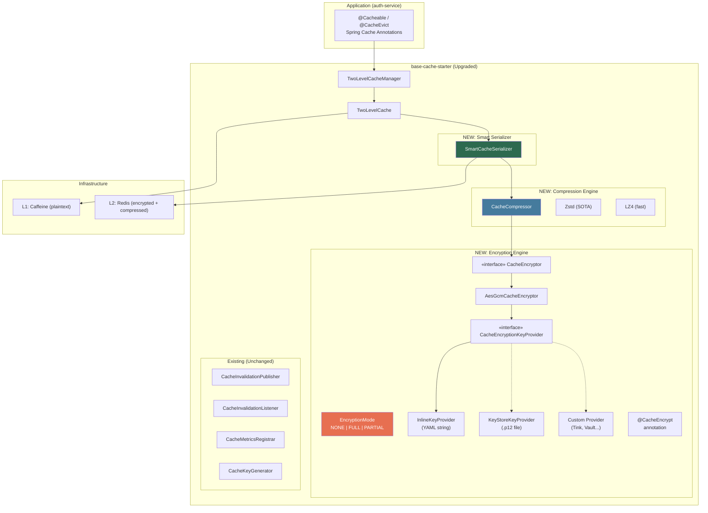

# Implementation Plan: Base Cache Starter Upgrade + Auth-Service Migration

## 1. Tổng quan

Upgrade `base-cache-starter` trực tiếp trong `components/base-core/starters/base-cache-starter/` với 3 tính năng mới, sau đó migrate `auth-service` sang dùng starter này.

### 3 New Features:
1. **Encryption Engine** — 3 modes: NONE / FULL / PARTIAL (field-level via `@CacheEncrypt`)
2. **Smart Serialization** — auto-detect data type → optimal serializer
3. **Compression Engine** — Zstd (SOTA) với optional LZ4 fallback

---

## 2. 🔑 Encryption Key Strategy — Debate & Decision

### Vấn đề
User yêu cầu: *"key có thể key từ yaml string hoặc file key store, cần tối ưu performance, không cần bảo mật phá mã cao quá"*

### Debate: 3 Phương án Key Provider

| Phương án | Performance | Security | Complexity | Recommendation |
|-----------|:-----------:|:--------:|:----------:|:--------------:|
| **A: YAML/Env String** | ⭐⭐⭐ Nhanh nhất | ⭐ Thấp (plaintext in config) | ⭐⭐⭐ Đơn giản | **DEFAULT** ✅ |
| **B: KeyStore File** | ⭐⭐ Nhanh (load 1 lần) | ⭐⭐ Trung bình | ⭐⭐ Vừa | **OPTIONAL** |
| **C: Google Tink / Vault / KMS** | ⭐ Chậm nhất (network call) | ⭐⭐⭐ Cao nhất | ⭐ Phức tạp | **CUSTOM** (advanced) |

### Performance Analysis

```
Encryption Algorithm: AES-256-GCM (với AES-NI hardware acceleration)

┌──────────────────────────────────────────────────────┐
│ Key Provider Loading (khởi tạo 1 lần khi app start) │
├──────────────────────────────────────────────────────┤
│ A: YAML String   → Base64.decode() → ~0.01ms        │
│ B: KeyStore File → FileInputStream + load → ~5-20ms  │
│ C: Tink/Vault    → Network call → ~50-500ms          │
├──────────────────────────────────────────────────────┤
│                                                      │
│ Per-Operation Encryption (mỗi cache put/get):        │
│ AES-256-GCM: ~0.5-2μs per 1KB (AES-NI accelerated)  │
│ → Tất cả 3 phương án GIỐNG NHAU sau khi load key    │
│                                                      │
└──────────────────────────────────────────────────────┘
```

### Decision: **Strategy Pattern — configurable, default YAML**

```kotlin
// Strategy interface — pluggable key provider
interface CacheEncryptionKeyProvider {
    fun getSecretKey(): SecretKey
    fun getProviderName(): String
}

// Provider A: YAML/Environment variable (DEFAULT)
class InlineCacheEncryptionKeyProvider(
    private val secretKeyBase64: String  // From app.cache.encryption.secret-key
) : CacheEncryptionKeyProvider {
    private val cachedKey: SecretKey by lazy {
        SecretKeySpec(Base64.getDecoder().decode(secretKeyBase64), "AES")
    }
    override fun getSecretKey(): SecretKey = cachedKey
    override fun getProviderName() = "inline"
}

// Provider B: KeyStore file
class KeyStoreCacheEncryptionKeyProvider(
    private val keystorePath: String,       // From app.cache.encryption.keystore.path
    private val keystorePassword: String,   // From env: CACHE_KEYSTORE_PASSWORD
    private val keyAlias: String            // From app.cache.encryption.keystore.alias
) : CacheEncryptionKeyProvider {
    private val cachedKey: SecretKey by lazy {
        val ks = KeyStore.getInstance("PKCS12")
        ks.load(FileInputStream(keystorePath), keystorePassword.toCharArray())
        ks.getKey(keyAlias, keystorePassword.toCharArray()) as SecretKey
    }
    override fun getSecretKey(): SecretKey = cachedKey
    override fun getProviderName() = "keystore"
}

// Provider C: Custom — user implements this interface
// Example: TinkCacheEncryptionKeyProvider, VaultCacheEncryptionKeyProvider
```

### Why AES-256-GCM (not ChaCha20, not AES-SIV)

| Factor | AES-256-GCM ✅ | ChaCha20-Poly1305 | AES-SIV |
|--------|:--------------:|:-----------------:|:-------:|
| Hardware accel (AES-NI) | ✅ Server có AES-NI | ❌ Software-only | ✅ |
| Throughput (server) | **Nhanh nhất** (GB/s) | Chậm hơn 2-3x trên x86 | Chậm 3-5x (2 passes) |
| Auth + Integrity | ✅ GCM tag | ✅ Poly1305 | ✅ SIV |
| JDK support | Native since JDK 8 | JDK 11+ | Cần Tink/BouncyCastle |
| Use case fit | **Server cache** ✅ | Mobile/IoT (no AES-NI) | Nonce-misuse resistant |

**Kết luận**: AES-256-GCM là tối ưu nhất cho server-side cache vì tận dụng AES-NI instruction set có sẵn trên tất cả server x86-64 hiện đại.

### YAML Config

```yaml
app:
  cache:
    encryption:
      enabled: true
      algorithm: AES-256-GCM          # Default (only option for now)
      default-mode: NONE              # NONE | FULL | PARTIAL
      key-provider: inline             # inline | keystore | custom
      # For 'inline' provider:
      secret-key: ${CACHE_ENCRYPTION_KEY:}  # Base64-encoded AES-256 key
      # For 'keystore' provider:
      keystore:
        path: /etc/secrets/cache-keystore.p12
        alias: cache-key
        password: ${CACHE_KEYSTORE_PASSWORD:}
```

---

## 3. 🗜️ Compression Engine — SOTA Analysis

### Research Result: **Zstd là SOTA** cho cache compression

| Algorithm | Compression Ratio | Compress Speed | Decompress Speed | Best For |
|-----------|:-----------------:|:--------------:|:----------------:|----------|
| **Zstd** ⭐ | **Tốt nhất** (tunable 1-22) | Rất nhanh (level 1-3) | Nhanh | **General purpose — RECOMMENDED** |
| LZ4 | Thấp | **Nhanh nhất** | **Nhanh nhất** | Ultra-low latency |
| Snappy | Thấp | Nhanh | Nhanh | Legacy (bị Zstd vượt) |
| Brotli | Rất cao | Chậm | Nhanh | Static assets (not cache) |
| GZIP | Trung bình | Chậm | Chậm | Legacy (not recommended) |

### Decision: **Zstd mặc định, LZ4 optional, configurable per-cache**

**Dependencies** (compileOnly — consumer brings):
```kotlin
// base-cache-starter/build.gradle.kts
compileOnly("com.github.luben:zstd-jni:1.5.7-15")  // SOTA compression
compileOnly("org.lz4:lz4-java:1.8.0")               // Ultra-fast fallback
```

### Compression Logic

```kotlin
enum class CompressionAlgorithm {
    NONE,   // No compression (default)
    ZSTD,   // Zstandard — best ratio/speed balance
    LZ4     // LZ4 — fastest decompression
}

class CacheCompressor(
    private val algorithm: CompressionAlgorithm,
    private val level: Int = 3,           // Zstd level (1=fast, 22=max ratio)
    private val threshold: Int = 1024     // Only compress if > N bytes
) {
    fun compress(data: ByteArray): ByteArray {
        if (data.size < threshold) return data  // Skip small payloads

        return when (algorithm) {
            CompressionAlgorithm.NONE -> data
            CompressionAlgorithm.ZSTD -> Zstd.compress(data, level)
            CompressionAlgorithm.LZ4 -> LZ4Factory.fastestInstance()
                .fastCompressor().compress(data)
        }
    }

    fun decompress(data: ByteArray): ByteArray {
        // Auto-detect: check magic bytes header
        return when {
            isZstdCompressed(data) -> Zstd.decompress(data, data.size * 4)
            isLz4Compressed(data) -> // LZ4 decompress
            else -> data // Not compressed
        }
    }
}
```

### Per-cache Config

```yaml
app:
  cache:
    compression:
      enabled: false                    # Global default: no compression
      algorithm: ZSTD                   # ZSTD | LZ4 | NONE
      level: 3                          # Zstd level (1-22)
      threshold: 1024                   # Only compress payloads > 1KB
    caches:
      userSessions:
        compression:
          enabled: true                 # Session objects can be large
          algorithm: ZSTD
          level: 1                      # Fast compression for sessions
      auditLogs:
        compression:
          enabled: true
          algorithm: ZSTD
          level: 9                      # Higher ratio for logs (read-heavy)
      permissions:
        compression:
          enabled: false                # Small lists — don't compress
```

---

## 4. 🧬 Smart Serialization — Data Type Matrix

### Type Detection & Optimal Strategy

| Data Type | Kotlin Type | Serialization | Redis Storage | Example |
|-----------|-------------|---------------|---------------|---------|
| **STRING** | `String` | UTF-8 raw bytes | String | `"hello"` |
| **NUMBER** | `Int`, `Long`, `Double`, `BigDecimal` | ASCII string repr | String | `"42"`, `"3.14"` |
| **BOOLEAN** | `Boolean` | `"1"` / `"0"` (1 byte) | String | `"1"` |
| **BINARY** | `ByteArray`, `BitSet` | Raw bytes | String | `0x01 0x02...` |
| **OBJECT** | Any data class | Jackson JSON | String (JSON) | `{"id":1,"name":"john"}` |
| **LIST** | `List<T>` | Jackson JSON array | String | `["a","b","c"]` |
| **SET** | `Set<T>` | Jackson JSON array (deduplicated) | String | `["a","b"]` |
| **SORTED_SET** | Items with score | JSON with score metadata | String | `[{"v":"a","s":1.0}]` |
| **MAP** | `Map<K,V>` | Jackson JSON object | String | `{"k1":"v1"}` |
| **ENUM** | Kotlin enum | `name()` string | String | `"ACTIVE"` |
| **TEMPORAL** | `Instant`, `LocalDateTime` | ISO-8601 string | String | `"2026-08-21T15:00:00Z"` |
| **UUID** | `java.util.UUID` | 36-char string | String | `"550e8400-..."` |
| **PAIR** | `Pair<A,B>` | JSON `{"first":...,"second":...}` | String | |
| **SEALED** | Kotlin sealed class | Jackson polymorphic JSON | String | `{"@type":"SubClass",...}` |
| **PAGE** | `Page<T>` (Spring Data) | JSON with metadata | String | `{"content":[...],"total":100}` |
| **DURATION** | `Duration`, `Period` | ISO-8601 string | String | `"PT30M"` |
| **BIGDECIMAL** | `BigDecimal` | String repr (no precision loss) | String | `"123456.789012"` |
| **COMPRESSED** | Large blob (> threshold) | Zstd/LZ4 compressed bytes | String | Binary blob |

### Special Cases Brainstormed

| Case | Scenario | Handling |
|------|----------|----------|
| **Null value** | Method returns null | Config `cache-null-values=false` (default) → don't cache |
| **Empty collection** | `emptyList()` / `emptySet()` | Cache as `[]` — valid empty result (not null) |
| **Circular reference** | Object A → B → A | Jackson `@JsonIdentityInfo` or throw error |
| **Polymorphic** | Sealed class hierarchy | Jackson `@JsonTypeInfo` with `@type` property |
| **Lazy-loaded** | JPA proxy / Hibernate lazy | Throw error — force DTO conversion before cache |
| **Versioned data** | Optimistic lock version | Include version in cache key or value |
| **TTL-varied** | Different TTL for same cache | Per-cache config in `app.cache.caches.xxx.l2.ttl` |
| **Computed/derived** | Value computed from multiple sources | Cache the computed result, evict when any source changes |
| **Stream/Flux** | Reactive types | NOT cacheable — cache the materialized result only |

---

## 5. Architecture Diagram



### Data Pipeline: L2 Write

```
Object → SmartSerializer → JSON bytes → Compressor (if enabled) → Encryptor (if enabled) → Redis
```

### Data Pipeline: L2 Read

```
Redis → Decryptor (if encrypted) → Decompressor (if compressed) → SmartSerializer → Object
```

---

## 6. New File Inventory — base-cache-starter

| # | File Path (relative to cache/) | Description | LOC |
|---|-------------------------------|-------------|:---:|
| 1 | `encryption/CacheEncryptor.kt` | Interface: encrypt/decrypt | ~15 |
| 2 | `encryption/AesGcmCacheEncryptor.kt` | AES-256-GCM impl (AES-NI accelerated) | ~70 |
| 3 | `encryption/CacheEncryptionKeyProvider.kt` | Interface: provide SecretKey | ~10 |
| 4 | `encryption/InlineCacheEncryptionKeyProvider.kt` | Key from YAML/env Base64 string | ~20 |
| 5 | `encryption/KeyStoreCacheEncryptionKeyProvider.kt` | Key from .p12/.jceks keystore file | ~35 |
| 6 | `encryption/CacheEncrypt.kt` | `@CacheEncrypt` annotation | ~10 |
| 7 | `encryption/EncryptionMode.kt` | Enum: NONE, FULL, PARTIAL | ~8 |
| 8 | `compression/CacheCompressor.kt` | Compress/decompress with auto-detect | ~60 |
| 9 | `compression/CompressionAlgorithm.kt` | Enum: NONE, ZSTD, LZ4 | ~8 |
| 10 | `serialization/SmartCacheSerializer.kt` | Type-aware serializer + encrypt + compress | ~130 |
| 11 | `serialization/SerializationFormat.kt` | Enum: JSON, STRING, BINARY | ~8 |
| 12 | `CacheEncryptionAutoConfiguration.kt` | Auto-config for encryption beans | ~60 |
| **Total NEW** | | | **~434** |

### Modified Files — base-cache-starter

| # | File | Changes |
|---|------|---------|
| 1 | `CacheProperties.kt` | Add `EncryptionProperties`, `CompressionProperties`, `SerializationProperties` |
| 2 | `TwoLevelCache.kt` | Inject `SmartCacheSerializer` for L2 operations |
| 3 | `TwoLevelCacheManager.kt` | Create serializer/compressor/encryptor per cache |
| 4 | `CacheAutoConfiguration.kt` | Register encryption + compression beans |
| 5 | `build.gradle.kts` | Add compileOnly: `zstd-jni`, `lz4-java` |

---

## 7. Auth-Service Migration

### Changes

| # | File | Action | Details |
|---|------|--------|---------|
| 1 | `build.gradle.kts` | MODIFY | `+implementation("com.ntt:base-cache-starter")`, `-caffeine standalone` |
| 2 | `application.yml` | MODIFY | Add `app.cache` config section |
| 3 | `AbstractTwoTierCache.kt` | DELETE | Replaced by `TwoLevelCache` |
| 4 | `CaffeinePermissionCache.kt` | DELETE | Replaced by `@Cacheable` |
| 5 | `MultiTierPermissionCache.kt` | DELETE | Replaced by `@Cacheable` |
| 6 | `InMemoryPermissionCache.kt` | DELETE | Dead code |
| 7 | `PermissionCache.kt` | DELETE | Port no longer needed |
| 8 | NEW: `PermissionQueryService.kt` | CREATE | `@Cacheable` service |
| 9 | `PermissionChangedConsumer.kt` | MODIFY | Use `CacheManager.getCache("permissions")?.evict()` |

### Before → After

```diff
# build.gradle.kts
 dependencies {
+    implementation("com.ntt:base-cache-starter")
-    implementation("com.github.ben-manes.caffeine:caffeine")
```

---

## 8. Phased Execution

| Phase | Scope | Effort | Risk |
|-------|-------|:------:|:----:|
| **Phase 1** | base-cache-starter: Encryption Engine | 2 days | Low |
| **Phase 2** | base-cache-starter: Compression Engine | 1 day | Low |
| **Phase 3** | base-cache-starter: Smart Serialization | 1 day | Low |
| **Phase 4** | base-cache-starter: CacheProperties + AutoConfiguration | 1 day | Medium |
| **Phase 5** | auth-service: Migration to base-cache-starter | 2 days | Medium |
| **Phase 6** | Testing: Unit + Integration | 1-2 days | Low |
| **Total** | | **8-9 days** | |

---

## 9. Verification Plan

### Automated Tests
```bash
# Phase 1-4: base-cache-starter
cd components/base-core && ./gradlew :starters:base-cache-starter:test

# Phase 5: auth-service
cd services/auth-service && ./gradlew test
```

### Test Coverage Targets

| Component | Test | Target |
|-----------|------|:------:|
| `AesGcmCacheEncryptor` | Roundtrip encrypt/decrypt, bad key, corrupted data | 100% |
| `InlineCacheEncryptionKeyProvider` | Load from Base64, invalid key | 100% |
| `KeyStoreCacheEncryptionKeyProvider` | Load from .p12, missing file, wrong password | 100% |
| `CacheCompressor` | Zstd + LZ4 roundtrip, threshold skip, auto-detect | 100% |
| `SmartCacheSerializer` | All 17 data types, null, empty collection | 100% |
| `SmartCacheSerializer + FULL` | Encrypt + compress pipeline roundtrip | 100% |
| `SmartCacheSerializer + PARTIAL` | @CacheEncrypt field-level encryption | 100% |
| `TwoLevelCache` | L1 hit, L2 hit (with encrypt), DB fallback | 100% |
| `PermissionQueryService` | @Cacheable integration test | 90%+ |

### Manual Verification
1. Start auth-service → log: `Initializing TwoLevelCacheManager: L1=Caffeine, L2=Redis`
2. Login → verify Redis key `auth:cache:permissions::perm:1:1` exists (new naming convention)
3. Redis CLI `GET auth:cache:permissions::perm:1:1` → verify value format matches encryption mode
4. `/actuator/metrics/cache.hit.ratio` → confirm metrics registered

---

## Phase 0 (NEW): Cache Key Taxonomy & Lifecycle — From Brainstorm 2026-08-21

> Brainstorm notes: [brainstorm_notes.md](file:///home/nguyentthai96/Desktop/bigbang/boilerplate/services/auth-service/openspec/changes/cache-starter-migration-upgrade/brainstorm_notes.md)

### Auth-Service Redis Key Inventory (15+ prefixes found)

| Category | Key Prefixes | Purpose | TTL |
|----------|-------------|---------|:---:|
| DATA_CACHE | `auth:perm:perms:*`, `auth:perm:roles:*` | Giảm DB load | 30m |
| SESSION_BOUND | `anon:session:*`, `anon:data:*`, `cipher:session:*` | Dữ liệu gắn phiên | 1-8h |
| RATE_COUNTER | `rate:login:attempts:*`, `anon:rate:*`, `otp:ratelimit:*`, `mfa:verify:attempts:*` | Đếm requests | 1-15m |
| RATE_LOCK | `rate:login:lock:*`, `mfa:verify:lock:*` | Khóa tạm khi vượt limit | 15-60m |
| IDEMPOTENCY | `idempotency:auth-service:*` | Anti-duplicate request | 5-30m |
| PROCESS_TOKEN | `otp:*`, `mfa:totp:setup:*`, `vault:token:*` | Multi-step process data | 5-15m |
| DISTRIBUTED_LOCK | `anon:lock:*` | Concurrent mutex | 10-30s |
| CRYPTO_SESSION | `cipher:session:*` | E2EE key material | 1-24h |

### New Cache Key Categories (brainstormed)

| # | Category | Enum | Jitter? | Encrypt? |
|---|----------|------|:-------:|:--------:|
| 1 | DATA_CACHE | `cache` | ✅ | NONE/PARTIAL |
| 2 | SESSION_BOUND | `session` | ❌ | FULL |
| 3 | RATE_COUNTER | `rate` | ❌ | NONE |
| 4 | RATE_LOCK | `rate` | ❌ | NONE |
| 5 | IDEMPOTENCY | `idempotent` | ❌ | NONE |
| 6 | PROCESS_TOKEN | `process` | ❌ | FULL |
| 7 | DISTRIBUTED_LOCK | `lock` | ❌ | NONE |
| 8 | CRYPTO_SESSION | `crypto` | ❌ | FULL |
| 9 | STATIC_CONFIG | `config` | ✅ | NONE |
| 10 | COMPUTED_AGGREGATE | `computed` | ✅ | NONE |
| 11 | WARMUP_PRELOAD | `warmup` | ✅ | NONE |

### Key Naming Convention

```
{service}:{category}:{cacheName}::{springKey}
Example: auth:cache:permissions::perm:1001:5
```

### New FRs from Brainstorm

| FR | Description |
|----|-------------|
| FR-023 | `CacheKeyCategory` enum với 11 categories + defaults |
| FR-024 | `CacheKeyResolver` resolve key format + jitter TTL |
| FR-025 | TTL Jitter anti-stampede (configurable per-category) |
| FR-026 | `KeyTaxonomyProperties` trong CacheProperties |
| FR-027 | Per-cache `category` field linking to CacheKeyCategory |
| FR-028 | Key naming standard: `{service}:{category}:{cache}::{key}` |

### Selected Approach: HYBRID (Enum + YAML Override)

- **Enum** = compile-time guardrails, self-documenting defaults
- **YAML** = runtime flexibility, per-environment override
