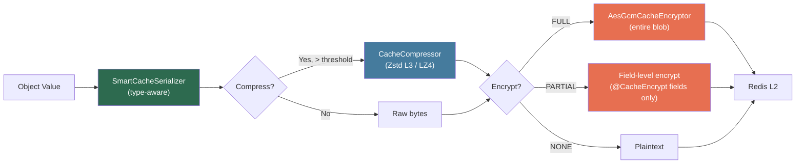
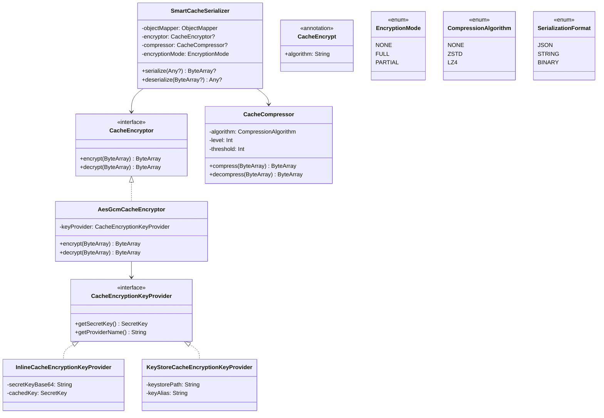

# Technical Specification: Base Cache Starter — Encryption + Compression + Smart Serialization

## 1. Data Pipeline Architecture



### Read Pipeline (reverse)
```
Redis → Detect(encrypted?) → Decrypt → Detect(compressed?) → Decompress → Deserialize → Object
```

### Magic Byte Headers

| Format | First Bytes | Detection |
|--------|------------|-----------|
| Zstd compressed | `0x28 0xB5 0x2F 0xFD` | Zstd magic number |
| LZ4 compressed | `0x04 0x22 0x4D 0x18` | LZ4 frame magic |
| AES-GCM encrypted | `0xCA 0xCE` + 1 byte version | Custom 3-byte header |
| Plaintext JSON | `{` or `[` or `"` | JSON start chars |
| Plaintext string | Any other | Raw UTF-8 |

## 2. New Class Hierarchy



## 3. CacheProperties — Expanded Schema

```kotlin
@ConfigurationProperties(prefix = "app.cache")
data class CacheProperties(
    var enabled: Boolean = true,
    var l1: L1Properties = L1Properties(),
    var l2: L2Properties = L2Properties(),
    var invalidation: InvalidationProperties = InvalidationProperties(),
    var encryption: EncryptionProperties = EncryptionProperties(),       // NEW
    var compression: CompressionProperties = CompressionProperties(),    // NEW
    var serialization: SerializationProperties = SerializationProperties(), // NEW
    var caches: Map<String, NamedCacheConfig> = emptyMap()
) {
    // ... existing L1, L2, InvalidationProperties UNCHANGED ...

    data class EncryptionProperties(
        var enabled: Boolean = false,
        var algorithm: String = "AES-256-GCM",
        var defaultMode: EncryptionMode = EncryptionMode.NONE,
        var keyProvider: String = "inline",  // inline | keystore | custom
        var secretKey: String = "",          // For inline provider (Base64)
        var keystore: KeystoreProperties = KeystoreProperties()
    )

    data class KeystoreProperties(
        var path: String = "",
        var alias: String = "cache-key",
        var password: String = ""  // Should come from env var
    )

    data class CompressionProperties(
        var enabled: Boolean = false,
        var algorithm: CompressionAlgorithm = CompressionAlgorithm.ZSTD,
        var level: Int = 3,
        var threshold: Int = 1024  // bytes
    )

    data class SerializationProperties(
        var defaultFormat: SerializationFormat = SerializationFormat.JSON
    )

    // Updated NamedCacheConfig
    data class NamedCacheConfig(
        var l1: NamedL1Properties = NamedL1Properties(),
        var l2: NamedL2Properties = NamedL2Properties(),
        var encryption: NamedEncryptionProperties = NamedEncryptionProperties(),
        var compression: NamedCompressionProperties = NamedCompressionProperties(),
        var serialization: NamedSerializationProperties = NamedSerializationProperties()
    )

    data class NamedEncryptionProperties(
        var mode: EncryptionMode? = null,
        var encryptedFields: List<String>? = null
    )

    data class NamedCompressionProperties(
        var enabled: Boolean? = null,
        var algorithm: CompressionAlgorithm? = null,
        var level: Int? = null
    )

    data class NamedSerializationProperties(
        var format: SerializationFormat? = null
    )
}
```

## 4. TwoLevelCacheManager Changes

```kotlin
// Updated constructor
class TwoLevelCacheManager(
    private val l1CacheManager: CacheManager?,
    private val l2CacheManager: CacheManager?,
    private val invalidationPublisher: CacheInvalidationPublisher?,
    private val properties: CacheProperties,
    private val encryptor: CacheEncryptor?,           // NEW
    private val objectMapper: ObjectMapper             // NEW
) : CacheManager {

    override fun getCache(name: String): Cache? {
        return cacheMap.computeIfAbsent(name) { cacheName ->
            val namedConfig = properties.caches[cacheName]
            val l1 = resolveL1(cacheName, namedConfig)
            val l2 = resolveL2(cacheName)

            // NEW: Create per-cache SmartCacheSerializer
            val serializer = createSerializerForCache(cacheName, namedConfig)

            when {
                l1 != null && l2 != null -> {
                    TwoLevelCache(cacheName, l1, l2, invalidationPublisher, serializer)
                }
                // ... existing fallback logic ...
            }
        }
    }

    private fun createSerializerForCache(
        cacheName: String,
        namedConfig: CacheProperties.NamedCacheConfig?
    ): SmartCacheSerializer {
        val encMode = namedConfig?.encryption?.mode ?: properties.encryption.defaultMode
        val compAlgo = namedConfig?.compression?.algorithm ?: properties.compression.algorithm
        val compEnabled = namedConfig?.compression?.enabled ?: properties.compression.enabled

        val compressor = if (compEnabled) {
            CacheCompressor(compAlgo, namedConfig?.compression?.level ?: properties.compression.level,
                properties.compression.threshold)
        } else null

        return SmartCacheSerializer(objectMapper, encryptor, compressor, encMode)
    }
}
```

## 5. New File Inventory

| # | File | Description | LOC |
|---|------|-------------|:---:|
| 1 | `encryption/CacheEncryptor.kt` | Interface | ~15 |
| 2 | `encryption/AesGcmCacheEncryptor.kt` | AES-256-GCM (AES-NI) | ~70 |
| 3 | `encryption/CacheEncryptionKeyProvider.kt` | Interface | ~10 |
| 4 | `encryption/InlineCacheEncryptionKeyProvider.kt` | YAML/env key | ~20 |
| 5 | `encryption/KeyStoreCacheEncryptionKeyProvider.kt` | .p12 keystore | ~35 |
| 6 | `encryption/CacheEncrypt.kt` | @CacheEncrypt annotation | ~10 |
| 7 | `encryption/EncryptionMode.kt` | Enum | ~8 |
| 8 | `compression/CacheCompressor.kt` | Zstd/LZ4 compress | ~70 |
| 9 | `compression/CompressionAlgorithm.kt` | Enum | ~8 |
| 10 | `serialization/SmartCacheSerializer.kt` | Type-aware + encrypt + compress | ~140 |
| 11 | `serialization/SerializationFormat.kt` | Enum | ~8 |
| 12 | `CacheEncryptionAutoConfiguration.kt` | Auto-config | ~70 |
| **Total** | | | **~464** |

## 6. Dependencies — base-cache-starter/build.gradle.kts

```kotlin
dependencies {
    // Existing...
    api(project(":"))
    implementation("org.springframework:spring-context-support")
    compileOnly("com.github.ben-manes.caffeine:caffeine")
    compileOnly("org.springframework.boot:spring-boot-starter-data-redis")
    compileOnly("io.micrometer:micrometer-core")

    // NEW: Compression (optional — consumer brings)
    compileOnly("com.github.luben:zstd-jni:1.5.7-15")
    compileOnly("org.lz4:lz4-java:1.8.0")

    // Test
    testImplementation("com.github.ben-manes.caffeine:caffeine")
    testImplementation("org.springframework.boot:spring-boot-starter-data-redis")
    testImplementation("io.micrometer:micrometer-core")
    testImplementation("com.github.luben:zstd-jni:1.5.7-15")
    testImplementation("org.lz4:lz4-java:1.8.0")
}
```

## 7. Risk & Mitigation

| Risk | Impact | Mitigation |
|------|--------|------------|
| Encryption latency | Low (AES-NI ~0.5μs/KB) | L1 serves plaintext, encrypt L2 only |
| Zstd JNI native lib issue | Medium | Fallback to no-compression if UnsatisfiedLinkError |
| Key rotation breaking cache | Medium | New key prefix, old entries expire via TTL |
| SmartSerializer type confusion | Medium | Comprehensive unit tests, magic byte detection |
| Breaking existing consumers | Low | All new features opt-in (disabled by default) |
