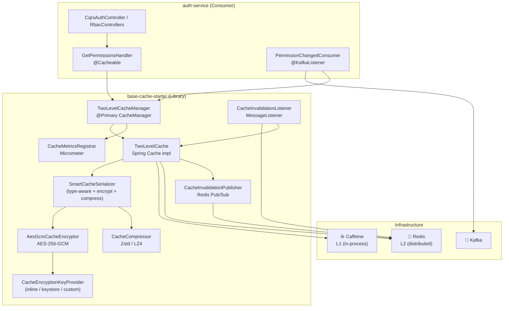
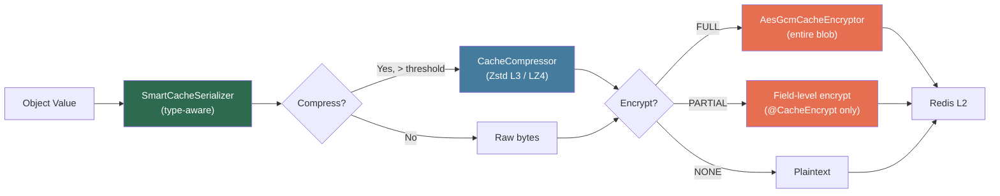
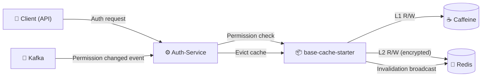
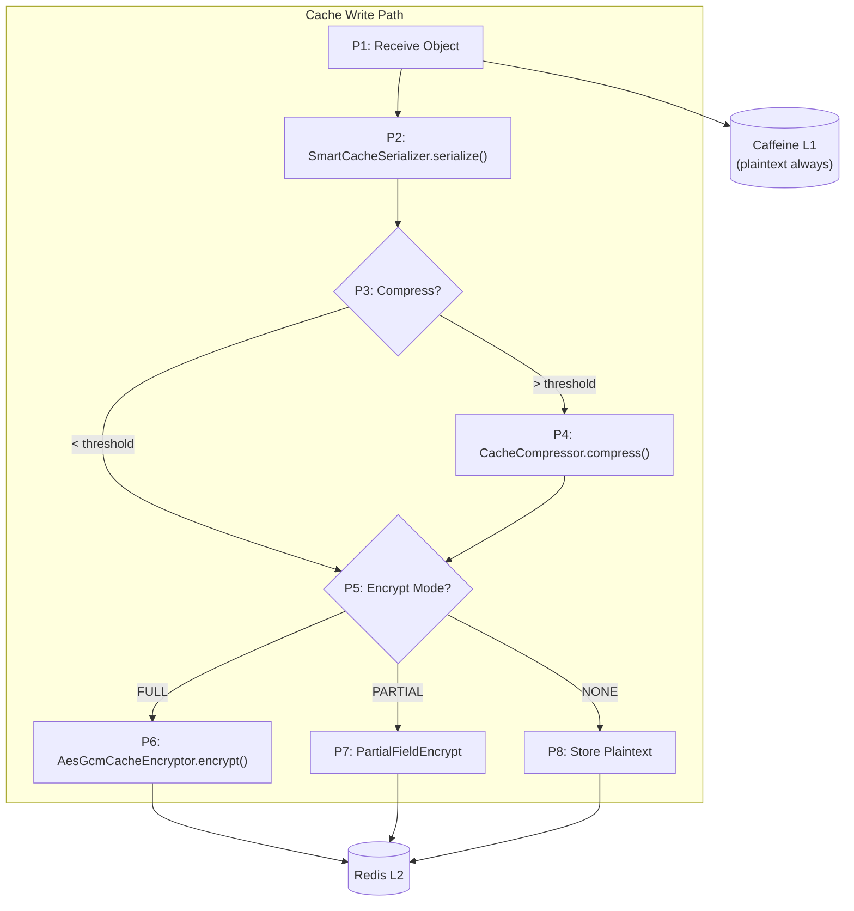
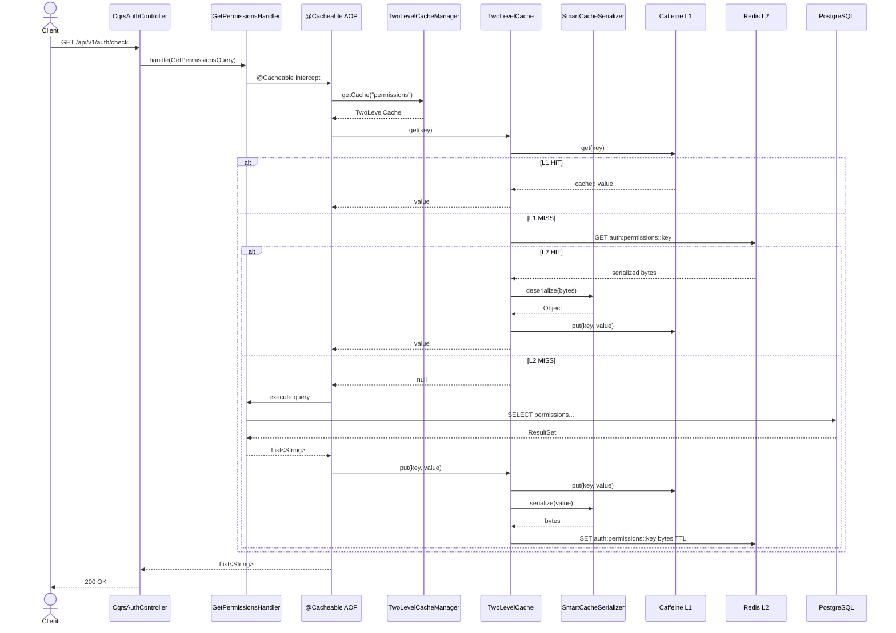
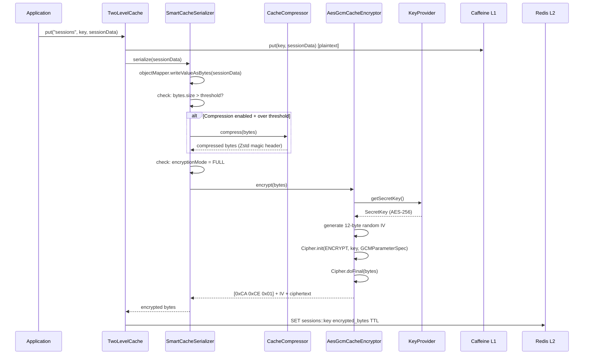

# Đặc tả kỹ thuật: Cache Starter Migration & Upgrade

> Technical specification chi tiết — thiết kế để agent có thể đọc và dev code trực tiếp.

---

## 1. Tổng quan hệ thống (System Overview)

### 1.1 Kiến trúc tổng thể



### 1.2 Technology Stack

| Layer | Technology | Version | Ghi chú |
|-------|-----------|---------|---------|
| Language | Kotlin | 2.x | JDK 25 target |
| Framework | Spring Boot | 4.1.0 | Spring Cache abstraction |
| L1 Cache | Caffeine | (via platform BOM) | In-process, thread-safe |
| L2 Cache | Redis | (via spring-boot-starter-data-redis) | Distributed, Lettuce client |
| Encryption | JCA (javax.crypto) | JDK 25 built-in | AES-256-GCM, AES-NI |
| Compression | zstd-jni | 1.5.7-15 | Zstd L3 default |
| Compression (alt) | lz4-java | 1.8.0 | LZ4 fastest decompress |
| Serialization | Jackson | (via Spring Boot) | JSON default |
| Messaging | Spring Kafka | (via platform BOM) | Cache invalidation events |
| Metrics | Micrometer | (via spring-boot-starter-actuator) | Cache hit/miss/eviction |
| Build | Gradle Kotlin DSL | 8.9 | com.ntt:platform BOM |

### 1.3 Dependencies & Integrations

| Dependency | Type | Purpose | Interface |
|-----------|------|---------|-----------|
| Caffeine | Internal | L1 in-process cache | CaffeineCacheManager |
| Redis (Lettuce) | External | L2 distributed cache + Pub/Sub | RedisConnectionFactory |
| Kafka | External | Permission change events → cache eviction | @KafkaListener |
| Micrometer | Internal | Cache metrics (hit/miss/eviction counters) | MeterRegistry |
| JCA (javax.crypto) | Internal | AES-256-GCM encryption | Cipher, SecretKey, KeyStore |
| zstd-jni | Optional | Zstd compression | com.github.luben.zstd.Zstd |
| lz4-java | Optional | LZ4 compression | org.lz4.LZ4Factory |

---

## 2. Lược đồ dữ liệu (Data Schema)

### 2.1 Data Pipeline Architecture



### 2.2 Magic Byte Header Protocol

| Format | First Bytes | Detection |
|--------|------------|-----------|
| AES-GCM encrypted | `0xCA 0xCE 0x01` | Custom 3-byte header |
| Zstd compressed | `0x28 0xB5 0x2F 0xFD` | Zstd magic number |
| LZ4 compressed | `0x04 0x22 0x4D 0x18` | LZ4 frame magic |
| Plaintext JSON | `{` or `[` or `"` | JSON start chars |
| Plaintext string | Any other | Raw UTF-8 |

**Read Pipeline (reverse)**: Redis → Detect(encrypted? magic `0xCA 0xCE`) → Decrypt → Detect(compressed? Zstd/LZ4 magic) → Decompress → Deserialize → Object

### 2.3 CacheProperties Schema (Expanded)

```kotlin
@ConfigurationProperties(prefix = "app.cache")
data class CacheProperties(
    var enabled: Boolean = true,
    var l1: L1Properties = L1Properties(),
    var l2: L2Properties = L2Properties(),
    var invalidation: InvalidationProperties = InvalidationProperties(),
    var encryption: EncryptionProperties = EncryptionProperties(),         // NEW
    var compression: CompressionProperties = CompressionProperties(),      // NEW
    var serialization: SerializationProperties = SerializationProperties(), // NEW
    var caches: Map<String, NamedCacheConfig> = emptyMap()
) {
    data class L1Properties(
        var spec: String = "maximumSize=1000,expireAfterWrite=5m"
    )
    data class L2Properties(
        var ttl: Duration = Duration.ofMinutes(30),
        var prefix: String = "",
        var enabled: Boolean = true
    )
    data class InvalidationProperties(
        var channel: String = "cache:invalidation"
    )
    // NEW
    data class EncryptionProperties(
        var enabled: Boolean = false,
        var algorithm: String = "AES-256-GCM",
        var defaultMode: EncryptionMode = EncryptionMode.NONE,
        var keyProvider: String = "inline",  // inline | keystore | custom
        var secretKey: String = "",          // For inline provider (Base64)
        var keystore: KeystoreProperties = KeystoreProperties()
    )
    data class KeystoreProperties(
        var path: String = "",
        var alias: String = "cache-key",
        var password: String = ""  // From env var
    )
    data class CompressionProperties(
        var enabled: Boolean = false,
        var algorithm: CompressionAlgorithm = CompressionAlgorithm.ZSTD,
        var level: Int = 3,
        var threshold: Int = 1024  // bytes
    )
    data class SerializationProperties(
        var defaultFormat: SerializationFormat = SerializationFormat.JSON
    )
    data class NamedCacheConfig(
        var l1: L1Properties = L1Properties(),
        var l2: L2Properties = L2Properties(),
        var encryption: NamedEncryptionProperties = NamedEncryptionProperties(),     // NEW
        var compression: NamedCompressionProperties = NamedCompressionProperties(), // NEW
        var serialization: NamedSerializationProperties = NamedSerializationProperties() // NEW
    )
    data class NamedEncryptionProperties(
        var mode: EncryptionMode? = null,           // Override default
        var encryptedFields: List<String>? = null     // For PARTIAL mode
    )
    data class NamedCompressionProperties(
        var enabled: Boolean? = null,
        var algorithm: CompressionAlgorithm? = null,
        var level: Int? = null
    )
    data class NamedSerializationProperties(
        var format: SerializationFormat? = null
    )
}
```

### 2.4 Sample application.yml Configuration

```yaml
app:
  cache:
    enabled: true
    l1:
      spec: "maximumSize=1000,expireAfterWrite=30s"
    l2:
      ttl: 30m
      prefix: "auth:"
    invalidation:
      channel: "cache:invalidation:auth"
    encryption:
      enabled: true
      algorithm: AES-256-GCM
      default-mode: NONE
      key-provider: inline
      secret-key: "${CACHE_ENCRYPTION_KEY}"  # Base64 AES-256 key from env
    compression:
      enabled: true
      algorithm: ZSTD
      level: 3
      threshold: 1024
    caches:
      permissions:
        l1:
          spec: "maximumSize=500,expireAfterWrite=30s"
        l2:
          ttl: 30m
        encryption:
          mode: NONE  # permissions are not PII
      sessions:
        l2:
          ttl: 1h
        encryption:
          mode: FULL  # session data is sensitive
      user-profiles:
        l2:
          ttl: 15m
        encryption:
          mode: PARTIAL  # only PII fields encrypted
```

---

## 3. Luồng dữ liệu (Data Flow)

### 3.1 Data Flow Diagram — Level 0 (Context)



### 3.2 Data Flow Diagram — Level 1 (Write Path)



### 3.3 Data Transformation Rules

| # | Input | Process | Output | Validation Rules |
|---|-------|---------|--------|-----------------|
| 1 | Object value | SmartCacheSerializer type detection | Serialized bytes | Non-null |
| 2 | Serialized bytes (> threshold) | CacheCompressor.compress() | Compressed bytes with magic header | payload.size > threshold |
| 3 | Bytes (FULL mode) | AesGcmCacheEncryptor.encrypt() | `0xCA 0xCE 0x01` + IV(12) + ciphertext + tag(16) | Key available |
| 4 | Object (PARTIAL mode) | Reflection scan @CacheEncrypt fields | JSON with `"ENC:"` prefixed field values | String fields only |

---

## 4. Luồng xử lý (Processing Steps)

### 4.1 Sequence Diagram — UC-001: Permission Cache Lookup



### 4.2 Sequence Diagram — UC-002: Encrypted Cache Write



### 4.3 Bảng Step xử lý chi tiết

#### UC-001: Permission Cache Lookup

| Step | Component | Action | Input | Output | Error Handling | Ghi chú |
|------|-----------|--------|-------|--------|---------------|---------|
| 1 | Controller | Route request | HTTP request | Handler dispatch | - | Standard |
| 2 | @Cacheable AOP | Intercept handler call | Method args | Cache key | - | Spring AOP |
| 3 | TwoLevelCacheManager | Resolve cache by name | "permissions" | TwoLevelCache | Return null if not found | Per-name config |
| 4 | TwoLevelCache | Check L1 | Cache key | Object or null | - | ~ns latency |
| 5 | TwoLevelCache | Check L2 (on L1 miss) | Cache key | Bytes or null | Redis timeout → return null | ~1-5ms |
| 6 | SmartCacheSerializer | Deserialize L2 bytes | byte[] | Object | Deserialization error → evict + null | Detect format via magic bytes |
| 7 | Handler | Execute DB query (on cache miss) | Query params | List\<String\> | DataAccessException → 503 | JPA query |
| 8 | TwoLevelCache | Store in L1 + L2 | Object | Cached | Redis error → L1 only | Graceful |
| 9 | SmartCacheSerializer | Serialize for L2 | Object | byte[] | Error → skip L2 cache | Encrypt if configured |

---

## 5. Luồng màn hình (Screen Flow)

N/A — This feature is purely backend infrastructure. No user-facing screens.

### 5.1 Operational Screens (Ops/SRE)

| Screen ID | Tên | Mục đích | Data hiển thị |
|-----------|-----|----------|--------------|
| OPS-001 | Grafana Cache Dashboard | Monitor cache hit/miss/eviction rates | Micrometer metrics: cache.gets, cache.puts, cache.evictions |
| OPS-002 | Redis CLI Inspection | Debug/verify encrypted cache entries | Raw Redis keys + encrypted/plaintext values |

---

## 6. API Specification

### 6.1 Endpoint List

This feature does not introduce new API endpoints. It modifies the **infrastructure layer** (cache behavior) behind existing endpoints.

**Affected existing endpoints** (indirectly, via cache behavior):

| # | Method | Path | Description | Cache Name | Encryption Mode |
|---|--------|------|------------|------------|----------------|
| 1 | `GET` | `/api/v1/rbac/permissions` | Get user permissions | `permissions` | NONE |
| 2 | `GET` | `/api/v1/rbac/roles` | Get user roles | `roles` | NONE |
| 3 | `POST` | `/api/v1/auth/login` | Login (session creation) | `sessions` | FULL |
| 4 | `POST` | `/api/v1/auth/token/refresh` | Token refresh | `sessions` | FULL |

### 6.2 Configuration API (application.yml)

See section 2.4 for complete YAML configuration schema.

### 6.3 Error Response Format (RFC 7807)

No new error responses to external clients. Cache errors are handled internally with graceful degradation:

| Scenario | HTTP Response | Internal Handling |
|----------|-------------|-------------------|
| L1 miss + L2 miss + DB success | 200 OK | Normal flow, cache populated |
| L1 miss + Redis down | 200 OK | DB fallback, L1 only cache |
| Encryption key missing at startup | Application fails to start | Fail-fast, log ERROR |
| Decryption failure on read | 200 OK | Evict stale entry, reload from DB |
| Compression library not found | 200 OK | No compression, log INFO |

---

## 7. Security Considerations

### 7.1 Authentication Flow

No changes to authentication flow. Cache encryption is transparent to auth flow.

### 7.2 Encryption Architecture

| Aspect | Design |
|--------|--------|
| Algorithm | AES-256-GCM (authenticated encryption with associated data) |
| Key size | 256-bit (32 bytes) |
| IV | 12 bytes random per encrypt operation (SecureRandom) |
| Auth tag | 128-bit (16 bytes) — GCM built-in |
| Key storage | inline (env var), keystore (PKCS12), custom (user implementation) |
| Hardware acceleration | AES-NI on x86-64 (JDK 25 intrinsics) |
| L1 encryption | **NO** — in-process memory, no network exposure |
| L2 encryption | **YES** — data at rest in Redis |

### 7.3 Data Protection

| Data Type | Cache Name | Encryption Mode | Rationale |
|-----------|-----------|----------------|-----------|
| Permissions list | `permissions` | NONE | Not PII, not sensitive |
| Roles list | `roles` | NONE | Not PII, not sensitive |
| Session data | `sessions` | FULL | Contains tokens, sensitive |
| User profiles | `user-profiles` | PARTIAL | Contains PII (email, phone) |
| i18n messages | `i18n-messages` | NONE | Public content |

---

## 8. Performance Requirements

| Metric | Target | Measurement Method |
|--------|--------|-------------------|
| L1 cache hit latency | < 1ms P95 | APM tracing (Micrometer) |
| L2 cache hit latency | < 10ms P95 | APM tracing |
| Encryption overhead per 1KB | < 50μs | Microbenchmark (AES-NI) |
| Compression ratio (Zstd L3, >1KB) | ≥ 2.5x | Benchmark with real data |
| LZ4 decompress throughput | ~4 GB/s | Library benchmark |
| PARTIAL mode overhead vs plaintext | < 8% | Load test comparison |
| Cache hit ratio | ≥ 90% | Micrometer cache.gets tag=HIT |
| Cross-instance eviction propagation | < 100ms | Distributed test |

---

## 9. Agent Implementation Notes

> **Section này dành cho AI agent** — chỉ rõ code cần tạo để agent dev trực tiếp.

### 9.1 Classes to Create (base-cache-starter)

| # | Class | Package | Type | Extends/Implements | Mô tả |
|---|-------|---------|------|-------------------|--------|
| 1 | `CacheEncryptor` | `autoconfigure.cache.encryption` | Interface | — | Interface: encrypt(ByteArray) / decrypt(ByteArray) |
| 2 | `AesGcmCacheEncryptor` | `autoconfigure.cache.encryption` | Class | CacheEncryptor | AES-256-GCM implementation with magic header |
| 3 | `CacheEncryptionKeyProvider` | `autoconfigure.cache.encryption` | Interface | — | Interface: getSecretKey() / getProviderName() |
| 4 | `InlineCacheEncryptionKeyProvider` | `autoconfigure.cache.encryption` | Class | CacheEncryptionKeyProvider | Base64 key from YAML/env var |
| 5 | `KeyStoreCacheEncryptionKeyProvider` | `autoconfigure.cache.encryption` | Class | CacheEncryptionKeyProvider | PKCS12 keystore file |
| 6 | `CacheEncrypt` | `autoconfigure.cache.encryption` | @Annotation | — | @CacheEncrypt for field-level encryption |
| 7 | `EncryptionMode` | `autoconfigure.cache.encryption` | Enum | — | NONE, FULL, PARTIAL |
| 8 | `CacheCompressor` | `autoconfigure.cache.compression` | Class | — | Zstd/LZ4 compress/decompress with threshold |
| 9 | `CompressionAlgorithm` | `autoconfigure.cache.compression` | Enum | — | NONE, ZSTD, LZ4 |
| 10 | `SmartCacheSerializer` | `autoconfigure.cache.serialization` | Class | RedisSerializer\<Object\> | Type-aware serialization + encrypt + compress pipeline |
| 11 | `SerializationFormat` | `autoconfigure.cache.serialization` | Enum | — | JSON, STRING, BINARY |
| 12 | `CacheEncryptionAutoConfiguration` | `autoconfigure.cache` | @AutoConfiguration | — | Auto-configure encryption beans |

### 9.2 Classes to Modify (base-cache-starter)

| # | Class | Changes | Backward Compatible? |
|---|-------|---------|:---:|
| 1 | `CacheProperties` | Add encryption, compression, serialization sections + per-cache overrides | ✅ (all new fields have defaults) |
| 2 | `TwoLevelCacheManager` | Accept SmartCacheSerializer, create per-cache serializer | ✅ (new constructor params optional) |
| 3 | `TwoLevelCache` | Pass serializer to L2 operations | ✅ (null serializer = current behavior) |
| 4 | `CacheAutoConfiguration` | Register encryption/compression beans, wire SmartCacheSerializer | ✅ (conditional on properties) |

### 9.3 Classes to Delete (auth-service)

| # | File | Package | Reason |
|---|------|---------|--------|
| 1 | `AbstractTwoTierCache.kt` | `shared.cache` | Replaced by base-cache-starter TwoLevelCache |
| 2 | `CaffeinePermissionCache.kt` | `auth.adapter.out.cache` | Replaced by @Cacheable |
| 3 | `MultiTierPermissionCache.kt` | `auth.adapter.out.cache` | Replaced by @Cacheable |
| 4 | `InMemoryPermissionCache.kt` | `auth.adapter.out.cache` | Dead code |
| 5 | `PermissionCache.kt` | `auth.application.port.out` | Port no longer needed with @Cacheable |

### 9.4 Classes to Modify (auth-service)

| # | Class | Changes |
|---|-------|---------|
| 1 | `GetPermissionsHandler` | Verify @Cacheable already present — ensure keyGenerator="baseCacheKeyGenerator" |
| 2 | `GetUserRolesHandler` | Add @Cacheable(cacheNames=["roles"], keyGenerator="baseCacheKeyGenerator") |
| 3 | `PermissionChangedConsumer` | Change from PermissionCache.evict() to CacheManager.getCache("permissions")?.evict(key) |
| 4 | `SecurityConfig` | Simplify twoLevelCacheManager() bean — let auto-configuration handle it or remove custom bean |
| 5 | `build.gradle.kts` | Dependencies already correct — verify base-cache-starter + caffeine present |
| 6 | `application.yml` | Add app.cache.encryption/compression/serialization config |

### 9.5 Pattern References

| Pattern | Reference | Ghi chú |
|---------|----------|---------|
| Flow style | Handler-based CQRS (command/query handlers) | Follow existing GetPermissionsHandler pattern |
| Auth pattern | @Cacheable + baseCacheKeyGenerator | Standard Spring Cache |
| Error handling | Graceful degradation — catch exception, log WARN, fallback | Follow TwoLevelCache existing pattern |
| Auto-configuration | @AutoConfiguration + @ConditionalOnClass + @ConditionalOnProperty | Follow CacheAutoConfiguration existing pattern |
| Base class | None — all new classes are standalone | No inheritance needed |

### 9.6 Integration Points

| Integration | Type | Protocol | Endpoint | Data Format |
|------------|------|----------|----------|------------|
| Redis L2 | Sync | Redis Protocol (Lettuce) | SET/GET/DEL cache entries | Encrypted/compressed bytes |
| Redis Pub/Sub | Async | Redis Pub/Sub | Channel: cache:invalidation:auth | JSON message |
| Kafka | Async | Kafka Consumer | Topic: permission-changed | JSON event |
| Micrometer | Sync | In-process API | MeterRegistry.gauge() | Metrics |

### 9.7 Test Cases (high-level)

| # | Test | Type | Scenario | Expected |
|---|------|------|----------|----------|
| 1 | SmartCacheSerializer — JSON roundtrip | Unit | Serialize/deserialize POJO | Object equals original |
| 2 | SmartCacheSerializer — String optimization | Unit | Serialize plain String | UTF-8 bytes, no JSON wrapping |
| 3 | AesGcmCacheEncryptor — encrypt/decrypt | Unit | Encrypt 1KB payload, decrypt | Original bytes restored |
| 4 | AesGcmCacheEncryptor — wrong key | Unit | Encrypt with key A, decrypt with key B | AEADBadTagException |
| 5 | CacheCompressor — Zstd roundtrip | Unit | Compress/decompress 2KB JSON | Original bytes restored |
| 6 | CacheCompressor — below threshold | Unit | 100-byte payload | No compression applied |
| 7 | SmartCacheSerializer — FULL pipeline | Integration | Serialize → compress → encrypt → decrypt → decompress → deserialize | Object equals original |
| 8 | SmartCacheSerializer — PARTIAL mode | Unit | POJO with @CacheEncrypt String fields | Encrypted fields have "ENC:" prefix |
| 9 | TwoLevelCache — L1 hit | Integration | Put + get from same instance | Value from Caffeine, no Redis call |
| 10 | TwoLevelCache — L1 miss, L2 hit | Integration | Put + evict L1 + get | Value from Redis, L1 re-populated |
| 11 | TwoLevelCache — Redis down | Integration | Redis connection fails | Graceful degradation, L1 only |
| 12 | Cross-instance invalidation | Integration | Evict on instance A | Instance B receives Pub/Sub, evicts L1 |
| 13 | CacheEncryptionKeyProvider — inline | Unit | Configure Base64 key | SecretKey loaded correctly |
| 14 | CacheEncryptionKeyProvider — keystore | Unit | PKCS12 file with alias | SecretKey loaded from keystore |
| 15 | Magic byte detection | Unit | Encrypted, compressed, plaintext bytes | Correct format detected |
| 16 | @Cacheable on GetPermissionsHandler | Integration | Call handler twice with same args | Second call hits cache |
| 17 | Cache eviction via PermissionChangedConsumer | Integration | Kafka event → evict → re-query | Fresh data from DB |

### 9.8 New Dependencies (base-cache-starter build.gradle.kts)

```kotlin
dependencies {
    // Existing...
    api(project(":base-core"))
    implementation("org.springframework:spring-context-support")
    compileOnly("com.github.ben-manes.caffeine:caffeine")
    compileOnly("org.springframework.boot:spring-boot-starter-data-redis")
    compileOnly("io.micrometer:micrometer-core")

    // NEW: Compression (optional — consumer brings at runtime)
    compileOnly("com.github.luben:zstd-jni:1.5.7-15")
    compileOnly("org.lz4:lz4-java:1.8.0")

    // Test
    testImplementation("com.github.ben-manes.caffeine:caffeine")
    testImplementation("org.springframework.boot:spring-boot-starter-data-redis")
    testImplementation("io.micrometer:micrometer-core")
    testImplementation("com.github.luben:zstd-jni:1.5.7-15")
    testImplementation("org.lz4:lz4-java:1.8.0")
}
```

### 9.9 Estimated LOC

| # | File | LOC |
|---|------|:---:|
| 1 | CacheEncryptor.kt (interface) | ~15 |
| 2 | AesGcmCacheEncryptor.kt | ~70 |
| 3 | CacheEncryptionKeyProvider.kt (interface) | ~10 |
| 4 | InlineCacheEncryptionKeyProvider.kt | ~20 |
| 5 | KeyStoreCacheEncryptionKeyProvider.kt | ~35 |
| 6 | CacheEncrypt.kt (annotation) | ~10 |
| 7 | EncryptionMode.kt (enum) | ~8 |
| 8 | CacheCompressor.kt | ~70 |
| 9 | CompressionAlgorithm.kt (enum) | ~8 |
| 10 | SmartCacheSerializer.kt | ~140 |
| 11 | SerializationFormat.kt (enum) | ~8 |
| 12 | CacheEncryptionAutoConfiguration.kt | ~70 |
| | **Total NEW code** | **~464** |

---

> **Traceability**: Research Brief → Business Analysis → **Technical Spec** → Implementation
> **Ready for**: `/wf_pre_openspec` hoặc `/wf_openspec` hoặc direct coding
