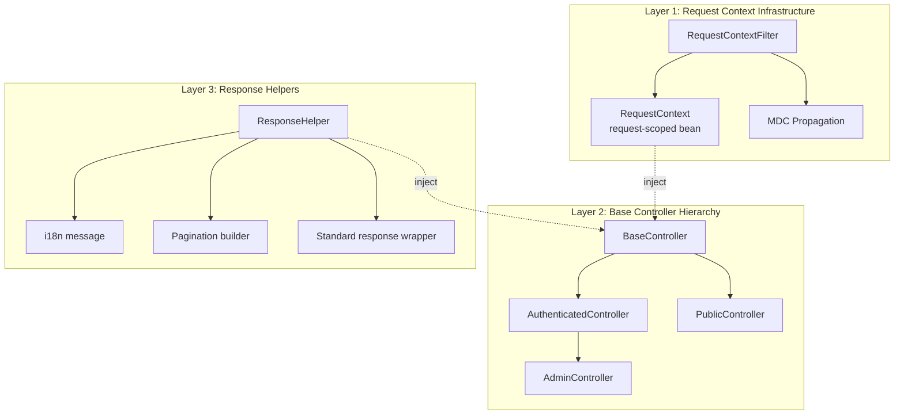
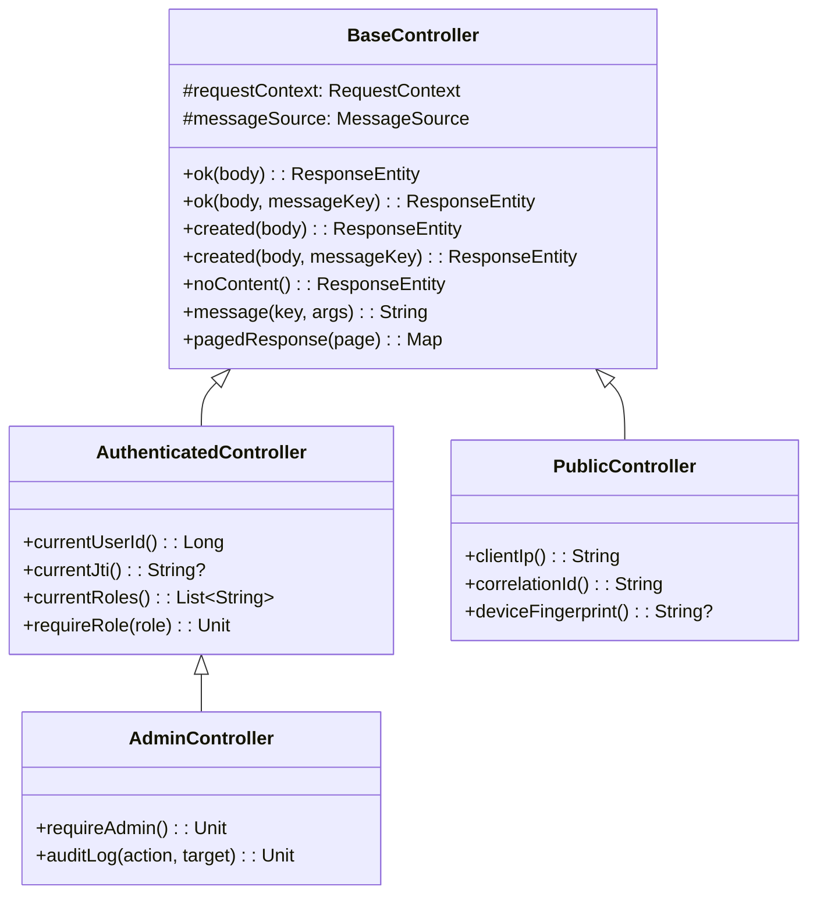
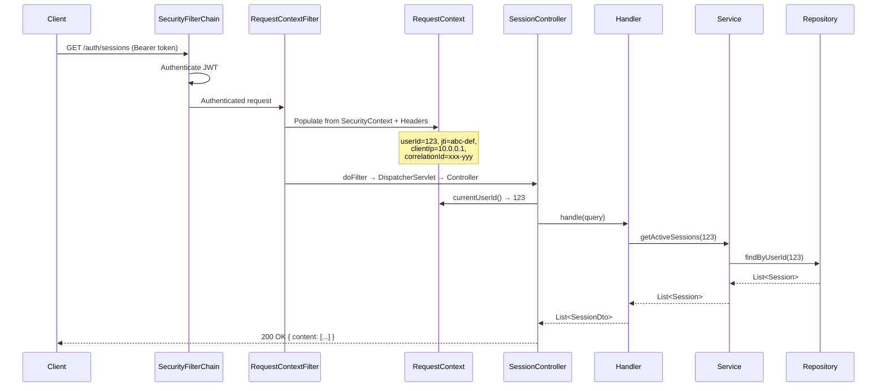

# Technical Specification — Controller Request Context Standardization

## 1. Architecture Overview

### 1.1 Giải pháp đề xuất: 3 Layer Approach



### 1.2 Data Flow — Before vs After

**BEFORE** (hiện tại):
```
Request → Controller {
    val userId = (SecurityContextHolder.getContext()...) // DUPLICATE
    val ip = request.getHeader("X-Forwarded-For")...     // DUPLICATE
    val correlationId = request.getHeader("X-Corr...")   // INCONSISTENT
    val command = LoginCommand(userId, ip, correlationId) // MANUAL MAPPING
    val result = handler.handle(command)
    val locale = LocaleContextHolder.getLocale()          // DUPLICATE
    val msg = messageSource.getMessage(...)               // DUPLICATE
    ResponseEntity.ok(mapOf("message" to msg))
}
```

**AFTER** (đề xuất):
```
Request → RequestContextFilter (auto-populate) → RequestContext bean
                                                      ↓
Controller {
    // RequestContext đã inject sẵn
    val command = request.toCommand(requestContext)  // Extension function
    val result = handler.handle(command)
    return ok(result, "auth.login_success")          // BaseController helper
}
```

---

## 2. Component Design

### 2.1 RequestContext — Request-Scoped Bean

```kotlin
/**
 * Centralized request context — populated by RequestContextFilter,
 * injectable into any Spring bean within the same request scope.
 *
 * Position in Clean Architecture: shared/web (adapter layer)
 * Scope: @RequestScope — one instance per HTTP request
 */
@Component
@RequestScope
class RequestContext {
    // === Authentication ===
    var userId: Long? = null
    var username: String? = null
    var jti: String? = null
    var roles: List<String> = emptyList()
    var authenticated: Boolean = false

    // === Request Metadata ===
    var clientIp: String = "unknown"
    var userAgent: String? = null
    var deviceFingerprint: String? = null
    var correlationId: String? = null    // X-Correlation-ID || X-Request-ID || auto-UUID
    var requestId: String = UUID.randomUUID().toString()

    // === Anonymous Session ===
    var anonymousSessionId: String? = null
    var anonymousTokenJti: String? = null

    // === Locale ===
    var locale: Locale = Locale.ENGLISH

    // === Convenience ===
    fun requireUserId(): Long = userId
        ?: throw InvalidCredentialsException()

    fun requireAuthenticated() {
        if (!authenticated) throw InvalidCredentialsException()
    }
}
```

### 2.2 RequestContextFilter — Auto-Populate

```kotlin
/**
 * Servlet filter — populates RequestContext before controller execution.
 * Runs AFTER Spring Security filter chain (authentication already resolved).
 *
 * Order: After SecurityFilterChain, before controllers.
 */
@Component
@Order(Ordered.LOWEST_PRECEDENCE - 10)
class RequestContextFilter(
    private val requestContext: ObjectProvider<RequestContext>
) : OncePerRequestFilter() {

    override fun doFilterInternal(
        request: HttpServletRequest,
        response: HttpServletResponse,
        filterChain: FilterChain
    ) {
        val ctx = requestContext.getObject()

        // Authentication
        SecurityContextHolder.getContext().authentication?.let { auth ->
            ctx.authenticated = auth.isAuthenticated
            ctx.userId = (auth.principal as? String)?.toLongOrNull()
            ctx.username = auth.name
            (auth.details as? Map<*, *>)?.let { details ->
                ctx.jti = details["jti"] as? String
            }
            ctx.roles = auth.authorities?.map { it.authority } ?: emptyList()
        }

        // Client IP
        ctx.clientIp = request.getHeader("X-Forwarded-For")
            ?.split(",")?.firstOrNull()?.trim()
            ?: request.remoteAddr

        // Headers
        ctx.userAgent = request.getHeader("User-Agent")
        ctx.deviceFingerprint = request.getHeader("X-Device-Fingerprint")
        ctx.correlationId = request.getHeader("X-Correlation-ID")
            ?: request.getHeader("X-Request-ID")
            ?: UUID.randomUUID().toString()

        // Locale
        ctx.locale = LocaleContextHolder.getLocale()

        // MDC propagation
        MDC.put("correlationId", ctx.correlationId)
        MDC.put("userId", ctx.userId?.toString() ?: "anonymous")
        MDC.put("clientIp", ctx.clientIp)

        try {
            filterChain.doFilter(request, response)
        } finally {
            MDC.remove("correlationId")
            MDC.remove("userId")
            MDC.remove("clientIp")
        }
    }
}
```

### 2.3 Base Controller Hierarchy



#### BaseController

```kotlin
/**
 * Base controller — provides common response helpers and RequestContext access.
 * All controllers should extend this class or its subclasses.
 */
abstract class BaseController(
    protected val requestContext: RequestContext,
    protected val messageSource: MessageSource
) {
    // === Response Helpers ===

    protected fun <T> ok(body: T): ResponseEntity<T> =
        ResponseEntity.ok(body)

    protected fun <T> ok(body: T, messageKey: String, vararg args: Any?): ResponseEntity<Any> {
        val msg = message(messageKey, *args)
        return when (body) {
            is Map<*, *> -> ResponseEntity.ok((body as Map<String, Any?>) + ("message" to msg))
            else -> ResponseEntity.ok(mapOf("data" to body, "message" to msg))
        }
    }

    protected fun okMessage(messageKey: String, vararg args: Any?): ResponseEntity<Map<String, String>> =
        ResponseEntity.ok(mapOf("message" to message(messageKey, *args)))

    protected fun <T> created(body: T): ResponseEntity<T> =
        ResponseEntity.status(HttpStatus.CREATED).body(body)

    protected fun <T> created(body: T, messageKey: String, vararg args: Any?): ResponseEntity<Any> {
        val msg = message(messageKey, *args)
        return ResponseEntity.status(HttpStatus.CREATED).body(
            when (body) {
                is Map<*, *> -> (body as Map<String, Any?>) + ("message" to msg)
                else -> mapOf("data" to body, "message" to msg)
            }
        )
    }

    protected fun noContent(): ResponseEntity<Void> =
        ResponseEntity.noContent().build()

    // === i18n ===

    protected fun message(key: String, vararg args: Any?): String =
        messageSource.getMessage(key, args.takeIf { it.isNotEmpty() }?.toList()?.toTypedArray(),
            key, requestContext.locale) ?: key

    // === Pagination ===

    protected fun <T> pagedResponse(page: org.springframework.data.domain.Page<T>): Map<String, Any?> =
        mapOf(
            "content" to page.content,
            "page" to page.number,
            "size" to page.size,
            "totalElements" to page.totalElements,
            "totalPages" to page.totalPages
        )
}
```

#### AuthenticatedController

```kotlin
/**
 * Controller base for endpoints requiring authentication.
 * Provides userId, JTI, roles from RequestContext.
 */
abstract class AuthenticatedController(
    requestContext: RequestContext,
    messageSource: MessageSource
) : BaseController(requestContext, messageSource) {

    protected fun currentUserId(): Long = requestContext.requireUserId()

    protected fun currentJti(): String? = requestContext.jti

    protected fun currentRoles(): List<String> = requestContext.roles

    protected fun requireRole(role: String) {
        if (role !in requestContext.roles) {
            throw org.springframework.security.access.AccessDeniedException("Required role: $role")
        }
    }
}
```

#### AdminController

```kotlin
/**
 * Controller base for admin-only endpoints.
 */
abstract class AdminController(
    requestContext: RequestContext,
    messageSource: MessageSource
) : AuthenticatedController(requestContext, messageSource) {

    protected fun requireAdmin() {
        if ("ROLE_ADMIN" !in requestContext.roles && "ROLE_SUPER_ADMIN" !in requestContext.roles) {
            throw org.springframework.security.access.AccessDeniedException("Admin access required")
        }
    }
}
```

### 2.4 DTO → Command Mapping Convention

**Convention**: Extension function trên DTO data class, nhận `RequestContext` làm parameter.

```kotlin
// BEFORE (inline trong Controller):
val command = LoginCommand(
    username = request.username,
    password = request.password,
    ipAddress = extractClientIp(httpRequest),
    userAgent = httpRequest.getHeader("User-Agent"),
    deviceFingerprint = httpRequest.getHeader("X-Device-Fingerprint"),
    correlationId = httpRequest.getHeader("X-Correlation-ID") ?: httpRequest.getHeader("X-Request-ID")
)

// AFTER (extension function on DTO):
fun LoginRequestDto.toCommand(ctx: RequestContext) = LoginCommand(
    username = username,
    password = password,
    domainCode = domainCode,
    captchaToken = captchaToken,
    trustedDeviceHash = trustedDeviceHash,
    ipAddress = ctx.clientIp,
    userAgent = ctx.userAgent,
    deviceFingerprint = ctx.deviceFingerprint,
    anonymousSessionId = anonymousSessionId,
    anonymousTokenJti = null, // Extracted separately in controller
    correlationId = ctx.correlationId
)
```

**Naming convention**: `fun <DtoClass>.toCommand(ctx: RequestContext): <CommandClass>`

**File location**: Cùng file với DTO hoặc trong file riêng `DtoMappers.kt` trong package `adapter.in.web.dto`.

---

## 3. File Layout

```
shared/
├── web/
│   ├── RequestContext.kt           [NEW]  ← Request-scoped bean
│   ├── RequestContextFilter.kt     [NEW]  ← Auto-populate filter
│   ├── BaseController.kt           [NEW]  ← Base with response helpers
│   ├── AuthenticatedController.kt  [NEW]  ← For auth-required endpoints
│   ├── AdminController.kt          [NEW]  ← For admin endpoints
│   └── PublicController.kt         [NEW]  ← For public endpoints

auth/adapter/in/web/
├── dto/
│   └── DtoMappers.kt              [NEW]  ← DTO → Command extension functions
├── CqrsAuthController.kt          [MODIFY] ← Extend PublicController/AuthenticatedController
├── MfaController.kt               [MODIFY] ← Extend AuthenticatedController
├── SessionController.kt           [MODIFY] ← Extend AuthenticatedController
├── DeviceController.kt            [MODIFY] ← Extend AuthenticatedController
├── SsoController.kt               [MODIFY] ← Extend AuthenticatedController
├── AccountLifecycleController.kt  [MODIFY] ← Extend AuthenticatedController
├── AdminSessionController.kt      [MODIFY] ← Extend AdminController
├── AdminUnlockController.kt       [MODIFY] ← Extend AdminController
├── RateLimitAdminController.kt    [MODIFY] ← Extend AdminController
├── AnonymousAuthController.kt     [MODIFY] ← Extend PublicController
├── TokenController.kt             [MODIFY] ← Extend BaseController
├── CaptchaController.kt           [MODIFY] ← Extend BaseController (no change needed — simple)
├── InternalApiController.kt       [MODIFY] ← Extend BaseController
├── KeyExchangeController.kt       [MODIFY] ← Minimal — already clean
├── EventStoreController.kt        [MODIFY] ← Minimal
└── SelfServiceUnlockController.kt [SKIP]  ← Thymeleaf SSR, different pattern
```

---

## 4. Sequence Diagram — Typical Authenticated Endpoint



---

## 5. Before/After Examples

### 5.1 SessionController

**BEFORE** (hiện tại — 93 lines):
```kotlin
@RestController
@RequestMapping("/auth/sessions")
class SessionController(
    private val loginSessionService: LoginSessionService,
    private val messageSource: MessageSource
) {
    @GetMapping
    fun getActiveSessions(): ResponseEntity<List<SessionResponse>> {
        val userId = getCurrentUserId()
        val sessions = loginSessionService.getActiveSessions(userId)
        return ResponseEntity.ok(sessions.map { it.toResponse() })
    }

    @DeleteMapping("/{sessionId}")
    fun revokeSession(@PathVariable sessionId: Long): ResponseEntity<Map<String, Any?>> {
        val userId = getCurrentUserId()
        val revoked = loginSessionService.revokeSession(sessionId, userId, "MANUAL")
        return if (revoked) {
            val locale = LocaleContextHolder.getLocale()
            val message = messageSource.getMessage("auth.session_revoked", null, "Session revoked", locale)
            ResponseEntity.ok(mapOf("message" to message))
        } else {
            ResponseEntity.notFound().build()
        }
    }

    @DeleteMapping
    fun revokeAllSessions(): ResponseEntity<Map<String, Any?>> {
        val userId = getCurrentUserId()
        loginSessionService.revokeAllSessions(userId, "MANUAL_ALL")
        val locale = LocaleContextHolder.getLocale()
        val message = messageSource.getMessage("auth.all_sessions_revoked", null, "All sessions revoked", locale)
        return ResponseEntity.ok(mapOf("message" to message))
    }

    private fun getCurrentUserId(): Long {
        return (SecurityContextHolder.getContext().authentication?.principal as? String)?.toLong()
            ?: throw InvalidCredentialsException()
    }
    // ...toResponse() extension...
}
```

**AFTER** (đề xuất — ~50 lines, cleaner):
```kotlin
@RestController
@RequestMapping("/auth/sessions")
class SessionController(
    requestContext: RequestContext,
    messageSource: MessageSource,
    private val loginSessionService: LoginSessionService
) : AuthenticatedController(requestContext, messageSource) {

    @GetMapping
    fun getActiveSessions(): ResponseEntity<List<SessionResponse>> {
        val sessions = loginSessionService.getActiveSessions(currentUserId())
        return ok(sessions.map { it.toResponse() })
    }

    @DeleteMapping("/{sessionId}")
    fun revokeSession(@PathVariable sessionId: Long): ResponseEntity<*> {
        val revoked = loginSessionService.revokeSession(sessionId, currentUserId(), "MANUAL")
        return if (revoked) okMessage("auth.session_revoked")
        else ResponseEntity.notFound().build()
    }

    @DeleteMapping
    fun revokeAllSessions(): ResponseEntity<Map<String, String>> {
        loginSessionService.revokeAllSessions(currentUserId(), "MANUAL_ALL")
        return okMessage("auth.all_sessions_revoked")
    }
}
```

### 5.2 AdminSessionController — Pagination

**BEFORE**:
```kotlin
@GetMapping
fun listAllActiveSessions(
    @RequestParam(defaultValue = "0") page: Int,
    @RequestParam(defaultValue = "20") size: Int
): ResponseEntity<Map<String, Any?>> {
    val pageable = PageRequest.of(page, size, Sort.by(Sort.Direction.DESC, "loginAt"))
    val sessionPage = loginSessionRepository.findBySessionActiveTrue(pageable)
    val sessions = sessionPage.content.map { session -> mapOf(...) }
    return ResponseEntity.ok(mapOf(
        "content" to sessions,
        "page" to page,
        "size" to size,
        "totalElements" to sessionPage.totalElements,
        "totalPages" to sessionPage.totalPages
    ))
}
```

**AFTER**:
```kotlin
@GetMapping
fun listAllActiveSessions(
    @RequestParam(defaultValue = "0") page: Int,
    @RequestParam(defaultValue = "20") size: Int
): ResponseEntity<Map<String, Any?>> {
    val pageable = PageRequest.of(page, size, Sort.by(Sort.Direction.DESC, "loginAt"))
    val sessionPage = loginSessionRepository.findBySessionActiveTrue(pageable)
        .map { it.toAdminDto() }
    return ok(pagedResponse(sessionPage))
}
```

---

## 6. Migration Strategy

### Phase 1: Infrastructure (0 breaking changes)
1. Tạo `RequestContext`, `RequestContextFilter` trong `shared/web/`
2. Tạo `BaseController`, `AuthenticatedController`, `AdminController`
3. Tạo `DtoMappers.kt`

### Phase 2: Migrate Controllers (one-by-one, incremental)
**Order**: Đơn giản → phức tạp

1. `SessionController` (đơn giản nhất, 3 endpoints)
2. `DeviceController` (tương tự SessionController)
3. `AccountLifecycleController` (5 endpoints, straightforward)
4. `MfaController` (5 endpoints)
5. `SsoController` (4 endpoints)
6. `AdminSessionController` + `RateLimitAdminController` + `AdminUnlockController` → `AdminController`
7. `TokenController` (complex — introspection)
8. `AnonymousAuthController` (complex — anonymous session)
9. `CqrsAuthController` (most complex — login/register/refresh/etc.)

### Phase 3: RBAC/PBAC Controllers
10. `RbacControllers.kt` (5 controllers trong 1 file → tách nếu cần)
11. `PolicyController`

### Phase 4: Cleanup
- Xóa tất cả private `getCurrentUserId()`, `extractClientIp()`, `extractBearerToken()`
- Xóa duplicate `LocaleContextHolder.getLocale()` calls
- Run tests → verify no behavior change

---

## 7. Compatibility & Risk

| Aspect | Risk | Mitigation |
|--------|------|-----------|
| API Contract | ⚠️ Không đổi | Extension functions giữ nguyên response format |
| Constructor change | ⚠️ Thêm params | Constructor injection — Spring auto-resolves |
| Existing tests | ⚠️ Cần update | Tests cần mock/inject `RequestContext` |
| Thread safety | ✅ An toàn | `@RequestScope` — mỗi request 1 instance |
| Performance | ✅ Negligible | Filter chỉ thêm ~1ms (header read + ThreadLocal set) |
| Async/Virtual Thread | ⚠️ Cần kiểm tra | `@RequestScope` dùng ThreadLocal — cần verify với virtual threads |

---

## 8. Agent Implementation Notes

### 8.1 Spring @RequestScope và ObjectProvider
- `@RequestScope` bean **PHẢI** inject qua `ObjectProvider<RequestContext>` trong Filter (vì Filter lifecycle khác Controller).
- Trong Controller, inject trực tiếp `RequestContext` vì Spring tạo proxy CGLIB.

### 8.2 Không dùng Abstract Controller cho mọi thứ
- `SelfServiceUnlockController` (Thymeleaf SSR) → KHÔNG extend, giữ nguyên.
- `KeyExchangeController`, `CaptchaController` → Đã rất clean, extend `BaseController` chỉ để dùng `ok()`.

### 8.3 Clean Architecture boundary
- `RequestContext` nằm trong `shared/web/` (adapter layer) — KHÔNG vào domain.
- Handler/Service KHÔNG biết về `RequestContext` — chỉ nhận data từ Command/Query.
- Controller chịu trách nhiệm extract từ `RequestContext` → map vào Command.
