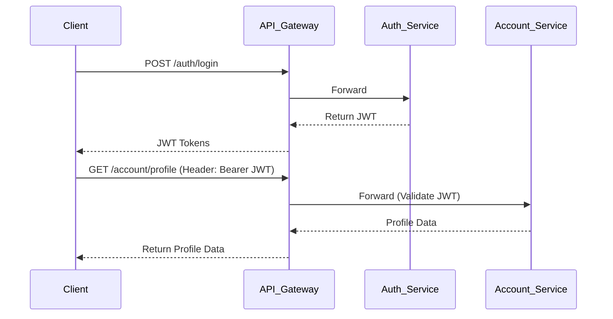

# Technical Specification

## 1. Architecture Flow

## 2. Database Schema Design (Phân tán)

### `auth-service` DB
- `credentials`: id, user_id (UUID), username, password_hash, status (ACTIVE, LOCKED).
- `refresh_tokens`: id, user_id, token_hash, device_id, expires_at.

### `account-service` DB
- `users`: id (UUID), email, phone, full_name, created_at.
- `user_devices`: id, user_id, device_name, ip_address, last_active.

### `system-admin-service` DB
- `roles`: id, name, description.
- `permissions`: id, action, resource.
- `role_permissions`: role_id, permission_id.
- `user_roles`: user_id, role_id.
- `audit_logs`: id, admin_id, action, target_id, details, created_at.

## 3. Core API Endpoints
**Auth Service**
- `POST /api/v1/auth/login`
- `POST /api/v1/auth/refresh`
- `POST /api/v1/auth/logout`

**Account Service**
- `GET /api/v1/account/me`
- `PUT /api/v1/account/profile`
- `GET /api/v1/account/devices`

**Admin Service**
- `GET /api/v1/admin/users`
- `POST /api/v1/admin/users/{id}/block`
- `POST /api/v1/admin/roles`

## 4. Agent Implementation Notes
- Cả 3 service cần sử dụng chung một cơ chế xử lý JWT (có thể tạo module `common-security` chứa JwtDecoder filter).
- Các action ảnh hưởng chéo (như Admin block user) có thể dùng Kafka: `AdminService` publish event `UserBlockedEvent`, `AuthService` listen và revoke hết token của user đó.
