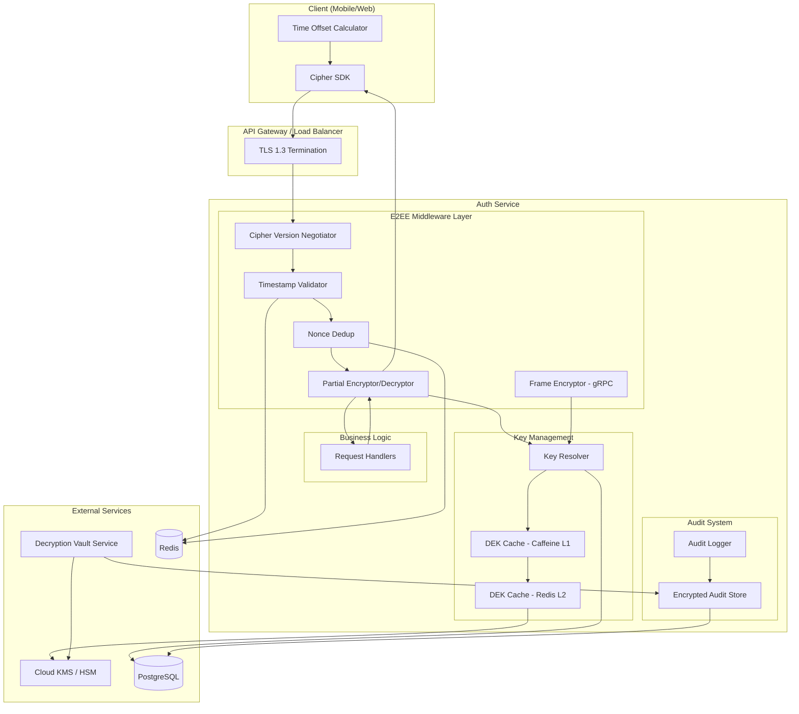
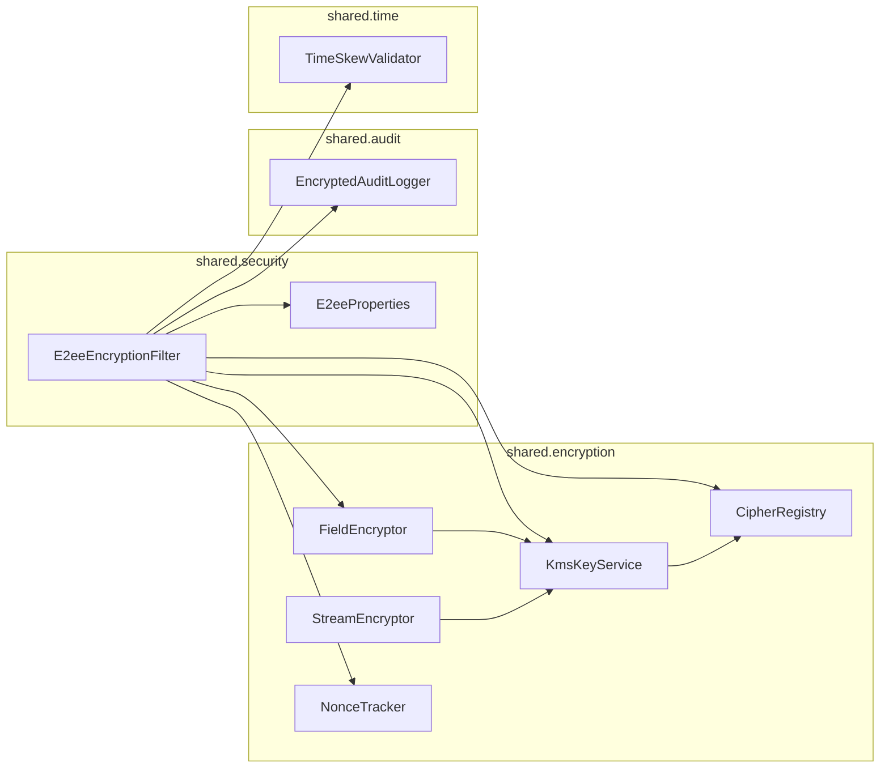
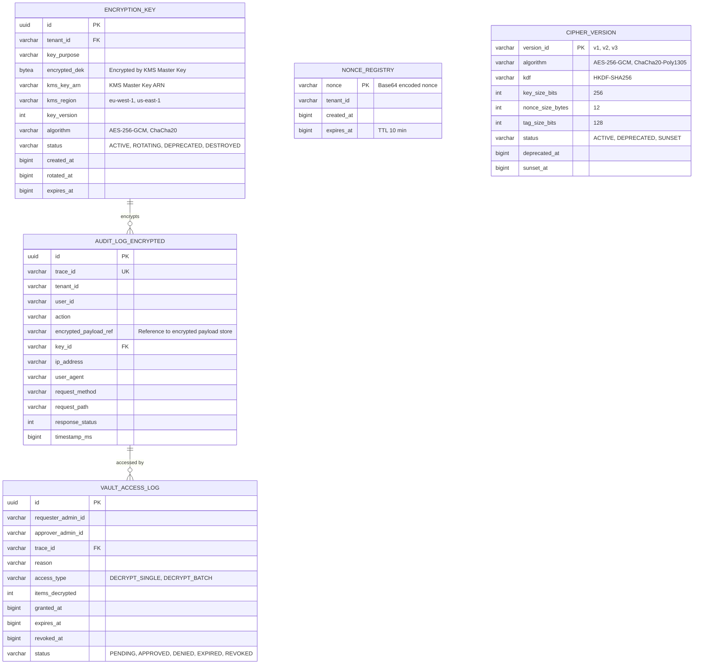
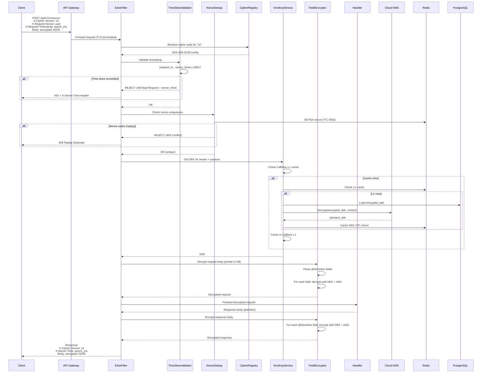
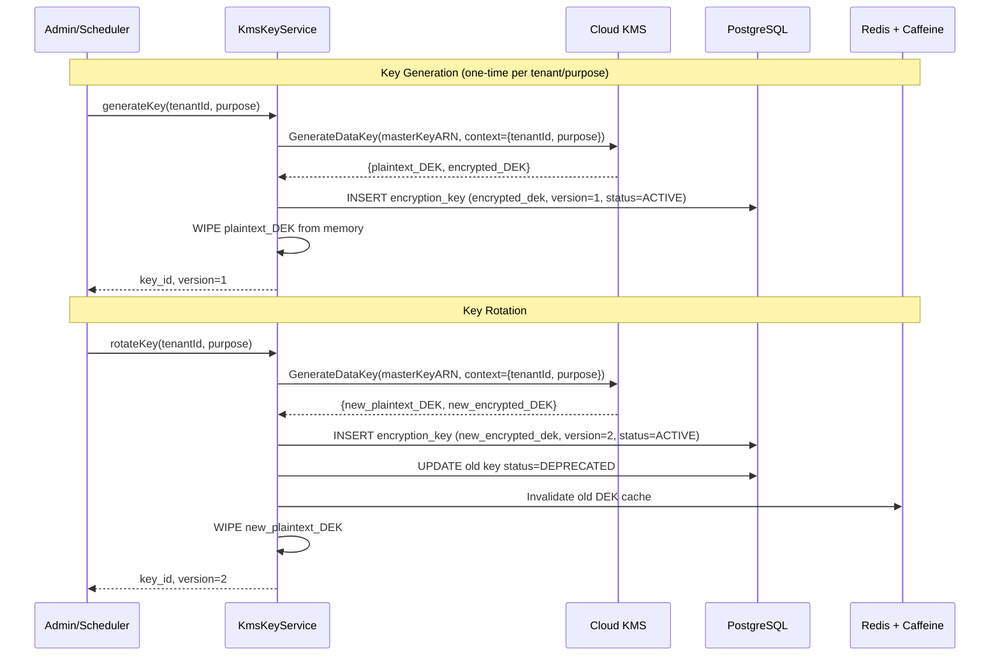
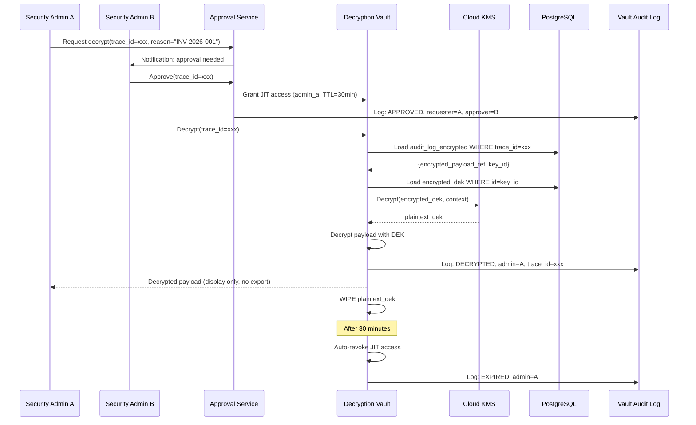

# Technical Specification: E2EE Performance & Compliance

> Đặc tả kỹ thuật chi tiết — architecture, data schema, data flow, API spec, agent implementation notes.

## 1. Architecture Overview

### 1.1 High-Level Architecture



### 1.2 Component Diagram



---

## 2. Data Schema

### 2.1 Entity Relationship Diagram



### 2.2 DDL Scripts

```sql
-- V10__e2ee_performance_compliance.sql

-- Table: encryption_key (replaces plaintext key storage)
CREATE TABLE encryption_key (
    id              UUID PRIMARY KEY DEFAULT gen_random_uuid(),
    tenant_id       VARCHAR(50) NOT NULL,
    key_purpose     VARCHAR(50) NOT NULL DEFAULT 'E2EE_DATA',
    encrypted_dek   BYTEA NOT NULL,
    kms_key_arn     VARCHAR(255) NOT NULL,
    kms_region      VARCHAR(30) NOT NULL DEFAULT 'us-east-1',
    key_version     INT NOT NULL DEFAULT 1,
    algorithm       VARCHAR(30) NOT NULL DEFAULT 'AES-256-GCM',
    status          VARCHAR(20) NOT NULL DEFAULT 'ACTIVE',
    created_at      BIGINT NOT NULL,
    rotated_at      BIGINT,
    expires_at      BIGINT,
    CONSTRAINT uq_tenant_purpose_version UNIQUE (tenant_id, key_purpose, key_version)
);

CREATE INDEX idx_encryption_key_tenant_status ON encryption_key (tenant_id, status);
CREATE INDEX idx_encryption_key_purpose ON encryption_key (key_purpose, status);

-- Table: audit_log_encrypted
CREATE TABLE audit_log_encrypted (
    id                      UUID PRIMARY KEY DEFAULT gen_random_uuid(),
    trace_id                VARCHAR(64) NOT NULL UNIQUE,
    tenant_id               VARCHAR(50) NOT NULL,
    user_id                 VARCHAR(50),
    action                  VARCHAR(100) NOT NULL,
    encrypted_payload_ref   VARCHAR(255),
    key_id                  UUID REFERENCES encryption_key(id),
    ip_address              VARCHAR(45),
    user_agent              VARCHAR(500),
    request_method          VARCHAR(10),
    request_path            VARCHAR(500),
    response_status         INT,
    timestamp_ms            BIGINT NOT NULL
);

CREATE INDEX idx_audit_log_tenant_ts ON audit_log_encrypted (tenant_id, timestamp_ms);
CREATE INDEX idx_audit_log_trace ON audit_log_encrypted (trace_id);
CREATE INDEX idx_audit_log_user ON audit_log_encrypted (user_id, timestamp_ms);

-- Table: vault_access_log
CREATE TABLE vault_access_log (
    id                  UUID PRIMARY KEY DEFAULT gen_random_uuid(),
    requester_admin_id  VARCHAR(50) NOT NULL,
    approver_admin_id   VARCHAR(50),
    trace_id            VARCHAR(64) NOT NULL,
    reason              VARCHAR(500) NOT NULL,
    access_type         VARCHAR(30) NOT NULL DEFAULT 'DECRYPT_SINGLE',
    items_decrypted     INT DEFAULT 0,
    granted_at          BIGINT,
    expires_at          BIGINT,
    revoked_at          BIGINT,
    status              VARCHAR(20) NOT NULL DEFAULT 'PENDING'
);

CREATE INDEX idx_vault_access_status ON vault_access_log (status, granted_at);

-- Table: cipher_version
CREATE TABLE cipher_version (
    version_id      VARCHAR(10) PRIMARY KEY,
    algorithm       VARCHAR(50) NOT NULL,
    kdf             VARCHAR(50) NOT NULL DEFAULT 'HKDF-SHA256',
    key_size_bits   INT NOT NULL DEFAULT 256,
    nonce_size_bytes INT NOT NULL DEFAULT 12,
    tag_size_bits   INT NOT NULL DEFAULT 128,
    status          VARCHAR(20) NOT NULL DEFAULT 'ACTIVE',
    deprecated_at   BIGINT,
    sunset_at       BIGINT
);

-- Seed cipher versions
INSERT INTO cipher_version (version_id, algorithm, kdf, key_size_bits, nonce_size_bytes, tag_size_bits, status)
VALUES 
    ('v1', 'ChaCha20-Poly1305', 'HKDF-SHA256', 256, 12, 128, 'ACTIVE'),
    ('v2', 'AES-256-GCM', 'HKDF-SHA256', 256, 12, 128, 'ACTIVE');
```

---

## 3. Data Flow

### 3.1 Request Encryption/Decryption Flow



### 3.2 KMS Key Lifecycle Flow



### 3.3 Audit Investigation Flow



---

## 4. API Specification

### 4.1 E2EE Headers

| Header | Direction | Required | Example | Description |
|--------|-----------|----------|---------|-------------|
| `X-Cipher-Version` | Request/Response | Yes | `v2` | Cipher suite version |
| `X-Request-Nonce` | Request | Yes | `uuid-v4` | Unique per request, anti-replay |
| `X-Request-Timestamp` | Request | Yes | `1723708539000` | Epoch ms, adjusted for offset |
| `X-Server-Time` | Response | Always | `1723708539500` | Server epoch ms for offset calc |
| `X-Encryption-Mode` | Request | No | `FULL` / `PARTIAL` | Default: FULL |
| `Sunset` | Response | Conditional | `2027-01-01` | When cipher version deprecated |

### 4.2 Encrypted Field Wrapper (Partial Mode)

```json
{
  "user": {
    "name": "John Doe",
    "email": "john@example.com",
    "ssn": {
      "_enc": true,
      "v": 2,
      "alg": "AES-256-GCM",
      "kid": "key-v2-T1",
      "iv": "base64...",
      "tag": "base64...",
      "ct": "base64..."
    }
  }
}
```

### 4.3 Streaming Frame Format (gRPC)

```
Frame Header (18 bytes):
┌────────────────────────────────────────┐
│ Version (1 byte)     = 0x02            │
│ Flags   (1 byte)     = 0b0000_000X    │
│   bit 0: is_last_frame                 │
│   bit 1: is_compressed                 │
│ Sequence (4 bytes)   = big-endian uint │
│ Nonce   (12 bytes)   = random          │
└────────────────────────────────────────┘

Frame Body:
┌────────────────────────────────────────┐
│ Encrypted Payload (variable length)    │
│ Auth Tag (16 bytes)                    │
└────────────────────────────────────────┘
```

### 4.4 Error Responses

| Status | Error Code | Scenario |
|--------|-----------|----------|
| 400 | `E2EE_TIME_SKEW` | Request timestamp outside tolerance |
| 400 | `E2EE_VERSION_UNKNOWN` | Unknown cipher version |
| 403 | `E2EE_CONTEXT_MISMATCH` | AAD context mismatch (wrong tenant/user) |
| 409 | `E2EE_REPLAY_DETECTED` | Duplicate nonce detected |
| 426 | `E2EE_VERSION_SUNSET` | Cipher version expired, upgrade required |
| 500 | `E2EE_DECRYPT_FAILED` | Decryption failure (corrupted data) |
| 503 | `E2EE_KMS_UNAVAILABLE` | KMS unreachable + no cached key |

---

## 5. Configuration

### 5.1 application.yml additions

```yaml
app:
  security:
    e2ee:
      enabled: true
      # Cipher versioning
      default-cipher-version: v2
      supported-versions:
        v1:
          algorithm: ChaCha20-Poly1305
          status: DEPRECATED
          sunset-date: "2027-01-01"
        v2:
          algorithm: AES-256-GCM
          status: ACTIVE
      # Time skew
      time-skew:
        default-tolerance-seconds: 300       # ±5 minutes
        initial-tolerance-seconds: 600       # ±10 minutes for first request
        nonce-dedup-ttl-seconds: 600         # 10 minutes Redis TTL
      # Key management
      kms:
        provider: aws                        # aws | gcp | azure
        master-key-arn: "arn:aws:kms:us-east-1:123456:key/xxx"
        region-mapping:
          EU: "arn:aws:kms:eu-west-1:123456:key/yyy"
          US: "arn:aws:kms:us-east-1:123456:key/xxx"
        dek-cache-ttl-seconds: 300           # 5 minutes
      # Partial encryption
      partial:
        enabled: true
        mode: ANNOTATION                     # ANNOTATION | JSON_PATH
        json-paths:                          # Only if mode = JSON_PATH
          - "$.user.ssn"
          - "$.payment.card_number"
      # Streaming
      streaming:
        max-frame-size-bytes: 1048576        # 1MB
        tunnel-threshold-bytes: 10485760     # 10MB — switch to TLS tunnel
      # Audit
      audit:
        log-encrypted: true
        vault-service-url: "https://vault.internal:8443"
        jit-access-ttl-minutes: 30
        max-decrypts-per-session: 10
      # Failure mode
      failure-mode: FAIL_FAST               # FAIL_FAST | FAIL_OPEN (dev only)
```

---

## 6. Module Structure (Proposed)

```
src/main/kotlin/com/ntt/authservice/
├── shared/
│   ├── encryption/
│   │   ├── E2eeProperties.kt              # @ConfigurationProperties for e2ee
│   │   ├── CipherRegistry.kt              # Version → algorithm mapping
│   │   ├── KmsKeyService.kt               # Envelope encryption via Cloud KMS
│   │   ├── FieldEncryptor.kt              # Partial field encrypt/decrypt
│   │   ├── StreamEncryptor.kt             # Frame-based streaming encrypt
│   │   ├── NonceTracker.kt                # Redis-backed nonce dedup
│   │   ├── TimeSkewValidator.kt           # Timestamp validation + tolerance
│   │   ├── Sensitive.kt                   # @Sensitive annotation
│   │   └── model/
│   │       ├── EncryptedFieldWrapper.kt   # {"_enc":true, "v":2, ...}
│   │       ├── EncryptionFrame.kt         # Streaming frame model
│   │       └── CipherSuiteConfig.kt       # Per-version cipher config
│   ├── security/
│   │   ├── JwtAuthFilter.kt              # (existing)
│   │   └── E2eeEncryptionFilter.kt       # NEW — main E2EE filter
│   └── audit/
│       ├── EncryptedAuditLogger.kt        # Log encrypted payloads
│       └── model/
│           └── AuditLogEntry.kt           # Encrypted audit log entity
```

---

## 7. Key Design Decisions

### 7.1 Decision Record

| # | Decision | Options Considered | Chosen | Rationale |
|---|----------|-------------------|--------|-----------|
| D1 | Crypto library | Tink, BouncyCastle, custom | **Tink (primary)** | Misuse-resistant, KMS native, streaming AEAD |
| D2 | KMS provider | AWS KMS, GCP KMS, Vault | **Cloud KMS (configurable)** | Managed, multi-cloud via Tink adapters |
| D3 | Partial encryption marker | JSONPath config, annotation | **Annotation (@Sensitive)** | Type-safe, compile-time, IDE support |
| D4 | Nonce dedup storage | Redis SET, DB, in-memory | **Redis SET + TTL** | Fast, auto-expire, distributed |
| D5 | DEK cache strategy | Redis only, Caffeine only, L1+L2 | **Caffeine L1 + Redis L2** | Fast local + shared across instances |
| D6 | Failure mode | Fail-fast, fail-open | **Fail-fast** | Security > availability for encryption |
| D7 | Session model | Stateless JWT, stateful Redis | **Stateless JWT** | E2EE metadata in JWT claims |
| D8 | Multi-tenancy | Shared key, per-tenant DEK | **Per-tenant DEK + TenantID in AAD** | Cryptographic isolation |
| D9 | Cipher migration | Breaking change, versioned | **Versioned payload + header** | Backward compatible, 3-month sunset |
| D10 | Audit access | Direct decrypt, vault service | **Decryption Vault + break-glass** | Tightest access control, compliance |

---

## 8. Non-Functional Requirements

| NFR | Requirement | Metric |
|-----|------------|--------|
| Latency | KMS call overhead | < 50ms (cached), < 100ms (uncached) |
| Throughput | Encryption overhead | < 5ms per field (partial), < 10ms full body |
| Availability | KMS dependency | 99.99% with DEK cache fallback |
| Cache hit ratio | DEK cache | > 95% in steady state |
| Nonce dedup | Redis latency | < 5ms for SETNX |
| Streaming | Frame processing | < 1ms per frame encryption |
| Time skew | Tolerance | ±5 min (±10 min initial) |
| Audit | Vault access | JIT TTL 30 min, max 10 decrypts |
| Security | Key exposure | Plaintext DEK in memory < 5 min |

---

## 9. Agent Implementation Notes

### 9.1 Implementation Order

1. **Phase 1**: `E2eeProperties`, `CipherRegistry`, `CipherSuiteConfig` — config foundation
2. **Phase 2**: `KmsKeyService` + DB migration — envelope encryption
3. **Phase 3**: `@Sensitive`, `FieldEncryptor`, `EncryptedFieldWrapper` — partial encryption
4. **Phase 4**: `TimeSkewValidator`, `NonceTracker` — anti-replay
5. **Phase 5**: `E2eeEncryptionFilter` — main filter (integrates phases 1-4)
6. **Phase 6**: `EncryptedAuditLogger`, `AuditLogEntry` — audit system
7. **Phase 7**: `StreamEncryptor`, `EncryptionFrame` — gRPC streaming (when needed)
8. **Phase 8**: Decryption Vault service — separate microservice

### 9.2 Key Code Patterns

**@Sensitive Annotation:**
```kotlin
@Target(AnnotationTarget.FIELD, AnnotationTarget.PROPERTY)
@Retention(AnnotationRetention.RUNTIME)
annotation class Sensitive(
    val level: SensitivityLevel = SensitivityLevel.PII,
    val fieldPath: String = "" // Override auto-detected path
)

enum class SensitivityLevel { PII, FINANCIAL, HEALTH, SECRET }
```

**AAD Builder:**
```kotlin
fun buildAad(tenantId: String, userId: String, fieldPath: String): ByteArray {
    return "tenant:$tenantId:user:$userId:field:$fieldPath"
        .toByteArray(Charsets.UTF_8)
}
```

**Envelope Encryption via Tink:**
```kotlin
// Setup (once)
val kmsClient = AwsKmsClient.create("aws-kms://arn:aws:kms:...")
val dekTemplate = KeyTemplates.get("AES256_GCM")
val kekAead = kmsClient.getAead("aws-kms://arn:aws:kms:...")
val envelopeAead = KmsEnvelopeAead.create(kekAead, dekTemplate)

// Encrypt with AAD
val ciphertext = envelopeAead.encrypt(plaintext, aad)

// Decrypt with AAD
val plaintext = envelopeAead.decrypt(ciphertext, aad)
```

### 9.3 Testing Strategy

| Test Type | What to Test | Tool |
|-----------|-------------|------|
| Unit | FieldEncryptor, NonceTracker, TimeSkewValidator | JUnit 5 + Mockito |
| Integration | KmsKeyService with mock KMS | Testcontainers (LocalStack) |
| Security | Nonce reuse detection, AAD mismatch rejection | Custom security tests |
| Performance | Encryption throughput, cache hit ratio | JMH benchmarks |
| E2E | Full request flow through E2eeFilter | Spring Boot Test |

### 9.4 Dependencies to Add

```kotlin
// build.gradle.kts additions
implementation("com.google.crypto.tink:tink:1.15.0")
implementation("com.google.crypto.tink:tink-awskms:1.15.0")   // or tink-gcpkms
// BouncyCastle already in testRuntimeOnly — promote to implementation if needed
```

---

> **Next**: Phase 7 (Review Loop)
