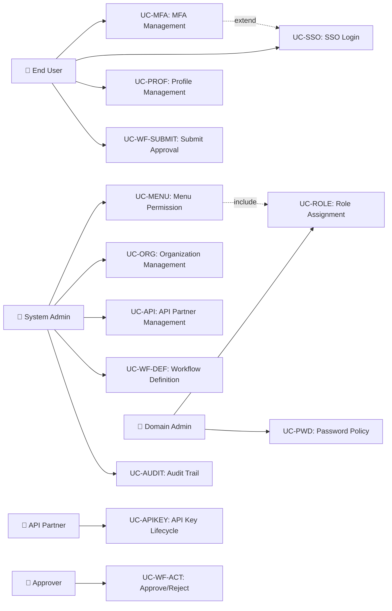

# Tài liệu phân tích nghiệp vụ: ERP IAM System

> Phân tích nghiệp vụ chi tiết — chia nhỏ theo use case, đặc tả ngữ nghĩa từng chức năng.

---

## 1. Tổng quan (Overview)

### 1.1 Bối cảnh nghiệp vụ (Business Context)
Hệ thống ERP boilerplate hiện có auth-service với authentication cơ bản (login/register, JWT, RBAC/PBAC, MFA, SSO, session management) nhưng thiếu nhiều tính năng enterprise-grade: dynamic menu permission, organization management, API partner management, approval workflow. Account-service và system-admin-service chỉ có stub code. Cần xây dựng IAM hoàn chỉnh chia 3 microservice với bounded contexts rõ ràng.

### 1.2 Mục tiêu (Objectives)

| # | Mục tiêu | KPI đo lường | Độ ưu tiên |
|---|---------|-------------|-----------|
| O-01 | Authentication hoàn chỉnh (MFA, SSO, password policy) | MFA enrollment rate > 50% enterprise users | High |
| O-02 | Dynamic menu permission (tree + button-level) | Frontend render < 500ms, cache hit > 80% | High |
| O-03 | Organization management (department, position) | Admin CRUD < 200ms response | High |
| O-04 | API partner management (key, rate limit, quota) | Rate limit accuracy > 99%, 429 response < 50ms | High |
| O-05 | Dynamic approval workflow engine | Workflow step completion notification < 5s | Medium |
| O-06 | User profile management (tách biệt auth data) | Profile CRUD < 200ms, separate DB | High |
| O-07 | Audit trail cho mọi thao tác admin | 100% admin actions logged, immutable | High |

### 1.3 Phạm vi (Scope)

| In Scope | Out of Scope |
|----------|-------------|
| User lifecycle (CRUD, lock/unlock, soft-delete) | Business domain logic (booking, payment) |
| Authentication: username/password, OAuth2 SSO, MFA | Frontend implementation (API contracts only) |
| RBAC: Role → Group → User hierarchy | Email/SMS provider (adapter pattern) |
| PBAC: Dynamic policy conditions | Notification service (separate microservice) |
| Menu permission: Dynamic tree + button-level | Payment/billing cho API partners |
| API Partner: API key, rate limiting, quota | Mobile biometric auth |
| Organization: Department, position, hierarchy | |
| Approval workflow: Dynamic multi-step | |
| Audit logging: All admin actions | |

### 1.4 Stakeholders & Actors

| Actor | Loại | Mô tả | Tương tác chính |
|-------|------|--------|----------------|
| End User | Primary | Người dùng hệ thống ERP | Login, MFA, view profile, use features |
| System Admin | Primary | Quản trị viên hệ thống | Menu config, org management, user management |
| Domain Admin | Primary | Quản trị viên domain/tenant | Role assignment, policy config, audit review |
| API Partner | Primary | Đối tác tích hợp API | API key management, usage monitoring |
| Approver | Primary | Người phê duyệt | Approve/reject workflow steps |
| Keycloak IdP | External System | Optional identity provider | OAuth2/OIDC delegation |
| Redis | External System | Cache + state store | Permission cache, rate limiting, OTP state |
| Kafka | External System | Message broker | Inter-service events |

---

## 2. Use Case Diagram (tổng quan)

---

## 3. Danh sách Use Case (Use Case Index)

| UC-ID | Tên Use Case | Actor | Nhóm chức năng | Độ ưu tiên | Trạng thái |
|-------|-------------|-------|----------------|-----------|-----------|
| UC-MFA-01 | Enable 2FA cho user | End User | AUTH - MFA | High | Draft |
| UC-MFA-02 | Login với 2FA | End User | AUTH - MFA | High | Draft |
| UC-MFA-03 | CAPTCHA verification | End User | AUTH - MFA | High | Draft |
| UC-MFA-04 | Recovery codes management | End User | AUTH - MFA | High | Draft |
| UC-MFA-05 | Disable 2FA | End User | AUTH - MFA | Medium | Draft |
| UC-SSO-01 | Login via Keycloak | End User | AUTH - SSO | High | Draft |
| UC-SSO-02 | Login via Google/Microsoft | End User | AUTH - SSO | High | Draft |
| UC-SSO-03 | Link external account | End User | AUTH - SSO | Medium | Draft |
| UC-SSO-04 | Auto-provision SSO user | System | AUTH - SSO | Medium | Draft |
| UC-PWD-01 | Configure password policy | Domain Admin | AUTH - Password | High | Draft |
| UC-PWD-02 | Force password reset | Domain Admin | AUTH - Password | Medium | Draft |
| UC-PROF-01 | View/Update profile | End User | ACCOUNT - Profile | High | Draft |
| UC-PROF-02 | Change email (verified) | End User | ACCOUNT - Profile | High | Draft |
| UC-PROF-03 | Upload avatar | End User | ACCOUNT - Profile | Medium | Draft |
| UC-PROF-04 | View login history | End User | ACCOUNT - Profile | Medium | Draft |
| UC-PROF-05 | Admin manage user profiles | System Admin | ACCOUNT - Profile | High | Draft |
| UC-DEV-01 | List active devices | End User | ACCOUNT - Device | Medium | Draft |
| UC-DEV-02 | Trust device (skip 2FA) | End User | ACCOUNT - Device | Medium | Draft |
| UC-DEV-03 | Revoke device | End User | ACCOUNT - Device | Medium | Draft |
| UC-SES-01 | List active sessions | End User | ACCOUNT - Session | Medium | Draft |
| UC-SES-02 | Terminate session | End User | ACCOUNT - Session | Medium | Draft |
| UC-LIFE-01 | Deactivate account | End User | ACCOUNT - Lifecycle | Medium | Draft |
| UC-LIFE-02 | Request account deletion (GDPR) | End User | ACCOUNT - Lifecycle | Medium | Draft |
| UC-LIFE-03 | Export personal data (GDPR) | End User | ACCOUNT - Lifecycle | Medium | Draft |
| UC-MENU-01 | CRUD menu items (tree) | System Admin | SYS-ADMIN - Menu | High | Draft |
| UC-MENU-02 | Assign menu permissions to role | System Admin | SYS-ADMIN - Menu | High | Draft |
| UC-MENU-03 | Get user's accessible menu tree | End User | SYS-ADMIN - Menu | High | Draft |
| UC-MENU-04 | Button-level permission | System Admin | SYS-ADMIN - Menu | High | Draft |
| UC-MENU-05 | Menu versioning (draft→publish) | System Admin | SYS-ADMIN - Menu | Medium | Draft |
| UC-ORG-01 | CRUD departments (tree) | System Admin | SYS-ADMIN - Org | High | Draft |
| UC-ORG-02 | CRUD positions | System Admin | SYS-ADMIN - Org | High | Draft |
| UC-ORG-03 | Assign user to position/department | System Admin | SYS-ADMIN - Org | High | Draft |
| UC-ORG-04 | View organization chart | End User | SYS-ADMIN - Org | Medium | Draft |
| UC-ORG-05 | Transfer user between departments | System Admin | SYS-ADMIN - Org | Medium | Draft |
| UC-API-01 | Register API partner | System Admin | SYS-ADMIN - API | High | Draft |
| UC-API-02 | Generate/Rotate API key | System Admin | SYS-ADMIN - API | High | Draft |
| UC-API-03 | Set rate limit per API key | System Admin | SYS-ADMIN - API | High | Draft |
| UC-API-04 | View usage dashboard | System Admin | SYS-ADMIN - API | Medium | Draft |
| UC-API-05 | Suspend/Revoke API key | System Admin | SYS-ADMIN - API | High | Draft |
| UC-API-06 | Configure IP whitelist | System Admin | SYS-ADMIN - API | Medium | Draft |
| UC-WF-01 | Define approval workflow | System Admin | SYS-ADMIN - Workflow | High | Draft |
| UC-WF-02 | Submit entity for approval | End User | SYS-ADMIN - Workflow | High | Draft |
| UC-WF-03 | Approve/Reject step | Approver | SYS-ADMIN - Workflow | High | Draft |
| UC-WF-04 | Delegate approval | Approver | SYS-ADMIN - Workflow | Medium | Draft |
| UC-WF-05 | Auto-escalation on timeout | System | SYS-ADMIN - Workflow | Medium | Draft |
| UC-WF-06 | View approval history | End User | SYS-ADMIN - Workflow | Medium | Draft |
| UC-AUDIT-01 | Search audit logs | System Admin | SYS-ADMIN - Audit | High | Draft |
| UC-AUDIT-02 | Export audit logs | System Admin | SYS-ADMIN - Audit | Medium | Draft |

---

## 4. Đặc tả Use Case chi tiết

### UC-MENU-01: CRUD Menu Items (Tree Structure)

#### 4.1 Thông tin chung

| Mục | Nội dung |
|-----|----------|
| **Mã** | UC-MENU-01 |
| **Tên** | Create/Read/Update/Delete Menu Items |
| **Mô tả ngữ nghĩa** | Quản lý cây menu chức năng dynamic — cho phép admin cấu hình navigation tree, route paths, icons, và component mappings. Giá trị: frontend nhận menu tree từ backend để render navigation bar, đảm bảo users chỉ thấy menu items được phân quyền. |
| **Actor** | System Admin |
| **Trigger** | Admin mở trang Menu Management |
| **Độ ưu tiên** | High |
| **Tần suất** | On-demand (khi cấu hình hệ thống mới hoặc thêm module) |
| **Nhóm chức năng** | SYS-ADMIN - Menu Permission |

#### 4.2 Điều kiện

| Loại | Mô tả |
|------|--------|
| **Pre-conditions** | Admin đã authenticated + có quyền `menu:manage` |
| **Post-conditions (Success)** | Menu tree updated, cache invalidated, all affected users see updated menu |
| **Post-conditions (Failure)** | Menu tree unchanged, error message returned |
| **Invariants** | Menu tree luôn acyclic (no circular parent references) |

#### 4.3 Luồng chính (Basic Flow)

| Step | Actor Action | System Response | Data | Ghi chú |
|------|-------------|----------------|------|---------|
| 1 | Admin mở Menu Management | Load full menu tree from DB | `GET /api/admin/menus/tree` | Cached in Redis |
| 2 | Admin click "Add Menu Item" | Show create form | - | Form: code, name, icon, path, type, parent |
| 3 | Admin fill form + select parent | Validate input | CreateMenuRequest | Type: DIRECTORY, MENU, BUTTON, API |
| 4 | Admin submit | Create menu item, assign sort_order | `POST /api/admin/menus` | Auto-increment sort_order |
| 5 | System | Invalidate menu cache for domain | Redis `menu:tree:{domainId}` | Event-driven |
| 6 | System | Return updated menu tree | MenuTreeResponse | 201 Created |

#### 4.4 Luồng thay thế (Alternative Flows)

##### AF-001: Update Existing Menu Item
- **Trigger**: Tại Step 2, admin chọn existing menu item
- **Steps**:
  1. Load menu item details
  2. Admin modifies fields
  3. Validate (code unique within domain, parent not self)
  4. Update + invalidate cache
- **Rejoin**: Step 6 (return updated tree)

##### AF-002: Reorder Menu Items
- **Trigger**: Admin drag-and-drop menu item to new position
- **Steps**:
  1. Receive new sort_order + optional new parent_id
  2. Update sort_order of affected items
  3. Invalidate cache
- **Rejoin**: Step 6

#### 4.5 Luồng ngoại lệ (Exception Flows)

##### EF-001: Duplicate Code
- **Trigger**: Tại Step 4, menu code already exists in domain
- **Error**: `409 Conflict` — `MENU_CODE_DUPLICATE`
- **Handling**: Return error message: "Menu code '{{code}}' already exists in this domain"
- **Post-condition**: No changes persisted

##### EF-002: Circular Parent Reference
- **Trigger**: Tại Step 4 (update), parent_id creates cycle
- **Error**: `422 Unprocessable Entity` — `MENU_CIRCULAR_REFERENCE`
- **Handling**: Return error message: "Cannot set parent: circular reference detected"
- **Post-condition**: No changes persisted

##### EF-003: Delete Menu with Children
- **Trigger**: Delete menu item that has children
- **Error**: `409 Conflict` — `MENU_HAS_CHILDREN`
- **Handling**: Return error: "Cannot delete menu with children. Move or delete children first."
- **Post-condition**: No changes persisted

#### 4.6 Quy tắc nghiệp vụ (Business Rules) — UC-MENU-01

| BR-ID | Quy tắc | Mô tả chi tiết | Validation |
|-------|---------|----------------|-----------|
| BR-MENU-01 | Menu display by intersection | Menu hiển thị dựa trên intersection (role permissions ∩ menu permissions) | Query filter |
| BR-MENU-02 | User override > Role | User override ưu tiên cao hơn role permission | Override check |
| BR-MENU-03 | BUTTON type invisible | BUTTON type không hiển thị trong navigation, chỉ control button visibility | menu_type filter |
| BR-MENU-04 | Admin full access | Admin domain có full access tất cả menu | Role check |
| BR-MENU-05 | Cache invalidation | Menu cache Redis TTL 5 phút, invalidate khi thay đổi permission | Redis event |

---

### UC-MFA-02: Login với 2FA

#### 4.1 Thông tin chung

| Mục | Nội dung |
|-----|----------|
| **Mã** | UC-MFA-02 |
| **Tên** | Login with Multi-Factor Authentication |
| **Mô tả ngữ nghĩa** | Progressive authentication flow — sau khi verify password, user phải verify 2FA code (OTP hoặc TOTP) để nhận full JWT token. Giá trị: bảo mật enterprise-grade, chống credential theft. |
| **Actor** | End User |
| **Trigger** | User submit login form với MFA enabled |
| **Độ ưu tiên** | High |
| **Tần suất** | Daily (mỗi lần login) |
| **Nhóm chức năng** | AUTH - MFA |

#### 4.3 Luồng chính (Basic Flow)

| Step | Actor Action | System Response | Data | Ghi chú |
|------|-------------|----------------|------|---------|
| 1 | User submit username + password | Validate credentials | LoginRequest | Argon2 verify |
| 2 | - | Check MFA enabled | User.mfaEnabled | From DB |
| 3 | - | Issue partial token, return MFA challenge | `{partial_token, require_2fa: true, methods: ["TOTP"]}` | 200 OK |
| 4 | User enter TOTP/OTP code | Verify code against secret/Redis | VerifyMfaRequest | Within tolerance window |
| 5 | - | Issue full JWT (access + refresh) | AuthResponse | Full authorization |

#### 4.4 Luồng thay thế (Alternative Flows)

##### AF-001: Trusted Device Skip
- **Trigger**: Tại Step 2, device fingerprint matches trusted device
- **Steps**: Skip MFA, issue full token directly
- **Rejoin**: Step 5

##### AF-002: Recovery Code
- **Trigger**: Tại Step 4, user chooses "Use recovery code"
- **Steps**: Verify recovery code hash, mark as used
- **Rejoin**: Step 5

#### 4.5 Luồng ngoại lệ (Exception Flows)

##### EF-001: Wrong OTP Code
- **Trigger**: Tại Step 4, code invalid
- **Error**: `401 Unauthorized` — `MFA_CODE_INVALID`
- **Handling**: Increment attempt counter. After 3 fails → lock MFA for 30 min.
- **Post-condition**: Partial token still valid (within TTL)

##### EF-002: Partial Token Expired
- **Trigger**: Tại Step 4, partial_token expired (> 5 min)
- **Error**: `401 Unauthorized` — `MFA_TOKEN_EXPIRED`
- **Handling**: Return "Session expired, please login again"
- **Post-condition**: Must restart login flow

#### 4.6 Quy tắc nghiệp vụ (Business Rules)

| BR-ID | Quy tắc | Mô tả chi tiết | Validation |
|-------|---------|----------------|-----------|
| BR-MFA-01 | OTP TTL = 5 min | OTP code expires after 300 seconds | Redis TTL |
| BR-MFA-02 | Max 3 OTP attempts | After 3 wrong codes → rate limit lock 30 min | Redis counter |
| BR-MFA-03 | TOTP window ±1 | Accept TOTP code within ±1 step (30 sec each) | Algorithm tolerance |
| BR-MFA-04 | Recovery code single-use | Each recovery code can only be used once | Mark `used_at` |
| BR-MFA-05 | Trusted device TTL = 30 days | Trusted device skips 2FA for 30 days | `trusted_until` field |

#### 4.7 Yêu cầu phi chức năng

| Loại | Yêu cầu | Target |
|------|---------|--------|
| Performance | MFA verification | < 200ms |
| Security | OTP brute-force protection | Rate limit: 5 attempts / 15 min |
| Security | Partial token scope | Cannot access any API except /verify-2fa |
| Availability | MFA service uptime | 99.9% |

---

### UC-API-02: Generate/Rotate API Key

#### 4.1 Thông tin chung

| Mục | Nội dung |
|-----|----------|
| **Mã** | UC-API-02 |
| **Tên** | Generate or Rotate API Key |
| **Mô tả ngữ nghĩa** | Tạo hoặc xoay vòng API key cho đối tác tích hợp. Key chỉ hiển thị 1 lần sau khi tạo (show-once pattern theo Stripe), sau đó chỉ lưu hash. Giá trị: cho phép partner truy cập API an toàn với lifecycle management. |
| **Actor** | System Admin |
| **Trigger** | Admin click "Generate API Key" hoặc "Rotate Key" |
| **Độ ưu tiên** | High |
| **Tần suất** | On-demand (khi onboard partner hoặc key rotation schedule) |
| **Nhóm chức năng** | SYS-ADMIN - API Partner |

#### 4.3 Luồng chính (Basic Flow)

| Step | Actor Action | System Response | Data | Ghi chú |
|------|-------------|----------------|------|---------|
| 1 | Admin select partner | Load partner details | `GET /api/admin/partners/{id}` | |
| 2 | Admin click "Generate Key" | Show key config form | - | Name, scopes, rate limits, IP whitelist |
| 3 | Admin configure + submit | Generate key: `ntt_pk_` + random 48 chars | `POST /api/admin/partners/{id}/api-keys` | Show-once pattern |
| 4 | - | Hash key (SHA-256), store hash | key_hash in DB | Raw key NOT stored |
| 5 | - | Return raw key (ONE TIME ONLY) | `{key: "ntt_pk_abc...", key_id: 123}` | User must copy now |
| 6 | Admin copies key | Confirmation | - | Key cannot be retrieved again |

#### 4.5 Luồng ngoại lệ (Exception Flows)

##### EF-001: Max Keys Exceeded
- **Trigger**: Partner already has max allowed keys
- **Error**: `409 Conflict` — `MAX_API_KEYS_EXCEEDED`
- **Handling**: Return "Maximum API keys reached for this partner"

#### 4.6 Quy tắc nghiệp vụ (Business Rules)

| BR-ID | Quy tắc | Mô tả chi tiết | Validation |
|-------|---------|----------------|-----------|
| BR-API-01 | Show-once key | Raw key displayed only at generation time | No raw key in DB |
| BR-API-02 | Key prefix format | Production: `ntt_pk_`, Sandbox: `ntt_sk_` | Prefix validation |
| BR-API-03 | Rate limit enforcement | Per-key rate limits enforced at filter level | Bucket4j + Redis |
| BR-API-04 | 429 on exceed | Return `429 Too Many Requests` + `Retry-After` header | HTTP standard |
| BR-API-05 | Usage log aggregation | Aggregate hourly/daily for dashboard | Scheduled job |

---

### UC-WF-02: Submit Entity for Approval

#### 4.1 Thông tin chung

| Mục | Nội dung |
|-----|----------|
| **Mã** | UC-WF-02 |
| **Tên** | Submit Entity for Approval |
| **Mô tả ngữ nghĩa** | Gửi business entity (order, purchase request, etc.) vào workflow phê duyệt. System tự động xác định workflow definition phù hợp, tạo instance, assign step đầu tiên. Giá trị: standardize approval process, đảm bảo compliance. |
| **Actor** | End User |
| **Trigger** | User click "Submit for Approval" trên business entity |
| **Độ ưu tiên** | High |
| **Tần suất** | Daily (mỗi khi có entity cần phê duyệt) |
| **Nhóm chức năng** | SYS-ADMIN - Approval Workflow |

#### 4.3 Luồng chính (Basic Flow)

| Step | Actor Action | System Response | Data | Ghi chú |
|------|-------------|----------------|------|---------|
| 1 | User click "Submit for Approval" | Look up workflow_definition by entity_type | SubmitWorkflowRequest | Match entity_type + domain |
| 2 | - | Create workflow_instance | PENDING status | Record requester_user_id |
| 3 | - | Resolve first step approver | Based on approver_type (ROLE/DEPT_HEAD/USER) | Dynamic resolution |
| 4 | - | Create workflow_step_instance | Assign to approver | Set due_at based on timeout_hours |
| 5 | - | Send notification to approver | Kafka event / in-app notification | Async |
| 6 | - | Return workflow instance | `{instance_id, status: "PENDING", current_step: 1}` | 201 Created |

#### 4.5 Luồng ngoại lệ (Exception Flows)

##### EF-001: No Workflow Defined
- **Trigger**: No workflow_definition matches entity_type
- **Error**: `404 Not Found` — `WORKFLOW_NOT_FOUND`
- **Handling**: Return "No approval workflow configured for this entity type"

##### EF-002: Cannot Resolve Approver
- **Trigger**: Step approver_type = DEPT_HEAD but user has no department
- **Error**: `422 Unprocessable Entity` — `APPROVER_NOT_RESOLVED`
- **Handling**: Return "Cannot determine approver. Please contact admin."

#### 4.6 Quy tắc nghiệp vụ (Business Rules)

| BR-ID | Quy tắc | Mô tả chi tiết | Validation |
|-------|---------|----------------|-----------|
| BR-WF-01 | Workflow version immutable | Cannot edit active workflow — create new version | Version field |
| BR-WF-02 | REJECTED → configurable | Restart or terminate based on workflow config | Per-definition setting |
| BR-WF-03 | Timeout escalation | Auto-escalate after N hours to escalation_step | Scheduled job |
| BR-WF-04 | Delegation same domain | Can only delegate to user in same domain | Domain check |
| BR-WF-05 | Conditional routing | JSONB conditions evaluate dynamic routing | Similar to PBAC |

---

## 5. Ma trận truy xuất (Traceability Matrix)

| UC-ID | FR-ID | NFR-ID | BR-ID | Screen | API Endpoint | DB Entity |
|-------|-------|--------|-------|--------|-------------|-----------|
| UC-MFA-01 | FR-001 | NFR-001, NFR-002 | BR-MFA-01..05 | MFA Settings | POST /api/mfa/enable | mfa_configs, recovery_codes |
| UC-MFA-02 | FR-002 | NFR-001, NFR-002 | BR-MFA-01..05 | Login + MFA | POST /api/auth/verify-2fa | otp_tokens |
| UC-SSO-01 | FR-003 | NFR-001 | BR-SSO-01..04 | SSO Login | GET /api/sso/{provider}/authorize | user_sso_links |
| UC-PWD-01 | FR-004 | NFR-002 | BR-PWD-01..03 | Password Policy Config | PUT /api/admin/password-policy | password_policies |
| UC-PROF-01 | FR-005 | NFR-001 | - | User Profile | PUT /api/account/profile | user_profiles |
| UC-DEV-01 | FR-006 | NFR-001 | - | Device List | GET /api/account/devices | user_devices |
| UC-MENU-01 | FR-007, FR-008 | NFR-001, NFR-003 | BR-MENU-01..05 | Menu Mgmt | POST /api/admin/menus | menu_items, menu_permissions |
| UC-MENU-03 | FR-009 | NFR-001, NFR-003 | BR-MENU-01..05 | Navigation | GET /api/admin/menus/user-tree | role_menu_permissions |
| UC-ORG-01 | FR-010 | NFR-001 | BR-ORG-01..04 | Dept Mgmt | POST /api/admin/departments | departments |
| UC-API-01 | FR-011 | NFR-001, NFR-004 | BR-API-01..05 | Partner Mgmt | POST /api/admin/partners | api_partners |
| UC-API-02 | FR-012 | NFR-002, NFR-004 | BR-API-01..05 | API Key Mgmt | POST /api/admin/partners/{id}/api-keys | api_keys |
| UC-WF-01 | FR-013 | NFR-001 | BR-WF-01..05 | Workflow Def | POST /api/admin/workflows | workflow_definitions |
| UC-WF-02 | FR-014 | NFR-001 | BR-WF-01..05 | Submit | POST /api/workflows/submit | workflow_instances |
| UC-WF-03 | FR-015 | NFR-001 | BR-WF-01..05 | Approve | POST /api/workflows/{id}/approve | workflow_step_instances |
| UC-AUDIT-01 | FR-016 | NFR-001, NFR-005 | BR-AUDIT-01..04 | Audit Logs | GET /api/admin/audit-logs | audit_logs |

---

## 6. Yêu cầu chức năng tổng hợp (Functional Requirements)

| FR-ID | Tên | Mô tả | UC liên quan | Độ ưu tiên |
|-------|-----|--------|-------------|-----------|
| FR-001 | MFA Enable/Disable | Hệ thống phải hỗ trợ enable/disable MFA per user (SMS, Email, TOTP) | UC-MFA-01, UC-MFA-05 | High |
| FR-002 | MFA Login Flow | Hệ thống phải hỗ trợ progressive auth (partial → verify → full token) | UC-MFA-02 | High |
| FR-003 | SSO Integration | Hệ thống phải hỗ trợ OAuth2/OIDC login via external IdP | UC-SSO-01, UC-SSO-02 | High |
| FR-004 | Password Policy | Hệ thống phải hỗ trợ configurable password rules per domain | UC-PWD-01 | High |
| FR-005 | User Profile CRUD | Hệ thống phải hỗ trợ separate user profile management | UC-PROF-01..05 | High |
| FR-006 | Device Management | Hệ thống phải track và manage user devices | UC-DEV-01..03 | Medium |
| FR-007 | Menu Tree CRUD | Hệ thống phải hỗ trợ dynamic menu tree management | UC-MENU-01 | High |
| FR-008 | Menu Permission Assignment | Hệ thống phải hỗ trợ role-based + user-override menu permissions | UC-MENU-02, UC-MENU-04 | High |
| FR-009 | User Menu Tree | Hệ thống phải return filtered menu tree per user based on permissions | UC-MENU-03 | High |
| FR-010 | Organization Management | Hệ thống phải hỗ trợ department/position tree management | UC-ORG-01..05 | High |
| FR-011 | API Partner Registration | Hệ thống phải hỗ trợ partner onboarding với subscription plans | UC-API-01 | High |
| FR-012 | API Key Lifecycle | Hệ thống phải hỗ trợ key generation, rotation, revocation | UC-API-02, UC-API-05 | High |
| FR-013 | Workflow Definition | Hệ thống phải hỗ trợ dynamic workflow definition (steps, approvers, conditions) | UC-WF-01 | High |
| FR-014 | Workflow Submission | Hệ thống phải hỗ trợ submit entity vào workflow | UC-WF-02 | High |
| FR-015 | Workflow Actions | Hệ thống phải hỗ trợ approve/reject/delegate/escalate | UC-WF-03..05 | High |
| FR-016 | Audit Trail | Hệ thống phải log mọi admin action (immutable) | UC-AUDIT-01, UC-AUDIT-02 | High |

---

## 7. Yêu cầu phi chức năng tổng hợp (Non-Functional Requirements)

| NFR-ID | Loại | Yêu cầu | Target | Measurement |
|--------|------|---------|--------|-------------|
| NFR-001 | Performance | API response time | < 500ms (P95) | APM monitoring |
| NFR-002 | Security | Authentication + authorization on all endpoints | 100% coverage | Security audit |
| NFR-003 | Performance | Permission cache hit ratio | > 80% | Redis metrics |
| NFR-004 | Performance | Rate limit accuracy | > 99% | Load test |
| NFR-005 | Compliance | Audit log immutability | No UPDATE/DELETE on audit_logs | DB constraint |
| NFR-006 | Scalability | Concurrent users per service | 1000+ | Load test |
| NFR-007 | Availability | Service uptime | 99.9% | Monitoring |
| NFR-008 | Data | GDPR compliance | Data export + deletion support | Manual verification |

---

## 8. Thuật ngữ nghiệp vụ (Glossary)

| Thuật ngữ | Định nghĩa | Context sử dụng |
|-----------|-----------|-----------------|
| Domain | Business domain/tenant trong hệ thống ERP (e.g., booking, rental) | Multi-tenant isolation |
| RBAC | Role-Based Access Control — phân quyền qua User→Group→Role→Permission chain | auth-service |
| PBAC | Policy-Based Access Control — phân quyền qua dynamic conditions (JSONB) | auth-service |
| Menu Item | Node trong navigation tree — có thể là DIRECTORY, MENU, BUTTON, hoặc API | system-admin-service |
| Permission Code | Mã quyền trên menu item (e.g., view, create, edit, delete, export) | system-admin-service |
| API Key | Chuỗi xác thực cho API partner (prefix + random, hash stored) | system-admin-service |
| Workflow Instance | Một instance cụ thể của workflow definition — track trạng thái phê duyệt | system-admin-service |
| Partial Token | JWT token tạm thời chỉ cho phép verify 2FA, không access API khác | auth-service MFA flow |

---

## 9. Phụ lục (Appendix)

### 9.1 Research References
- [opensource_findings.md](./opensource_findings.md) — 5 projects evaluated (Keycloak, Cerbos, OpenFGA, Casbin, Bucket4j)
- [web_research.md](./web_research.md) — 4 search iterations, 14 unique sources
- [comparison_analysis.md](./comparison_analysis.md) — Hybrid build recommendation, 18% current gap coverage

### 9.2 Open Questions
- [ ] OQ-001: Spring Security 7 `@EnableMultiFactorAuthentication` exact API stable? (may change before GA)
- [ ] OQ-002: DPoP (Demonstrating Proof-of-Possession) support — Phase 4 consideration?

### 9.3 Assumptions
- ⚠️ AS-001: base-core chưa có TreeEntity — cần tạo mới — Lý do: codebase scan confirmed
- ⚠️ AS-002: account-service và system-admin-service chỉ có stub — Lý do: codebase scan confirmed
- ⚠️ AS-003: Spring Security 7 MFA API based on early documentation — Lý do: Spring Boot 4.1.0 docs in development
- ⚠️ AS-004: Kafka compileOnly dependency — cần thêm runtime dependency khi implement events — Lý do: build.gradle.kts review

---

> **Next step**: Technical Specification (technical_spec.md)
> **Traceability**: Research Brief → Business Analysis → Technical Spec
