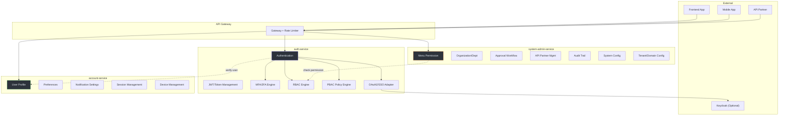
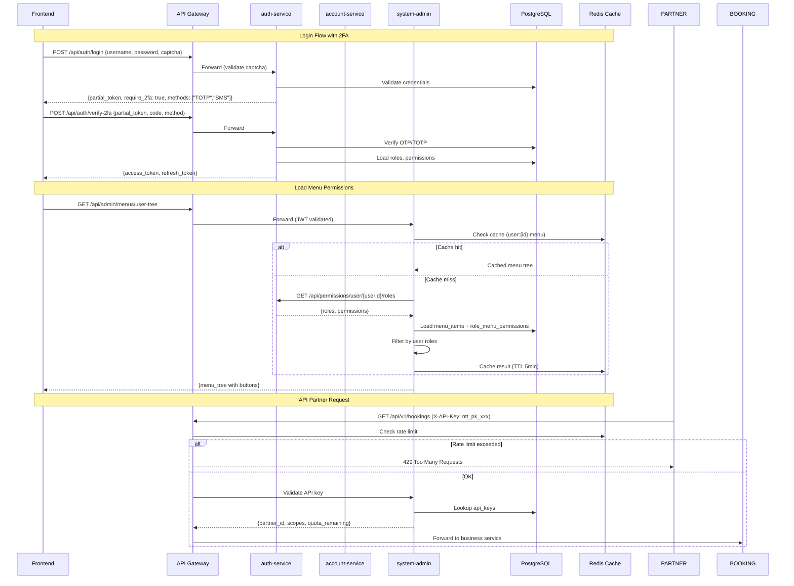

# Business Analysis — ERP IAM System (3 Modules)

> Feature: Enterprise Identity & Access Management
> Version: 1.0
> Created: 2026-08-05

---

## 1. Tổng Quan Kiến Trúc Phân Chia 3 Module



---

## 2. Nguyên Tắc Phân Chia Module

| Nguyên tắc | Giải thích |
|------------|------------|
| **Single Responsibility** | Mỗi service chỉ quản lý 1 domain cụ thể |
| **Bounded Context** | auth = xác thực + phân quyền, account = profile + preferences, system-admin = cấu hình hệ thống |
| **Loose Coupling** | Giao tiếp qua REST API hoặc Event, không share database |
| **High Cohesion** | Các entity liên quan nằm cùng service |
| **Scalability** | auth-service scale riêng vì traffic authentication cao |

---

## 3. Phân Tích Chi Tiết — AUTH-SERVICE

### 3.1 Tính Năng Hiện Có (Đã Triển Khai)

| Feature | Status | Notes |
|---------|--------|-------|
| Login/Register | ✅ | Username/Password + domain-aware |
| JWT Access/Refresh Token | ✅ | HMAC-SHA256, JTI, blacklist |
| Token Refresh (Rotation) | ✅ | Revoke old → issue new |
| Domain Switch | ✅ | Switch active domain without re-auth |
| RBAC Engine | ✅ | User → Group → Role → Permission chain |
| PBAC Policy Evaluator | ✅ | JSONB conditions, priority, DENY-wins |
| Account Lock/Unlock | ✅ | Failed login count, timed lock |
| Password Hashing | ✅ | PasswordEncoder (Argon2 ready) |
| Permission Check API | ✅ | Single + Batch check endpoints |

### 3.2 Tính Năng Cần Triển Khai

#### AUTH-F01: Multi-Factor Authentication (2FA/MFA)
**Mô tả:** Hỗ trợ xác thực nhiều lớp — OTP SMS, OTP Email, TOTP (Google Authenticator), CAPTCHA.

**Use Cases:**
| UC | Mô tả | Flow |
|----|-------|------|
| UC-MFA-01 | Enable 2FA cho user | User → chọn method (SMS/Email/TOTP) → xác thực lần đầu → lưu config |
| UC-MFA-02 | Login với 2FA | Login (password) → partial token → verify OTP → full token |
| UC-MFA-03 | CAPTCHA verification | Khi login/register → validate reCAPTCHA/hCaptcha token |
| UC-MFA-04 | Recovery codes | Generate backup codes khi enable 2FA → store hashed |
| UC-MFA-05 | Disable 2FA | Verify current 2FA → remove config |

**Entities cần thêm:**
```
mfa_configs (user_id, method, secret_encrypted, is_active, created_at)
otp_tokens (user_id, code_hash, channel, expires_at, verified, attempts)
recovery_codes (user_id, code_hash, used_at)
```

**Business Rules:**
- BR-MFA-01: OTP expires sau 5 phút, tối đa 3 lần nhập sai
- BR-MFA-02: TOTP window = 30 giây, tolerance ±1 step
- BR-MFA-03: Recovery code dùng 1 lần, generate 10 codes
- BR-MFA-04: CAPTCHA bắt buộc sau 3 lần login fail
- BR-MFA-05: Admin có thể enforce 2FA cho toàn domain

---

#### AUTH-F02: OAuth2 / SSO Support
**Mô tả:** Hỗ trợ đăng nhập SSO qua external IdP (Google, Microsoft, Keycloak) + OAuth2 Authorization Server.

**Use Cases:**
| UC | Mô tả | Flow |
|----|-------|------|
| UC-SSO-01 | Login via Keycloak | Redirect → Keycloak login → callback → exchange code → JWT |
| UC-SSO-02 | Login via Google/Microsoft | OAuth2 Authorization Code flow |
| UC-SSO-03 | Link external account | User nội bộ link thêm social account |
| UC-SSO-04 | Auto-provision user | First-time SSO login → auto-create user + default role |

**Entities cần thêm:**
```
sso_providers (id, code, name, provider_type, client_id, client_secret_enc, 
               discovery_url, scopes, auto_provision, status)
user_sso_links (user_id, provider_id, external_sub, external_email, linked_at)
```

**Business Rules:**
- BR-SSO-01: Keycloak là optional downstream — khi enable, JWT validate qua Keycloak public key
- BR-SSO-02: Auto-provision chỉ khi domain config cho phép
- BR-SSO-03: Một user có thể link nhiều SSO provider
- BR-SSO-04: Khi Keycloak disabled, fallback về local JWT (current flow)

---

#### AUTH-F03: Enhanced Token Management
**Mô tả:** Nâng cấp JWT — RS256 support, token introspection, session binding.

**Cần bổ sung:**
- RS256 key pair generation/rotation
- Token introspection endpoint (`/api/auth/introspect`)
- Active session listing + force logout
- Device fingerprint binding (optional)

---

#### AUTH-F04: Password Policy Engine
**Mô tả:** Configurable password rules per domain.

**Cần bổ sung:**
```
password_policies (domain_id, min_length, require_uppercase, require_lowercase,
                   require_digit, require_special, max_age_days, history_count,
                   min_change_interval_hours)
password_history (user_id, password_hash, changed_at)
```

**Business Rules:**
- BR-PWD-01: Không cho phép reuse N passwords gần nhất
- BR-PWD-02: Force change password khi expired
- BR-PWD-03: Admin có thể force reset password

---

## 4. Phân Tích Chi Tiết — ACCOUNT-SERVICE

### 4.1 Hiện Trạng
- Chỉ có `DefaultSessionManagement.kt` (stub)
- Đã có dependency: Spring Security, OAuth2 Client, Kafka, Spring Modulith

### 4.2 Tính Năng Cần Triển Khai

#### ACC-F01: User Profile Management
**Mô tả:** CRUD quản lý thông tin cá nhân user — tách biệt khỏi auth data.

**Use Cases:**
| UC | Mô tả |
|----|-------|
| UC-PROF-01 | View/Update profile (fullName, phone, avatar, address, dateOfBirth, gender) |
| UC-PROF-02 | Change email (verification required) |
| UC-PROF-03 | Change phone (OTP required) |
| UC-PROF-04 | Upload avatar (presigned URL) |
| UC-PROF-05 | View login history |
| UC-PROF-06 | Admin view/edit any user profile |

**Entities:**
```
user_profiles (user_id, display_name, first_name, last_name, date_of_birth,
               gender, address, city, country, timezone, locale, avatar_url,
               bio, metadata_json)
user_contacts (user_id, contact_type, contact_value, is_primary, is_verified,
               verified_at)
login_history (user_id, ip_address, user_agent, device_fingerprint, login_at,
               login_method, status, country, city)
```

---

#### ACC-F02: User Preferences & Settings
**Mô tả:** Quản lý cài đặt cá nhân — notification, language, theme, UI settings.

**Entities:**
```
user_preferences (user_id, preference_key, preference_value, category)
notification_settings (user_id, channel, event_type, is_enabled)
```

**Preference Categories:** UI, Notification, Privacy, Security, Regional

---

#### ACC-F03: Device Management
**Mô tả:** Quản lý thiết bị đã đăng nhập — hỗ trợ trust device, remote logout.

**Entities:**
```
user_devices (user_id, device_id, device_name, device_type, os, browser,
              fingerprint, last_active_at, trusted, trusted_until,
              push_token, status)
```

**Use Cases:**
| UC | Mô tả |
|----|-------|
| UC-DEV-01 | List active devices |
| UC-DEV-02 | Trust device (skip 2FA cho device trusted) |
| UC-DEV-03 | Revoke device (remote logout) |
| UC-DEV-04 | Untrust all devices |

---

#### ACC-F04: Session Management
**Mô tả:** Active session tracking, concurrent session policy, force logout.

**Entities:**
```
active_sessions (session_id, user_id, device_id, token_jti, created_at,
                 last_accessed_at, expires_at, ip_address, status)
```

**Business Rules:**
- BR-SES-01: Configurable max concurrent sessions per domain
- BR-SES-02: Admin có thể force terminate session
- BR-SES-03: Session auto-expire sau N phút inactive

---

#### ACC-F05: Account Lifecycle
**Mô tả:** Deactivation, deletion request, data export (GDPR).

**Use Cases:**
| UC | Mô tả |
|----|-------|
| UC-LIFE-01 | Deactivate account (tạm khóa) |
| UC-LIFE-02 | Request account deletion (GDPR) |
| UC-LIFE-03 | Export personal data (GDPR) |
| UC-LIFE-04 | Reactivate account |

---

## 5. Phân Tích Chi Tiết — SYSTEM-ADMIN-SERVICE

### 5.1 Hiện Trạng
- Chỉ có `DefaultSessionManagement.kt` (stub)
- Đã có dependency: Spring Batch, Spring Modulith

### 5.2 Tính Năng Cần Triển Khai

#### SYS-F01: Menu Permission Management (Dynamic)
**Mô tả:** Quản lý cây menu chức năng + button-level permission — dynamic theo user role, department, chức vụ.

**Use Cases:**
| UC | Mô tả |
|----|-------|
| UC-MENU-01 | CRUD menu items (tree structure) |
| UC-MENU-02 | Assign menu permissions to role |
| UC-MENU-03 | Get user's accessible menu tree (filtered by role/department) |
| UC-MENU-04 | Button-level permission per menu item |
| UC-MENU-05 | Menu versioning (draft → publish) |

**Entities:**
```
menu_items (id, parent_id, domain_id, code, name, icon, path, route_name,
            component, sort_order, menu_type, is_visible, is_cacheable,
            status, metadata_json)
    -- menu_type: DIRECTORY | MENU | BUTTON | API
    
menu_permissions (id, menu_id, permission_code, name, description)
    -- permission_code: e.g., "view", "create", "edit", "delete", "export", "import", "approve"

role_menu_permissions (id, role_id, menu_id, permission_code, is_granted)
    -- Xác định role X có permission Y trên menu Z

user_menu_overrides (id, user_id, menu_id, permission_code, is_granted, reason)
    -- Override cho từng user cụ thể (ngoại lệ)
```

**API Design:**
```
GET    /api/admin/menus/tree                    -- Full menu tree (admin)
GET    /api/admin/menus/user-tree               -- User's accessible menu (filtered)
POST   /api/admin/menus                         -- Create menu item
PUT    /api/admin/menus/{id}                    -- Update menu item
DELETE /api/admin/menus/{id}                    -- Soft delete menu item
GET    /api/admin/menus/{id}/permissions         -- List menu's permissions
POST   /api/admin/menus/{id}/permissions         -- Add permission to menu
POST   /api/admin/roles/{roleId}/menus           -- Assign menus to role
GET    /api/admin/roles/{roleId}/menus           -- Get role's menu permissions
POST   /api/admin/users/{userId}/menu-overrides  -- Override user's menu permission
```

**Menu Tree Response Format:**
```json
{
  "menus": [
    {
      "id": 1,
      "code": "system",
      "name": "Quản lý hệ thống",
      "icon": "settings",
      "path": "/system",
      "type": "DIRECTORY",
      "permissions": ["view"],
      "children": [
        {
          "id": 2,
          "code": "user-management",
          "name": "Quản lý người dùng",
          "path": "/system/users",
          "type": "MENU",
          "permissions": ["view", "create", "edit", "delete", "export"],
          "buttons": [
            {"code": "btn-create", "name": "Tạo mới", "permission": "create"},
            {"code": "btn-edit", "name": "Chỉnh sửa", "permission": "edit"},
            {"code": "btn-delete", "name": "Xóa", "permission": "delete"},
            {"code": "btn-export", "name": "Xuất Excel", "permission": "export"}
          ]
        }
      ]
    }
  ]
}
```

**Business Rules:**
- BR-MENU-01: Menu hiển thị dựa trên intersection (role permissions ∩ menu permissions)
- BR-MENU-02: User override > Role permission (ưu tiên cao hơn)
- BR-MENU-03: BUTTON type menu không hiển thị trong navigation, chỉ control button visibility
- BR-MENU-04: Admin domain có full access tất cả menu
- BR-MENU-05: Menu cache Redis với TTL 5 phút, invalidate khi thay đổi permission

---

#### SYS-F02: Organization Management
**Mô tả:** Quản lý cơ cấu tổ chức — department, position, employee assignment.

**Entities:**
```
departments (id, parent_id, domain_id, code, name, description, manager_user_id,
             sort_order, status, level)

positions (id, domain_id, code, name, description, department_id, grade_level,
           status)

user_positions (user_id, position_id, department_id, is_primary, effective_from,
                effective_to, status)
```

**Use Cases:**
| UC | Mô tả |
|----|-------|
| UC-ORG-01 | CRUD departments (tree structure) |
| UC-ORG-02 | CRUD positions |
| UC-ORG-03 | Assign user to position/department |
| UC-ORG-04 | View organization chart |
| UC-ORG-05 | Transfer user between departments |
| UC-ORG-06 | Get all users in department (recursive) |

**Business Rules:**
- BR-ORG-01: Department tree tối đa 10 levels
- BR-ORG-02: User có thể có nhiều position nhưng chỉ 1 primary
- BR-ORG-03: Transfer department tự động cập nhật approval chain
- BR-ORG-04: Department manager kế thừa quyền phê duyệt

---

#### SYS-F03: API Partner Management
**Mô tả:** Quản lý đối tác tích hợp API — API key, rate limiting, quota, subscription plan.

**Entities:**
```
api_partners (id, domain_id, partner_name, partner_code, contact_email,
              contact_phone, description, status, subscription_plan_id)

api_keys (id, partner_id, key_prefix, key_hash, name, scopes_json,
          rate_limit_per_second, rate_limit_per_minute, rate_limit_per_day,
          quota_monthly, ip_whitelist_json, expires_at, status,
          last_used_at, created_at)

subscription_plans (id, code, name, description, max_requests_per_day,
                    max_requests_per_month, rate_limit_per_second,
                    allowed_apis_json, price_monthly, status)

api_usage_logs (id, partner_id, api_key_id, endpoint, method, status_code,
                response_time_ms, ip_address, request_at)
```

**Use Cases:**
| UC | Mô tả |
|----|-------|
| UC-API-01 | Register API partner |
| UC-API-02 | Generate/Rotate API key |
| UC-API-03 | Set rate limit per API key |
| UC-API-04 | View usage dashboard |
| UC-API-05 | Suspend/Revoke API key |
| UC-API-06 | Configure IP whitelist |
| UC-API-07 | Manage subscription plans |

**Business Rules:**
- BR-API-01: API key hiển thị 1 lần duy nhất khi generate, sau đó chỉ lưu hash
- BR-API-02: Rate limit enforce tại Gateway level (Redis-backed)
- BR-API-03: Khi exceed quota → trả 429 + Retry-After header
- BR-API-04: API key prefix format: `ntt_pk_` (production) / `ntt_sk_` (sandbox)
- BR-API-05: Usage log aggregate hourly/daily cho dashboard

---

#### SYS-F04: Dynamic Approval Workflow
**Mô tả:** Engine phê duyệt động — multi-step, conditional routing, escalation, delegation.

**Entities:**
```
workflow_definitions (id, domain_id, code, name, description, entity_type,
                      trigger_event, version, status)

workflow_steps (id, workflow_id, step_order, step_type, name,
                approver_type, approver_value, condition_json,
                timeout_hours, escalation_step_id, is_parallel)
    -- approver_type: ROLE | DEPARTMENT_HEAD | USER | POSITION | DYNAMIC_RULE
    -- step_type: APPROVAL | REVIEW | NOTIFICATION | AUTO_APPROVE

workflow_instances (id, workflow_definition_id, entity_type, entity_id,
                    requester_user_id, current_step_order, status,
                    submitted_at, completed_at, metadata_json)

workflow_step_instances (id, workflow_instance_id, step_id, assignee_user_id,
                         action, comment, actioned_at, delegated_to_user_id,
                         status, due_at)
    -- action: APPROVED | REJECTED | DELEGATED | ESCALATED | AUTO_APPROVED

workflow_delegation_rules (id, from_user_id, to_user_id, workflow_id,
                           effective_from, effective_to, status)
```

**Use Cases:**
| UC | Mô tả |
|----|-------|
| UC-WF-01 | Define approval workflow (admin) |
| UC-WF-02 | Submit entity for approval |
| UC-WF-03 | Approve/Reject step |
| UC-WF-04 | Delegate approval |
| UC-WF-05 | Auto-escalation khi timeout |
| UC-WF-06 | View approval history |
| UC-WF-07 | Configure conditional routing (amount-based, department-based) |
| UC-WF-08 | Parallel approval (all must approve) |

**Business Rules:**
- BR-WF-01: Workflow version immutable — tạo version mới khi sửa
- BR-WF-02: REJECTED → restart hoặc terminate (configurable)
- BR-WF-03: Timeout escalation tự động sau N hours
- BR-WF-04: Delegation phải trong cùng domain
- BR-WF-05: Conditional routing dựa trên JSONB conditions (tương tự PBAC)

---

#### SYS-F05: System Configuration
**Mô tả:** Quản lý cấu hình hệ thống dynamic — feature flags, system parameters.

**Entities:**
```
system_configs (id, domain_id, config_key, config_value, config_type,
                category, description, is_encrypted, is_public)
    -- config_type: STRING | NUMBER | BOOLEAN | JSON
    -- category: SECURITY | UI | BUSINESS | INTEGRATION

feature_flags (id, domain_id, flag_key, is_enabled, rollout_percentage,
               target_roles_json, description, expires_at)
```

---

#### SYS-F06: Audit Trail
**Mô tả:** Ghi nhận toàn bộ thao tác admin — immutable audit log.

**Entities:**
```
audit_logs (id, domain_id, user_id, action_type, entity_type, entity_id,
            old_value_json, new_value_json, ip_address, user_agent,
            timestamp, module, description)
    -- action_type: CREATE | UPDATE | DELETE | LOGIN | LOGOUT | PERMISSION_CHANGE
                    | CONFIG_CHANGE | APPROVAL_ACTION
```

**Business Rules:**
- BR-AUDIT-01: Audit log immutable — không cho UPDATE/DELETE
- BR-AUDIT-02: Retention policy configurable per domain (default 2 năm)
- BR-AUDIT-03: Sensitive data (password) KHÔNG log giá trị cũ/mới
- BR-AUDIT-04: Support export audit log (CSV/Excel via base-file-starter)

---

#### SYS-F07: Tenant/Domain Configuration (mở rộng từ auth-service)
**Mô tả:** Quản lý cấu hình nâng cao cho mỗi domain/tenant.

**Entities:**
```
domain_configs (domain_id, branding_json, login_page_config_json,
                password_policy_json, mfa_policy_json, session_policy_json,
                allowed_ip_ranges_json, max_users, max_api_partners)
```

---

## 6. Traceability Matrix

| Feature ID | Use Cases | Entities | API Endpoints | Priority |
|-----------|-----------|----------|---------------|----------|
| AUTH-F01 (MFA) | UC-MFA-01..05 | mfa_configs, otp_tokens, recovery_codes | 6 | P0 |
| AUTH-F02 (SSO) | UC-SSO-01..04 | sso_providers, user_sso_links | 5 | P1 |
| AUTH-F03 (Token) | - | key_pairs | 3 | P1 |
| AUTH-F04 (Password) | - | password_policies, password_history | 3 | P1 |
| ACC-F01 (Profile) | UC-PROF-01..06 | user_profiles, user_contacts, login_history | 8 | P0 |
| ACC-F02 (Preferences) | - | user_preferences, notification_settings | 4 | P2 |
| ACC-F03 (Device) | UC-DEV-01..04 | user_devices | 4 | P1 |
| ACC-F04 (Session) | - | active_sessions | 4 | P1 |
| ACC-F05 (Lifecycle) | UC-LIFE-01..04 | - | 4 | P2 |
| SYS-F01 (Menu) | UC-MENU-01..05 | menu_items, menu_permissions, role_menu_permissions, user_menu_overrides | 10 | P0 |
| SYS-F02 (Org) | UC-ORG-01..06 | departments, positions, user_positions | 8 | P0 |
| SYS-F03 (API Partner) | UC-API-01..07 | api_partners, api_keys, subscription_plans, api_usage_logs | 10 | P1 |
| SYS-F04 (Workflow) | UC-WF-01..08 | workflow_definitions, workflow_steps, workflow_instances, workflow_step_instances, workflow_delegation_rules | 10 | P1 |
| SYS-F05 (Config) | - | system_configs, feature_flags | 4 | P2 |
| SYS-F06 (Audit) | - | audit_logs | 3 | P1 |
| SYS-F07 (Tenant) | - | domain_configs | 3 | P2 |

---

## 7. Data Flow Tổng Quan



---

## 8. Tổng Hợp Entity Count

| Service | New Entities | Existing Entities | Total |
|---------|-------------|-------------------|-------|
| auth-service | 6 (mfa_configs, otp_tokens, recovery_codes, sso_providers, user_sso_links, password_policies/history) | 11 | ~17 |
| account-service | 6 (user_profiles, user_contacts, login_history, user_preferences, notification_settings, user_devices, active_sessions) | 0 | ~7 |
| system-admin-service | 14 (menu_items, menu_permissions, role_menu_permissions, user_menu_overrides, departments, positions, user_positions, api_partners, api_keys, subscription_plans, api_usage_logs, workflow_*, system_configs, feature_flags, audit_logs, domain_configs) | 0 | ~17 |
| **Total** | **~26** | **11** | **~41** |

---

## 9. Base-Core Extensions Needed

| Extension | Module | Description |
|-----------|--------|-------------|
| `base-security-starter` enhancement | base-core | Thêm MFA filter chain, CAPTCHA validator, API key authentication filter |
| `TreeEntity<T>` base class | base-model | Abstract entity cho tree structures (menu, department) với `parentId`, `sortOrder`, `level` |
| `AuditLogService` | common-log hoặc base-core | Abstract service cho audit trail pattern (AOP-based) |
| `RateLimiterFilter` | base-security-starter | API key rate limiting filter (Redis-backed, Bucket4j) |
| `WorkflowEngine` interface | base-core | Abstract workflow engine interfaces (optional, có thể là starter mới) |

---

## 10. Validation Checklist (Phase 5)

- [x] ≥ 1 use case defined → 30+ use cases
- [x] Each UC has basic flow + ≥ 1 exception flow
- [x] Each UC has semantic description
- [x] Traceability matrix complete
- [x] Business rules documented
