# Comparison Analysis — ERP IAM System

> Created: 2026-08-05

---

## 1. Build vs Buy vs Adopt Decision

### Comparison Matrix

| Requirement | Keycloak (Adopt) | Full Custom (Build) | Hybrid (Recommended) |
|-------------|-----------------|--------------------|--------------------|
| **Authentication** | ✅ Full (OIDC, SAML, MFA) | ✅ Custom (đã có basic) | ✅ Keycloak optional + local JWT |
| **RBAC** | ✅ Built-in | ✅ Custom (đã có RbacEngine) | ✅ Custom (đã có) |
| **PBAC/ABAC** | ⚠️ UMA 2.0 (limited) | ✅ Custom (đã có PolicyEvaluator) | ✅ Custom (đã có) |
| **Menu Permission** | ❌ Không có | ✅ Custom (cần build) | ✅ Custom (cần build) |
| **Button-level Permission** | ❌ Không có | ✅ Custom (cần build) | ✅ Custom (cần build) |
| **API Key Management** | ❌ Không có | ✅ Custom (cần build) | ✅ Custom + Bucket4j |
| **Rate Limiting** | ❌ Không có | ✅ Custom + Bucket4j | ✅ Bucket4j + Redis |
| **Organization/Department** | ❌ Không có | ✅ Custom (cần build) | ✅ Custom (cần build) |
| **Approval Workflow** | ❌ Không có | ✅ Custom (cần build) | ✅ Custom (cần build) |
| **2FA/MFA** | ✅ Built-in (OTP, TOTP) | ✅ Custom (cần build) | ✅ Spring Security 7 native |
| **OAuth2 SSO** | ✅ Full IdP | ⚠️ Custom OAuth2 server complex | ✅ Keycloak IdP + local validation |
| **Audit Trail** | ✅ Admin events | ✅ Custom (cần build) | ✅ Custom (business-specific) |
| **Integration Effort** | HIGH | MEDIUM | LOW |
| **Maintenance** | LOW (Keycloak managed) | HIGH (all custom) | MEDIUM |
| **Flexibility** | LOW (Keycloak constraints) | HIGH (full control) | HIGH |
| **Time to Market** | 2 weeks setup | 8-10 weeks | 8-10 weeks |

---

## 2. Recommendation: HYBRID approach

```mermaid
graph TD
    A["Decision: HYBRID BUILD"] --> B["Custom Build (Primary)"]
    A --> C["Adopt Libraries"]
    A --> D["Optional Integration"]

    B --> B1["Menu Permission System<br/>(system-admin-service)"]
    B --> B2["Organization Management<br/>(system-admin-service)"]
    B --> B3["API Partner + Rate Limit<br/>(system-admin-service)"]
    B --> B4["Approval Workflow Engine<br/>(system-admin-service)"]
    B --> B5["User Profile Management<br/>(account-service)"]
    B --> B6["MFA/2FA Engine<br/>(auth-service)"]
    B --> B7["Password Policy<br/>(auth-service)"]

    C --> C1["Bucket4j → Rate Limiting"]
    C --> C2["java-otp → TOTP"]
    C --> C3["Spring Security 7 → MFA framework"]
    C --> C4["Resilience4j → Circuit breaker<br/>(already in base-core)"]

    D --> D1["Keycloak → Optional IdP<br/>(adapter pattern)"]
    D --> D2["reCAPTCHA/hCaptcha → CAPTCHA"]

    style A fill:#6d5dfc,color:#fff
    style B fill:#2d333b,stroke:#3fb950,color:#e6edf3
    style C fill:#2d333b,stroke:#f0883e,color:#e6edf3
    style D fill:#2d333b,stroke:#6d5dfc,color:#e6edf3
```

### Rationale:
1. **Custom Build** cho business-specific features (menu, org, workflow) — không có open source nào cover
2. **Adopt Libraries** cho proven algorithms (rate limiting, TOTP) — không reinvent the wheel
3. **Optional Integration** cho Keycloak — adapter pattern cho phép switch on/off mà không break core

---

## 3. Feature Comparison Table

| Feature Area | Current Status | Gap | Solution | Effort |
|-------------|---------------|-----|----------|--------|
| User Authentication | ✅ Basic login/register | MFA, SSO, CAPTCHA | Spring Security 7 MFA + Keycloak adapter | M |
| RBAC | ✅ Full chain | - | No change needed | - |
| PBAC | ✅ Policy evaluator | - | No change needed | - |
| Menu Permissions | ❌ None | Full system | Custom build (entities + API + cache) | L |
| Button Permissions | ❌ None | Full system | Part of menu system | M |
| Organization | ❌ None | Full system | Custom build (tree entities + API) | M |
| API Partner | ❌ None | Full system | Custom build + Bucket4j | L |
| Approval Workflow | ❌ None | Full engine | Custom build (state machine) | XL |
| User Profile | ❌ None | Full CRUD | Custom build (separate service) | M |
| Device Management | ❌ None | Full system | Custom build | S |
| Session Management | ❌ Stub only | Full implementation | Redis-backed sessions | M |
| Audit Trail | ⚠️ Logging only | Persistent audit | AOP + Entity + Elasticsearch | M |
| System Config | ❌ None | Key-value config | Custom build + Redis cache | S |
| Feature Flags | ❌ None | Toggle system | Custom build + Redis cache | S |
| Password Policy | ❌ None | Configurable rules | Custom build | S |

**Effort Legend:** S = Small (1-2 days), M = Medium (3-5 days), L = Large (1-2 weeks), XL = Extra Large (2+ weeks)

---

## 4. Gap Coverage Assessment

| Domain | Total Features | Existing | New | Coverage |
|--------|---------------|----------|-----|----------|
| Authentication | 8 | 4 | 4 | 50% |
| Authorization (RBAC/PBAC) | 6 | 4 | 2 | 67% |
| Menu Permission | 5 | 0 | 5 | 0% |
| Organization | 4 | 0 | 4 | 0% |
| API Partner | 5 | 0 | 5 | 0% |
| Approval Workflow | 6 | 0 | 6 | 0% |
| User Profile | 6 | 0 | 6 | 0% |
| Session/Device | 4 | 0 | 4 | 0% |
| System Config | 3 | 0 | 3 | 0% |
| Audit | 2 | 1 | 1 | 50% |
| **Overall** | **49** | **9** | **40** | **18%** |

> **Gap Score: 18% covered** → Significant development effort required, but strong foundation exists.

---

## 5. Risk Assessment

| Risk | Severity | Mitigation |
|------|----------|------------|
| Scope creep (too many features) | HIGH | Phased rollout (4 phases) |
| Cross-service data consistency | MEDIUM | Kafka events + eventual consistency |
| Performance (permission check per request) | MEDIUM | Redis caching (5 min TTL) |
| Keycloak lock-in | LOW | Adapter pattern, optional integration |
| Menu permission complexity | MEDIUM | Start simple (role-based), add overrides later |
| Approval workflow state management | HIGH | Immutable workflow versions, clear state machine |

---

## 6. Validation Checklist (Phase 4)

- [x] Comparison matrix complete
- [x] Feature comparison table complete
- [x] Gap analysis documented (18% current coverage)
- [x] Recommendation provided with reasoning (HYBRID BUILD)
