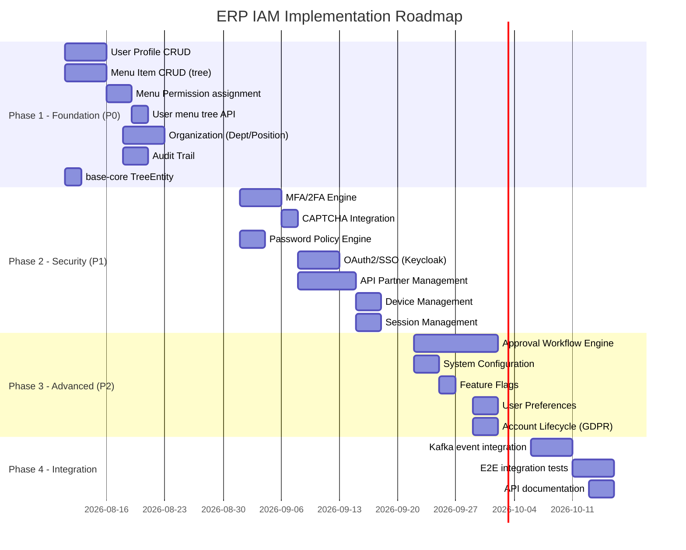

# Handoff Summary — ERP IAM System

> Feature: Enterprise Identity & Access Management (3 Modules)
> Status: Research Complete ✅
> Created: 2026-08-05

---

## 1. Executive Summary

### Mục tiêu
Thiết kế và triển khai hệ thống IAM hoàn chỉnh cho ERP enterprise, chia thành 3 microservice:
- **auth-service**: Authentication, JWT, MFA, OAuth2/SSO, RBAC, PBAC
- **account-service**: User profile, preferences, device, session management
- **system-admin-service**: Menu permission, organization, API partner, approval workflow, audit

### Kết quả nghiên cứu
- **Gap Coverage hiện tại**: 18% (9/49 features đã có)
- **Recommendation**: HYBRID BUILD — custom build + adopt libraries (Bucket4j) + optional Keycloak
- **Estimated effort**: ~10-13 weeks (4 phases)
- **Open source adopted**: Bucket4j (rate limiting)
- **Open source as optional**: Keycloak (IdP)

---

## 2. Module Feature Summary

### AUTH-SERVICE (Xác thực & Phân quyền)

| Feature | Đã có | Cần thêm |
|---------|-------|----------|
| Login/Register | ✅ | - |
| JWT Token Management | ✅ | RS256 support, introspection |
| RBAC Engine | ✅ | - |
| PBAC Policy Engine | ✅ | - |
| Account Lock/Unlock | ✅ | - |
| **MFA/2FA** | ❌ | OTP SMS/Email, TOTP, CAPTCHA, Recovery codes |
| **OAuth2/SSO** | ❌ | Keycloak adapter, Google/MS SSO, auto-provision |
| **Password Policy** | ❌ | Configurable rules, history, expiry |
| **Logout/Revoke** | ⚠️ Partial | Force logout, logout all sessions |

### ACCOUNT-SERVICE (Quản lý tài khoản)

| Feature | Đã có | Cần thêm |
|---------|-------|----------|
| **User Profile** | ❌ | Full CRUD, avatar, contacts |
| **Preferences** | ❌ | UI/notification/privacy settings |
| **Device Management** | ❌ | Trust device, remote logout |
| **Session Management** | ❌ | Active sessions, concurrent policy |
| **Login History** | ❌ | IP, device, location tracking |
| **Account Lifecycle** | ❌ | Deactivate, delete (GDPR), export |

### SYSTEM-ADMIN-SERVICE (Quản trị hệ thống)

| Feature | Đã có | Cần thêm |
|---------|-------|----------|
| **Menu Permission** | ❌ | Tree structure, button-level, role assign, user override |
| **Organization** | ❌ | Department tree, positions, user assignment |
| **API Partner** | ❌ | Partner registration, API key lifecycle, rate limiting |
| **Approval Workflow** | ❌ | Dynamic engine, multi-step, conditional routing |
| **System Config** | ❌ | Key-value config, feature flags |
| **Audit Trail** | ❌ | Immutable logs, export |
| **Tenant Config** | ❌ | Domain-level branding/policy config |

---

## 3. Base-Core Extensions Needed

| Extension | Target Module | Priority | Description |
|-----------|--------------|----------|-------------|
| `TreeEntity<T>` | base-model | P0 | Abstract entity cho tree structures (menu, department) |
| `@Audited` + AuditLogInterceptor | common-log | P1 | AOP-based audit trail creation |
| `ApiKeyAuthenticationFilter` | base-security-starter | P1 | API key validation filter |
| Rate limiting integration | base-security-starter | P1 | Bucket4j + Redis distributed rate limiting |
| MFA filter chain support | base-security-starter | P1 | Partial auth → 2FA flow support |

---

## 4. Database Impact

| Service | New Tables | Estimated DDL Lines |
|---------|-----------|-------------------|
| auth-service | 6 tables | ~150 lines |
| account-service | 7 tables | ~180 lines |
| system-admin-service | 17 tables | ~400 lines |
| **Total** | **30 tables** | **~730 lines** |

---

## 5. Implementation Phases



---

## 6. Key Decisions Made

| Decision | Choice | Rationale |
|----------|--------|-----------|
| Authorization model | RBAC + PBAC (custom) | Already implemented, fits business needs |
| Menu permission storage | Database + Redis cache | Dynamic, admin-configurable, fast retrieval |
| Rate limiting library | Bucket4j + Redis | Proven, Spring Boot native, distributed |
| IdP integration | Keycloak (optional adapter) | Avoid lock-in, adapter pattern |
| MFA implementation | Spring Security 7 native | Framework-native, reduces custom code |
| TOTP library | java-otp | Standard choice for JVM |
| Approval workflow | Custom state machine | No suitable open source for ERP workflows |
| Inter-service communication | REST (sync) + Kafka (async) | Already in tech stack |

---

## 7. Next Steps

### Immediate (Post-Research)
```
→ /wf_pre_openspec erp-iam-system business_analysis
  (Uses business analysis as URD source)
  
→ /wf_brainstorm_openspec erp-iam-system
  (Deep thinking with research context)
  
→ /wf_openspec erp-iam-system
  (Generate implementation artifacts — entities, handlers, tests)
```

### Recommended Order
1. **Phase 1 — system-admin-service (Menu + Org)** → Unblock frontend development
2. **Phase 1 — account-service (Profile)** → User management foundation
3. **Phase 2 — auth-service (MFA + SSO)** → Security hardening
4. **Phase 2 — system-admin-service (API Partner)** → Partner onboarding
5. **Phase 3 — system-admin-service (Workflow)** → ERP approval engine
6. **Phase 4 — Integration + Tests** → Production readiness

---

## 8. Generated Files

| File | Description | Status |
|------|-------------|--------|
| [research_brief.md](research_brief.md) | Scope, keywords, current system analysis | ✅ |
| [business_analysis.md](business_analysis.md) | Use cases, entities, business rules, traceability | ✅ |
| [technical_spec.md](technical_spec.md) | Architecture, ERD, API spec, caching, security | ✅ |
| [opensource_findings.md](opensource_findings.md) | 5 projects evaluated, scoring matrix | ✅ |
| [web_research.md](web_research.md) | 4 search iterations, products evaluated | ✅ |
| [comparison_analysis.md](comparison_analysis.md) | Build/Buy/Adopt, gap analysis (18%), risks | ✅ |
| [validation_report.md](validation_report.md) | 5/5 checks passed | ✅ |
| [handoff_summary.md](handoff_summary.md) | This document | ✅ |
