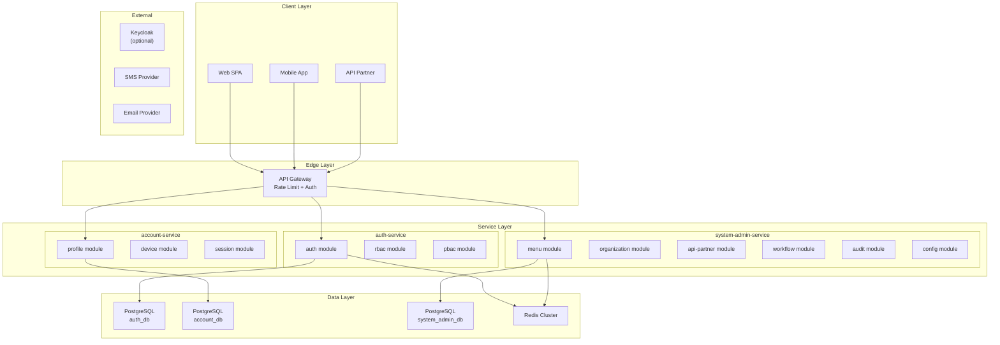
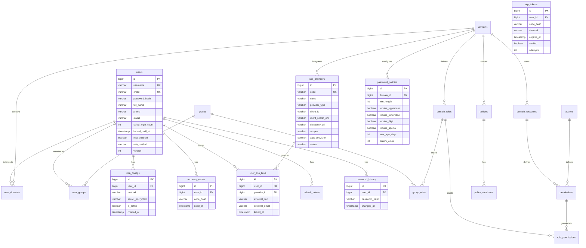
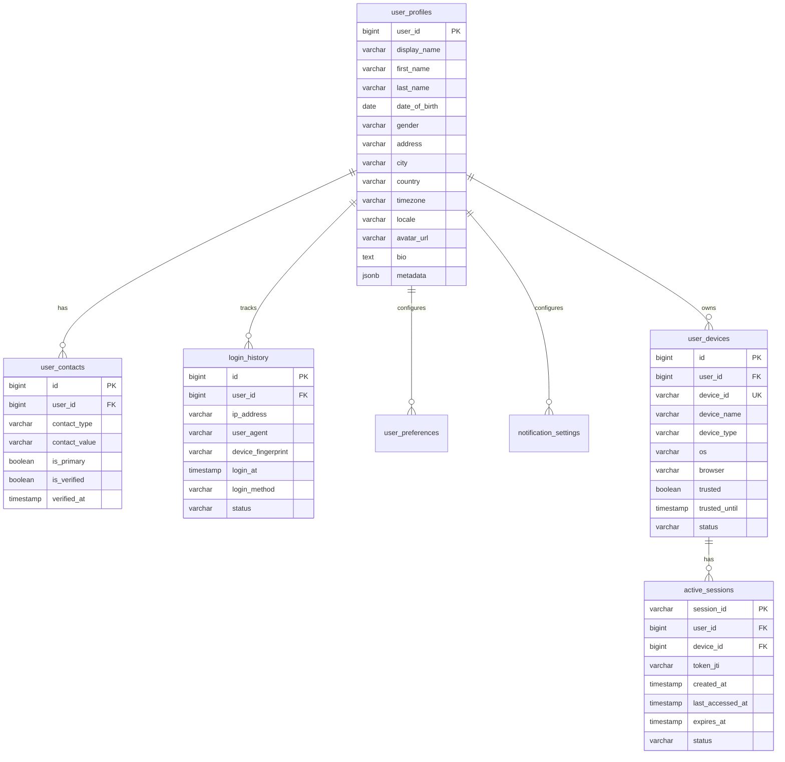
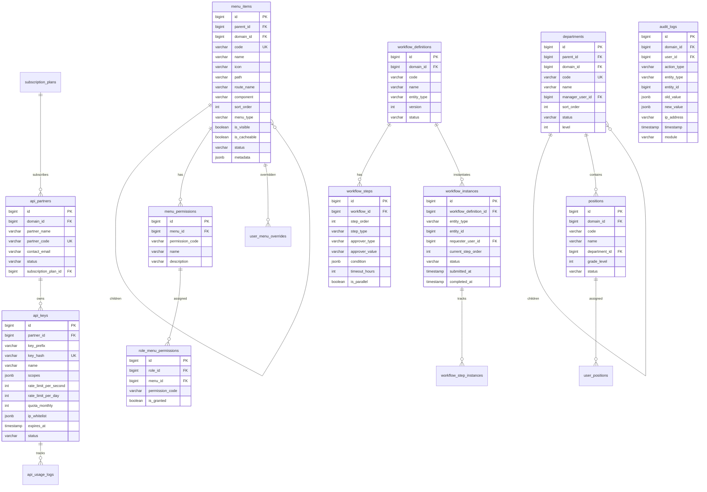
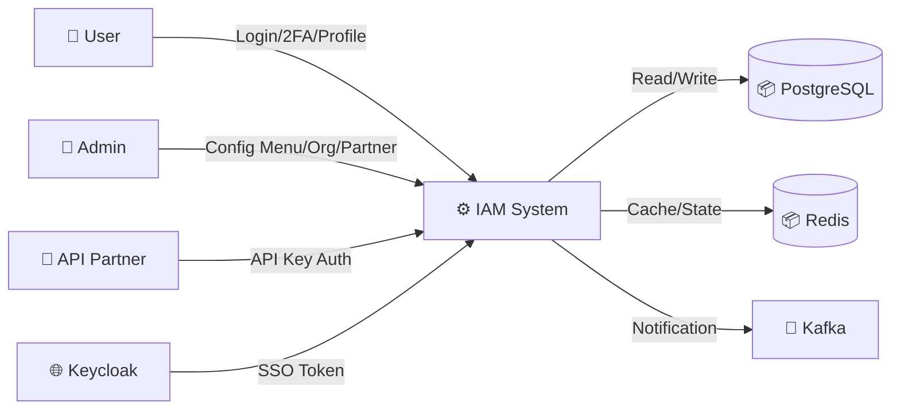
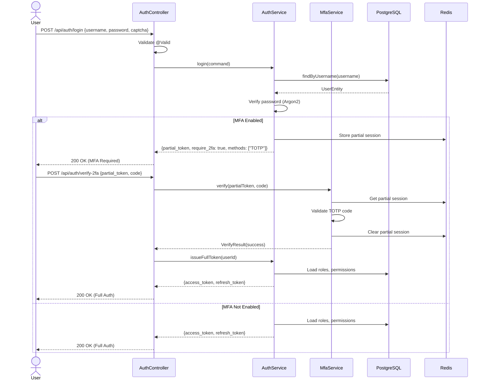
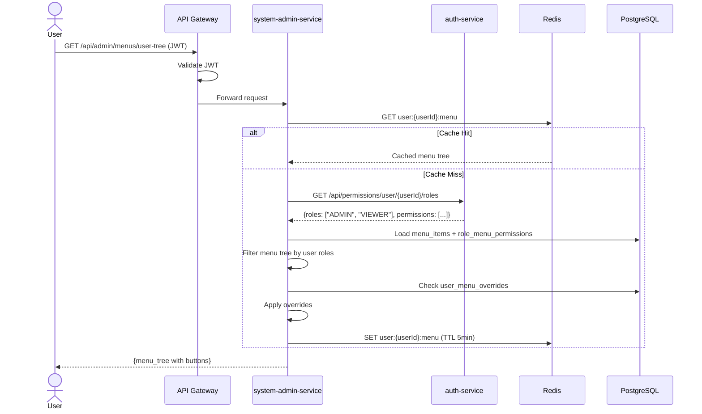
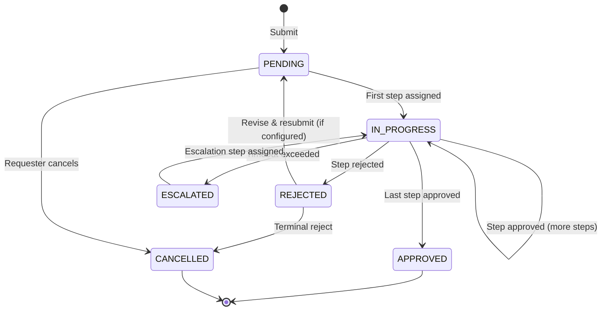

# Đặc tả kỹ thuật: ERP IAM System

> Technical specification chi tiết — thiết kế để agent có thể đọc và dev code trực tiếp.

---

## 1. Tổng quan hệ thống (System Overview)

### 1.1 Kiến trúc tổng thể



### 1.2 Technology Stack

| Layer | Technology | Version | Ghi chú |
|-------|-----------|---------|---------|
| Language | Kotlin | 2.4.x | Primary language |
| JDK | OpenJDK | 25 | Virtual threads enabled |
| Framework | Spring Boot | 4.1.0 | Spring Framework 7, Spring Security 7 |
| Database | PostgreSQL | 17+ | Separate DB per service |
| Cache | Redis | 7.x | Permission cache, rate limiting, OTP state |
| Cache L1 | Caffeine | Latest | In-process cache (30s TTL) |
| ORM | Spring Data JPA + Hibernate | Latest | Via base-data-starter |
| Migration | Flyway | Latest | Via base-data-starter |
| Security | Spring Security + JJWT | Latest | RS256 + HMAC-SHA256 |
| MFA | dev.samstevens.totp + Passay | 1.7.1 / 1.6.4 | TOTP + password policy |
| Rate Limiting | Bucket4j | Latest | Token bucket + Redis ProxyManager |
| Messaging | Spring Kafka | Optional | Inter-service events (async) |
| E2EE | Google Tink | 1.15.0 | End-to-end encryption |
| Build | Gradle | 8.x | Convention plugins |
| Base | com.ntt:platform BOM | 0.0.1-SNAPSHOT | base-web-starter, base-data-starter, common-log |

### 1.3 Dependencies & Integrations

| Dependency | Type | Purpose | Interface |
|-----------|------|---------|-----------|
| auth-service | Internal | Authentication + Authorization | REST API |
| account-service | Internal | User profile management | REST API |
| system-admin-service | Internal | Menu, Org, API Partner, Workflow | REST API |
| Keycloak | External (Optional) | SSO/OIDC delegation | OAuth2/OIDC |
| SMS Provider | External | OTP delivery | Adapter pattern (HTTP) |
| Email Provider | External | OTP + notifications | Adapter pattern (SMTP/HTTP) |

---

## 2. Lược đồ dữ liệu (Data Schema)

### 2.1 ERD — Auth Service (Mở rộng)



### 2.2 ERD — Account Service



### 2.3 ERD — System Admin Service



### 2.4 Database Migration Scripts (draft)

```sql
-- Auth Service: V10__mfa_sso_password_policy.sql
CREATE TABLE mfa_configs (
    id BIGINT PRIMARY KEY,
    user_id BIGINT NOT NULL REFERENCES users(id),
    method VARCHAR(20) NOT NULL,
    secret_encrypted VARCHAR(500),
    is_active BOOLEAN NOT NULL DEFAULT TRUE,
    active BOOLEAN NOT NULL DEFAULT TRUE,
    created_at TIMESTAMPTZ NOT NULL DEFAULT NOW(),
    updated_at TIMESTAMPTZ NOT NULL DEFAULT NOW(),
    created_by VARCHAR(100),
    updated_by VARCHAR(100)
);

CREATE TABLE sso_providers (
    id BIGINT PRIMARY KEY,
    code VARCHAR(50) NOT NULL UNIQUE,
    name VARCHAR(200) NOT NULL,
    provider_type VARCHAR(20) NOT NULL,
    client_id VARCHAR(500) NOT NULL,
    client_secret_enc VARCHAR(500),
    discovery_url VARCHAR(500),
    scopes VARCHAR(500),
    auto_provision BOOLEAN NOT NULL DEFAULT FALSE,
    status VARCHAR(20) NOT NULL DEFAULT 'ACTIVE',
    active BOOLEAN NOT NULL DEFAULT TRUE,
    created_at TIMESTAMPTZ NOT NULL DEFAULT NOW(),
    updated_at TIMESTAMPTZ NOT NULL DEFAULT NOW(),
    created_by VARCHAR(100),
    updated_by VARCHAR(100)
);

CREATE TABLE password_policies (
    id BIGINT PRIMARY KEY,
    domain_id BIGINT NOT NULL REFERENCES domains(id),
    min_length INT NOT NULL DEFAULT 8,
    require_uppercase BOOLEAN NOT NULL DEFAULT TRUE,
    require_lowercase BOOLEAN NOT NULL DEFAULT TRUE,
    require_digit BOOLEAN NOT NULL DEFAULT TRUE,
    require_special BOOLEAN NOT NULL DEFAULT FALSE,
    max_age_days INT NOT NULL DEFAULT 90,
    history_count INT NOT NULL DEFAULT 5,
    active BOOLEAN NOT NULL DEFAULT TRUE,
    created_at TIMESTAMPTZ NOT NULL DEFAULT NOW(),
    updated_at TIMESTAMPTZ NOT NULL DEFAULT NOW(),
    created_by VARCHAR(100),
    updated_by VARCHAR(100)
);
```

---

## 3. Luồng dữ liệu (Data Flow)

### 3.1 Data Flow Diagram — Level 0 (Context)



### 3.2 Data Transformation Rules

| # | Input | Process | Output | Validation Rules |
|---|-------|---------|--------|-----------------|
| 1 | Login request (username, password) | Validate + check MFA | Partial/Full JWT token | NOT NULL, password encoder match |
| 2 | MFA verify (partial_token, code) | Validate OTP/TOTP | Full JWT token | Code within window, max 3 attempts |
| 3 | API Key header (X-API-Key) | Hash + lookup | Partner context | Key format `ntt_pk_` or `ntt_sk_`, SHA-256 hash match |
| 4 | Menu tree request (userId) | Resolve roles → filter menu | Filtered menu tree JSON | User must be authenticated, domain context |

---

## 4. Luồng xử lý (Processing Steps)

### 4.1 Sequence Diagram — Login with MFA



### 4.2 Sequence Diagram — User Menu Tree Load



### 4.3 State Machine — Workflow Instance



| Transition | From | To | Trigger | Guard Condition | Side Effect |
|-----------|------|-----|---------|----------------|------------|
| Submit | [*] | PENDING | User action | All required fields filled | Create workflow_instance |
| Assign | PENDING | IN_PROGRESS | System | First step resolved | Create step_instance, notify approver |
| Approve | IN_PROGRESS | IN_PROGRESS | Approver action | More steps remaining | Advance to next step |
| Approve (last) | IN_PROGRESS | APPROVED | Approver action | Last step | Mark complete, notify requester |
| Reject | IN_PROGRESS | REJECTED | Approver action | - | Notify requester |
| Escalate | IN_PROGRESS | ESCALATED | Timeout scheduler | timeout_hours exceeded | Assign to escalation step |
| Cancel | PENDING | CANCELLED | Requester action | - | Close instance |

### 4.4 Screen Flow

| Screen ID | Tên | Mục đích | Data hiển thị | User Actions | Navigation |
|-----------|-----|----------|--------------|-------------|-----------|
| SCR-001 | Menu Management | Admin quản lý menu tree | Tree: menu items with drag-drop | Create, Edit, Delete, Reorder | → SCR-002 |
| SCR-002 | Menu Permission | Assign permissions to menu | Table: permissions per menu item | Add, Remove, Toggle | ← SCR-001 |
| SCR-003 | Role-Menu Assignment | Assign menus to role | Matrix: role × menu × permission | Toggle grants | - |
| SCR-004 | Department Management | Admin quản lý org tree | Tree: departments with managers | Create, Edit, Delete | → SCR-005 |
| SCR-005 | Position Management | CRUD positions | Table: positions per department | Create, Edit, Delete | ← SCR-004 |
| SCR-006 | API Partner Management | Partner + key management | Table: partners with keys | Register, Generate Key, Revoke | → SCR-007 |
| SCR-007 | Usage Dashboard | API usage analytics | Charts: requests/day, response times | Filter by date, export | ← SCR-006 |
| SCR-008 | Workflow Definitions | Admin create workflows | List: definitions with steps | Create, Edit, Activate | → SCR-009 |
| SCR-009 | Approval Queue | Pending approvals | Table: pending items with actions | Approve, Reject, Delegate | - |

---

## 6. API Specification

### 6.1 Auth Service APIs

| # | Method | Path | Description | Auth | Request Body | Response |
|---|--------|------|------------|------|-------------|----------|
| 1 | POST | `/api/auth/login` | Login (existing) | Public | LoginRequest | AuthResponse / MfaChallenge |
| 2 | POST | `/api/auth/verify-2fa` | Verify MFA code | Partial | VerifyMfaRequest | AuthResponse |
| 3 | POST | `/api/auth/request-otp` | Request OTP SMS/Email | Partial | RequestOtpRequest | 200 OK |
| 4 | POST | `/api/auth/forgot-password` | Initiate password reset | Public | ForgotPasswordRequest | 200 OK |
| 5 | POST | `/api/auth/reset-password` | Reset with token | Public | ResetPasswordRequest | 200 OK |
| 6 | POST | `/api/auth/change-password` | Change password | Bearer | ChangePasswordRequest | 200 OK |
| 7 | GET | `/api/auth/introspect` | Token introspection | Bearer | - | IntrospectResponse |
| 8 | GET | `/api/mfa/status` | MFA config status | Bearer | - | MfaStatusResponse |
| 9 | POST | `/api/mfa/enable` | Enable MFA method | Bearer | EnableMfaRequest | MfaSetupResponse |
| 10 | POST | `/api/mfa/disable` | Disable MFA | Bearer | DisableMfaRequest | 200 OK |
| 11 | GET | `/api/mfa/recovery-codes` | Generate recovery codes | Bearer | - | RecoveryCodesResponse |
| 12 | GET | `/api/sso/providers` | List SSO providers | Public | - | List<SsoProvider> |
| 13 | GET | `/api/sso/{provider}/authorize` | Initiate SSO | Public | - | Redirect |
| 14 | POST | `/api/sso/{provider}/callback` | SSO callback | Public | OAuthCallback | AuthResponse |
| 15 | GET | `/api/permissions/user/{userId}` | User effective permissions | Internal | - | PermissionsResponse |

### 6.2 Account Service APIs

| # | Method | Path | Description | Auth |
|---|--------|------|------------|------|
| 1 | GET | `/api/account/profile` | Get profile | Bearer |
| 2 | PUT | `/api/account/profile` | Update profile | Bearer |
| 3 | POST | `/api/account/profile/avatar` | Upload avatar | Bearer |
| 4 | GET | `/api/account/devices` | List devices | Bearer |
| 5 | POST | `/api/account/devices/{id}/trust` | Trust device | Bearer |
| 6 | DELETE | `/api/account/devices/{id}` | Revoke device | Bearer |
| 7 | GET | `/api/account/sessions` | List sessions | Bearer |
| 8 | DELETE | `/api/account/sessions/{id}` | Terminate session | Bearer |
| 9 | GET | `/api/account/login-history` | Login history | Bearer |
| 10 | GET | `/api/account/preferences` | Get preferences | Bearer |
| 11 | PUT | `/api/account/preferences` | Update preferences | Bearer |
| 12 | POST | `/api/account/deactivate` | Deactivate account | Bearer |
| 13 | POST | `/api/account/deletion-request` | GDPR deletion | Bearer |
| 14 | GET | `/api/account/export` | GDPR export | Bearer |

### 6.3 System Admin Service APIs

| # | Method | Path | Description | Auth |
|---|--------|------|------------|------|
| 1 | GET | `/api/admin/menus/tree` | Full menu tree | Bearer+Admin |
| 2 | GET | `/api/admin/menus/user-tree` | User's menu | Bearer |
| 3 | POST | `/api/admin/menus` | Create menu item | Bearer+Admin |
| 4 | PUT | `/api/admin/menus/{id}` | Update menu item | Bearer+Admin |
| 5 | DELETE | `/api/admin/menus/{id}` | Delete menu item | Bearer+Admin |
| 6 | POST | `/api/admin/roles/{roleId}/menus` | Assign menus to role | Bearer+Admin |
| 7 | GET | `/api/admin/departments/tree` | Department tree | Bearer |
| 8 | POST | `/api/admin/departments` | Create department | Bearer+Admin |
| 9 | PUT | `/api/admin/departments/{id}` | Update department | Bearer+Admin |
| 10 | GET | `/api/admin/positions` | List positions | Bearer |
| 11 | POST | `/api/admin/positions` | Create position | Bearer+Admin |
| 12 | POST | `/api/admin/user-positions` | Assign user position | Bearer+Admin |
| 13 | GET | `/api/admin/partners` | List partners | Bearer+Admin |
| 14 | POST | `/api/admin/partners` | Register partner | Bearer+Admin |
| 15 | POST | `/api/admin/partners/{id}/api-keys` | Generate API key | Bearer+Admin |
| 16 | POST | `/api/admin/api-keys/{id}/rotate` | Rotate API key | Bearer+Admin |
| 17 | DELETE | `/api/admin/api-keys/{id}` | Revoke API key | Bearer+Admin |
| 18 | GET | `/api/admin/partners/{id}/usage` | Usage dashboard | Bearer+Admin |
| 19 | POST | `/api/admin/workflows` | Create workflow | Bearer+Admin |
| 20 | POST | `/api/workflows/submit` | Submit for approval | Bearer |
| 21 | POST | `/api/workflows/{id}/approve` | Approve step | Bearer |
| 22 | POST | `/api/workflows/{id}/reject` | Reject step | Bearer |
| 23 | POST | `/api/workflows/{id}/delegate` | Delegate step | Bearer |
| 24 | GET | `/api/workflows/my-pending` | My pending | Bearer |
| 25 | GET | `/api/admin/audit-logs` | Search audit logs | Bearer+Admin |
| 26 | GET | `/api/admin/audit-logs/export` | Export audit | Bearer+Admin |
| 27 | GET | `/api/admin/configs` | List configs | Bearer+Admin |
| 28 | PUT | `/api/admin/configs/{key}` | Update config | Bearer+Admin |

### 6.4 Error Response Format (RFC 7807)

| HTTP Status | Error Type | Khi nào |
|-------------|-----------|---------|
| 400 | Validation Error | Input không hợp lệ |
| 401 | Unauthorized | Chưa đăng nhập hoặc MFA required |
| 403 | Forbidden | Không có quyền |
| 404 | Not Found | Resource không tồn tại |
| 409 | Conflict | Duplicate code, max keys exceeded |
| 422 | Unprocessable Entity | Business rule violation |
| 429 | Too Many Requests | Rate limit exceeded |
| 500 | Internal Server Error | Lỗi hệ thống |

---

## 7. Security Considerations

### 7.1 Authentication Flow

MFA progressive auth: Partial JWT (only allows `/verify-2fa`) → Full JWT (all authorized APIs). Trusted devices skip MFA for configured TTL (30 days default).

### 7.2 Authorization Matrix

| Role | Menu Config | Org Config | API Partner | Workflow Def | Audit View | User Profile |
|------|:---:|:---:|:---:|:---:|:---:|:---:|
| SUPER_ADMIN | ✅ | ✅ | ✅ | ✅ | ✅ | ✅ (all) |
| DOMAIN_ADMIN | ✅ (own domain) | ✅ (own domain) | ✅ (own domain) | ✅ (own domain) | ✅ (own domain) | ✅ (own domain) |
| USER | ❌ | ❌ | ❌ | Submit only | ❌ | ✅ (own) |
| API_PARTNER | ❌ | ❌ | View own | ❌ | ❌ | ❌ |

### 7.3 Data Protection
- Password: Argon2id hashing (via BouncyCastle)
- TOTP secret: AES-256 encrypted at rest
- API key: SHA-256 hash stored, raw key show-once
- E2EE: Google Tink for end-to-end encryption
- Audit log: Immutable (no UPDATE/DELETE constraints)
- GDPR: Data export + deletion request workflow

---

## 8. Performance Requirements

| Metric | Target | Measurement Method |
|--------|--------|-------------------|
| API response time (P95) | < 500ms | APM monitoring |
| Menu tree load (cached) | < 100ms | Redis GET latency |
| Permission check (cached) | < 50ms | Caffeine L1 hit |
| Rate limit check | < 10ms | Bucket4j + Redis |
| Throughput (auth endpoints) | > 200 req/s | Load test |
| Cache hit ratio (permissions) | > 80% | Redis metrics |
| Database query time | < 100ms | Slow query log |

---

## 9. Agent Implementation Notes

> **Section này dành cho AI agent** — chỉ rõ code cần tạo để agent dev trực tiếp.

### 9.1 Classes to Create — Auth Service (Mở rộng)

| # | Class | Package | Type | Extends/Implements | Mô tả |
|---|-------|---------|------|-------------------|--------|
| 1 | `MfaConfigEntity` | `auth.adapter.out.persistence.entity` | @Entity | SnowflakePersistentAuditableEntity | MFA configuration per user |
| 2 | `SsoProviderEntity` | `auth.adapter.out.persistence.entity` | @Entity | SnowflakePersistentAuditableEntity | SSO provider config |
| 3 | `UserSsoLinkEntity` | `auth.adapter.out.persistence.entity` | @Entity | SnowflakePersistentAuditableEntity | User-SSO link |
| 4 | `PasswordPolicyEntity` | `auth.adapter.out.persistence.entity` | @Entity | SnowflakePersistentAuditableEntity | Password policy per domain |
| 5 | `PasswordPolicyService` | `auth.application` | @Service | - | Validate password against policy |

### 9.2 Classes to Create — System Admin Service

| # | Class | Package | Type | Extends/Implements | Mô tả |
|---|-------|---------|------|-------------------|--------|
| 1 | `MenuItemEntity` | `menu.adapter.out.persistence.entity` | @Entity | TreeEntity<MenuItemEntity> | Menu tree node |
| 2 | `MenuPermissionEntity` | `menu.adapter.out.persistence.entity` | @Entity | SnowflakeBaseEntity | Permission on menu |
| 3 | `RoleMenuPermissionEntity` | `menu.adapter.out.persistence.entity` | @Entity | SnowflakePersistentAuditableEntity | Role-menu grant |
| 4 | `MenuService` | `menu.application` | @Service | - | Menu CRUD + tree operations |
| 5 | `MenuPermissionService` | `menu.application` | @Service | - | Permission assignment + user tree |
| 6 | `MenuController` | `menu.adapter.in.web` | @RestController | BaseController | Menu management endpoints |
| 7 | `DepartmentEntity` | `org.adapter.out.persistence.entity` | @Entity | TreeEntity<DepartmentEntity> | Department tree node |
| 8 | `PositionEntity` | `org.adapter.out.persistence.entity` | @Entity | SnowflakePersistentAuditableEntity | Position within department |
| 9 | `OrganizationService` | `org.application` | @Service | - | Org CRUD + tree operations |
| 10 | `OrganizationController` | `org.adapter.in.web` | @RestController | BaseController | Org management endpoints |
| 11 | `ApiPartnerEntity` | `partner.adapter.out.persistence.entity` | @Entity | SnowflakePersistentAuditableEntity | API partner |
| 12 | `ApiKeyEntity` | `partner.adapter.out.persistence.entity` | @Entity | SnowflakePersistentAuditableEntity | API key (hash stored) |
| 13 | `ApiPartnerService` | `partner.application` | @Service | - | Partner + key management |
| 14 | `ApiKeyFilter` | `partner.adapter.in.web.filter` | OncePerRequestFilter | - | API key auth + rate limit |
| 15 | `WorkflowDefinitionEntity` | `workflow.adapter.out.persistence.entity` | @Entity | SnowflakePersistentAuditableEntity | Workflow definition |
| 16 | `WorkflowInstanceEntity` | `workflow.adapter.out.persistence.entity` | @Entity | SnowflakePersistentAuditableEntity | Workflow instance |
| 17 | `WorkflowEngine` | `workflow.application` | @Service | - | Workflow state machine |
| 18 | `AuditLogEntity` | `audit.adapter.out.persistence.entity` | @Entity | SnowflakeBaseEntity | Immutable audit log |
| 19 | `AuditLogService` | `audit.application` | @Service | - | Audit log creation + search |
| 20 | `AuditLogInterceptor` | `audit.application` | @Aspect | - | AOP-based audit capture |

### 9.3 Classes to Create — Account Service

| # | Class | Package | Type | Extends/Implements | Mô tả |
|---|-------|---------|------|-------------------|--------|
| 1 | `UserProfileEntity` | `profile.adapter.out.persistence.entity` | @Entity | SnowflakePersistentAuditableEntity | User profile |
| 2 | `UserContactEntity` | `profile.adapter.out.persistence.entity` | @Entity | SnowflakePersistentAuditableEntity | Contact info |
| 3 | `UserDeviceEntity` | `device.adapter.out.persistence.entity` | @Entity | SnowflakePersistentAuditableEntity | User device |
| 4 | `ProfileService` | `profile.application` | @Service | - | Profile CRUD |
| 5 | `DeviceService` | `device.application` | @Service | - | Device management |
| 6 | `ProfileController` | `profile.adapter.in.web` | @RestController | BaseController | Profile endpoints |

### 9.4 Base-Core Extensions

| # | Class | Module | Type | Mô tả |
|---|-------|--------|------|--------|
| 1 | `TreeEntity<T>` | base-model | @MappedSuperclass | Abstract tree entity (parentId, sortOrder, level, children) |
| 2 | `@Audited` | common-log | Annotation | Mark method for audit logging |
| 3 | `ApiKeyAuthenticationFilter` | base-security-starter | Filter | API key validation filter |

### 9.5 Caching Strategy (Redis)

| Cache Key Pattern | TTL | Invalidation Event |
|-------------------|-----|-------------------|
| `user:{id}:permissions` | 5 min | Role/Permission change |
| `user:{id}:menu` | 5 min | Menu permission change |
| `otp:{userId}:{channel}` | 5 min | OTP verified/expired |
| `rate_limit:{apiKeyId}:{window}` | Per window | Auto-expire |
| `menu:tree:{domainId}` | 10 min | Menu item change |
| `config:{domainId}:{key}` | 30 min | Config update |

### 9.6 Inter-Service Communication

| Topic | Producer | Consumer | Event |
|-------|----------|----------|-------|
| `auth.user.events` | auth-service | account-service, system-admin | user.registered, user.status.changed |
| `auth.permission.events` | auth-service | system-admin | permission.changed, role.changed |
| `system.org.events` | system-admin | auth-service | org.structure.changed |
| `system.audit.events` | all services | system-admin (audit) | audit.log.created |

### 9.7 Test Cases (high-level)

| # | Test | Type | Scenario | Expected |
|---|------|------|----------|----------|
| 1 | MFA enable TOTP | Integration | User enables TOTP, gets secret + QR | 200 + secret + recovery codes |
| 2 | Login with MFA | Integration | Password OK + TOTP code | 200 + full JWT |
| 3 | MFA wrong code 3x | Integration | 3 wrong TOTP codes | 401 + rate limit lock |
| 4 | Menu tree create | Integration | Admin creates menu item | 201 + item in tree |
| 5 | User menu filtered | Integration | User with limited roles | 200 + filtered menu tree |
| 6 | API key generate | Integration | Generate key for partner | 201 + raw key (show-once) |
| 7 | API rate limit | Integration | Exceed rate limit | 429 + Retry-After |
| 8 | Workflow submit | Integration | Submit entity for approval | 201 + instance created |
| 9 | Workflow approve | Integration | Approve pending step | 200 + next step assigned |
| 10 | Audit immutable | Integration | Try UPDATE on audit_logs | DB constraint error |

---

> **Traceability**: Research Brief → Business Analysis → **Technical Spec** → Implementation
> **Ready for**: `/wf_pre_openspec` hoặc `/wf_openspec` hoặc direct coding
