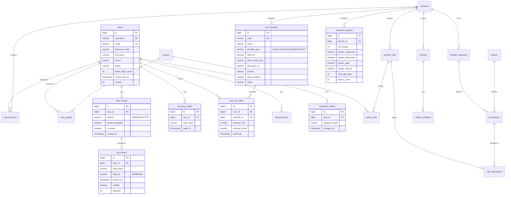
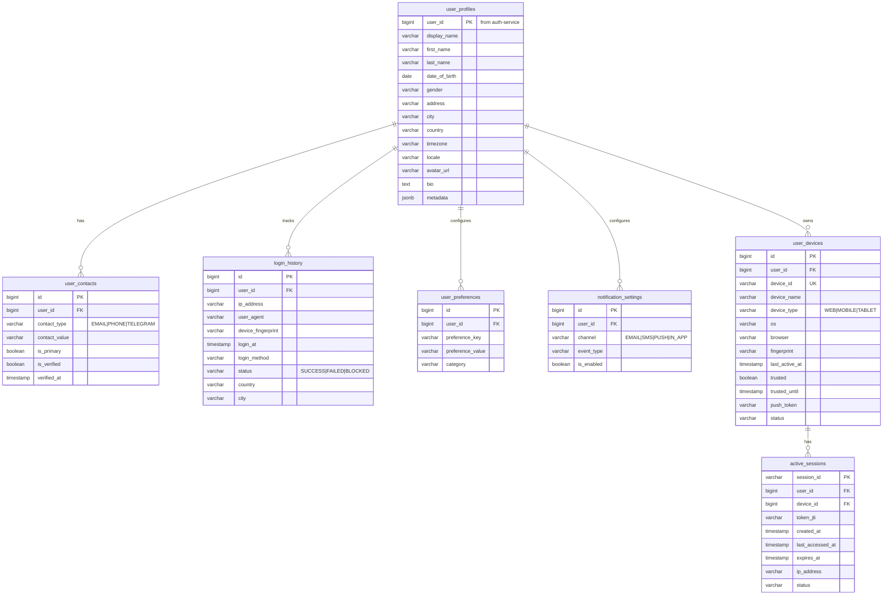
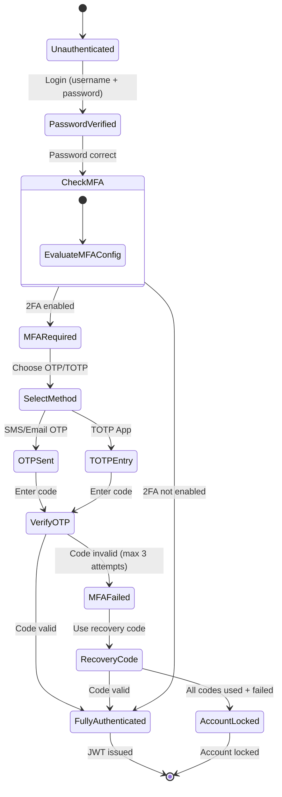
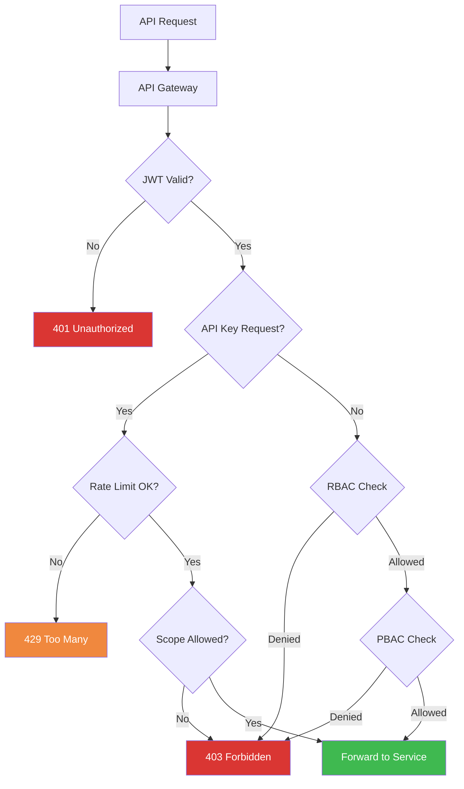
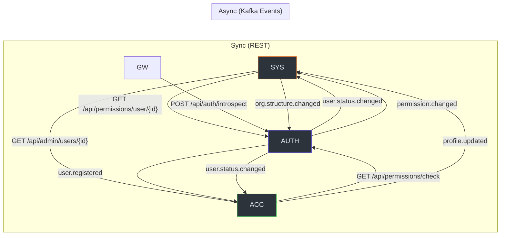

# Technical Specification — ERP IAM System

> Version: 1.0
> Created: 2026-08-05

---

## 1. Architecture Overview

```mermaid
graph TB
    subgraph "Client Layer"
        WEB["Web SPA"]
        MOBILE["Mobile App"]
        PARTNER["API Partner"]
    end

    subgraph "Edge Layer"
        GW["API Gateway<br/>Rate Limit + Auth"]
        CDN["CDN / Static"]
    end

    subgraph "Service Layer"
        subgraph "auth-service"
            A_AUTH["auth module"]
            A_RBAC["rbac module"]
            A_PBAC["pbac module"]
            A_MFA["mfa module"]
            A_SSO["sso module"]
        end
        subgraph "account-service"
            B_PROF["profile module"]
            B_PREF["preference module"]
            B_DEV["device module"]
            B_SES["session module"]
        end
        subgraph "system-admin-service"
            C_MENU["menu module"]
            C_ORG["organization module"]
            C_API["api-partner module"]
            C_WF["workflow module"]
            C_AUDIT["audit module"]
            C_CONF["config module"]
        end
    end

    subgraph "Data Layer"
        DB_AUTH["PostgreSQL<br/>auth_db"]
        DB_ACC["PostgreSQL<br/>account_db"]
        DB_SYS["PostgreSQL<br/>system_admin_db"]
        REDIS["Redis Cluster"]
        ES["Elasticsearch<br/>(audit logs)"]
    end

    subgraph "External"
        KC["Keycloak<br/>(optional)"]
        SMS["SMS Provider"]
        EMAIL["Email Provider"]
        CAPTCHA["reCAPTCHA"]
    end

    WEB --> GW
    MOBILE --> GW
    PARTNER --> GW
    GW --> A_AUTH
    GW --> B_PROF
    GW --> C_MENU

    A_AUTH --> DB_AUTH
    A_AUTH --> REDIS
    B_PROF --> DB_ACC
    C_MENU --> DB_SYS
    C_MENU --> REDIS
    C_AUDIT --> ES

    A_MFA --> SMS
    A_MFA --> EMAIL
    A_AUTH --> CAPTCHA
    A_SSO --> KC

    style GW fill:#161b22,stroke:#f0883e,color:#e6edf3
    style A_AUTH fill:#2d333b,stroke:#6d5dfc,color:#e6edf3
    style B_PROF fill:#2d333b,stroke:#3fb950,color:#e6edf3
    style C_MENU fill:#2d333b,stroke:#f0883e,color:#e6edf3
```



---

## 2. ERD — Auth Service (Mở rộng)



---

## 3. ERD — Account Service



---

## 4. ERD — System Admin Service

```mermaid
erDiagram
    menu_items {
        bigint id PK
        bigint parent_id FK "self-reference"
        bigint domain_id FK
        varchar code UK
        varchar name
        varchar icon
        varchar path
        varchar route_name
        varchar component
        int sort_order
        varchar menu_type "DIRECTORY|MENU|BUTTON|API"
        boolean is_visible
        boolean is_cacheable
        varchar status
        jsonb metadata
    }

    menu_permissions {
        bigint id PK
        bigint menu_id FK
        varchar permission_code "view|create|edit|delete|export|approve"
        varchar name
        varchar description
    }

    role_menu_permissions {
        bigint id PK
        bigint role_id FK "from auth-service domain_roles"
        bigint menu_id FK
        varchar permission_code
        boolean is_granted
    }

    user_menu_overrides {
        bigint id PK
        bigint user_id FK
        bigint menu_id FK
        varchar permission_code
        boolean is_granted
        varchar reason
    }

    departments {
        bigint id PK
        bigint parent_id FK "self-reference"
        bigint domain_id FK
        varchar code UK
        varchar name
        varchar description
        bigint manager_user_id FK
        int sort_order
        varchar status
        int level
    }

    positions {
        bigint id PK
        bigint domain_id FK
        varchar code
        varchar name
        varchar description
        bigint department_id FK
        int grade_level
        varchar status
    }

    user_positions {
        bigint id PK
        bigint user_id FK
        bigint position_id FK
        bigint department_id FK
        boolean is_primary
        date effective_from
        date effective_to
        varchar status
    }

    api_partners {
        bigint id PK
        bigint domain_id FK
        varchar partner_name
        varchar partner_code UK
        varchar contact_email
        varchar contact_phone
        varchar description
        varchar status
        bigint subscription_plan_id FK
    }

    api_keys {
        bigint id PK
        bigint partner_id FK
        varchar key_prefix
        varchar key_hash UK
        varchar name
        jsonb scopes
        int rate_limit_per_second
        int rate_limit_per_minute
        int rate_limit_per_day
        int quota_monthly
        jsonb ip_whitelist
        timestamp expires_at
        varchar status
        timestamp last_used_at
    }

    subscription_plans {
        bigint id PK
        varchar code UK
        varchar name
        varchar description
        int max_requests_per_day
        int max_requests_per_month
        int rate_limit_per_second
        jsonb allowed_apis
        decimal price_monthly
        varchar status
    }

    api_usage_logs {
        bigint id PK
        bigint partner_id FK
        bigint api_key_id FK
        varchar endpoint
        varchar method
        int status_code
        int response_time_ms
        varchar ip_address
        timestamp request_at
    }

    workflow_definitions {
        bigint id PK
        bigint domain_id FK
        varchar code
        varchar name
        varchar description
        varchar entity_type
        varchar trigger_event
        int version
        varchar status
    }

    workflow_steps {
        bigint id PK
        bigint workflow_id FK
        int step_order
        varchar step_type "APPROVAL|REVIEW|NOTIFICATION|AUTO_APPROVE"
        varchar name
        varchar approver_type "ROLE|DEPT_HEAD|USER|POSITION"
        varchar approver_value
        jsonb condition
        int timeout_hours
        bigint escalation_step_id FK
        boolean is_parallel
    }

    workflow_instances {
        bigint id PK
        bigint workflow_definition_id FK
        varchar entity_type
        bigint entity_id
        bigint requester_user_id FK
        int current_step_order
        varchar status "PENDING|IN_PROGRESS|APPROVED|REJECTED|CANCELLED"
        timestamp submitted_at
        timestamp completed_at
        jsonb metadata
    }

    workflow_step_instances {
        bigint id PK
        bigint workflow_instance_id FK
        bigint step_id FK
        bigint assignee_user_id FK
        varchar action "APPROVED|REJECTED|DELEGATED|ESCALATED"
        text comment
        timestamp actioned_at
        bigint delegated_to_user_id FK
        varchar status
        timestamp due_at
    }

    audit_logs {
        bigint id PK
        bigint domain_id FK
        bigint user_id FK
        varchar action_type
        varchar entity_type
        bigint entity_id
        jsonb old_value
        jsonb new_value
        varchar ip_address
        varchar user_agent
        timestamp timestamp
        varchar module
        text description
    }

    system_configs {
        bigint id PK
        bigint domain_id FK
        varchar config_key UK
        text config_value
        varchar config_type "STRING|NUMBER|BOOLEAN|JSON"
        varchar category
        varchar description
        boolean is_encrypted
        boolean is_public
    }

    feature_flags {
        bigint id PK
        bigint domain_id FK
        varchar flag_key UK
        boolean is_enabled
        int rollout_percentage
        jsonb target_roles
        varchar description
        timestamp expires_at
    }

    menu_items ||--o{ menu_items : "children"
    menu_items ||--o{ menu_permissions : "has"
    menu_permissions ||--o{ role_menu_permissions : "assigned"
    menu_items ||--o{ user_menu_overrides : "overridden"

    departments ||--o{ departments : "children"
    departments ||--o{ positions : "contains"
    positions ||--o{ user_positions : "assigned"

    api_partners ||--o{ api_keys : "owns"
    subscription_plans ||--o{ api_partners : "subscribes"
    api_keys ||--o{ api_usage_logs : "tracks"

    workflow_definitions ||--o{ workflow_steps : "has"
    workflow_definitions ||--o{ workflow_instances : "instantiates"
    workflow_instances ||--o{ workflow_step_instances : "tracks"
```



---

## 5. API Specification Summary

### 5.1 Auth Service APIs

| Method | Endpoint | Description | Auth | Status |
|--------|----------|-------------|------|--------|
| POST | `/api/auth/login` | Login with username/password | Public | ✅ Existing |
| POST | `/api/auth/register` | Register new user | Public | ✅ Existing |
| POST | `/api/auth/refresh` | Refresh access token | Public | ✅ Existing |
| POST | `/api/auth/switch-domain` | Switch active domain | Bearer | ✅ Existing |
| POST | `/api/auth/logout` | Logout (revoke tokens) | Bearer | 🆕 New |
| POST | `/api/auth/logout-all` | Logout all sessions | Bearer | 🆕 New |
| POST | `/api/auth/verify-2fa` | Verify 2FA code | Partial | 🆕 New |
| POST | `/api/auth/request-otp` | Request OTP via SMS/Email | Partial | 🆕 New |
| GET | `/api/auth/introspect` | Token introspection | Bearer | 🆕 New |
| POST | `/api/auth/forgot-password` | Initiate password reset | Public | 🆕 New |
| POST | `/api/auth/reset-password` | Reset password with token | Public | 🆕 New |
| POST | `/api/auth/change-password` | Change password (authenticated) | Bearer | 🆕 New |
| GET | `/api/mfa/status` | Get MFA config status | Bearer | 🆕 New |
| POST | `/api/mfa/enable` | Enable MFA method | Bearer | 🆕 New |
| POST | `/api/mfa/disable` | Disable MFA method | Bearer | 🆕 New |
| GET | `/api/mfa/recovery-codes` | Generate recovery codes | Bearer | 🆕 New |
| GET | `/api/sso/providers` | List available SSO providers | Public | 🆕 New |
| GET | `/api/sso/{provider}/authorize` | Initiate SSO flow | Public | 🆕 New |
| POST | `/api/sso/{provider}/callback` | SSO callback handler | Public | 🆕 New |
| POST | `/api/sso/link` | Link SSO account | Bearer | 🆕 New |
| DELETE | `/api/sso/link/{providerId}` | Unlink SSO account | Bearer | 🆕 New |
| POST | `/api/permissions/check` | Check single permission | Internal | ✅ Existing |
| POST | `/api/permissions/check-batch` | Check batch permissions | Internal | ✅ Existing |
| GET | `/api/permissions/user/{userId}` | Get user effective permissions | Internal | 🆕 New |

### 5.2 Account Service APIs

| Method | Endpoint | Description | Auth |
|--------|----------|-------------|------|
| GET | `/api/account/profile` | Get current user profile | Bearer |
| PUT | `/api/account/profile` | Update profile | Bearer |
| POST | `/api/account/profile/avatar` | Upload avatar | Bearer |
| PUT | `/api/account/profile/email` | Change email (requires OTP) | Bearer |
| PUT | `/api/account/profile/phone` | Change phone (requires OTP) | Bearer |
| GET | `/api/account/preferences` | Get preferences | Bearer |
| PUT | `/api/account/preferences` | Update preferences | Bearer |
| GET | `/api/account/notifications/settings` | Get notification settings | Bearer |
| PUT | `/api/account/notifications/settings` | Update notification settings | Bearer |
| GET | `/api/account/devices` | List devices | Bearer |
| POST | `/api/account/devices/{id}/trust` | Trust device | Bearer |
| DELETE | `/api/account/devices/{id}` | Revoke device | Bearer |
| GET | `/api/account/sessions` | List active sessions | Bearer |
| DELETE | `/api/account/sessions/{id}` | Terminate session | Bearer |
| DELETE | `/api/account/sessions` | Terminate all other sessions | Bearer |
| GET | `/api/account/login-history` | Get login history | Bearer |
| POST | `/api/account/deactivate` | Deactivate account | Bearer |
| POST | `/api/account/deletion-request` | Request account deletion | Bearer |
| GET | `/api/account/export` | Export personal data (GDPR) | Bearer |
| GET | `/api/admin/users` | List users (admin) | Bearer+Admin |
| GET | `/api/admin/users/{id}` | Get user detail (admin) | Bearer+Admin |
| PUT | `/api/admin/users/{id}` | Update user (admin) | Bearer+Admin |
| PUT | `/api/admin/users/{id}/status` | Change user status | Bearer+Admin |
| POST | `/api/admin/users/{id}/reset-password` | Force reset password | Bearer+Admin |

### 5.3 System Admin Service APIs

| Method | Endpoint | Description | Auth |
|--------|----------|-------------|------|
| **Menu Management** | | | |
| GET | `/api/admin/menus/tree` | Full menu tree | Bearer+Admin |
| GET | `/api/admin/menus/user-tree` | User's accessible menu | Bearer |
| POST | `/api/admin/menus` | Create menu item | Bearer+Admin |
| PUT | `/api/admin/menus/{id}` | Update menu item | Bearer+Admin |
| DELETE | `/api/admin/menus/{id}` | Delete menu item | Bearer+Admin |
| GET | `/api/admin/menus/{id}/permissions` | Menu permissions | Bearer+Admin |
| POST | `/api/admin/menus/{id}/permissions` | Add menu permission | Bearer+Admin |
| POST | `/api/admin/roles/{roleId}/menus` | Assign menus to role | Bearer+Admin |
| GET | `/api/admin/roles/{roleId}/menus` | Role's menu permissions | Bearer+Admin |
| POST | `/api/admin/users/{userId}/menu-overrides` | Override user menu | Bearer+Admin |
| **Organization** | | | |
| GET | `/api/admin/departments/tree` | Department tree | Bearer |
| POST | `/api/admin/departments` | Create department | Bearer+Admin |
| PUT | `/api/admin/departments/{id}` | Update department | Bearer+Admin |
| DELETE | `/api/admin/departments/{id}` | Delete department | Bearer+Admin |
| GET | `/api/admin/departments/{id}/users` | Users in department | Bearer |
| GET | `/api/admin/positions` | List positions | Bearer |
| POST | `/api/admin/positions` | Create position | Bearer+Admin |
| POST | `/api/admin/user-positions` | Assign user position | Bearer+Admin |
| PUT | `/api/admin/user-positions/{id}` | Update assignment | Bearer+Admin |
| **API Partner** | | | |
| GET | `/api/admin/partners` | List partners | Bearer+Admin |
| POST | `/api/admin/partners` | Register partner | Bearer+Admin |
| PUT | `/api/admin/partners/{id}` | Update partner | Bearer+Admin |
| POST | `/api/admin/partners/{id}/api-keys` | Generate API key | Bearer+Admin |
| PUT | `/api/admin/api-keys/{id}` | Update API key config | Bearer+Admin |
| DELETE | `/api/admin/api-keys/{id}` | Revoke API key | Bearer+Admin |
| POST | `/api/admin/api-keys/{id}/rotate` | Rotate API key | Bearer+Admin |
| GET | `/api/admin/partners/{id}/usage` | Usage dashboard | Bearer+Admin |
| GET | `/api/admin/subscription-plans` | List plans | Bearer+Admin |
| POST | `/api/admin/subscription-plans` | Create plan | Bearer+Admin |
| **Approval Workflow** | | | |
| GET | `/api/admin/workflows` | List workflow definitions | Bearer+Admin |
| POST | `/api/admin/workflows` | Create workflow | Bearer+Admin |
| PUT | `/api/admin/workflows/{id}` | Update workflow | Bearer+Admin |
| POST | `/api/workflows/submit` | Submit for approval | Bearer |
| POST | `/api/workflows/{instanceId}/approve` | Approve step | Bearer |
| POST | `/api/workflows/{instanceId}/reject` | Reject step | Bearer |
| POST | `/api/workflows/{instanceId}/delegate` | Delegate step | Bearer |
| GET | `/api/workflows/my-pending` | My pending approvals | Bearer |
| GET | `/api/workflows/my-submitted` | My submitted requests | Bearer |
| GET | `/api/workflows/{instanceId}/history` | Approval history | Bearer |
| **System Config** | | | |
| GET | `/api/admin/configs` | List configs | Bearer+Admin |
| PUT | `/api/admin/configs/{key}` | Update config | Bearer+Admin |
| GET | `/api/admin/feature-flags` | List feature flags | Bearer+Admin |
| PUT | `/api/admin/feature-flags/{key}` | Toggle feature flag | Bearer+Admin |
| **Audit** | | | |
| GET | `/api/admin/audit-logs` | Search audit logs | Bearer+Admin |
| GET | `/api/admin/audit-logs/export` | Export audit logs | Bearer+Admin |

---

## 6. Security Architecture

### 6.1 Authentication Flow



### 6.2 Authorization Decision Flow



---

## 7. Caching Strategy (Redis)

| Cache Key Pattern | TTL | Invalidation Event |
|-------------------|-----|-------------------|
| `user:{id}:permissions` | 5 min | Role/Permission change |
| `user:{id}:menu` | 5 min | Menu permission change |
| `user:{id}:mfa_config` | 10 min | MFA config change |
| `otp:{userId}:{channel}` | 5 min | OTP verified/expired |
| `rate_limit:{apiKeyId}:{window}` | Per window | Auto-expire |
| `session:{sessionId}` | Session TTL | Logout/expire |
| `menu:tree:{domainId}` | 10 min | Menu item change |
| `config:{domainId}:{key}` | 30 min | Config update |
| `feature_flag:{domainId}:{key}` | 5 min | Flag toggle |
| `token_blacklist:{jti}` | Token remaining TTL | N/A |

---

## 8. Inter-Service Communication



### Kafka Topics:
| Topic | Producer | Consumer | Event |
|-------|----------|----------|-------|
| `auth.user.events` | auth-service | account-service, system-admin | user.registered, user.status.changed |
| `auth.permission.events` | auth-service | system-admin | permission.changed, role.changed |
| `system.org.events` | system-admin | auth-service | org.structure.changed |
| `account.profile.events` | account-service | system-admin | profile.updated |
| `system.audit.events` | all services | system-admin (audit) | audit.log.created |

---

## 9. Implementation Priority (Phased Rollout)

### Phase 1 — Foundation (P0) — ~3-4 weeks
| Task | Service | Dependencies |
|------|---------|-------------|
| User Profile CRUD | account-service | base-core |
| Menu Item CRUD (tree) | system-admin-service | base-core |
| Menu Permission assignment | system-admin-service | auth-service RBAC |
| User menu tree API | system-admin-service | Redis |
| Organization (Department/Position) | system-admin-service | base-core |
| Audit Trail | system-admin-service | Elasticsearch (optional) |

### Phase 2 — Security Enhancement (P1) — ~3-4 weeks
| Task | Service | Dependencies |
|------|---------|-------------|
| MFA/2FA Engine | auth-service | SMS/Email provider |
| CAPTCHA Integration | auth-service | reCAPTCHA |
| Password Policy Engine | auth-service | - |
| OAuth2/SSO (Keycloak) | auth-service | Keycloak (optional) |
| Token Enhancement (RS256) | auth-service | - |
| API Partner Management | system-admin-service | Redis (rate limit) |
| Device Management | account-service | - |
| Session Management | account-service | Redis |

### Phase 3 — Advanced (P2) — ~2-3 weeks
| Task | Service | Dependencies |
|------|---------|-------------|
| Dynamic Approval Workflow | system-admin-service | Kafka |
| System Configuration | system-admin-service | Redis |
| Feature Flags | system-admin-service | Redis |
| User Preferences | account-service | - |
| Account Lifecycle (GDPR) | account-service | - |
| Tenant/Domain Config | system-admin-service | - |

### Phase 4 — Integration & Polish — ~1-2 weeks
| Task | Service | Dependencies |
|------|---------|-------------|
| Kafka event integration | All | Kafka |
| base-core extensions (TreeEntity, RateLimiter) | base-core | - |
| E2E integration tests | All | Testcontainers |
| API documentation (OpenAPI) | All | springdoc |

---

## 10. Base-Core Extension Details

### 10.1 TreeEntity Base Class (base-model)
```kotlin
// Proposed: base-model/src/main/kotlin/com/ntt/basecore/model/tree/TreeEntity.kt
@MappedSuperclass
abstract class TreeEntity<T : TreeEntity<T>> : SnowflakePersistentAuditableEntity() {
    @Column(name = "parent_id")
    var parentId: Long? = null
    
    @Column(name = "sort_order", nullable = false)
    var sortOrder: Int = 0
    
    @Column(name = "level", nullable = false)
    var level: Int = 0
    
    @Transient
    var children: MutableList<T> = mutableListOf()
}
```

### 10.2 AuditLogInterceptor (common-log enhancement)
```kotlin
// Proposed: AOP interceptor that auto-creates audit log entries
@Aspect
@Component
class AuditLogInterceptor {
    @Around("@annotation(audited)")
    fun logAuditAction(joinPoint: ProceedingJoinPoint, audited: Audited): Any? {
        // Before: capture old state
        // Execute: proceed
        // After: capture new state, publish audit event
    }
}
```

### 10.3 ApiKeyAuthenticationFilter (base-security-starter)
```kotlin
// Proposed: Filter for API key authentication alongside JWT
class ApiKeyAuthenticationFilter : OncePerRequestFilter() {
    override fun doFilterInternal(request, response, filterChain) {
        val apiKey = request.getHeader("X-API-Key")
        if (apiKey != null) {
            // Validate API key, check rate limit, set SecurityContext
        }
        filterChain.doFilter(request, response)
    }
}
```

---

## 11. Validation Checklist (Phase 6)

- [x] Architecture diagram present
- [x] ERD diagram present (3 diagrams)
- [x] ≥ 1 sequence diagram (2 diagrams)
- [x] Screen flow documented (via API spec)
- [x] API endpoints listed (80+ endpoints)
- [x] Agent Implementation Notes complete
