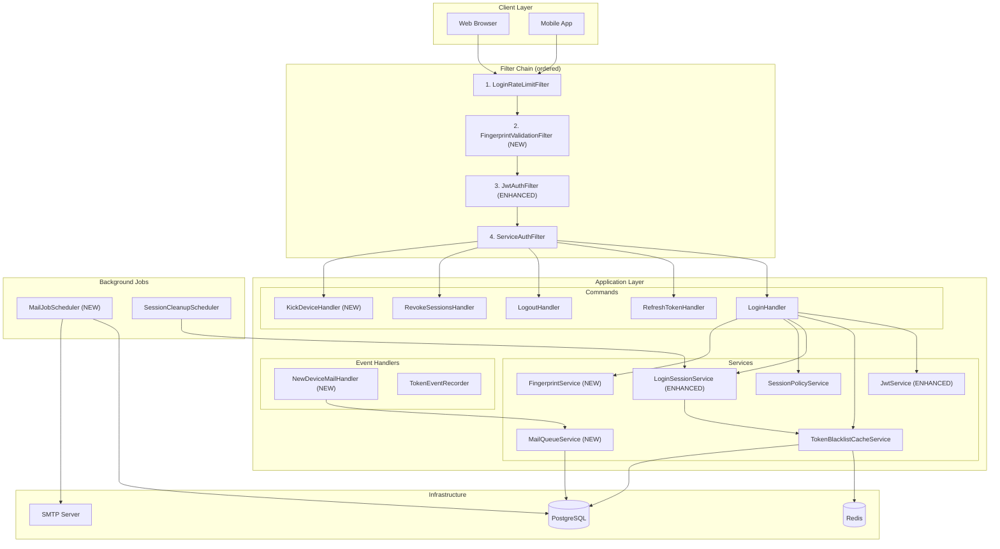
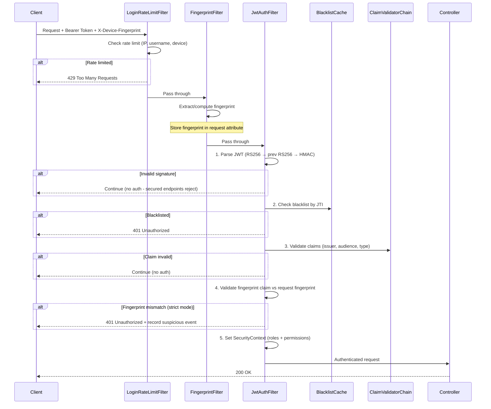
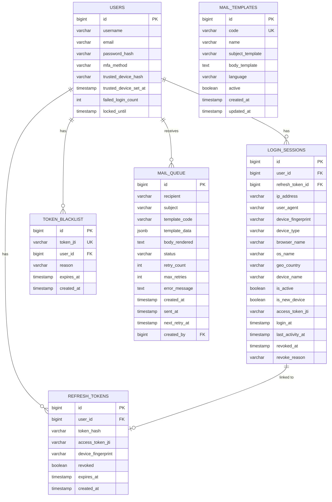
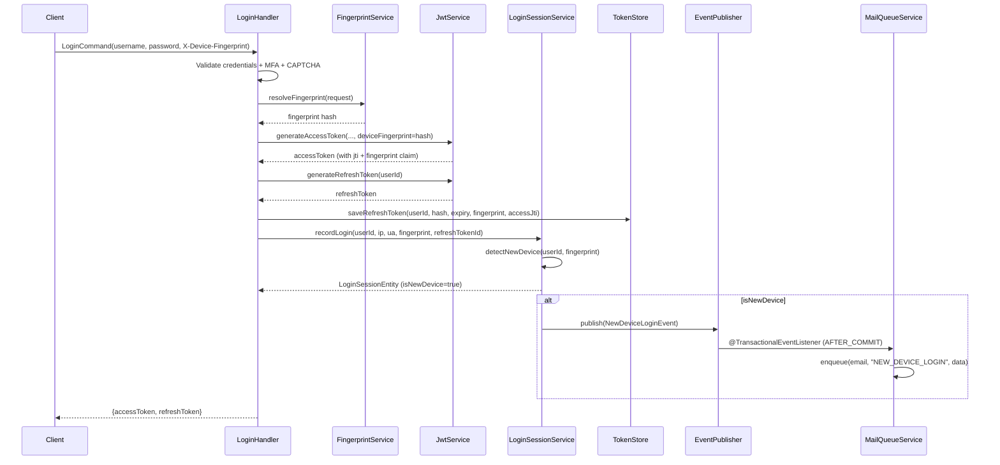
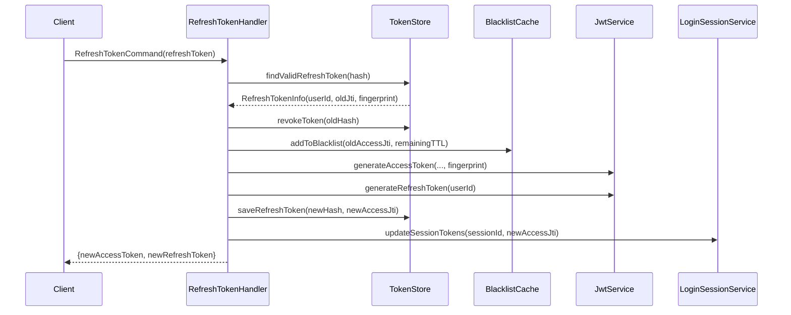
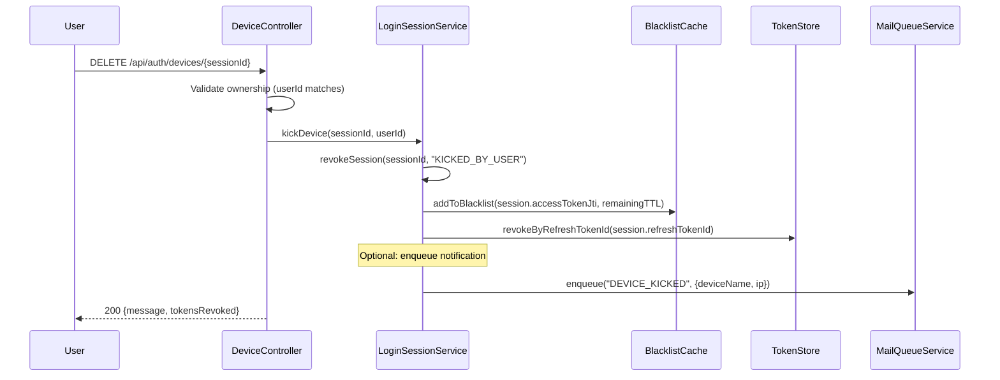
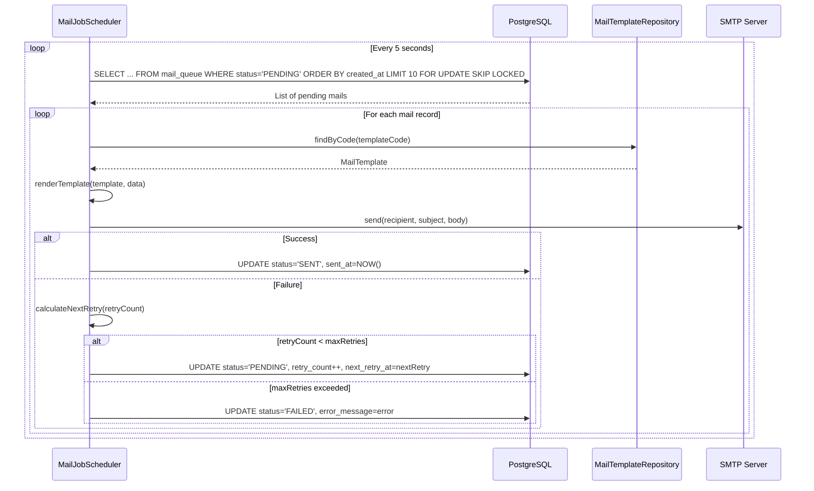

# Technical Specification: JWT OAuth2 Security Redesign

> Đặc tả kỹ thuật chi tiết — architecture, ERD, data flow, API spec, implementation notes.

## 1. Architecture Overview

### 1.1 High-Level Architecture



### 1.2 Request Processing Pipeline (Full Auth Check Flow)



---

## 2. Database Schema (ERD)

### 2.1 Entity Relationship Diagram



### 2.2 New/Modified Tables

#### `mail_queue` (NEW)

```sql
-- V20__create_mail_queue.sql
CREATE TABLE mail_queue (
    id              BIGINT PRIMARY KEY,
    recipient       VARCHAR(255) NOT NULL,
    subject         VARCHAR(500),
    template_code   VARCHAR(100) NOT NULL,
    template_data   JSONB DEFAULT '{}',
    body_rendered   TEXT,
    status          VARCHAR(20) NOT NULL DEFAULT 'PENDING',
    retry_count     INT NOT NULL DEFAULT 0,
    max_retries     INT NOT NULL DEFAULT 3,
    error_message   TEXT,
    created_at      TIMESTAMPTZ NOT NULL DEFAULT NOW(),
    sent_at         TIMESTAMPTZ,
    next_retry_at   TIMESTAMPTZ,
    created_by      BIGINT,
    version         INT NOT NULL DEFAULT 0,

    CONSTRAINT chk_mail_queue_status CHECK (status IN ('PENDING', 'PROCESSING', 'SENT', 'FAILED', 'CANCELLED'))
);

CREATE INDEX idx_mail_queue_status_next_retry ON mail_queue (status, next_retry_at) WHERE status IN ('PENDING', 'PROCESSING');
CREATE INDEX idx_mail_queue_created_by ON mail_queue (created_by);
COMMENT ON TABLE mail_queue IS 'Transactional outbox for email notifications';
```

#### `mail_templates` (NEW)

```sql
-- V21__create_mail_templates.sql
CREATE TABLE mail_templates (
    id              BIGINT PRIMARY KEY,
    code            VARCHAR(100) NOT NULL UNIQUE,
    name            VARCHAR(255) NOT NULL,
    subject_template VARCHAR(500) NOT NULL,
    body_template   TEXT NOT NULL,
    language        VARCHAR(10) NOT NULL DEFAULT 'vi',
    active          BOOLEAN NOT NULL DEFAULT TRUE,
    created_at      TIMESTAMPTZ NOT NULL DEFAULT NOW(),
    updated_at      TIMESTAMPTZ NOT NULL DEFAULT NOW(),
    version         INT NOT NULL DEFAULT 0
);

-- Seed initial template
INSERT INTO mail_templates (id, code, name, subject_template, body_template, language) VALUES
(1, 'NEW_DEVICE_LOGIN', 'New Device Login Alert',
 '[Security Alert] New Device Login - {{appName}}',
 E'Chào {{username}},\n\nChúng tôi phát hiện đăng nhập từ thiết bị mới:\n- Browser: {{browserName}}\n- OS: {{osName}}\n- IP: {{ipAddress}}\n- Thời gian: {{loginAt}}\n- Vị trí: {{geoLocation}}\n\nNếu đây không phải bạn, hãy:\n1. Đổi mật khẩu ngay\n2. Đăng xuất tất cả thiết bị\n\nTrân trọng,\n{{appName}} Security Team',
 'vi');
```

#### `login_sessions` (MODIFY — add columns)

```sql
-- V22__alter_login_sessions_add_device_fields.sql
ALTER TABLE login_sessions ADD COLUMN IF NOT EXISTS access_token_jti VARCHAR(64);
ALTER TABLE login_sessions ADD COLUMN IF NOT EXISTS device_name VARCHAR(100);

CREATE INDEX idx_login_sessions_access_jti ON login_sessions (access_token_jti) WHERE access_token_jti IS NOT NULL;
COMMENT ON COLUMN login_sessions.access_token_jti IS 'JTI of the current access token for this session - enables token-session sync';
COMMENT ON COLUMN login_sessions.device_name IS 'User-friendly device name (e.g., "Chrome on Windows")';
```

#### `refresh_tokens` (MODIFY — add columns)

```sql
-- V23__alter_refresh_tokens_add_fingerprint.sql
ALTER TABLE refresh_tokens ADD COLUMN IF NOT EXISTS device_fingerprint VARCHAR(64);
ALTER TABLE refresh_tokens ADD COLUMN IF NOT EXISTS access_token_jti VARCHAR(64);

CREATE INDEX idx_refresh_tokens_fingerprint ON refresh_tokens (device_fingerprint) WHERE device_fingerprint IS NOT NULL;
```

---

## 3. Component Design

### 3.1 FingerprintService (NEW)

**Package**: `com.ntt.authservice.auth.application`

```kotlin
/**
 * Server-side device fingerprint computation and validation.
 * Generates a deterministic hash from client request signals.
 *
 * Algorithm: SHA-256(User-Agent + Accept-Language + IP-Prefix + SEC-CH-UA)
 * IP-Prefix: /24 for IPv4, /48 for IPv6 — stable across NAT/CGNAT
 */
@Service
class FingerprintService(
    private val securityProperties: SecurityProperties
) {
    /**
     * Compute fingerprint from request headers.
     * Priority: X-Device-Fingerprint header > server-computed hash
     */
    fun resolveFingerprint(request: HttpServletRequest): String

    /**
     * Validate that a fingerprint claim in JWT matches current request.
     * Returns true if match, false if mismatch.
     */
    fun validateFingerprint(
        claimFingerprint: String,
        requestFingerprint: String
    ): Boolean

    /**
     * Server-side computation when client doesn't provide fingerprint.
     */
    private fun computeServerFingerprint(request: HttpServletRequest): String
}
```

### 3.2 MailQueueService (NEW)

**Package**: `com.ntt.authservice.auth.application`

```kotlin
/**
 * Transactional outbox for email delivery.
 * Enqueue mail within business transaction, deliver asynchronously via job.
 *
 * Pattern: Same-transaction INSERT → @Scheduled poll → SMTP send
 */
@Service
class MailQueueService(
    private val mailQueueRepository: MailQueueRepository,
    private val mailTemplateRepository: MailTemplateRepository
) {
    /**
     * Enqueue an email for async delivery.
     * MUST be called within an existing @Transactional context.
     */
    fun enqueue(
        recipient: String,
        templateCode: String,
        templateData: Map<String, Any>,
        createdBy: Long? = null
    ): MailQueueEntity

    /**
     * Render a template with data using simple {{placeholder}} substitution.
     */
    fun renderTemplate(template: MailTemplateEntity, data: Map<String, Any>): RenderedMail
}
```

### 3.3 MailJobScheduler (NEW)

**Package**: `com.ntt.authservice.auth.application`

```kotlin
/**
 * Background job that polls mail_queue and sends emails sequentially.
 * Uses SELECT ... FOR UPDATE SKIP LOCKED for multi-instance safety.
 *
 * Retry strategy: Exponential backoff — delay = 30s * 2^retryCount
 */
@Component
class MailJobScheduler(
    private val mailQueueRepository: MailQueueRepository,
    private val mailTemplateRepository: MailTemplateRepository,
    private val javaMailSender: JavaMailSender,
    private val meterRegistry: MeterRegistry
) {
    @Scheduled(fixedDelay = 5000) // Every 5 seconds
    @Transactional
    fun processMailQueue()

    private fun sendMail(record: MailQueueEntity): Boolean
    private fun calculateNextRetry(retryCount: Int): Instant
}
```

### 3.4 NewDeviceMailHandler (NEW)

**Package**: `com.ntt.authservice.auth.application.event`

```kotlin
/**
 * Listens for NewDeviceLoginEvent and enqueues notification email.
 * Uses @TransactionalEventListener to ensure mail is enqueued
 * only after login transaction commits.
 */
@Component
class NewDeviceMailHandler(
    private val mailQueueService: MailQueueService,
    private val userPort: UserPort
) {
    @TransactionalEventListener(phase = TransactionPhase.AFTER_COMMIT)
    fun handleNewDeviceLogin(event: NewDeviceLoginEvent)
}
```

### 3.5 DeviceController (NEW/ENHANCE)

**Package**: `com.ntt.authservice.auth.adapter.in.web`

```kotlin
@RestController
@RequestMapping("/api/auth/devices")
class DeviceController(
    private val loginSessionService: LoginSessionService,
    private val tokenBlacklistCacheService: TokenBlacklistCacheService,
    private val tokenStore: TokenStore
) {
    /** List active devices for current user */
    @GetMapping
    fun listDevices(authentication: Authentication): ResponseEntity<List<DeviceResponse>>

    /** Kick out specific device */
    @DeleteMapping("/{sessionId}")
    fun kickDevice(
        @PathVariable sessionId: Long,
        authentication: Authentication
    ): ResponseEntity<Void>

    /** Kick out all other devices */
    @DeleteMapping
    fun kickAllOtherDevices(
        authentication: Authentication,
        request: HttpServletRequest
    ): ResponseEntity<KickAllResponse>
}
```

### 3.6 Enhanced JwtAuthFilter

**Modifications to existing `JwtAuthFilter`:**

```kotlin
// ADDITIONS to doFilterInternal():

// Step 4 (NEW): Fingerprint validation
val fingerprintClaim = claims["device_fingerprint"] as? String
if (fingerprintClaim != null && securityProperties.fingerprint.validationEnabled) {
    val requestFingerprint = request.getAttribute("resolved_fingerprint") as? String
        ?: fingerprintService.resolveFingerprint(request)

    if (!fingerprintService.validateFingerprint(fingerprintClaim, requestFingerprint)) {
        if (securityProperties.fingerprint.strictMode) {
            // Reject request
            recordValidationFailure(
                reason = ValidationFailureReason.FINGERPRINT_MISMATCH, ...)
            response.status = HttpServletResponse.SC_UNAUTHORIZED
            return
        } else {
            // Warn only
            log.warn("Fingerprint mismatch (lenient mode): jti={}", jti)
            meterRegistry.counter("auth.token.fingerprint", "result", "mismatch").increment()
        }
    }
}
```

### 3.7 Enhanced JwtService

**Modifications to existing `JwtService`:**

```kotlin
// ADDITION: Add device_fingerprint claim to access token
fun generateAccessToken(
    userId: Long,
    username: String,
    domains: List<String>,
    activeDomain: String,
    roles: List<String>,
    permissions: List<String>,
    groups: List<String>,
    jti: String? = null,
    deviceFingerprint: String? = null  // NEW parameter
): String {
    // ... existing code ...
    val builder = Jwts.builder()
        // ... existing claims ...
        .claim("device_fingerprint", deviceFingerprint)  // NEW claim
    // ...
}
```

### 3.8 Enhanced LoginSessionService

**Additions to existing `LoginSessionService`:**

```kotlin
// NEW: Kick out device with token blacklist sync
@Transactional
fun kickDevice(sessionId: Long, userId: Long): KickResult {
    val session = revokeSession(sessionId, userId, "KICKED_BY_USER")
    if (session) {
        // Blacklist associated access token JTI
        val sessionEntity = loginSessionRepository.findById(sessionId).orElse(null)
        sessionEntity?.accessTokenJti?.let { jti ->
            tokenBlacklistCacheService.addToBlacklist(jti, remainingTtl)
        }
        // Revoke associated refresh token
        sessionEntity?.refreshTokenId?.let { refreshId ->
            tokenStore.revokeByRefreshTokenId(refreshId)
        }
    }
    return KickResult(success = session)
}

// NEW: List devices with "current" marker
fun listDevicesForUser(userId: Long, currentJti: String?): List<DeviceInfo> {
    return getActiveSessions(userId).map { session ->
        DeviceInfo(
            sessionId = session.id!!,
            deviceType = session.deviceType,
            browserName = session.browserName,
            osName = session.osName,
            ipAddress = session.ipAddress,
            loginAt = session.loginAt,
            lastActivityAt = session.lastActivityAt,
            deviceName = session.deviceName ?: "${session.browserName} on ${session.osName}",
            isCurrent = session.accessTokenJti == currentJti
        )
    }
}
```

---

## 4. API Specification

### 4.1 Device Management APIs

#### `GET /api/auth/devices`
**Description**: List all active devices for current user  
**Auth**: Required (Bearer Token)  
**Response** (200):
```json
[
  {
    "sessionId": 123456789,
    "deviceType": "DESKTOP",
    "browserName": "Chrome",
    "osName": "Windows",
    "ipAddress": "192.168.1.xxx",
    "loginAt": "2026-09-07T10:00:00Z",
    "lastActivityAt": "2026-09-07T10:25:00Z",
    "deviceName": "Chrome on Windows",
    "isCurrent": true
  },
  {
    "sessionId": 123456790,
    "deviceType": "MOBILE",
    "browserName": "Safari",
    "osName": "iOS",
    "ipAddress": "10.0.0.xxx",
    "loginAt": "2026-09-06T08:00:00Z",
    "lastActivityAt": "2026-09-06T20:00:00Z",
    "deviceName": "Safari on iOS",
    "isCurrent": false
  }
]
```

#### `DELETE /api/auth/devices/{sessionId}`
**Description**: Kick out specific device  
**Auth**: Required (Bearer Token)  
**Response** (200):
```json
{
  "message": "Device session revoked successfully",
  "sessionId": 123456790,
  "tokensRevoked": 1
}
```

#### `DELETE /api/auth/devices`
**Description**: Kick out all other devices (except current)  
**Auth**: Required (Bearer Token)  
**Response** (200):
```json
{
  "message": "All other devices have been signed out",
  "revokedCount": 2
}
```

### 4.2 Request Headers Contract

| Header | Required | Description | Example |
|--------|----------|-------------|---------|
| `Authorization` | Yes | Bearer JWT token | `Bearer eyJhbGci...` |
| `X-Device-Fingerprint` | Optional | Client-computed device hash (SHA-256, hex, 64 chars) | `a1b2c3d4...` |
| `User-Agent` | Standard | Browser/OS info | `Mozilla/5.0 ...` |
| `Accept-Language` | Standard | Preferred language | `vi,en-US;q=0.9` |
| `Sec-CH-UA` | Optional | Client Hints (modern browsers) | `"Chromium";v="128"` |

---

## 5. Data Flow Diagrams

### 5.1 Login Flow (Enhanced)



### 5.2 Token Refresh Flow (Enhanced)



### 5.3 Kick Device Flow



### 5.4 Mail Queue Processing Flow



---

## 6. Configuration Properties (NEW)

```yaml
# application.yml additions
app:
  security:
    fingerprint:
      enabled: true                    # Master switch
      validation-enabled: true         # Validate fingerprint claim in JWT
      strict-mode: false               # true=reject mismatch, false=warn only
      header-name: "X-Device-Fingerprint"
      server-compute-fallback: true    # Compute from request headers if no client header

    mail:
      queue:
        batch-size: 10                 # Records per poll
        poll-interval-ms: 5000         # Poll frequency
        max-retries: 3                 # Max retry attempts
        base-retry-delay-seconds: 30   # Base delay for exponential backoff
        cleanup-after-days: 30         # Archive SENT records after N days
      templates:
        default-language: "vi"
```

---

## 7. Design Patterns Applied

| Pattern | Where | Why |
|---------|-------|-----|
| **Strategy** | FingerprintService (client vs server-computed) | Pluggable fingerprint sources |
| **Chain of Responsibility** | ClaimValidatorChain + FingerprintValidator | Extensible validation pipeline |
| **Transactional Outbox** | MailQueueService → MailJobScheduler | Reliable async mail delivery |
| **Observer/Event** | NewDeviceLoginEvent → NewDeviceMailHandler | Decouple detection from notification |
| **Template Method** | MailTemplate rendering | Reusable email templates |
| **Circuit Breaker** | TokenBlacklistCacheService (existing), MailJobScheduler | Resilience for external services |
| **Hexagonal/Ports & Adapters** | TokenStore port, NotificationGateway port | Testability, swap implementations |
| **CQRS** | LoginHandler, RefreshTokenHandler, KickDeviceHandler | Separate read/write concerns |
| **Repository** | MailQueueRepository, MailTemplateRepository | Data access abstraction |

---

## 8. Security Considerations

| Threat | Mitigation | Implementation |
|--------|-----------|----------------|
| Token theft (XSS) | Fingerprint binding rejects token on different device | FingerprintValidationFilter |
| Token replay | JTI blacklist + short-lived access tokens | TokenBlacklistCacheService |
| Session hijacking | Fingerprint mismatch detection + email alert | FingerprintService + NewDeviceMailHandler |
| Brute force | Multi-dimensional rate limiting (IP, username, device) | LoginRateLimitFilter |
| Refresh token reuse | Token rotation + reuse detection | RefreshTokenHandler |
| Denial of service (mail) | Rate limit mail queue per user | MailQueueService |
| Email enumeration | Consistent timing for new/existing device checks | LoginSessionService |

---

## 9. Agent Implementation Notes

### 9.1 Implementation Order (Dependency-aware)

```
Phase 1: Foundation (no external dependency)
├── 1.1 FingerprintService (NEW) — pure computation, no DB
├── 1.2 MailQueueEntity + MailTemplateEntity (NEW) — JPA entities
├── 1.3 MailQueueRepository + MailTemplateRepository (NEW) — Spring Data
└── 1.4 Flyway migrations (V20-V23)

Phase 2: Services (depends on Phase 1)
├── 2.1 MailQueueService (NEW) — enqueue logic
├── 2.2 MailJobScheduler (NEW) — @Scheduled poller
├── 2.3 NewDeviceMailHandler (NEW) — event listener
└── 2.4 DeviceInfo DTO + KickResult DTO

Phase 3: Enhancement (depends on Phase 1-2)
├── 3.1 JwtService — add deviceFingerprint parameter
├── 3.2 LoginSessionService — add kickDevice, listDevicesForUser
├── 3.3 LoginSessionEntity — add accessTokenJti, deviceName columns
├── 3.4 JwtAuthFilter — add fingerprint validation step
└── 3.5 LoginHandler — integrate fingerprint into login flow

Phase 4: APIs & Config (depends on Phase 1-3)
├── 4.1 DeviceController (NEW) — REST endpoints
├── 4.2 SecurityProperties — add fingerprint + mail config
├── 4.3 SecurityConfig — register FingerprintValidationFilter
└── 4.4 ValidationFailureReason — add FINGERPRINT_MISMATCH enum

Phase 5: Testing
├── 5.1 Unit tests for FingerprintService
├── 5.2 Unit tests for MailQueueService + MailJobScheduler
├── 5.3 Integration tests for device management APIs
├── 5.4 Integration tests for mail queue flow
└── 5.5 JwtAuthFilter fingerprint validation tests
```

### 9.2 Files to Create (NEW)

| File | Package | Description |
|------|---------|-------------|
| `FingerprintService.kt` | `auth.application` | Device fingerprint computation |
| `FingerprintProperties.kt` | `shared.config` | Fingerprint config (or extend SecurityProperties) |
| `MailQueueEntity.kt` | `auth.adapter.out.persistence.entity` | Mail queue JPA entity |
| `MailTemplateEntity.kt` | `auth.adapter.out.persistence.entity` | Mail template JPA entity |
| `MailQueueRepository.kt` | `auth.adapter.out.persistence.repository` | Mail queue Spring Data repo |
| `MailTemplateRepository.kt` | `auth.adapter.out.persistence.repository` | Mail template Spring Data repo |
| `MailQueueService.kt` | `auth.application` | Enqueue + render logic |
| `MailJobScheduler.kt` | `auth.application` | @Scheduled poll + send |
| `NewDeviceMailHandler.kt` | `auth.application.event` | Event → mail queue |
| `DeviceController.kt` | `auth.adapter.in.web` | REST APIs for device mgmt |
| `DeviceDtos.kt` | `auth.adapter.in.web.dto` | Request/Response DTOs |
| `V20__create_mail_queue.sql` | `resources/db/migration` | Flyway migration |
| `V21__create_mail_templates.sql` | `resources/db/migration` | Flyway migration |
| `V22__alter_login_sessions.sql` | `resources/db/migration` | Flyway migration |
| `V23__alter_refresh_tokens.sql` | `resources/db/migration` | Flyway migration |

### 9.3 Files to Modify (EXISTING)

| File | Modification |
|------|-------------|
| `JwtService.kt` | Add `deviceFingerprint` param to `generateAccessToken()` |
| `JwtAuthFilter.kt` | Add fingerprint validation step (step 4) |
| `LoginSessionService.kt` | Add `kickDevice()`, `listDevicesForUser()` |
| `LoginSessionEntity.kt` | Add `accessTokenJti`, `deviceName` columns |
| `LoginHandler.kt` | Integrate `FingerprintService`, pass fingerprint to JWT |
| `RefreshTokenHandler.kt` | Blacklist old access token JTI on rotation |
| `SecurityProperties.kt` | Add `FingerprintProperties`, `MailProperties` |
| `SecurityConfig.kt` | Register device endpoints, fingerprint filter |
| `TokenStore.kt` | Add `revokeByRefreshTokenId()` method |
| `ValidationFailureReason.kt` | Add `FINGERPRINT_MISMATCH` enum value |

### 9.4 Constraints & Notes

- **DO NOT** add new external dependencies — use existing Spring Boot starters (JavaMailSender, @Scheduled)
- **DO** use Snowflake IDs for new entities (extend `SnowflakePersistentAuditableEntity`)
- **DO** follow Clean Architecture layering (domain → application → adapter)
- **DO** use `@TransactionalEventListener(AFTER_COMMIT)` for mail enqueue (not `@EventListener`)
- **DO** use `SELECT ... FOR UPDATE SKIP LOCKED` in mail job (PostgreSQL specific)
- **DO** add Micrometer metrics for mail queue (pending count, send latency, failure rate)
- **DO** use existing `TokenBlacklistCacheService` pattern for new cache operations

---

> **Generated**: 2026-09-07  
> **Status**: Ready for implementation
