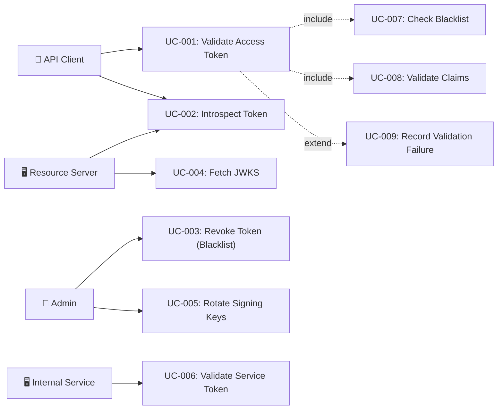

# Tài liệu phân tích nghiệp vụ: JWT Token Validation

> Phân tích nghiệp vụ chi tiết — chia nhỏ theo use case, đặc tả ngữ nghĩa từng chức năng.

---

## 1. Tổng quan (Overview)

### 1.1 Bối cảnh nghiệp vụ (Business Context)

Trong kiến trúc microservices, mỗi request từ client cần được xác thực (authentication) trước khi truy cập tài nguyên bảo vệ. JWT (JSON Web Token) là phương thức xác thực stateless phổ biến nhất, cho phép resource server validate token mà không cần gọi ngược auth server mỗi request. Auth-service cần cung cấp hệ thống JWT validation toàn diện bao gồm: signature verification, claim validation, token revocation/blacklist, key rotation, token introspection, và security event monitoring.

### 1.2 Mục tiêu (Objectives)

| # | Mục tiêu | KPI đo lường | Độ ưu tiên |
|---|---------|-------------|-----------|
| O-01 | Validate JWT tokens với latency thấp trên hot path | P95 < 5ms cho validation pipeline | High |
| O-02 | Hỗ trợ key rotation không downtime | Zero rejected valid tokens during rotation | High |
| O-03 | Revoke tokens trước thời hạn qua blacklist | Blacklisted token bị reject trong < 30s | High |
| O-04 | Cung cấp token introspection cho resource servers | RFC 7662 compliant endpoint | High |
| O-05 | Ghi nhận validation failure events cho security monitoring | 100% suspicious failures recorded | Medium |
| O-06 | Phân biệt và validate nhiều token types (access, mfa, anonymous, service) | Mỗi type có validation rules riêng | High |

### 1.3 Phạm vi (Scope)

| In Scope | Out of Scope |
|----------|-------------|
| JWT signature verification (RS256 primary, HMAC fallback) | Token generation/issuance logic |
| Claim validation chain (iss, aud, type) | User management, registration |
| Token blacklist with tiered cache | MFA verification flow |
| Key rotation with dual-key overlap | SSO/OAuth2 authorization flows |
| JWKS public key endpoint | Password policy enforcement |
| RFC 7662 token introspection | Session management (covered separately) |
| Validation failure event recording | Anonymous session data storage |
| Service-to-service token validation | Captcha verification |

### 1.4 Stakeholders & Actors

| Actor | Loại | Mô tả | Tương tác chính |
|-------|------|--------|----------------|
| API Client | Primary | Mobile/Web app gửi JWT trong Authorization header | Gửi request với Bearer token → nhận response hoặc 401 |
| Resource Server | Primary | Internal microservice cần validate JWT để authorize request | Gọi introspection endpoint hoặc verify JWKS locally |
| Admin/Operator | Secondary | Quản trị hệ thống, monitor security events | Revoke tokens, rotate keys, monitor validation failures |
| Security Monitoring System | External System | SIEM/alerting system nhận validation failure events | Nhận events qua Kafka topic `iam.token.validation-failed` |
| Service (Internal) | External System | Microservice khác call internal API với service token | Authenticate via ServiceAuthFilter |

---

## 2. Use Case Diagram (tổng quan)



---

## 3. Danh sách Use Case (Use Case Index)

| UC-ID | Tên Use Case | Actor | Nhóm chức năng | Độ ưu tiên | Trạng thái |
|-------|-------------|-------|----------------|-----------|-----------|
| UC-001 | Validate Access Token | API Client | Token Validation | High | Draft |
| UC-002 | Introspect Token (RFC 7662) | Resource Server | Token Introspection | High | Draft |
| UC-003 | Revoke Token (Add to Blacklist) | Admin | Token Revocation | High | Draft |
| UC-004 | Fetch JWKS Public Keys | Resource Server | Key Management | High | Draft |
| UC-005 | Rotate Signing Keys | Admin | Key Management | Medium | Draft |
| UC-006 | Validate Service Token | Internal Service | Service Auth | High | Draft |
| UC-007 | Check Token Blacklist | System (sub-UC) | Token Validation | High | Draft |
| UC-008 | Validate JWT Claims | System (sub-UC) | Token Validation | High | Draft |
| UC-009 | Record Validation Failure Event | System (sub-UC) | Security Monitoring | Medium | Draft |

---

## 4. Đặc tả Use Case chi tiết

### UC-001: Validate Access Token

#### 4.1 Thông tin chung

| Mục | Nội dung |
|-----|----------|
| **Mã** | UC-001 |
| **Tên** | Validate Access Token |
| **Mô tả ngữ nghĩa** | Xác thực JWT token trong mỗi incoming HTTP request để cho phép hoặc từ chối truy cập. Đây là use case trọng tâm nhất — nằm trên hot path của mọi API call, yêu cầu latency cực thấp (< 5ms P95). Token được verify chữ ký (RS256/HMAC), check blacklist (tiered cache), validate claims (issuer, audience, type), rồi set SecurityContext với roles/permissions. |
| **Actor** | API Client |
| **Trigger** | Client gửi HTTP request với header `Authorization: Bearer <token>` |
| **Độ ưu tiên** | High |
| **Tần suất** | Every API request — thousands/second |
| **Nhóm chức năng** | Token Validation |

#### 4.2 Điều kiện

| Loại | Mô tả |
|------|--------|
| **Pre-conditions** | Client có JWT token hợp lệ (chưa expired, chưa bị revoke) |
| **Post-conditions (Success)** | SecurityContext được set với userId, roles, permissions; request tiếp tục vào controller |
| **Post-conditions (Failure)** | SecurityContext rỗng; request tiếp tục nhưng secured endpoints sẽ trả 401/403 |
| **Invariants** | Signing key(s) phải được load thành công; blacklist cache phải khả dụng (ít nhất DB fallback) |

#### 4.3 Luồng chính (Basic Flow)

| Step | Actor Action | System Response | Data | Ghi chú |
|------|-------------|----------------|------|---------|
| 1 | Client gửi request với `Authorization: Bearer <token>` | JwtAuthFilter intercept request, extract token từ header | Raw JWT string | OncePerRequestFilter |
| 2 | — | JwtService.parseToken(token): verify signature RS256 (current key) | Claims object | FR-006: cascading key fallback |
| 3 | — | TokenBlacklistCacheService.isBlacklisted(jti): check L1 Caffeine → L2 Redis → L3 DB | Boolean | FR-001, FR-003 |
| 4 | — | ClaimValidatorChain.validateOrThrow(claims): run IssuerClaimValidator → AudienceClaimValidator → TokenTypeClaimValidator | Pass/Fail | FR-004, FR-009 |
| 5 | — | Extract token type: access vs anonymous. Build authorities list (ROLE_* + PERM_*) | Authorities list | FR-011 |
| 6 | — | Set SecurityContextHolder.authentication = UsernamePasswordAuthenticationToken | Authentication object | Spring Security |
| 7 | — | filterChain.doFilter() — request proceeds to controller | — | — |

#### 4.4 Luồng thay thế (Alternative Flows)

##### AF-001: Anonymous Token
- **Trigger**: Tại Step 5 khi `type == "anonymous"`
- **Steps**:
  1. Set authorities = `[ROLE_ANONYMOUS]`
  2. Set authDetails = `{ type: "anonymous", sessionId: claims.subject }`
- **Rejoin**: Quay lại Step 6 của Basic Flow

##### AF-002: Key Rotation Fallback
- **Trigger**: Tại Step 2 khi current RS256 key fails
- **Steps**:
  1. Try previous RS256 key (previousKeyPair) — FR-006
  2. If still fails, try HMAC legacy key — 7-day migration window
- **Rejoin**: Quay lại Step 3 với parsed Claims

##### AF-003: No Authorization Header
- **Trigger**: Tại Step 1 khi `Authorization` header missing or not `Bearer`
- **Steps**:
  1. Skip validation entirely
  2. filterChain.doFilter() — request proceeds without authentication
- **Rejoin**: N/A — flow ends (secured endpoints will reject)

#### 4.5 Luồng ngoại lệ (Exception Flows)

##### EF-001: Signature Verification Failed
- **Trigger**: Tại Step 2 khi all keys fail (current RS256, previous RS256, HMAC)
- **Error**: SignatureException — JWT tampered or signed with unknown key
- **Handling**:
  1. Log warning: `JWT signature verification failed: ip={remoteAddr}`
  2. Record TokenValidationFailedEvent (reason=SIGNATURE_INVALID)
  3. Continue without authentication (filterChain.doFilter)
- **Post-condition**: SecurityContext rỗng; request proceeds but secured endpoints reject

##### EF-002: Token Blacklisted
- **Trigger**: Tại Step 3 khi JTI found in blacklist
- **Error**: Token revoked before natural expiration
- **Handling**:
  1. Log warning: `Blacklisted token used: jti={}, ip={}`
  2. Record TokenValidationFailedEvent (reason=BLACKLISTED)
  3. Return HTTP 401 immediately
- **Post-condition**: Response 401 Unauthorized

##### EF-003: Claim Validation Failed
- **Trigger**: Tại Step 4 khi any ClaimValidator returns FAIL
- **Error**: ClaimValidationException — issuer mismatch, audience mismatch, or invalid token type
- **Handling**:
  1. Log warning: `Claim validation failed: validator={}, reason={}, jti={}, ip={}`
  2. Record TokenValidationFailedEvent (reason=AUDIENCE_MISMATCH or TYPE_REJECTED)
  3. Continue without authentication (filterChain.doFilter)
- **Post-condition**: SecurityContext rỗng; secured endpoints reject

##### EF-004: Token Expired
- **Trigger**: Tại Step 2 khi token exp < current time - clockSkew
- **Error**: TokenExpiredException
- **Handling**:
  1. Log debug: `JWT validation failed: {message}`
  2. Continue without authentication
- **Post-condition**: SecurityContext rỗng; client should refresh token

#### 4.6 Quy tắc nghiệp vụ (Business Rules)

| BR-ID | Quy tắc | Mô tả chi tiết | Validation |
|-------|---------|----------------|-----------|
| BR-001 | Clock skew tolerance | Token expiration validated with configurable tolerance (default 60s) to handle clock drift between servers | `clockSkewSeconds` in SecurityProperties |
| BR-002 | Token type restriction | Only tokens with type=null, "access", or "anonymous" are allowed as access tokens. "mfa" and "refresh" tokens are rejected. | TokenTypeClaimValidator ALLOWED_TYPES set |
| BR-003 | Blacklist winddate Claims│ → Issuer → Audience → Type  │
│  └────────┬─────────┘                               │
│           ▼                                         │
│  ┌──────────────────┐                               │
│  │ 4. Set Security  │ → Roles + Permissions         │
│  │    Context       │                               │
│  └────────┬─────────┘                               │
│           ▼                                         │
│  200 OK { ... } or 401 Unauthorized                 │
└─────────────────────────────────────────────────────┘
```

---

### UC-002: Introspect Token (RFC 7662)

#### 4.1 Thông tin chung

| Mục | Nội dung |
|-----|----------|
| **Mã** | UC-002 |
| **Tên** | Introspect Token |
| **Mô tả ngữ nghĩa** | Cho phép resource servers kiểm tra trạng thái (active/inactive) và metadata của JWT token theo RFC 7662. Khác với UC-001 (real-time filter), introspection là on-demand diagnostic endpoint cho phép collect-all validation (chạy tất cả validators, không fail-fast). |
| **Actor** | Resource Server |
| **Trigger** | Resource Server gọi `POST /api/auth/introspect` với token |
| **Độ ưu tiên** | High |
| **Tần suất** | On-demand — per resource server decision |
| **Nhóm chức năng** | Token Introspection |

#### 4.2 Điều kiện

| Loại | Mô tả |
|------|--------|
| **Pre-conditions** | Caller có quyền truy cập introspection endpoint |
| **Post-conditions (Success)** | Response chứa `active: true/false` + metadata (sub, username, roles, permissions, exp, iat, iss, jti, token_type, scope, client_id) |
| **Post-conditions (Failure)** | Response `active: false` — no metadata exposed |
| **Invariants** | Introspection endpoint luôn trả 200 OK (per RFC 7662) |

#### 4.3 Luồng chính (Basic Flow)

| Step | Actor Action | System Response | Data | Ghi chú |
|------|-------------|----------------|------|---------|
| 1 | Resource Server gửi `POST /api/auth/introspect` với body `{ "token": "eyJ..." }` | Validate request body (@Valid) | IntrospectionRequest | — |
| 2 | — | JwtService.parseToken(token): verify signature | Claims | — |
| 3 | — | Check blacklist: tokenBlacklistCacheService.isBlacklisted(jti) | Boolean | — |
| 4 | — | ClaimValidatorChain.validateAll(claims): run ALL validators (collect-all mode) | List<ClaimValidationResult> | FR-007 |
| 5 | — | Compute `active = !isBlacklisted && !hasClaimFailure` | Boolean | — |
| 6 | — | Build IntrospectionResponse with RFC 7662 fields | IntrospectionResponse | token_type, scope, client_id only when active |
| 7 | — | Return 200 OK with response | JSON | Always 200 per RFC |

#### 4.4 Luồng thay thế (Alternative Flows)

##### AF-001: Inactive Token
- **Trigger**: Tại Step 5 khi `active = false` (blacklisted or claim failure)
- **Steps**:
  1. Return `IntrospectionResponse(active = false)` — no metadata
- **Rejoin**: N/A — flow ends

#### 4.5 Luồng ngoại lệ (Exception Flows)

##### EF-001: Invalid/Expired/Malformed Token
- **Trigger**: Tại Step 2 khi token cannot be parsed
- **Error**: Any JwtException
- **Handling**:
  1. Catch exception
  2. Return `IntrospectionResponse(active = false)`
- **Post-condition**: Response 200 OK with `active: false`

#### 4.6 Quy tắc nghiệp vụ (Business Rules)

| BR-ID | Quy tắc | Mô tả chi tiết | Validation |
|-------|---------|----------------|-----------|
| BR-008 | Always return 200 | Per RFC 7662, introspection MUST return 200 OK even for invalid tokens | Try-catch wrapping |
| BR-009 | Metadata only when active | `token_type`, `scope`, `client_id` fields only populated when `active=true` | Conditional response building |
| BR-010 | Collect-all validation | Use `validateAll()` (not `validateOrThrow()`) to provide diagnostic information | ClaimValidatorChain mode |

#### 4.7 Yêu cầu phi chức năng (cho UC này)

| Loại | Yêu cầu | Target |
|------|---------|--------|
| Performance | Response time | < 50ms P95 |
| Security | Endpoint protection | Authenticated callers only |
| Availability | Uptime | 99.9% |

#### 4.8 Mockup / Wireframe Description

```
┌────────────────────────────────────────────────────┐
│  POST /api/auth/introspect                         │
│  Content-Type: application/json                    │
│                                                    │
│  Request:  { "token": "eyJhbGciOiJSUzI1Ni..." }   │
│                                                    │
│  Response (active):                                │
│  {                                                 │
│    "active": true,                                 │
│    "sub": "123",                                   │
│    "username": "john.doe",                         │
│    "roles": ["ADMIN"],                             │
│    "permissions": ["user:read", "user:write"],     │
│    "exp": 1737345600,                              │
│    "iat": 1737344700,                              │
│    "iss": "auth-service",                          │
│    "jti": "550e8400-e29b-...",                     │
│    "token_type": "Bearer",                         │
│    "scope": "user:read user:write",                │
│    "client_id": "my-api"                           │
│  }                                                 │
│                                                    │
│  Response (inactive):                              │
│  { "active": false }                               │
└────────────────────────────────────────────────────┘
```

---

### UC-004: Fetch JWKS Public Keys

#### 4.1 Thông tin chung

| Mục | Nội dung |
|-----|----------|
| **Mã** | UC-004 |
| **Tên** | Fetch JWKS Public Keys |
| **Mô tả ngữ nghĩa** | Cung cấp public key(s) qua JWKS endpoint (RFC 7517) để resource servers có thể tự verify JWT tokens locally mà không cần gọi introspection mỗi request. Hỗ trợ ETag conditional requests để giảm bandwidth. Trong key rotation, endpoint serve cả current và previous keys. |
| **Actor** | Resource Server |
| **Trigger** | Resource Server gọi `GET /.well-known/jwks.json` |
| **Độ ưu tiên** | High |
| **Tần suất** | Low — cached 24h by clients |
| **Nhóm chức năng** | Key Management |

#### 4.2 Điều kiện

| Loại | Mô tả |
|------|--------|
| **Pre-conditions** | RS256 key pair loaded successfully |
| **Post-conditions (Success)** | Response chứa JWK set với RSA public key(s) |
| **Post-conditions (Failure)** | Empty keys array nếu no RS256 configured |
| **Invariants** | Endpoint publicly accessible (no auth required) |

#### 4.3 Luồng chính (Basic Flow)

| Step | Actor Action | System Response | Data | Ghi chú |
|------|-------------|----------------|------|---------|
| 1 | Resource Server gọi `GET /.well-known/jwks.json` | Build JWKS response from loaded key pairs | JWK set | FR-008 |
| 2 | — | Add current RSA public key as JWK entry (kty, kid, alg, use, n, e) | JWK entry | — |
| 3 | — | If previousPublicKeyPath configured: add previous key as second JWK entry | JWK entry | FR-006 key rotation |
| 4 | — | Compute ETag from sorted kid(s) SHA-256 hash | ETag string | FR-008 |
| 5 | — | Check If-None-Match header: if matches → 304 Not Modified | — | Conditional request |
| 6 | — | Return 200 OK with JWKS, ETag header, Cache-Control: max-age=86400, public | JSON + headers | 24h cache |

#### 4.5 Luồng ngoại lệ (Exception Flows)

##### EF-001: No RSA Keys Configured
- **Trigger**: Tại Step 2 khi keyPair is null (HMAC-only mode)
- **Error**: No keys to expose
- **Handling**: Return `{ "keys": [] }` — empty JWK set
- **Post-condition**: Resource servers cannot verify locally; must use introspection

#### 4.6 Quy tắc nghiệp vụ (Business Rules)

| BR-ID | Quy tắc | Mô tả chi tiết | Validation |
|-------|---------|----------------|-----------|
| BR-011 | ETag-based caching | ETag computed from kid(s) — changes only on key rotation | SHA-256 hash of sorted kids |
| BR-012 | 24h cache max-age | JWKS response cacheable for 24 hours, public | Cache-Control header |
| BR-013 | Dual-key serving | During rotation overlap, both current and previous keys exposed | previousKeyId check |

#### 4.7 Yêu cầu phi chức năng (cho UC này)

| Loại | Yêu cầu | Target |
|------|---------|--------|
| Performance | Response time | < 10ms P95 (in-memory keys) |
| Availability | Uptime | 99.99% (critical for all JWT validation) |
| Caching | Client cache duration | 24h with ETag revalidation |

---

## 5. Ma trận truy xuất (Traceability Matrix)

| UC-ID | FR-ID | NFR-ID | BR-ID | Screen | API Endpoint | DB Entity |
|-------|-------|--------|-------|--------|-------------|-----------|
| UC-001 | FR-001, FR-003, FR-004, FR-005, FR-006, FR-009, FR-011, FR-012, FR-014 | NFR-001, NFR-002 | BR-001–BR-007 | N/A (filter) | All protected endpoints | TokenBlacklist |
| UC-002 | FR-007, FR-011 | NFR-003 | BR-008–BR-010 | N/A (API) | POST /api/auth/introspect | TokenBlacklist |
| UC-003 | FR-001, FR-016 | NFR-004 | BR-003 | N/A (API) | POST /api/auth/sessions/{userId}/revoke-all | TokenBlacklist |
| UC-004 | FR-006, FR-008 | NFR-005 | BR-011–BR-013 | N/A (API) | GET /.well-known/jwks.json | — |
| UC-006 | FR-017 | NFR-001 | — | N/A (filter) | /internal/** paths | — |
| UC-007 | FR-001, FR-003, FR-015 | NFR-001, NFR-002 | BR-003 | N/A (sub-UC) | — | TokenBlacklist |
| UC-008 | FR-004, FR-009, FR-010 | NFR-001 | BR-001, BR-002, BR-006 | N/A (sub-UC) | — | — |
| UC-009 | FR-012 | NFR-006 | BR-007 | N/A (sub-UC) | — | EventStore, EventOutbox |

---

## 6. Yêu cầu chức năng tổng hợp (Functional Requirements)

| FR-ID | Tên | Mô tả | UC liên quan | Độ ưu tiên |
|-------|-----|--------|-------------|-----------|
| FR-001 | Three-tier blacklist lookup | Hệ thống phải check token JTI qua L1 Caffeine → L2 Redis → L3 DB | UC-001, UC-007 | High |
| FR-003 | Cache-based blacklist check | JwtAuthFilter phải check blacklist trước khi set SecurityContext | UC-001 | High |
| FR-004 | Claim validation pipeline | Hệ thống phải validate claims qua extensible chain (iss, aud, type) | UC-001, UC-008 | High |
| FR-005 | Clock skew tolerance | Token expiration validation phải áp dụng configurable tolerance | UC-001 | High |
| FR-006 | Dual-key rotation | Hệ thống phải support current RS256 → previous RS256 → HMAC fallback | UC-001, UC-004 | High |
| FR-007 | RFC 7662 introspection | Introspection endpoint phải return active/inactive + metadata | UC-002 | High |
| FR-008 | JWKS with ETag | JWKS endpoint phải support ETag conditional requests | UC-004 | High |
| FR-009 | Fail-fast claim validation | JwtAuthFilter phải dùng fail-fast mode cho performance | UC-001 | High |
| FR-010 | Audience feature flag | Audience validation phải disable khi config trống | UC-008 | Medium |
| FR-011 | Anonymous token recognition | Filter phải nhận diện type=anonymous và set ROLE_ANONYMOUS | UC-001 | High |
| FR-012 | Validation failure events | Suspicious failures phải được record qua TokenEventRecorder | UC-009 | Medium |
| FR-014 | Structured failure logging | Validation failures phải log với reason categorization | UC-001 | Medium |
| FR-015 | Redis circuit breaker | Redis failures phải trigger circuit breaker, fallback to DB | UC-007 | Medium |
| FR-016 | Write-through blacklist | Token revocation phải write-through Caffeine + Redis | UC-003 | High |
| FR-017 | Service token validation | Internal API paths phải validate service tokens via ServiceAuthFilter | UC-006 | High |

---

## 7. Yêu cầu phi chức năng tổng hợp (Non-Functional Requirements)

| NFR-ID | Loại | Yêu cầu | Target | Measurement |
|--------|------|---------|--------|-------------|
| NFR-001 | Performance | Validation pipeline latency | < 5ms P95 | APM monitoring |
| NFR-002 | Performance | Blacklist cache hit ratio (L1 Caffeine) | > 80% | Caffeine metrics |
| NFR-003 | Performance | Introspection response time | < 50ms P95 | APM monitoring |
| NFR-004 | Availability | Blacklist system availability | 99.9% | DB fallback guarantee |
| NFR-005 | Availability | JWKS endpoint availability | 99.99% | Health check |
| NFR-006 | Security | Validation failure event completeness | 100% suspicious events recorded | Kafka consumer lag |
| NFR-007 | Scalability | Concurrent token validations | > 1000 req/s | Load test (K6) |

---

## 8. Thuật ngữ nghiệp vụ (Glossary)

| Thuật ngữ | Định nghĩa | Context sử dụng |
|-----------|-----------|-----------------|
| JWT (JSON Web Token) | Compact, URL-safe token format per RFC 7519 for representing claims between parties | Primary authentication mechanism |
| JTI (JWT ID) | Unique identifier claim within JWT, used for tracking and revocation | Blacklist lookup key |
| kid (Key ID) | JWT header parameter identifying which key was used to sign the token | Key rotation, JWKS key matching |
| JWKS (JSON Web Key Set) | RFC 7517 — collection of public keys used for JWT verification | JWKS endpoint, key distribution |
| Claim | Name-value pair in JWT payload (e.g., iss, aud, exp, sub) | Claim validation chain |
| Token Introspection | RFC 7662 — endpoint for querying token status and metadata | Resource server integration |
| Blacklist | Set of revoked token JTIs that must be rejected before natural expiration | Token revocation enforcement |
| Clock Skew | Time difference between token issuer and validator system clocks | Expiration validation tolerance |

---

## 9. Phụ lục (Appendix)

### 9.1 Research References
- [opensource_findings.md](./opensource_findings.md)
- [web_research.md](./web_research.md)
- [comparison_analysis.md](./comparison_analysis.md)

### 9.2 Open Questions
- [ ] OQ-001: Should DPoP (Demonstrating Proof of Possession — RFC 9449) be adopted for token binding in future iterations?
- [ ] OQ-002: Should the custom circuit breaker be migrated to Resilience4j for consistency with other service calls?

### 9.3 Assumptions
- ⚠️ AS-001: JJWT library will continue to be actively maintained — Lý do: 10.3k stars, regular releases, widely adopted
- ⚠️ AS-002: Redis availability is > 99% — Lý do: circuit breaker + DB fallback mitigate Redis failures
- ⚠️ AS-003: Key rotation happens infrequently (< 1x/month) — Lý do: JWKS 24h cache is acceptable

---

> **Next step**: Technical Specification (technical_spec.md)
> **Traceability**: Research Brief → Business Analysis → Technical Spec
