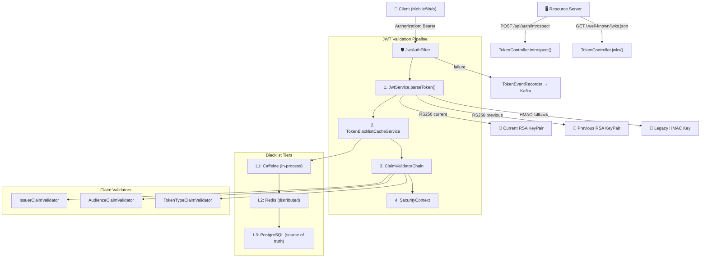
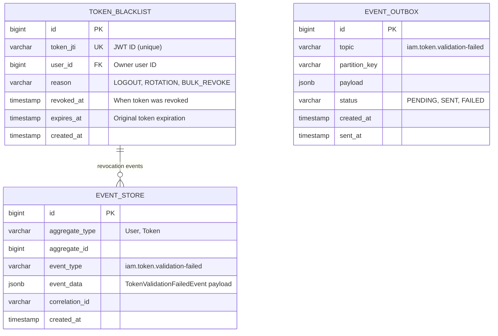
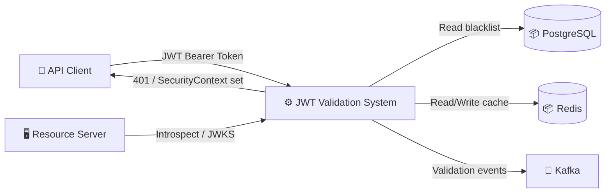
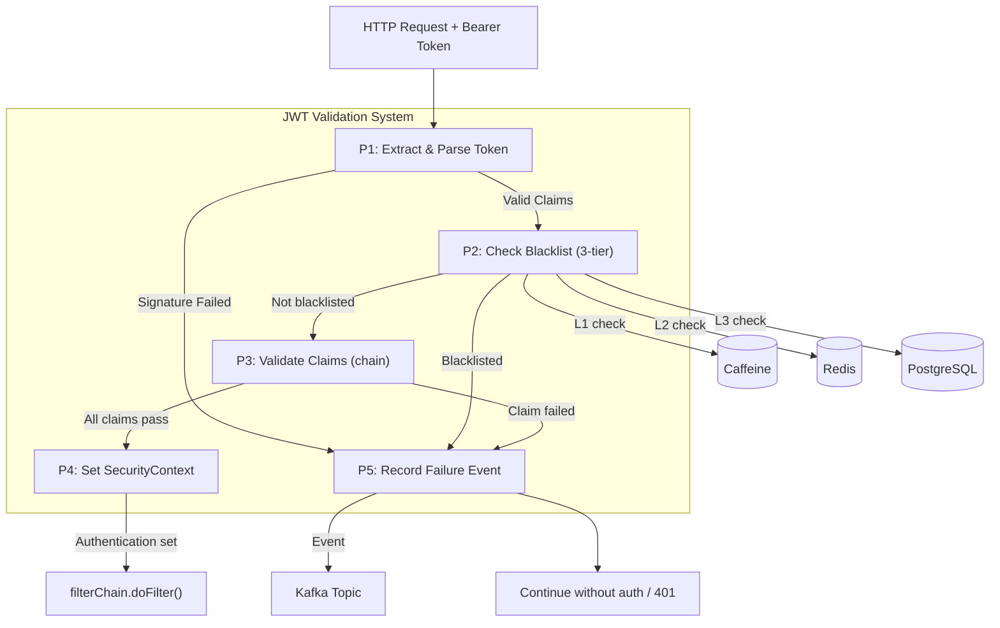
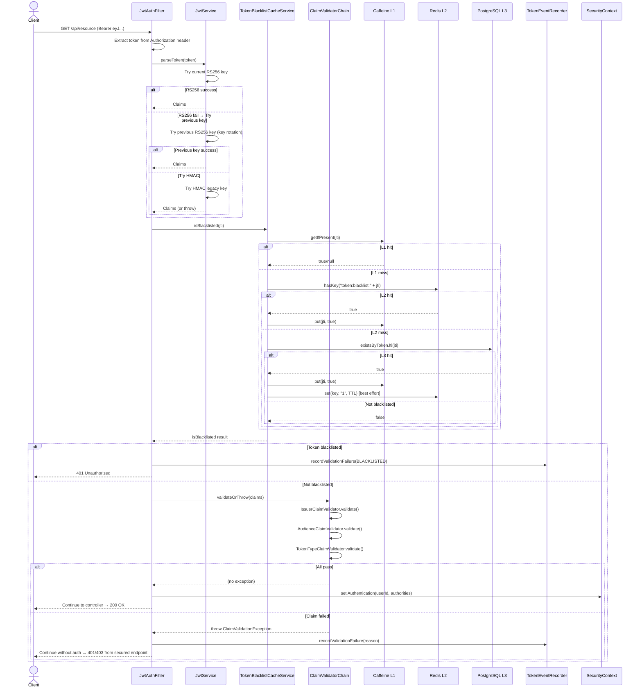
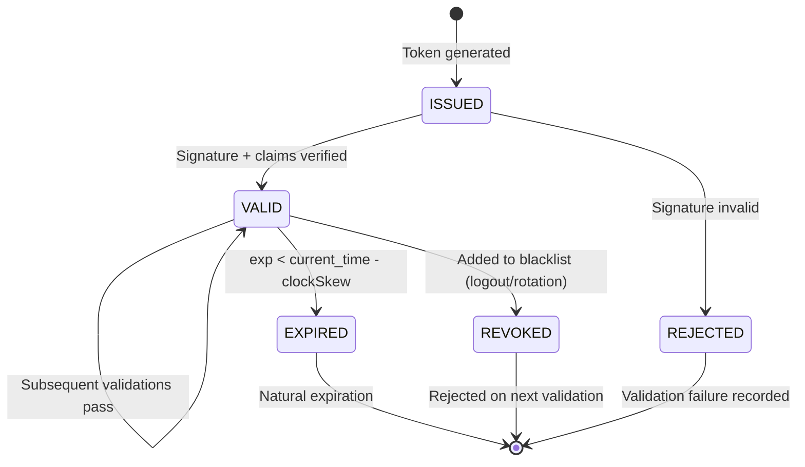
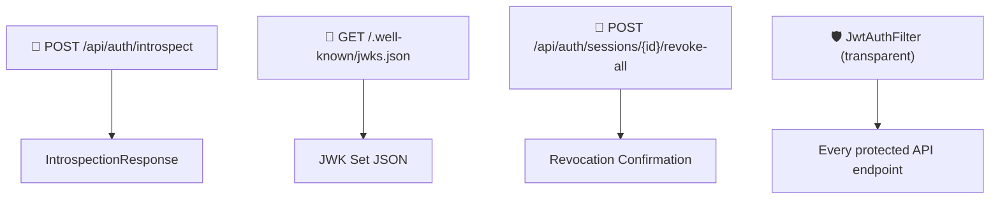

# Đặc tả kỹ thuật: JWT Token Validation

> Technical specification chi tiết — thiết kế để agent có thể đọc và dev code trực tiếp.

---

## 1. Tổng quan hệ thống (System Overview)

### 1.1 Kiến trúc tổng thể



### 1.2 Technology Stack

| Layer | Technology | Version | Ghi chú |
|-------|-----------|---------|---------|
| Language | Kotlin | 1.9+ | JVM target |
| Framework | Spring Boot | 3.x | Spring Security, Spring Web |
| JWT Library | JJWT (io.jsonwebtoken) | 0.12.x | API + impl + jackson modules |
| Cache L1 | Caffeine | 3.x | In-process, programmatic (not Spring Cache) |
| Cache L2 | Redis | 7.x | Via spring-boot-starter-data-redis |
| Database | PostgreSQL | 15+ | Via Spring Data JPA + Flyway |
| Message Queue | Kafka | 3.x | Validation failure events |
| Security | Spring Security | 6.x | Filter chain, SecurityContext |

### 1.3 Dependencies & Integrations

| Dependency | Type | Purpose | Interface |
|-----------|------|---------|-----------|
| TokenBlacklistRepository | Internal DB | Source of truth for blacklisted JTIs | Spring Data JPA |
| EventService | Internal | Domain event recording (outbox pattern) | record() method |
| SecurityProperties | Internal Config | All JWT configuration (keys, TTLs, issuer, audience) | @ConfigurationProperties |
| Kafka | External | Publish validation failure events | Topic: `iam.token.validation-failed` |
| Redis | External | Distributed blacklist cache (L2) | StringRedisTemplate |

---

## 2. Lược đồ dữ liệu (Data Schema)

### 2.1 Entity-Relationship Diagram



### 2.2 Bảng chi tiết Entity

#### Entity: TokenBlacklist

| Field | Type | Constraint | Default | Mô tả |
|-------|------|-----------|---------|--------|
| `id` | `BIGINT` | PK, AUTO_INCREMENT | - | Primary key |
| `token_jti` | `VARCHAR(255)` | UNIQUE, NOT NULL | - | JWT ID of revoked token |
| `user_id` | `BIGINT` | NOT NULL | - | Owner user ID |
| `reason` | `VARCHAR(50)` | NOT NULL | - | Revocation reason (LOGOUT, ROTATION, BULK_REVOKE) |
| `revoked_at` | `TIMESTAMP` | NOT NULL | `CURRENT_TIMESTAMP` | When revocation occurred |
| `expires_at` | `TIMESTAMP` | NOT NULL | - | Original token expiration (for TTL-based cleanup) |
| `created_at` | `TIMESTAMP` | NOT NULL | `CURRENT_TIMESTAMP` | Record creation time |

#### Indexes

| Index Name | Columns | Type | Purpose |
|-----------|---------|------|---------|
| `idx_token_blacklist_jti` | `token_jti` | UNIQUE BTREE | Fast JTI lookup (L3 blacklist check) |
| `idx_token_blacklist_user_id` | `user_id` | BTREE | Bulk revocation by user |
| `idx_token_blacklist_expires_at` | `expires_at` | BTREE | Cleanup expired entries |

---

## 3. Luồng dữ liệu (Data Flow)

### 3.1 Data Flow Diagram — Level 0 (Context)



### 3.2 Data Flow Diagram — Level 1 (chi tiết)



### 3.3 Data Transformation Rules

| # | Input | Process | Output | Validation Rules |
|---|-------|---------|--------|-----------------|
| 1 | `Authorization: Bearer eyJ...` | Extract substring(7) | Raw JWT string | Must start with "Bearer " |
| 2 | Raw JWT string | JJWT parseSignedClaims() | io.jsonwebtoken.Claims | Valid RS256/HMAC signature, not expired (±clockSkew) |
| 3 | Claims.id (JTI) | Blacklist 3-tier lookup | Boolean (is_blacklisted) | NOT in Caffeine, Redis, or DB |
| 4 | Claims (iss, aud, type) | ClaimValidatorChain.validateOrThrow() | Pass or ClaimValidationException | iss matches config, aud matches config (if set), type in allowed set |
| 5 | Claims (roles, permissions) | Map to GrantedAuthority list | List<SimpleGrantedAuthority> | Roles prefixed with "ROLE_", permissions with "PERM_" |

---

## 4. Luồng xử lý (Processing Steps)

### 4.1 Sequence Diagram — UC-001: Validate Access Token



### 4.2 Bảng Step xử lý chi tiết

#### UC-001: Validate Access Token

| Step | Component | Action | Input | Output | Error Handling | Ghi chú |
|------|-----------|--------|-------|--------|---------------|---------|
| 1 | JwtAuthFilter | Extract Bearer token from Authorization header | HttpServletRequest | String (JWT) | No header → skip filter | OncePerRequestFilter |
| 2 | JwtService | Parse token: try current RS256 → previous RS256 → HMAC | String (JWT) | Claims | SignatureException → record event, skip auth | FR-006 cascading |
| 3 | TokenBlacklistCacheService | Check L1 Caffeine cache | String (JTI) | Boolean | — | ~nanoseconds |
| 4 | TokenBlacklistCacheService | Check L2 Redis (if L1 miss) | String (JTI) | Boolean | Circuit breaker open → skip to L3 | FR-015 |
| 5 | TokenBlacklistCacheService | Check L3 DB (if L2 miss) | String (JTI) | Boolean | DB error → log, return false | Source of truth |
| 6 | ClaimValidatorChain | Run validators in order (fail-fast) | Claims | void (or exception) | ClaimValidationException → record event | FR-009 |
| 7 | JwtAuthFilter | Build authorities (ROLE_* + PERM_*) or ROLE_ANONYMOUS | Claims | List<GrantedAuthority> | — | FR-011 |
| 8 | JwtAuthFilter | Set SecurityContext.authentication | Authentication | void | — | Spring Security |
| 9 | JwtAuthFilter | filterChain.doFilter() | — | — | — | Continue chain |

### 4.3 State Machine — Token Lifecycle



| Transition | From | To | Trigger | Guard Condition | Side Effect |
|-----------|------|-----|---------|----------------|------------|
| Validate | ISSUED | VALID | JwtAuthFilter processes request | Signature valid, not blacklisted, claims pass | SecurityContext set |
| Expire | VALID | EXPIRED | Clock passes exp - clockSkew | Token lifetime exceeded | Client must refresh |
| Revoke | VALID | REVOKED | Admin/user logout/session revoke | JTI added to blacklist (DB + cache) | Write-through to Caffeine + Redis |
| Reject | ISSUED | REJECTED | Invalid signature or tampered | Signature verification fails | TokenValidationFailedEvent recorded |

---

## 5. Luồng màn hình (Screen Flow)

### 5.1 Screen Map (Sitemap)

JWT Token Validation is a backend-only feature — no UI screens. All interactions are API-based.



### 5.2 Chi tiết từng Screen

| Screen ID | Tên | Mục đích | Data hiển thị | User Actions | Navigation |
|-----------|-----|----------|--------------|-------------|-----------|
| N/A | No UI | JWT validation is transparent filter + API endpoints | N/A | N/A | N/A |

### 5.3 Wireframe Description (text-based)

#### Introspection API Response
```
┌────────────────────────────────────────────────┐
│  POST /api/auth/introspect                     │
├────────────────────────────────────────────────┤
│  Request Body:                                 │
│    { "token": "eyJhbGciOiJSUzI1NiI..." }      │
├────────────────────────────────────────────────┤
│  Response (200 OK):                            │
│    {                                           │
│      "active": true,                           │
│      "sub": "123",                             │
│      "username": "john.doe",                   │
│      "roles": ["ADMIN", "USER"],               │
│      "permissions": ["user:read"],             │
│      "exp": 1737345600,                        │
│      "iat": 1737344700,                        │
│      "iss": "auth-service",                    │
│      "jti": "550e8400-...",                    │
│      "token_type": "Bearer",                   │
│      "scope": "user:read",                     │
│      "client_id": "my-api"                     │
│    }                                           │
└────────────────────────────────────────────────┘
```

---

## 6. API Specification

### 6.1 Endpoint List

| # | Method | Path | Description | Auth | Request Body | Response |
|---|--------|------|------------|------|-------------|----------|
| 1 | `POST` | `/api/auth/introspect` | Token introspection (RFC 7662) | JWT (authenticated callers) | IntrospectionRequest | IntrospectionResponse |
| 2 | `GET` | `/.well-known/jwks.json` | JWKS public key endpoint | None (public) | — | JWK Set JSON |
| 3 | `POST` | `/api/auth/sessions/{userId}/revoke-all` | Revoke all user sessions | JWT (admin) | — | Revocation result |

### 6.2 Request/Response chi tiết

#### POST /api/auth/introspect

**Request:**
```json
{
  "token": "string (required, JWT token to introspect)"
}
```

**Response (200 OK — active token):**
```json
{
  "active": true,
  "sub": "123",
  "username": "john.doe",
  "roles": ["ADMIN", "USER"],
  "permissions": ["user:read", "user:write"],
  "exp": 1737345600,
  "iat": 1737344700,
  "iss": "auth-service",
  "jti": "550e8400-e29b-41d4-a716-446655440000",
  "token_type": "Bearer",
  "scope": "user:read user:write",
  "client_id": "my-api"
}
```

**Response (200 OK — inactive/invalid token):**
```json
{
  "active": false
}
```

#### GET /.well-known/jwks.json

**Response (200 OK):**
```json
{
  "keys": [
    {
      "kty": "RSA",
      "kid": "auth-service-key-1",
      "alg": "RS256",
      "use": "sig",
      "n": "0vx7agoebGcQSuuPiLJXZpt...",
      "e": "AQAB"
    },
    {
      "kty": "RSA",
      "kid": "auth-service-key-0",
      "alg": "RS256",
      "use": "sig",
     tạo để agent dev trực tiếp.

### 9.1 Classes to Create

| # | Class | Package | Type | Extends/Implements | Mô tả |
|---|-------|---------|------|-------------------|--------|
| 1 | `JwtService` | `auth.application` | @Service | — | JWT token parsing with RS256/HMAC cascading fallback, JWKS generation |
| 2 | `ClaimValidator` | `auth.application` | Interface | — | Contract for claim validators (chain of responsibility) |
| 3 | `ClaimValidatorChain` | `auth.application` | @Component | — | Orchestrates validators: fail-fast (filter) and collect-all (introspection) |
| 4 | `IssuerClaimValidator` | `auth.application` | @Component | ClaimValidator | Validates `iss` claim against configured issuer |
| 5 | `AudienceClaimValidator` | `auth.application` | @Component | ClaimValidator | Validates `aud` claim (feature-flagged) |
| 6 | `TokenTypeClaimValidator` | `auth.application` | @Component | ClaimValidator | Rejects non-access token types (mfa, refresh) |
| 7 | `ClaimValidationResult` | `auth.application` | Data class | — | Validator result (validatorName, status, reason) |
| 8 | `ClaimValidationException` | `auth.application` | RuntimeException | RuntimeException | Thrown by fail-fast mode |
| 9 | `TokenBlacklistCacheService` | `auth.application` | @Service | — | Three-tier blacklist cache with circuit breaker |
| 10 | `JwtAuthFilter` | `shared.security` | @Component | OncePerRequestFilter | PEP filter: parse → blacklist → claims → SecurityContext |
| 11 | `TokenController` | `auth.adapter.in.web` | @RestController | — | Introspection + JWKS + session revocation endpoints |
| 12 | `TokenEventRecorder` | `auth.application.event` | @Component | — | Records validation failure events to Kafka via EventService |
| 13 | `TokenValidationFailedEvent` | `auth.domain.event` | Data class | DomainEvent | Domain event for validation failures |
| 14 | `ValidationFailureReason` | `auth.domain.event` | Enum | — | BLACKLISTED, SIGNATURE_INVALID, AUDIENCE_MISMATCH, TYPE_REJECTED |
| 15 | `IntrospectionRequest` | `auth.adapter.in.web.dto` | Data class | — | Request DTO with @Valid token field |
| 16 | `IntrospectionResponse` | `auth.adapter.in.web.dto` | Data class | — | RFC 7662 response DTO |

### 9.2 Pattern References

| Pattern | Reference | Ghi chú |
|---------|----------|---------|
| Flow style | Clean Architecture — filter → service → repository | Follow hexagonal adapter pattern |
| Auth pattern | JwtAuthFilter (OncePerRequestFilter) | Spring Security filter chain integration |
| Validation pattern | Chain of Responsibility (ClaimValidator interface) | Extensible, testable, open-closed |
| Cache pattern | Three-tier (Caffeine L1 → Redis L2 → DB L3) | Programmatic Caffeine, not Spring Cache |
| Error handling | Fail-safe — validation failure ≠ system failure | Events logged, filter continues |
| Event pattern | Outbox pattern via EventService.record() | Ensures event delivery to Kafka |

### 9.3 Integration Points

| Integration | Type | Protocol | Endpoint | Data Format |
|------------|------|----------|----------|------------|
| TokenBlacklistRepository | Sync | JPA | `existsByTokenJti(jti)` | Boolean |
| Redis (blacklist) | Sync | Redis protocol | `token:blacklist:{jti}` key | String "1" |
| Kafka (events) | Async | Kafka | `iam.token.validation-failed` topic | JSON (TokenValidationFailedEvent) |
| Caffeine (L1 cache) | Sync | In-process | Programmatic API | Boolean |
| SecurityProperties | Config | Spring ConfigurationProperties | `app.security.jwt.*` | Data class |

### 9.4 Test Cases (high-level)

| # | Test | Type | Scenario | Expected |
|---|------|------|----------|----------|
| 1 | Parse valid RS256 token | Unit | Valid JWT signed with current key | Claims returned successfully |
| 2 | Parse with previous key (rotation) | Unit | JWT signed with previous RS256 key | Claims returned via fallback |
| 3 | Parse with HMAC fallback | Unit | JWT signed with legacy HMAC key | Claims returned via fallback |
| 4 | Reject expired token | Unit | Token with exp < now - clockSkew | TokenExpiredException thrown |
| 5 | Reject tampered token | Unit | Modified JWT payload | SignatureException thrown |
| 6 | Blacklist check — L1 hit | Unit | JTI in Caffeine cache | isBlacklisted returns true |
| 7 | Blacklist check — L2 hit | Unit | JTI not in Caffeine, in Redis | isBlacklisted returns true, Caffeine populated |
| 8 | Blacklist check — L3 hit | Unit | JTI not in Caffeine/Redis, in DB | isBlacklisted returns true, Caffeine+Redis populated |
| 9 | Blacklist check — not found | Unit | JTI not in any tier | isBlacklisted returns false |
| 10 | Redis circuit breaker | Unit | 5 consecutive Redis failures | Circuit breaker opens, skips Redis, falls back to DB |
| 11 | Issuer claim validation | Unit | Token with wrong issuer | ClaimValidationResult(FAIL) |
| 12 | Audience claim validation (enabled) | Unit | Token with wrong audience | ClaimValidationResult(FAIL) |
| 13 | Audience claim validation (disabled) | Unit | Audience config empty | ClaimValidationResult(PASS) |
| 14 | Token type validation | Unit | Refresh token used as access | ClaimValidationResult(FAIL) |
| 15 | Token type validation — anonymous | Unit | Anonymous token | ClaimValidationResult(PASS) |
| 16 | JwtAuthFilter — full flow | Integration | Valid Bearer token | SecurityContext set with authorities |
| 17 | JwtAuthFilter — blacklisted | Integration | Blacklisted token | 401 Unauthorized |
| 18 | Introspection — active token | Integration | Valid, non-blacklisted token | active=true + metadata |
| 19 | Introspection — inactive token | Integration | Expired/blacklisted token | active=false |
| 20 | JWKS endpoint | Integration | GET /.well-known/jwks.json | JWK set with RSA public key(s) |
| 21 | JWKS ETag — conditional request | Integration | If-None-Match matches | 304 Not Modified |
| 22 | Validation failure event | Integration | Signature failure | TokenValidationFailedEvent recorded |

---

> **Traceability**: Research Brief → Business Analysis → **Technical Spec** → Implementation
> **Ready for**: `/wf_pre_openspec` hoặc `/wf_openspec` hoặc direct coding
