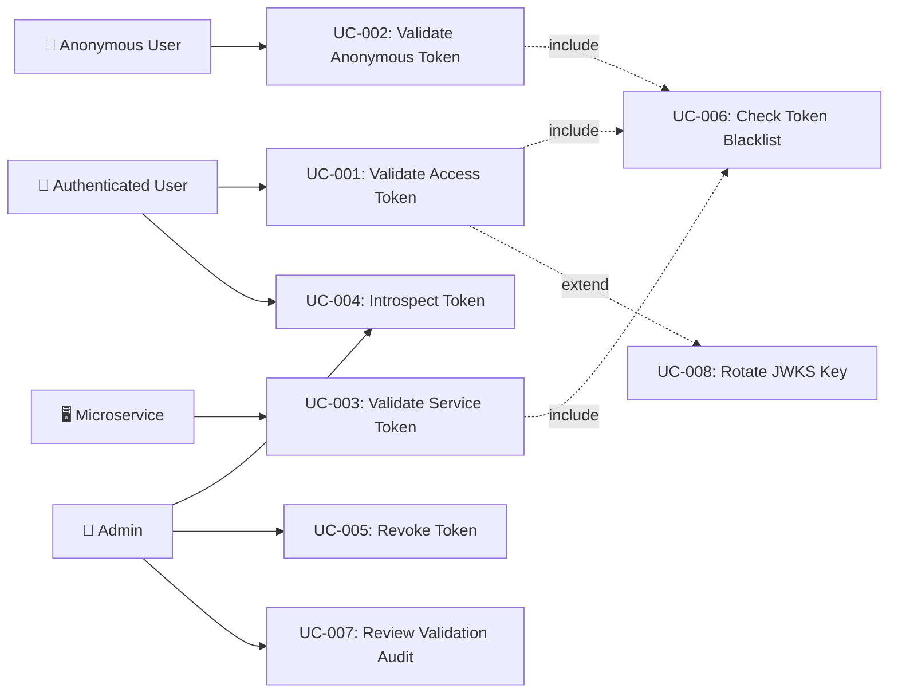

# Tài liệu phân tích nghiệp vụ: JWT Token Validation

> Phân tích nghiệp vụ chi tiết — chia nhỏ theo use case, đặc tả ngữ nghĩa từng chức năng.

---

## 1. Tổng quan (Overview)

### 1.1 Bối cảnh nghiệp vụ (Business Context)

The auth-service is a production-grade authentication service built on Event Sourcing architecture. JWT tokens are the primary mechanism for stateless authentication across the microservices ecosystem. Every API request requires token validation — making this the most critical and frequently-invoked code path in the system. Currently, validation logic is scattered across multiple components (`JwtAuthFilter`, `ServiceAuthFilter`, `TokenController`), leading to inconsistent checks, potential security gaps (algorithm confusion), and no audit trail for validation events. A unified, hardened validation pipeline is needed to ensure security, observability, and maintainability.

### 1.2 Mục tiêu (Objectives)

| # | Mục tiêu | KPI đo lường | Độ ưu tiên |
|---|---------|-------------|-----------|
| O-01 | Unified validation pipeline — single entry point for all token validation | 100% of validation goes through pipeline | High |
| O-02 | Algorithm whitelist enforcement — prevent algorithm confusion attacks | 0 algorithm confusion vulnerabilities | High |
| O-03 | Two-level cache for blacklist — sub-millisecond validation for cached tokens | P95 validation < 5ms (cache hit), < 50ms (cache miss) | High |
| O-04 | Token type-specific validation — clean dispatch per token type | 5 token types handled, 0 type confusion errors | Medium |
| O-05 | Validation audit trail — record validation failures as domain events | 100% of failed validations logged | Medium |
| O-06 | JWKS key rotation support — zero-downtime key changes | Key rotation with 0 rejected valid tokens | Low |

### 1.3 Phạm vi (Scope)

| In Scope | Out of Scope |
|----------|-------------|
| JWT signature verification (RS256 + HMAC fallback) | Token generation/issuance logic |
| Claims validation pipeline (exp, iss, aud, nbf, jti, type) | User registration/login flows |
| Token blacklist checking (JTI-based, two-level cache) | OAuth2 authorization flows |
| Token introspection endpoint (RFC 7662) | MFA verification logic |
| Inter-service token validation (ServiceTokenService) | SSO provider integration |
| JWKS endpoint enhancement (multi-key support) | E2EE key exchange |
| Validation failure event recording | RBAC/PBAC policy evaluation |
| Algorithm whitelist enforcement | Password management |

### 1.4 Stakeholders & Actors

| Actor | Loại | Mô tả | Tương tác chính |
|-------|------|--------|----------------|
| Authenticated User | Primary | End user with valid JWT access token | All protected API calls |
| Anonymous User | Primary | Guest with anonymous session token | Anonymous API endpoints |
| Microservice | Primary | Internal service with service JWT | /api/internal/ endpoints |
| Admin | Secondary | System administrator monitoring token activity | Introspection, session revocation, audit review |
| API Gateway | External System | Reverse proxy forwarding requests | Passes Bearer tokens to auth-service |
| Redis Cache | External System | Distributed cache for blacklist, session data | Blacklist lookups, cache invalidation |
| Event Store | External System | PostgreSQL event log | Validation event persistence |

---

## 2. Use Case Diagram (tổng quan)



---

## 3. Danh sách Use Case (Use Case Index)

| UC-ID | Tên Use Case | Actor | Nhóm chức năng | Độ ưu tiên | Trạng thái |
|-------|-------------|-------|----------------|-----------|-----------|
| UC-001 | Validate Access Token | Authenticated User | Token Validation | High | Draft |
| UC-002 | Validate Anonymous Token | Anonymous User | Token Validation | High | Draft |
| UC-003 | Validate Service Token | Microservice | Token Validation | High | Draft |
| UC-004 | Introspect Token | Admin, Authenticated User | Token Management | Medium | Draft |
| UC-005 | Revoke Token (Blacklist) | Admin, System | Token Management | High | Draft |
| UC-006 | Check Token Blacklist | System (internal) | Validation Infrastructure | High | Draft |
| UC-007 | Review Validation Audit | Admin | Observability | Low | Draft |
| UC-008 | Rotate JWKS Key | Admin | Key Management | Low | Draft |

---

## 4. Đặc tả Use Case chi tiết

### UC-001: Validate Access Token

#### 4.1 Thông tin chung

| Mục | Nội dung |
|-----|----------|
| **Mã** | UC-001 |
| **Tên** | Validate Access Token |
| **Mô tả ngữ nghĩa** | Validates a user's JWT access token on every API request — the critical security gate ensuring only authenticated, authorized users access protected resources. This is the highest-frequency operation in the auth-service (invoked on every request), making performance paramount. |
| **Actor** | Authenticated User (via API Gateway) |
| **Trigger** | HTTP request with `Authorization: Bearer <token>` header |
| **Độ ưu tiên** | High |
| **Tần suất** | Every API request — thousands per second |
| **Nhóm chức năng** | Token Validation |

#### 4.2 Điều kiện

| Loại | Mô tả |
|------|--------|
| **Pre-conditions** | Token exists in Authorization header; signing keys are loaded; blacklist cache is initialized |
| **Post-conditions (Success)** | SecurityContext populated with userId, roles, permissions, domains; request proceeds to handler |
| **Post-conditions (Failure)** | SecurityContext remains empty; 401 Unauthorized returned; validation failure event optionally recorded |
| **Invariants** | Signing keys remain available; blacklist cache is accessible (graceful degradation to DB if Redis down) |

#### 4.3 Luồng chính (Basic Flow)

| Step | Actor Action | System Response | Data | Ghi chú |
|------|-------------|----------------|------|---------|
| 1 | Send HTTP request with `Authorization: Bearer <JWT>` | Extract token from header | Raw JWT string | Strip "Bearer " prefix |
| 2 | — | Verify algorithm is in whitelist (RS256, HS256) | JWT header `alg` field | OWASP: reject unknown alg |
| 3 | — | Verify signature using appropriate key (RS256 primary, HS256 fallback) | Signature bytes | Try RS256 first |
| 4 | — | Validate registered claims: exp, iss, iat | Claims payload | Reject if expired or wrong issuer |
| 5 | — | Extract JTI and check blacklist (Caffeine L1 → Redis L2 → DB) | JTI string | Two-level cache |
| 6 | — | Determine token type (access if no `type` claim or type=null) | `type` claim | Type discrimination |
| 7 | — | Extract roles, permissions, domains, username from claims | Claims payload | Build authority list |
| 8 | — | Set SecurityContext with UsernamePasswordAuthenticationToken | Authentication object | authorities = ROLE_X + PERM_X |
| 9 | — | Pass request to next filter / controller | — | FilterChain.doFilter() |

#### 4.4 Luồng thay thế (Alternative Flows)

##### AF-001: HMAC Legacy Token (Migration Period)
- **Trigger**: Tại Step 3 khi RS256 signature verification fails
- **Steps**:
  1. Check if HMAC legacy key is configured
  2. Verify signature using HMAC-SHA256
  3. If valid, log warning: "Legacy HMAC token detected — migration pending"
  4. Continue from Step 4
- **Rejoin**: Quay lại Step 4 của Basic Flow

##### AF-002: No Authorization Header
- **Trigger**: Tại Step 1 khi Authorization header is missing
- **Steps**:
  1. Skip authentication (do not set SecurityContext)
  2. Let Spring Security authorization check handle access denial
- **Rejoin**: Step 9 (filterChain.doFilter)

#### 4.5 Luồng ngoại lệ (Exception Flows)

##### EF-001: Token Expired
- **Trigger**: Tại Step 4 khi `exp` claim is in the past
- **Error**: AUTH_003 — "JWT token has expired"
- **Handling**:
  1. Log debug: "Token expired for subject {sub}"
  2. Do not set SecurityContext
  3. Optionally record `TokenValidationFailedEvent(reason=EXPIRED)`
- **Post-condition**: Request continues unauthenticated; secured endpoints return 401

##### EF-002: Invalid Signature
- **Trigger**: Tại Step 3 khi signature verification fails for both RS256 and HMAC
- **Error**: AUTH_003 — "JWT token has expired" (generic, do not leak signature details)
- **Handling**:
  1. Log warn: "Invalid JWT signature detected"
  2. Record `TokenValidationFailedEvent(reason=INVALID_SIGNATURE)` for security monitoring
- **Post-condition**: Request continues unauthenticated

##### EF-003: Token Blacklisted
- **Trigger**: Tại Step 5 khi JTI found in blacklist
- **Error**: 401 Unauthorized
- **Handling**:
  1. Log debug: "Token {jti} is blacklisted"
  2. Return 401 directly (do not proceed to controller)
- **Post-condition**: Request rejected immediately

##### EF-004: Algorithm Not Allowed
- **Trigger**: Tại Step 2 khi `alg` header is not in whitelist
- **Error**: AUTH_003 (generic)
- **Handling**:
  1. Log warn: "Algorithm confusion attempt: {alg}"
  2. Record `TokenValidationFailedEvent(reason=ALGORITHM_NOT_ALLOWED)` for security alert
- **Post-condition**: Request continues unauthenticated

#### 4.6 Quy tắc nghiệp vụ (Business Rules)

| BR-ID | Quy tắc | Mô tả chi tiết | Validation |
|-------|---------|----------------|-----------|
| BR-001 | Algorithm Whitelist | Only RS256 and HS256 (legacy, time-limited) are accepted. Any other algorithm MUST be rejected. | Check JWT header `alg` against whitelist before verification |
| BR-002 | Issuer Validation | Token `iss` claim MUST match `app.security.jwt.issuer` (default: "auth-service") | String equality check |
| BR-003 | Expiration Enforcement | Token `exp` claim MUST be in the future (with no clock skew tolerance) | NumericDate comparison |
| BR-004 | Blacklist Check Required | Every token with a JTI MUST be checked against the blacklist before acceptance | Blacklist lookup on every validation |
| BR-005 | Signature-First Validation | Signature MUST be verified before any claims extraction | Pipeline ordering enforcement |
| BR-006 | HMAC Migration Deadline | HMAC fallback MUST be disabled after configurable migration period (default: 7 days from RS256 deployment) | Date-based config check |

#### 4.7 Yêu cầu phi chức năng (cho UC này)

| Loại | Yêu cầu | Target |
|------|---------|--------|
| Performance | Validation time (cache hit) | < 5ms P95 |
| Performance | Validation time (cache miss, Redis) | < 50ms P95 |
| Security | Algorithm confusion prevention | 0 vulnerabilities |
| Availability | Validation available during Redis outage | Graceful degradation to DB |
| Concurrency | Max concurrent validations | 10,000+ req/s |

#### 4.8 Mockup / Wireframe Description

```
N/A — UC-001 is a backend-only operation (HTTP filter).
No UI involved. Interaction is via HTTP headers.

Request:
┌─────────────────────────────────────────────┐
│ GET /api/v1/protected-resource              │
│ Authorization: Bearer eyJhbGciOiJSUz...     │
└─────────────────────────────────────────────┘

Response (success): 200 OK + resource data
Response (failure): 401 Unauthorized
```

---

### UC-002: Validate Anonymous Token

#### 4.1 Thông tin chung

| Mục | Nội dung |
|-----|----------|
| **Mã** | UC-002 |
| **Tên** | Validate Anonymous Token |
| **Mô tả ngữ nghĩa** | Validates anonymous session tokens (type=anonymous) for guest users. Anonymous tokens grant limited ROLE_ANONYMOUS authority, allowing access to public features like browsing, cart management, and session data storage without requiring full registration. |
| **Actor** | Anonymous User |
| **Trigger** | HTTP request to `/api/v1/auth/anonymous/**` with Bearer token |
| **Độ ưu tiên** | High |
| **Tần suất** | On-demand — guest browsing sessions |
| **Nhóm chức năng** | Token Validation |

#### 4.2 Điều kiện

| Loại | Mô tả |
|------|--------|
| **Pre-conditions** | Anonymous token issued via `/api/v1/auth/anonymous`; Redis session exists |
| **Post-conditions (Success)** | SecurityContext with ROLE_ANONYMOUS, sessionId in details |
| **Post-conditions (Failure)** | 401 Unauthorized |
| **Invariants** | Anonymous tokens MUST have `type=anonymous` claim |

#### 4.3 Luồng chính (Basic Flow)

| Step | Actor Action | System Response | Data | Ghi chú |
|------|-------------|----------------|------|---------|
| 1 | Send request with Bearer anonymous token | Extract and verify signature | JWT | Same as UC-001 steps 1-4 |
| 2 | — | Verify `type` claim equals "anonymous" | type claim | Type-specific validator |
| 3 | — | Check blacklist for JTI | JTI | Renewal blacklists old tokens |
| 4 | — | Verify Redis session exists for subject (sessionId) | sessionId | Redis key: `anon:session:{sessionId}` |
| 5 | — | Set SecurityContext with ROLE_ANONYMOUS authority | Authentication | Limited permissions |

#### 4.4 Luồng thay thế (Alternative Flows)

##### AF-001: Session Expired in Redis
- **Trigger**: Tại Step 4 khi Redis session not found
- **Steps**:
  1. Token is valid (not expired) but session was evicted from Redis
  2. Return 401 with AUTH_040 (anonymous session expired)
- **Rejoin**: N/A — request ends

#### 4.5 Luồng ngoại lệ (Exception Flows)

##### EF-001: Wrong Token Type
- **Trigger**: Tại Step 2 khi `type` claim is not "anonymous"
- **Error**: AUTH_003 — Token type mismatch
- **Handling**: Reject token, do not set SecurityContext
- **Post-condition**: 401 Unauthorized

#### 4.6 Quy tắc nghiệp vụ (Business Rules)

| BR-ID | Quy tắc | Mô tả chi tiết | Validation |
|-------|---------|----------------|-----------|
| BR-007 | Anonymous Type Required | Anonymous endpoints MUST only accept tokens with `type=anonymous` | Claim check |
| BR-008 | Session Validation | Anonymous token is only valid if corresponding Redis session exists | Redis lookup |
| BR-009 | Max Renewals | Anonymous tokens can be renewed max `anonymous.maxRenewals` times (default: 24) | Counter check |

#### 4.7 Yêu cầu phi chức năng (cho UC này)

| Loại | Yêu cầu | Target |
|------|---------|--------|
| Performance | Validation time | < 10ms P95 (Redis lookup included) |
| Security | Type confusion prevention | Cannot use access token on anonymous endpoints |

#### 4.8 Mockup / Wireframe Description

```
N/A — Backend-only filter operation.
```

---

### UC-003: Validate Service Token

#### 4.1 Thông tin chung

| Mục | Nội dung |
|-----|----------|
| **Mã** | UC-003 |
| **Tên** | Validate Service Token |
| **Mô tả ngữ nghĩa** | Validates inter-service JWT tokens for /api/internal/ endpoints. Service tokens use HMAC-SHA256 signing (derived key) and carry service name + scope claims. Only registered services (auth-service, account-service, system-admin-service) can obtain service tokens. |
| **Actor** | Microservice (internal) |
| **Trigger** | HTTP request to `/api/internal/**` with service Bearer token |
| **Độ ưu tiên** | High |
| **Tần suất** | On-demand — inter-service calls |
| **Nhóm chức năng** | Token Validation |

#### 4.2 Điều kiện

| Loại | Mô tả |
|------|--------|
| **Pre-conditions** | Service token generated by `ServiceTokenService.generateServiceToken()` |
| **Post-conditions (Success)** | SecurityContext with ROLE_SERVICE + ROLE_INTERNAL + SCOPE_X |
| **Post-conditions (Failure)** | 401 Unauthorized (AUTH_060) or 403 Forbidden (AUTH_062) |
| **Invariants** | Service token MUST have `type=service` claim |

#### 4.3 Luồng chính (Basic Flow)

| Step | Actor Action | System Response | Data | Ghi chú |
|------|-------------|----------------|------|---------|
| 1 | Send request with service Bearer token to /api/internal/ | Check URL pattern matches /api/internal/ | Request URI | ServiceAuthFilter |
| 2 | — | Verify signature using HMAC-SHA256 (derived key) | Signature | ServiceTokenService.validateServiceToken() |
| 3 | — | Validate `type=service` claim | type claim | Type discrimination |
| 4 | — | Validate issuer matches config | iss claim | app.security.jwt.issuer |
| 5 | — | Extract service name from subject | sub claim | Must be in REGISTERED_SERVICES |
| 6 | — | Extract scope claim | scope claim | Default: "INTERNAL" |
| 7 | — | Set SecurityContext with ROLE_SERVICE, ROLE_INTERNAL, SCOPE_X | Authentication | Service authorities |

#### 4.5 Luồng ngoại lệ (Exception Flows)

##### EF-001: Unregistered Service
- **Trigger**: Tại Step 5 khi service name not in REGISTERED_SERVICES
- **Error**: AUTH_062 — "Service is not registered"
- **Handling**: Return 403 Forbidden
- **Post-condition**: Request rejected

##### EF-002: Invalid Service Token
- **Trigger**: Tại Step 2 khi signature verification fails
- **Error**: AUTH_060 — "Invalid or expired service authentication token"
- **Handling**: Return 401 Unauthorized
- **Post-condition**: Request rejected

#### 4.6 Quy tắc nghiệp vụ (Business Rules)

| BR-ID | Quy tắc | Mô tả chi tiết | Validation |
|-------|---------|----------------|-----------|
| BR-010 | Registered Services Only | Only services in REGISTERED_SERVICES set can use /api/internal/ | Set membership check |
| BR-011 | Scope Check | Service must have sufficient scope for the operation | Scope string comparison |
| BR-012 | Service Token TTL | Service tokens are valid for 1 hour (3600s) | Expiration check |

#### 4.7 Yêu cầu phi chức năng (cho UC này)

| Loại | Yêu cầu | Target |
|------|---------|--------|
| Performance | Validation time | < 2ms P95 (HMAC is fast, no cache needed) |
| Security | Key derivation | Service key derived from main secret + ":service" suffix |

#### 4.8 Mockup / Wireframe Description

```
N/A — Backend-only filter operation.
```

---

### UC-004: Introspect Token

#### 4.1 Thông tin chung

| Mục | Nội dung |
|-----|----------|
| **Mã** | UC-004 |
| **Tên** | Introspect Token |
| **Mô tả ngữ nghĩa** | Provides RFC 7662-compliant token introspection — allows clients and services to query whether a token is still valid and retrieve its metadata. Critical for debugging, admin dashboards, and interoperability with external systems that need to verify auth-service tokens. |
| **Actor** | Admin, Authenticated User, Microservice |
| **Trigger** | POST `/api/auth/introspect` with token in request body |
| **Độ ưu tiên** | Medium |
| **Tần suất** | On-demand — admin operations, debugging |
| **Nhóm chức năng** | Token Management |

#### 4.2 Điều kiện

| Loại | Mô tả |
|------|--------|
| **Pre-conditions** | Token string provided in request body |
| **Post-conditions (Success)** | Returns `{active: true, sub, username, roles, permissions, exp, iat, iss, jti}` |
| **Post-conditions (Failure)** | Returns `{active: false}` (does NOT return error — RFC 7662 spec) |
| **Invariants** | Endpoint MUST always return 200 OK (even for invalid tokens) per RFC 7662 |

#### 4.3 Luồng chính (Basic Flow)

| Step | Actor Action | System Response | Data | Ghi chú |
|------|-------------|----------------|------|---------|
| 1 | POST token to /api/auth/introspect | Parse and validate token | JWT string | Full validation pipeline |
| 2 | — | Check blacklist | JTI | Must include blacklist check |
| 3 | — | Extract all claims (sub, username, roles, permissions, exp, iat, iss, jti) | Claims | Build IntrospectionResponse |
| 4 | — | Return `{active: true, ...claims}` | IntrospectionResponse | 200 OK |

#### 4.5 Luồng ngoại lệ (Exception Flows)

##### EF-001: Invalid or Expired Token
- **Trigger**: Tại Step 1 khi token cannot be parsed or is expired
- **Error**: No error — return `{active: false}` per RFC 7662
- **Handling**: Catch all exceptions from parseToken, return inactive response
- **Post-condition**: 200 OK with `{active: false}`

#### 4.6 Quy tắc nghiệp vụ (Business Rules)

| BR-ID | Quy tắc | Mô tả chi tiết | Validation |
|-------|---------|----------------|-----------|
| BR-013 | RFC 7662 Compliance | Always return 200 OK; `active` field MUST be present | Response format check |
| BR-014 | Blacklist Inclusion | Blacklisted tokens MUST return `active: false` | Blacklist lookup in introspection |

#### 4.7 Yêu cầu phi chức năng (cho UC này)

| Loại | Yêu cầu | Target |
|------|---------|--------|
| Performance | Response time | < 100ms P95 |
| Security | Authentication | Requires valid JWT (authenticated endpoint) |

#### 4.8 Mockup / Wireframe Description

```
N/A — API endpoint.

Request:
POST /api/auth/introspect
{ "token": "eyJhbGciOi..." }

Response (active):
{ "active": true, "sub": "12345", "username": "john", "roles": ["ADMIN"], ... }

Response (inactive):
{ "active": false }
```

---

### UC-005: Revoke Token (Blacklist)

#### 4.1 Thông tin chung

| Mục | Nội dung |
|-----|----------|
| **Mã** | UC-005 |
| **Tên** | Revoke Token (Blacklist) |
| **Mô tả ngữ nghĩa** | Adds a token's JTI to the blacklist, preventing its use for the remainder of its lifetime. Used during logout, session revocation, token rotation, and admin-forced revocation. Critical for mitigating stolen token scenarios. |
| **Actor** | Admin, System (logout/rotation) |
| **Trigger** | Logout, session revocation, token rotation, admin action |
| **Độ ưu tiên** | High |
| **Tần suất** | On-demand — logout, rotation |
| **Nhóm chức năng** | Token Management |

#### 4.3 Luồng chính (Basic Flow)

| Step | Actor Action | System Response | Data | Ghi chú |
|------|-------------|----------------|------|---------|
| 1 | Trigger revocation (logout, rotation, admin) | Extract JTI from token | JTI string | |
| 2 | — | Save to token_blacklist table (userId, JTI, reason, expiresAt) | TokenBlacklistEntity | JPA persist |
| 3 | — | Invalidate Caffeine L1 cache entry | Cache key | Immediate local invalidation |
| 4 | — | Publish cache invalidation via Redis pub/sub | Invalidation message | Cross-instance invalidation |
| 5 | — | Record TokenRevokedEvent in event store | Domain event | Event sourcing audit |

#### 4.6 Quy tắc nghiệp vụ (Business Rules)

| BR-ID | Quy tắc | Mô tả chi tiết | Validation |
|-------|---------|----------------|-----------|
| BR-015 | TTL-Based Cleanup | Blacklist entries expire when the original token would have expired | Set expiresAt = token.exp |
| BR-016 | Reason Tracking | Every revocation MUST include a reason (LOGOUT, ROTATION, ADMIN, SECURITY) | NOT NULL reason field |
| BR-017 | Idempotent Revocation | Revoking an already-blacklisted token is a no-op (no error) | Check before insert |

---

### UC-006: Check Token Blacklist

#### 4.1 Thông tin chung

| Mục | Nội dung |
|-----|----------|
| **Mã** | UC-006 |
| **Tên** | Check Token Blacklist |
| **Mô tả ngữ nghĩa** | Internal operation checking if a JTI is blacklisted. Uses two-level cache (Caffeine L1 → Redis L2 → PostgreSQL) for optimal performance. This is included in UC-001, UC-002, and UC-004 validation flows. |
| **Actor** | System (internal — invoked by validation pipeline) |
| **Trigger** | Token validation pipeline step |
| **Độ ưu tiên** | High |
| **Tần suất** | Every API request (same frequency as UC-001) |
| **Nhóm chức năng** | Validation Infrastructure |

#### 4.3 Luồng chính (Basic Flow)

| Step | Actor Action | System Response | Data | Ghi chú |
|------|-------------|----------------|------|---------|
| 1 | — | Check Caffeine L1 cache for JTI | Cache key: `blacklist:{jti}` | Sub-millisecond |
| 2 | — | If L1 miss, check Redis L2 | Redis key | ~1-5ms |
| 3 | — | If L2 miss, check PostgreSQL | SQL query | ~10-50ms |
| 4 | — | If found, populate caches (write-through) | Cache entries | L1 TTL: 30s, L2 TTL: token remaining lifetime |
| 5 | — | Return blacklisted: true/false | Boolean | |

#### 4.6 Quy tắc nghiệp vụ (Business Rules)

| BR-ID | Quy tắc | Mô tả chi tiết | Validation |
|-------|---------|----------------|-----------|
| BR-018 | Cache-Aside Pattern | Check L1 → L2 → DB; populate caches on miss | Layered lookup |
| BR-019 | Graceful Degradation | If Redis is unavailable, fall back to DB; if DB is unavailable, deny (fail-closed) | Health checks |
| BR-020 | Cache TTL Strategy | L1 (Caffeine): 30s; L2 (Redis): token remaining lifetime; DB: until token expiry | Configurable TTLs |

---

## 5. Ma trận truy xuất (Traceability Matrix)

| UC-ID | FR-ID | NFR-ID | BR-ID | Screen | API Endpoint | DB Entity |
|-------|-------|--------|-------|--------|-------------|-----------|
| UC-001 | FR-001, FR-002, FR-003 | NFR-001, NFR-002 | BR-001 to BR-006 | N/A | All protected endpoints | token_blacklist |
| UC-002 | FR-001, FR-004 | NFR-001 | BR-007 to BR-009 | N/A | /api/v1/auth/anonymous/** | token_blacklist |
| UC-003 | FR-005 | NFR-001 | BR-010 to BR-012 | N/A | /api/internal/** | N/A |
| UC-004 | FR-006 | NFR-003 | BR-013, BR-014 | N/A | POST /api/auth/introspect | token_blacklist |
| UC-005 | FR-007 | NFR-004 | BR-015 to BR-017 | N/A | POST /api/auth/sessions/{id}/revoke-all | token_blacklist, event_store |
| UC-006 | FR-008 | NFR-001 | BR-018 to BR-020 | N/A | N/A (internal) | token_blacklist |

---

## 6. Yêu cầu chức năng tổng hợp (Functional Requirements)

| FR-ID | Tên | Mô tả | UC liên quan | Độ ưu tiên |
|-------|-----|--------|-------------|-----------|
| FR-001 | Signature Verification | System MUST verify JWT signature using RS256 (primary) or HS256 (legacy fallback) | UC-001, UC-002 | High |
| FR-002 | Algorithm Whitelist | System MUST reject tokens with algorithms not in {RS256, HS256} whitelist | UC-001 | High |
| FR-003 | Claims Validation | System MUST validate exp, iss, iat claims on every token | UC-001, UC-002 | High |
| FR-004 | Token Type Discrimination | System MUST dispatch to type-specific validator based on `type` claim | UC-001, UC-002 | High |
| FR-005 | Service Token Validation | System MUST validate service tokens via HMAC-SHA256 with derived key | UC-003 | High |
| FR-006 | Token Introspection | System MUST provide RFC 7662-compliant introspection endpoint | UC-004 | Medium |
| FR-007 | Token Revocation | System MUST support JTI-based blacklisting with reason tracking | UC-005 | High |
| FR-008 | Two-Level Blacklist Cache | System MUST check Caffeine L1 → Redis L2 → PostgreSQL for blacklist | UC-006 | High |
| FR-009 | Validation Event Recording | System SHOULD record validation failure events to event store | UC-001, UC-002 | Medium |
| FR-010 | JWKS Multi-Key Support | System SHOULD support multiple keys in JWKS endpoint for rotation | UC-008 | Low |

---

## 7. Yêu cầu phi chức năng tổng hợp (Non-Functional Requirements)

| NFR-ID | Loại | Yêu cầu | Target | Measurement |
|--------|------|---------|--------|-------------|
| NFR-001 | Performance | Token validation latency (cache hit) | < 5ms P95 | APM / Micrometer timer |
| NFR-002 | Performance | Token validation latency (cache miss) | < 50ms P95 | APM / Micrometer timer |
| NFR-003 | Performance | Introspection response time | < 100ms P95 | APM |
| NFR-004 | Reliability | Validation during Redis outage | Graceful degradation to DB | Chaos test |
| NFR-005 | Security | Algorithm confusion prevention | 0 vulnerabilities | Security audit |
| NFR-006 | Scalability | Concurrent validations | 10,000+ req/s | Load test (K6) |
| NFR-007 | Observability | Validation metrics | Timer, counter, error rate | Micrometer metrics |

---

## 8. Thuật ngữ nghiệp vụ (Glossary)

| Thuật ngữ | Định nghĩa | Context sử dụng |
|-----------|-----------|-----------------|
| JTI (JWT ID) | Unique identifier for each JWT token, used for blacklist/revocation tracking | Blacklist, introspection |
| JWKS (JSON Web Key Set) | Standard JSON format for publishing public keys used for JWT signature verification | /.well-known/jwks.json endpoint |
| kid (Key ID) | JWT header parameter identifying which key was used to sign the token | Key rotation, JWKS key selection |
| Algorithm Confusion | Attack where attacker changes `alg` header to trick server into using wrong key | Security validation |
| Token Blacklist | Set of revoked JTIs that must be rejected even if signature/claims are valid | Logout, revocation |
| Token Type Discrimination | Pattern of dispatching to type-specific validators based on `type` claim | Multi-token validation |
| PEP (Policy Enforcement Point) | Component that enforces access control decisions | JwtAuthFilter |

---

## 9. Phụ lục (Appendix)

### 9.1 Research References
- [opensource_findings.md](./opensource_findings.md)
- [web_research.md](./web_research.md)
- [comparison_analysis.md](./comparison_analysis.md)

### 9.2 Open Questions
- [ ] OQ-001: Should service tokens migrate from HMAC-SHA256 to RS256 for consistency?
- [ ] OQ-002: What is the acceptable stale window for Caffeine L1 blacklist cache? (30s assumed)
- [ ] OQ-003: Should DPoP (Demonstrating Proof of Possession) be considered for future security enhancement?

### 9.3 Assumptions
- ⚠️ AS-001: RS256 (2048-bit RSA) is sufficient for production — no need for RS384/RS512 or EdDSA — Lý do: Industry standard, used by Google, Auth0, Keycloak
- ⚠️ AS-002: PostgreSQL-based blacklist with two-level cache is adequate for < 10K concurrent sessions — Lý do: Caffeine + Redis covers hot path; DB only for cold start
- ⚠️ AS-003: HMAC fallback will be removed within 7 days of RS256 deployment — Lý do: Security best practice, single algorithm preferred
- ⚠️ AS-004: Validation failure events are "best effort" — failures to persist events should NOT block token validation — Lý do: Security > observability priority

---

> **Next step**: Technical Specification (technical_spec.md)
> **Traceability**: Research Brief → Business Analysis → Technical Spec
