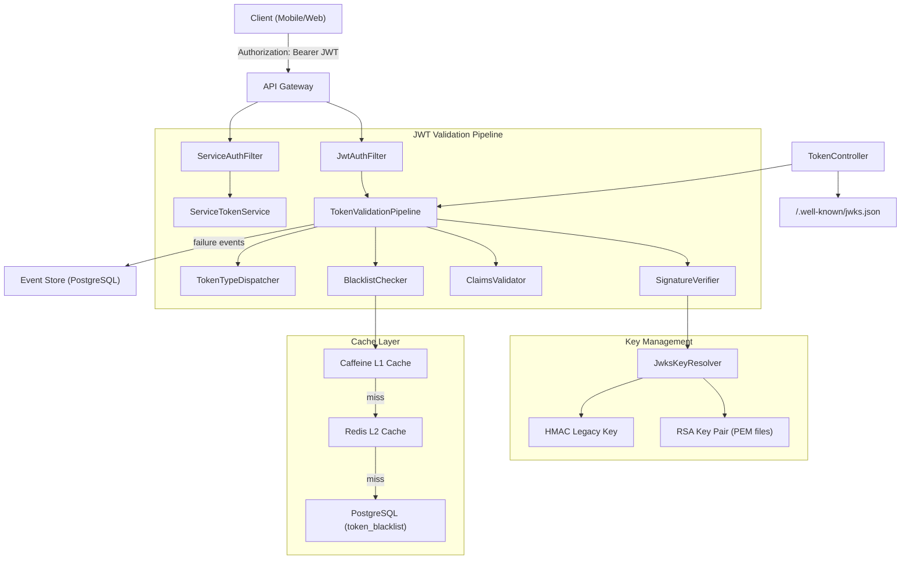
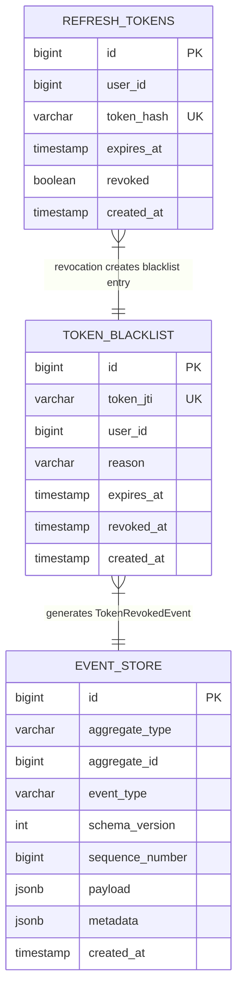
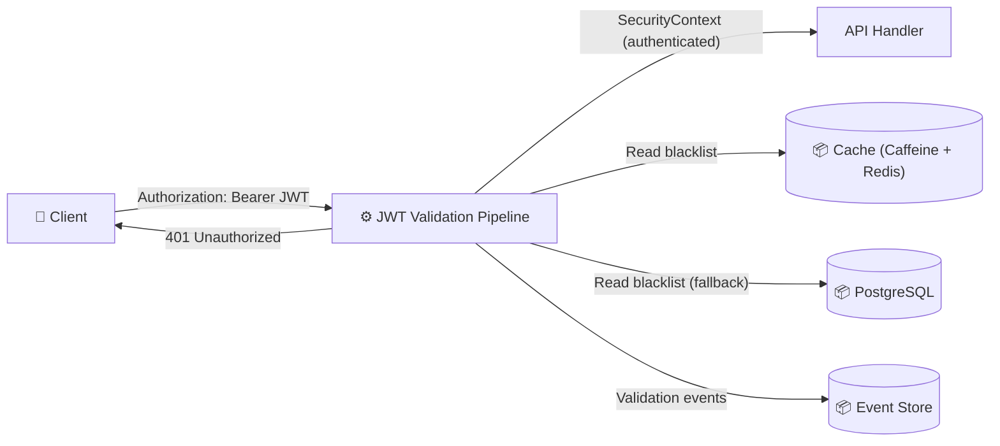
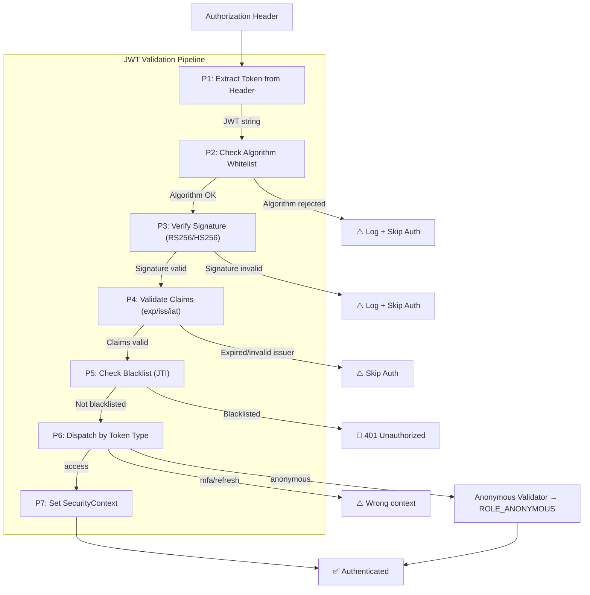
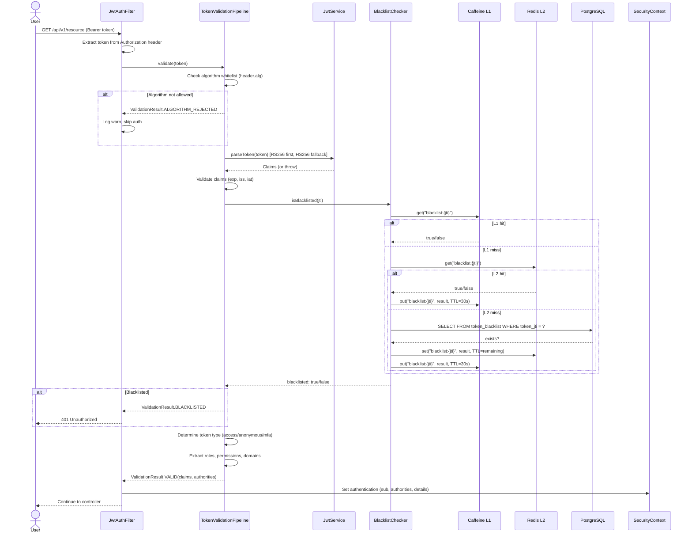
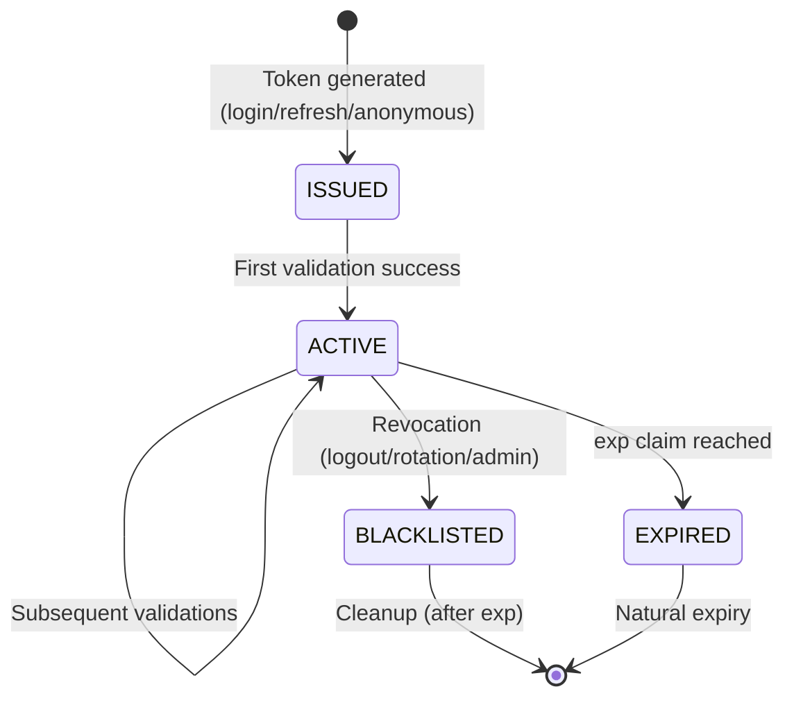
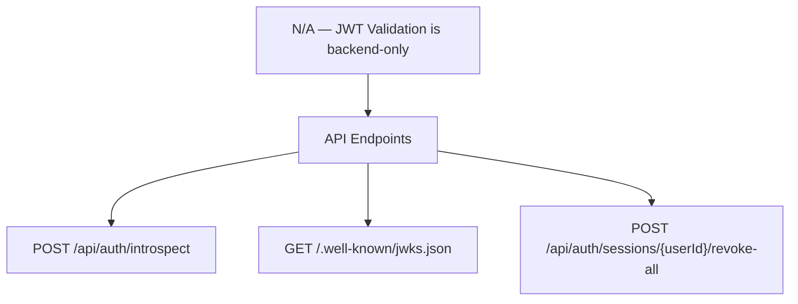
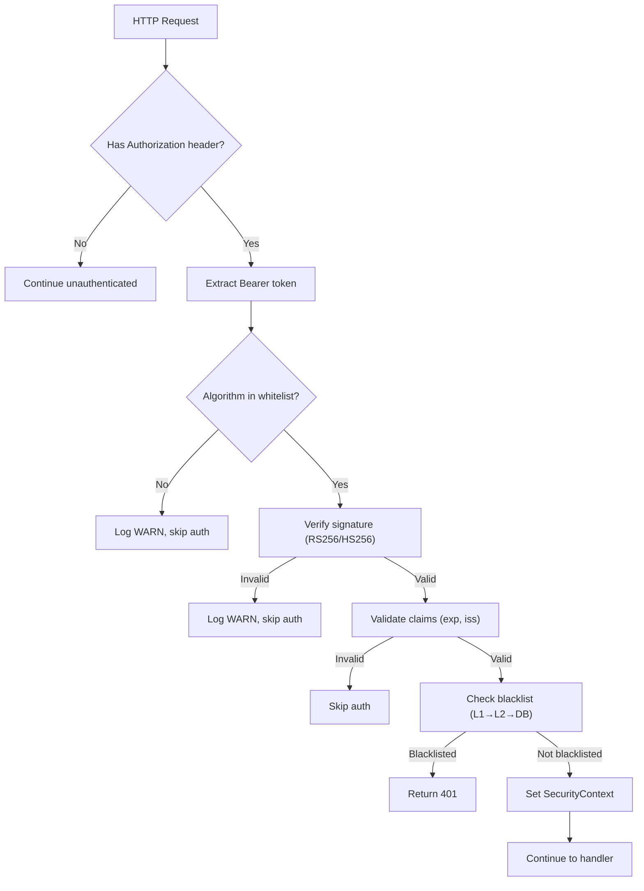

# Đặc tả kỹ thuật: JWT Token Validation

> Technical specification chi tiết — thiết kế để agent có thể đọc và dev code trực tiếp.

---

## 1. Tổng quan hệ thống (System Overview)

### 1.1 Kiến trúc tổng thể



### 1.2 Technology Stack

| Layer | Technology | Version | Ghi chú |
|-------|-----------|---------|---------|
| Language | Kotlin | 2.x | JVM 21+ |
| Framework | Spring Boot | 3.x | Spring Security 6.x |
| JWT Library | io.jsonwebtoken:jjwt | 0.12.x | api + impl + jackson modules |
| Database | PostgreSQL | 16.x | token_blacklist, event_store tables |
| L1 Cache | Caffeine | 3.x | In-process, sub-ms lookup |
| L2 Cache | Redis | 7.x | Distributed, via base-cache-starter |
| Event Sourcing | eventsourcing-utils | 0.0.1-SNAPSHOT | Custom event store |
| Base Module | base-core | 0.0.1-SNAPSHOT | Auto-config for cache, security, data |

### 1.3 Dependencies & Integrations

| Dependency | Type | Purpose | Interface |
|-----------|------|---------|-----------|
| base-security-starter | Internal (base-core) | Security auto-configuration | Spring beans |
| base-cache-starter | Internal (base-core) | TwoLevelCacheManager (Caffeine + Redis) | CacheManager bean |
| eventsourcing-utils | Internal | EventStorePort for event persistence | Port interface |
| PostgreSQL | Infrastructure | token_blacklist, event_store persistence | JPA Repository |
| Redis | Infrastructure | Distributed blacklist cache, session store | Spring Data Redis |

---

## 2. Lược đồ dữ liệu (Data Schema)

### 2.1 Entity-Relationship Diagram



### 2.2 Bảng chi tiết Entity

#### Entity: token_blacklist (existing — no changes needed)

| Field | Type | Constraint | Default | Mô tả |
|-------|------|-----------|---------|--------|
| `id` | `BIGINT` | PK, Snowflake | - | Primary key |
| `token_jti` | `VARCHAR(255)` | NOT NULL, UNIQUE | - | JWT ID being blacklisted |
| `user_id` | `BIGINT` | NOT NULL | - | Owner of the blacklisted token |
| `reason` | `VARCHAR(100)` | NULLABLE | NULL | Revocation reason (LOGOUT, ROTATION, ADMIN, SECURITY) |
| `expires_at` | `TIMESTAMP` | NOT NULL | - | When blacklist entry can be cleaned up |
| `revoked_at` | `TIMESTAMP` | NOT NULL | `CURRENT_TIMESTAMP` | When token was revoked |

#### Indexes (existing)

| Index Name | Columns | Type | Purpose |
|-----------|---------|------|---------|
| `uk_token_blacklist_jti` | `token_jti` | UNIQUE | Fast JTI lookup |
| `idx_token_blacklist_expires` | `expires_at` | BTREE | Cleanup query |

#### New Event Types for Event Store

| Event Type | Aggregate Type | Payload Schema | When Recorded |
|------------|---------------|----------------|---------------|
| `iam.token.validation_failed` | `TOKEN` | `{userId, jti, reason, ipAddress, userAgent, tokenType}` | Signature invalid, expired, blacklisted, algorithm not allowed |
| `iam.token.validation_suspicious` | `TOKEN` | `{jti, reason, details, ipAddress}` | Algorithm confusion attempt, repeated failures from same IP |

### 2.3 Database Migration Scripts (draft)

```sql
-- No new tables needed — token_blacklist and event_store already exist.
-- Only new event types in event_store (schema-less JSONB payload).

-- Optional: index for validation failure event queries
CREATE INDEX IF NOT EXISTS idx_event_store_type_created
    ON event_store (event_type, created_at)
    WHERE event_type LIKE 'iam.token.validation%';
```

---

## 3. Luồng dữ liệu (Data Flow)

### 3.1 Data Flow Diagram — Level 0 (Context)



### 3.2 Data Flow Diagram — Level 1 (chi tiết)



### 3.3 Data Transformation Rules

| # | Input | Process | Output | Validation Rules |
|---|-------|---------|--------|-----------------|
| 1 | `Authorization: Bearer eyJ...` | Strip "Bearer " prefix | Raw JWT string | Must start with "Bearer ", non-empty after strip |
| 2 | JWT header `alg` | Check against whitelist {RS256, HS256} | Algorithm enum | Reject if not in set |
| 3 | JWT `roles` claim | Prefix each with "ROLE_" | List<SimpleGrantedAuthority> | May be empty list |
| 4 | JWT `permissions` claim | Prefix each with "PERM_" | List<SimpleGrantedAuthority> | May be empty list |
| 5 | JWT `sub` claim | Direct pass-through | Principal (userId string) | NOT NULL for access tokens |

---

## 4. Luồng xử lý (Processing Steps)

### 4.1 Sequence Diagram — UC-001 (Validate Access Token)



### 4.2 Bảng Step xử lý chi tiết

#### UC-001: Validate Access Token

| Step | Component | Action | Input | Output | Error Handling | Ghi chú |
|------|-----------|--------|-------|--------|---------------|---------|
| 1 | JwtAuthFilter | Extract Bearer token | Authorization header | Token string | No header → skip auth | OncePerRequestFilter |
| 2 | TokenValidationPipeline | Check algorithm whitelist | JWT header (pre-parse) | Allowed/Rejected | Rejected → log warn, skip | OWASP requirement |
| 3 | JwtService | Parse and verify signature | Token string | Claims | Exception → skip auth | RS256 primary, HS256 fallback |
| 4 | TokenValidationPipeline | Validate registered claims | Claims (exp, iss, iat) | Valid/Invalid | Expired → TokenExpiredException | |
| 5 | BlacklistChecker | Check JTI against blacklist | JTI string | Blacklisted yes/no | Cache miss → fallback to DB | Two-level cache |
| 6 | TokenValidationPipeline | Determine token type | `type` claim | TokenType enum | Unknown type → treat as access | Extensible |
| 7 | TokenValidationPipeline | Extract authorities | Claims | List<GrantedAuthority> | Empty roles → empty list | ROLE_ + PERM_ prefix |
| 8 | JwtAuthFilter | Set SecurityContext | Claims + authorities | Authentication | — | UsernamePasswordAuthenticationToken |

### 4.3 State Machine — Token Lifecycle



| Transition | From | To | Trigger | Guard Condition | Side Effect |
|-----------|------|-----|---------|----------------|------------|
| Issue | - | ISSUED | Login, refresh, anonymous session | Valid credentials | TokenIssuedEvent recorded |
| First Use | ISSUED | ACTIVE | First API request with token | Signature + claims valid | Validation timer recorded |
| Revoke | ACTIVE | BLACKLISTED | Logout, rotation, admin action | Token exists and not already blacklisted | TokenRevokedEvent recorded, blacklist entry created |
| Expire | ACTIVE | EXPIRED | exp claim in the past | Time > exp | Natural, no event |
| Cleanup | BLACKLISTED | - | Scheduled cleanup job | expires_at in the past | Row deleted from token_blacklist |

---

## 5. Luồng màn hình (Screen Flow)

### 5.1 Screen Map (Sitemap)



### 5.2 Chi tiết từng Screen

| Screen ID | Tên | Mục đích | Data hiển thị | User Actions | Navigation |
|-----------|-----|----------|--------------|-------------|-----------|
| N/A | — | JWT Validation has no UI screens | — | — | — |

### 5.3 Wireframe Description (text-based)

#### API Endpoints (no UI)
```
JWT Validation is a backend filter operation.
No screens needed.

Existing API endpoints:
  POST /api/auth/introspect       → Token introspection (RFC 7662)
  GET  /.well-known/jwks.json     → JWKS public keys
  POST /api/auth/sessions/{id}/revoke-all → Session revocation
```

---

## 6. API Specification

### 6.1 Endpoint List

| # | Method | Path | Description | Auth | Request Body | Response |
|---|--------|------|------------|------|-------------|----------|
| 1 | `POST` | `/api/auth/introspect` | Token introspection (RFC 7662) | JWT (authenticated) | `IntrospectionRequest` | `IntrospectionResponse` |
| 2 | `GET` | `/.well-known/jwks.json` | JWKS public keys | None (public) | - | `JWKSResponse` |
| 3 | `POST` | `/api/auth/sessions/{userId}/revoke-all` | Revoke all sessions for user | JWT (ADMIN) | - | `RevokeResponse` |

### 6.2 Request/Response chi tiết

#### POST /api/auth/introspect

**Request:**
```json
{
  "token": "string (required, JWT token to introspect)"
}
```

**Response (200 OK — active):**
```json
{
  "active": true,
  "sub": "12345",
  "username": "john.doe",
  "roles": ["ADMIN", "USER"],
  "permissions": ["bookings:read", "bookings:create"],
  "exp": 1720700400,
  "iat": 1720699500,
  "iss": "auth-service",
  "jti": "550e8400-e29b-41d4-a716-446655440000"
}
```

**Response (200 OK — inactive):**
```json
{
  "active": false
}
```

#### GET /.well-known/jwks.json

**Response (200 OK):**
```json
{
  "keys": [
    {
      "kty": "RSA",
      "kid": "auth-service-key-1",
      "alg": "RS256",
      "use": "sig",
      "n": "base64url-encoded-modulus",
      "e": "AQAB"
    }
  ]
}
```

### 6.3 Error Response Format (RFC 7807)

| HTTP Status | Error Type | Khi nào |
|-------------|-----------|---------|
| 401 | Unauthorized | Token expired, invalid signature, blacklisted |
| 403 | Forbidden | Insufficient permissions, unregistered service |
| 429 | Too Many Requests | Rate limit exceeded |

---

## 7. Security Considerations

### 7.1 Authentication Flow



### 7.2 Authorization Matrix

| Role | Introspect (UC-004) | Revoke All (UC-005) | JWKS (UC-008) |
|------|:---:|:---:|:---:|
| Admin | ✅ | ✅ | ✅ (public) |
| User | ✅ (own tokens) | ❌ | ✅ (public) |
| Anonymous | ❌ | ❌ | ✅ (public) |
| Service | ✅ (via internal) | ❌ | ✅ (public) |

### 7.3 Data Protection

- **Private keys**: PEM files on filesystem, never in code or config properties
- **Token hashing**: Refresh tokens stored as SHA-256 hashes, never raw
- **JTI exposure**: Only JTI (UUID) is stored in blacklist, not full token
- **Algorithm confusion prevention**: Explicit whitelist enforcement before signature verification
- **Error messages**: Generic errors (AUTH_003) — never leak signature verification details

---

## 8. Performance Requirements

| Metric | Target | Measurement Method |
|--------|--------|-------------------|
| Validation latency P95 (cache hit) | < 5ms | Micrometer timer: `auth.token.validation.duration` |
| Validation latency P95 (cache miss) | < 50ms | Micrometer timer |
| Blacklist lookup P95 | < 2ms (L1), < 10ms (L2) | Micrometer timer: `auth.blacklist.check.duration` |
| Cache hit ratio (L1) | > 80% | Caffeine stats |
| Cache hit ratio (L2) | > 95% | Redis metrics |
| Throughput | > 10,000 validations/sec | K6 load test |
| JWKS endpoint response | < 10ms (cached) | Response timer |

---

## 9. Agent Implementation Notes

> **Section này dành cho AI agent** — chỉ rõ code cần tạo để agent dev trực tiếp.

### 9.1 Classes to Create

| # | Class | Package | Type | Extends/Implements | Mô tả |
|---|-------|---------|------|-------------------|--------|
| 1 | `TokenValidationPipeline` | `auth.application.validation` | @Component | — | Central validation orchestrator: alg check → sig verify → claims → blacklist → type |
| 2 | `TokenValidationResult` | `auth.application.validation` | sealed class | — | Validation result: Valid(claims, authorities) / Invalid(reason) |
| 3 | `BlacklistChecker` | `auth.application.validation` | @Component | — | Two-level cache blacklist checker (Caffeine L1 → Redis L2 → DB) |
| 4 | `TokenTypeDispatcher` | `auth.application.validation` | @Component | — | Dispatches to type-specific validators based on `type` claim |
| 5 | `TokenTypeValidator` | `auth.application.validation` | interface | — | Interface for type-specific validation (AccessTokenValidator, AnonymousTokenValidator) |
| 6 | `AccessTokenValidator` | `auth.application.validation` | @Component | TokenTypeValidator | Validates access tokens — extracts roles, permissions, domains |
| 7 | `AnonymousTokenValidator` | `auth.application.validation` | @Component | TokenTypeValidator | Validates anonymous tokens — checks session exists |
| 8 | `TokenValidationFailedEvent` | `auth.domain.event` | data class | DomainEvent | Event for failed validations (security audit) |
| 9 | `AlgorithmWhitelist` | `auth.application.validation` | object | — | Enum/set of allowed JWT algorithms |

### 9.2 Classes to Modify

| # | Class | Package | Change | Reason |
|---|-------|---------|--------|--------|
| 1 | `JwtAuthFilter` | `shared.security` | Delegate to `TokenValidationPipeline` instead of inline logic | Centralize validation |
| 2 | `JwtService` | `auth.application` | Add algorithm whitelist check in `parseToken()` | OWASP requirement |
| 3 | `TokenController` | `auth.adapter.in.web` | Use `TokenValidationPipeline` for introspection | Consistency |

### 9.3 Pattern References

| Pattern | Reference | Ghi chú |
|---------|----------|---------|
| Clean Architecture | Hexagonal Architecture with ports/adapters | Existing pattern in auth-service |
| CQRS Command Handler | `CommandHandler<C, R>` interface | From eventsourcing-utils |
| Two-Level Cache | `TwoLevelCacheManager` from base-cache-starter | Already in SecurityConfig |
| Domain Event | `DomainEvent` interface with `eventType` | From auth.application.port.out |
| Base Entity | `SnowflakePersistentAuditableEntity` | From base-core |
| Error Handling | `AuthErrorCode` enum with `ErrorCodeBase` | Existing pattern |

### 9.4 Integration Points

| Integration | Type | Protocol | Endpoint | Data Format |
|------------|------|----------|----------|------------|
| TokenBlacklistRepository | Sync | JPA | `existsByTokenJti(jti)` | Boolean |
| EventStorePort | Sync | JPA | `save(event)` | JSON (Event entity) |
| Redis | Sync | Spring Data Redis | `opsForValue().get/set` | String |
| Caffeine Cache | Sync | In-process | `cache.getIfPresent/put` | Object |

### 9.5 Test Cases (high-level)

| # | Test | Type | Scenario | Expected |
|---|------|------|----------|----------|
| 1 | Valid access token | Integration | RS256 signed, not expired, not blacklisted | SecurityContext set with roles/permissions |
| 2 | Expired token | Unit | Token with past exp | No SecurityContext, request proceeds unauthenticated |
| 3 | Blacklisted token | Integration | Valid signature but JTI in blacklist | 401 Unauthorized |
| 4 | Algorithm confusion | Unit | Token with alg=HS256 but signed with RS256 public key | Rejected, warning logged |
| 5 | Invalid signature | Unit | Tampered token payload | No SecurityContext |
| 6 | Wrong issuer | Unit | Token with iss != "auth-service" | Rejected |
| 7 | Anonymous token on auth endpoint | Integration | type=anonymous on /api/v1/protected | Not ROLE_ANONYMOUS authority match |
| 8 | Service token validation | Integration | Valid HMAC service token on /api/internal/ | ROLE_SERVICE set |
| 9 | Introspection - active token | Integration | POST valid token to /api/auth/introspect | {active: true, claims...} |
| 10 | Introspection - expired token | Integration | POST expired token | {active: false} |
| 11 | Introspection - blacklisted token | Integration | POST blacklisted token | {active: false} |
| 12 | L1 cache hit | Unit | JTI checked twice within L1 TTL | Second check hits Caffeine, no Redis/DB |
| 13 | L2 cache hit | Integration | JTI checked after L1 eviction | Hits Redis, populates L1 |
| 14 | DB fallback | Integration | Redis unavailable | Falls back to PostgreSQL |
| 15 | JWKS endpoint | Integration | GET /.well-known/jwks.json | Returns RSA public key with kid |
| 16 | HMAC legacy token | Unit | HS256 signed token within migration window | Accepted with warning log |
| 17 | Validation failure event | Integration | Invalid signature attempt | TokenValidationFailedEvent recorded in event store |

---

> **Traceability**: Research Brief → Business Analysis → **Technical Spec** → Implementation
> **Ready for**: `/wf_pre_openspec` hoặc `/wf_openspec` hoặc direct coding
