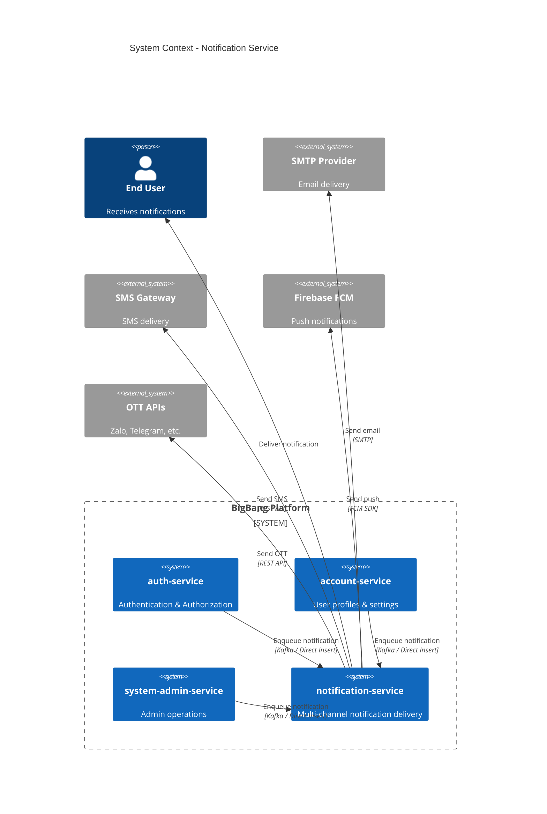
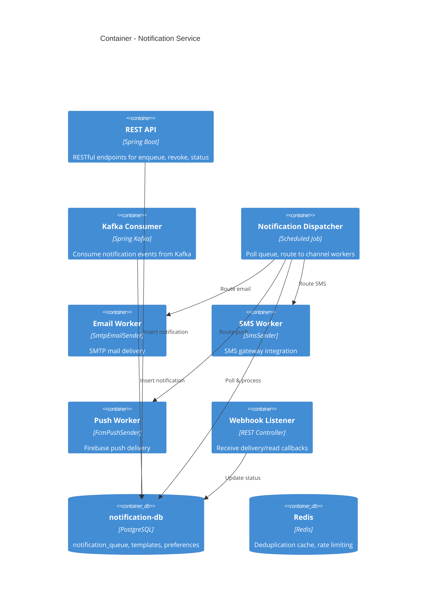
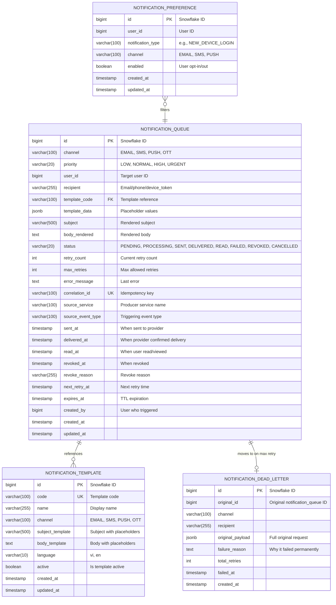
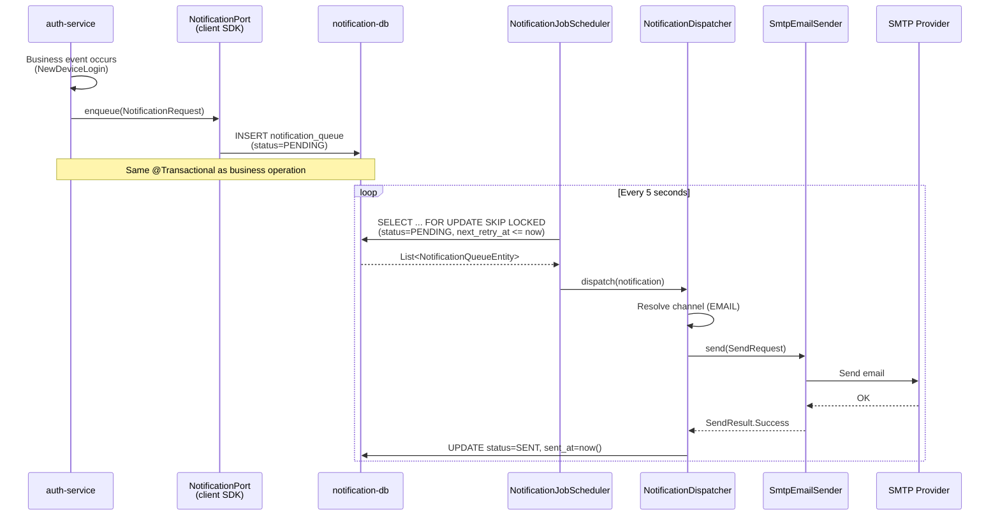
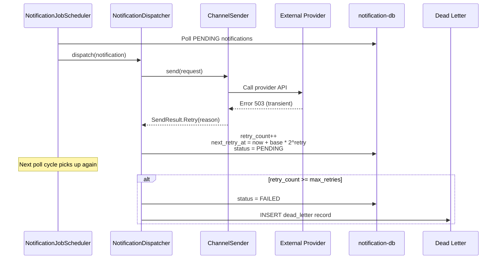
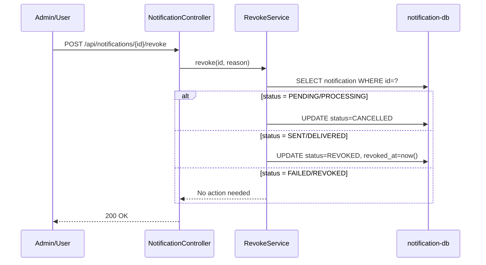

# Technical Specification: Notification Service

## 1. Architecture Overview

### 1.1 System Context



### 1.2 Container Diagram



## 2. Clean Architecture Layers

```
notification-service/
├── domain/                          # Domain layer (pure Kotlin)
│   ├── model/
│   │   ├── NotificationChannel.kt   # Enum: EMAIL, SMS, PUSH, OTT
│   │   ├── NotificationStatus.kt    # Enum: PENDING → ... → READ
│   │   ├── NotificationPriority.kt  # Enum: LOW, NORMAL, HIGH, URGENT
│   │   └── NotificationRequest.kt   # Value object for notification creation
│   └── event/
│       └── NotificationEvent.kt     # Domain events
│
├── application/                     # Application layer (use cases)
│   ├── port/
│   │   ├── in/
│   │   │   ├── EnqueueNotificationUseCase.kt    # UC-001
│   │   │   ├── RevokeNotificationUseCase.kt     # UC-004
│   │   │   └── QueryNotificationUseCase.kt      # UC-003, UC-005
│   │   └── out/
│   │       ├── NotificationQueuePort.kt          # DB operations
│   │       ├── NotificationSender.kt             # Strategy interface
│   │       ├── TemplatePort.kt                   # Template rendering
│   │       └── DeliveryWebhookPort.kt            # Webhook processing
│   ├── service/
│   │   ├── NotificationEnqueueService.kt         # Enqueue logic
│   │   ├── NotificationDispatcherService.kt      # Poll + route
│   │   ├── NotificationRevokeService.kt          # Revoke logic
│   │   └── TemplateRenderService.kt              # Template rendering
│   └── scheduler/
│       ├── NotificationJobScheduler.kt            # @Scheduled polling
│       └── NotificationCleanupScheduler.kt        # Cleanup old records
│
├── adapter/
│   ├── in/
│   │   ├── web/
│   │   │   ├── NotificationController.kt          # REST API
│   │   │   └── WebhookController.kt               # Provider callbacks
│   │   └── kafka/
│   │       └── NotificationKafkaConsumer.kt        # Kafka consumer
│   ├── out/
│   │   ├── persistence/
│   │   │   ├── entity/
│   │   │   │   ├── NotificationQueueEntity.kt     # Unified queue table
│   │   │   │   ├── NotificationTemplateEntity.kt  # Templates
│   │   │   │   └── NotificationPreferenceEntity.kt # User preferences
│   │   │   ├── repository/
│   │   │   │   ├── NotificationQueueRepository.kt
│   │   │   │   ├── NotificationTemplateRepository.kt
│   │   │   │   └── NotificationPreferenceRepository.kt
│   │   │   └── NotificationPersistenceAdapter.kt
│   │   └── sender/                                 # Channel implementations
│   │       ├── SmtpEmailSender.kt
│   │       ├── TwilioSmsSender.kt
│   │       ├── FcmPushSender.kt
│   │       └── ZaloOttSender.kt
│   └── config/
│       └── NotificationProperties.kt
│
└── shared/
    └── config/
        └── NotificationServiceProperties.kt
```

## 3. Database Schema (notification-db)

### 3.1 ERD Diagram



### 3.2 DDL (Flyway Migration V1)

```sql
-- V1__notification_service_init.sql

-- 1. Unified notification queue
CREATE TABLE notification_queue (
    id                  BIGINT PRIMARY KEY,
    channel             VARCHAR(100) NOT NULL,
    priority            VARCHAR(20) NOT NULL DEFAULT 'NORMAL',
    user_id             BIGINT,
    recipient           VARCHAR(255) NOT NULL,
    template_code       VARCHAR(100) NOT NULL,
    template_data       JSONB NOT NULL DEFAULT '{}',
    subject             VARCHAR(500),
    body_rendered       TEXT,
    status              VARCHAR(20) NOT NULL DEFAULT 'PENDING',
    retry_count         INT NOT NULL DEFAULT 0,
    max_retries         INT NOT NULL DEFAULT 3,
    error_message       TEXT,
    correlation_id      VARCHAR(100) NOT NULL,
    source_service      VARCHAR(100) NOT NULL,
    source_event_type   VARCHAR(100),
    sent_at             TIMESTAMP,
    delivered_at        TIMESTAMP,
    read_at             TIMESTAMP,
    revoked_at          TIMESTAMP,
    revoke_reason       VARCHAR(255),
    next_retry_at       TIMESTAMP,
    expires_at          TIMESTAMP,
    created_by          BIGINT,
    created_at          TIMESTAMP NOT NULL DEFAULT NOW(),
    updated_at          TIMESTAMP NOT NULL DEFAULT NOW()
);

CREATE UNIQUE INDEX uq_notification_correlation ON notification_queue(correlation_id);
CREATE INDEX idx_notification_status_retry ON notification_queue(status, next_retry_at);
CREATE INDEX idx_notification_channel_status ON notification_queue(channel, status);
CREATE INDEX idx_notification_user ON notification_queue(user_id, created_at DESC);
CREATE INDEX idx_notification_created ON notification_queue(created_at);

-- 2. Notification templates
CREATE TABLE notification_template (
    id                  BIGINT PRIMARY KEY,
    code                VARCHAR(100) NOT NULL UNIQUE,
    name                VARCHAR(255) NOT NULL,
    channel             VARCHAR(100) NOT NULL DEFAULT 'EMAIL',
    subject_template    VARCHAR(500),
    body_template       TEXT NOT NULL,
    language            VARCHAR(10) NOT NULL DEFAULT 'vi',
    active              BOOLEAN NOT NULL DEFAULT TRUE,
    created_at          TIMESTAMP NOT NULL DEFAULT NOW(),
    updated_at          TIMESTAMP NOT NULL DEFAULT NOW()
);

-- 3. User notification preferences
CREATE TABLE notification_preference (
    id                  BIGINT PRIMARY KEY,
    user_id             BIGINT NOT NULL,
    notification_type   VARCHAR(100) NOT NULL,
    channel             VARCHAR(100) NOT NULL,
    enabled             BOOLEAN NOT NULL DEFAULT TRUE,
    created_at          TIMESTAMP NOT NULL DEFAULT NOW(),
    updated_at          TIMESTAMP NOT NULL DEFAULT NOW()
);

CREATE UNIQUE INDEX uq_pref_user_type_channel 
    ON notification_preference(user_id, notification_type, channel);

-- 4. Dead letter queue
CREATE TABLE notification_dead_letter (
    id                  BIGINT PRIMARY KEY,
    original_id         BIGINT NOT NULL,
    channel             VARCHAR(100) NOT NULL,
    recipient           VARCHAR(255) NOT NULL,
    original_payload    JSONB NOT NULL,
    failure_reason      TEXT,
    total_retries       INT NOT NULL DEFAULT 0,
    failed_at           TIMESTAMP NOT NULL,
    created_at          TIMESTAMP NOT NULL DEFAULT NOW()
);

CREATE INDEX idx_dead_letter_created ON notification_dead_letter(created_at);
```

## 4. Key Interfaces (Domain Ports)

### 4.1 NotificationSender — Strategy Pattern (Core Extension Point)

```kotlin
/**
 * Strategy interface for multi-channel notification delivery.
 * Each channel implements this interface. New channels are added
 * by creating a new implementation — no dispatcher changes needed.
 */
interface NotificationSender {
    /** Which channel this sender handles. */
    fun channel(): NotificationChannel
    
    /** Send notification to recipient. Returns delivery result. */
    fun send(request: SendRequest): SendResult
}

data class SendRequest(
    val notificationId: Long,
    val recipient: String,
    val subject: String?,
    val body: String,
    val channel: NotificationChannel,
    val metadata: Map<String, String> = emptyMap()
)

sealed class SendResult {
    data class Success(val providerMessageId: String? = null) : SendResult()
    data class Retry(val reason: String, val delaySeconds: Long? = null) : SendResult()
    data class Failed(val reason: String, val permanent: Boolean = false) : SendResult()
}
```

### 4.2 NotificationPort — Client SDK Interface

```kotlin
/**
 * Port interface for producer services (notification-client library).
 * Implementations: DirectInsertAdapter, KafkaAdapter, RestAdapter.
 */
interface NotificationPort {
    fun enqueue(request: NotificationRequest): Long // returns notification ID
}

data class NotificationRequest(
    val channel: NotificationChannel,
    val recipient: String,
    val templateCode: String,
    val templateData: Map<String, Any> = emptyMap(),
    val userId: Long? = null,
    val priority: NotificationPriority = NotificationPriority.NORMAL,
    val correlationId: String = UUID.randomUUID().toString(),
    val sourceService: String,
    val sourceEventType: String? = null,
    val expiresAt: Instant? = null,
    val createdBy: Long? = null
)
```

## 5. Sequence Diagrams

### 5.1 Enqueue → Deliver (Happy Path)



### 5.2 Retry Flow



### 5.3 Revoke Flow



## 6. API Endpoints

### 6.1 REST API

| Method | Endpoint | Description | Priority |
|--------|----------|-------------|----------|
| POST | `/api/v1/notifications` | Enqueue notification | P0 |
| POST | `/api/v1/notifications/batch` | Batch enqueue | P1 |
| GET | `/api/v1/notifications/{id}` | Get notification status | P1 |
| GET | `/api/v1/notifications` | Query notifications (filter by user, status, channel) | P1 |
| POST | `/api/v1/notifications/{id}/revoke` | Revoke/unsend notification | P2 |
| POST | `/api/v1/notifications/{id}/retry` | Manual retry failed notification | P2 |
| POST | `/api/v1/webhooks/delivery` | Provider delivery callback | P1 |
| POST | `/api/v1/webhooks/read` | Provider read callback | P2 |
| GET | `/api/v1/notifications/report` | Delivery statistics report | P2 |

### 6.2 Kafka Topics

| Topic | Direction | Description |
|-------|-----------|-------------|
| `notification.enqueue` | Consumer | Receive notification requests from producers |
| `notification.status` | Producer | Emit status change events |
| `notification.dead-letter` | Producer | Emit permanently failed notifications |

## 7. Configuration

```yaml
# application.yml for notification-service
app:
  notification:
    queue:
      poll-interval-ms: 5000
      batch-size: 50
      max-retries: 3
      base-retry-delay-seconds: 30
      cleanup-after-days: 30
    channels:
      email:
        enabled: true
        provider: smtp  # smtp | sendgrid | ses
      sms:
        enabled: false
        provider: twilio  # twilio | nexmo
      push:
        enabled: false
        provider: fcm  # fcm | apns
      ott:
        enabled: false
        providers:
          zalo:
            enabled: false
          telegram:
            enabled: false

spring:
  datasource:
    url: jdbc:postgresql://localhost:5432/notification_db  # Separate DB!
```

## 8. Client SDK (notification-client)

### 8.1 Module Structure

```
notification-client/  (shared library, published to Maven local)
├── build.gradle.kts
├── src/main/kotlin/com/ntt/notification/client/
│   ├── NotificationPort.kt              # Port interface
│   ├── NotificationRequest.kt           # Request DTO
│   ├── NotificationChannel.kt           # Channel enum
│   ├── NotificationPriority.kt          # Priority enum
│   ├── adapter/
│   │   ├── DirectInsertNotificationAdapter.kt  # Same-DB insert
│   │   ├── KafkaNotificationAdapter.kt          # Kafka publish
│   │   └── RestNotificationAdapter.kt           # REST API call
│   └── config/
│       └── NotificationClientAutoConfiguration.kt  # Spring Boot auto-config
```

### 8.2 Usage in auth-service (After Migration)

```kotlin
// auth-service build.gradle.kts
dependencies {
    implementation("com.ntt:notification-client:0.0.1-SNAPSHOT")
}

// NewDeviceMailHandler.kt (after migration)
@Component
class NewDeviceMailHandler(
    private val notificationPort: NotificationPort  // Injected via auto-config
) {
    @TransactionalEventListener(phase = TransactionPhase.AFTER_COMMIT)
    fun handleNewDeviceLogin(event: NewDeviceLoginEvent) {
        notificationPort.enqueue(
            NotificationRequest(
                channel = NotificationChannel.EMAIL,
                recipient = event.email ?: return,
                templateCode = "NEW_DEVICE_LOGIN",
                templateData = mapOf(
                    "userName" to event.username,
                    "deviceName" to event.deviceName,
                    // ... other fields
                ),
                userId = event.userId,
                sourceService = "auth-service",
                sourceEventType = "NEW_DEVICE_LOGIN"
            )
        )
    }
}
```

## 9. Implementation Notes (Agent Guidelines)

### 9.1 Files to Migrate from auth-service

| Source (auth-service) | Target (notification-service) | Action |
|----------------------|-------------------------------|--------|
| MailQueueEntity | NotificationQueueEntity | Refactor + extend |
| MailTemplateEntity | NotificationTemplateEntity | Refactor |
| MailStatus | NotificationStatus | Extend (add DELIVERED, READ, REVOKED, CANCELLED) |
| MailQueueService | NotificationEnqueueService | Refactor |
| MailJobScheduler | NotificationJobScheduler | Refactor + Strategy dispatch |
| MailQueueRepository | NotificationQueueRepository | Refactor |
| MailTemplateRepository | NotificationTemplateRepository | Refactor |
| SecurityProperties.MailProperties | NotificationProperties | Extract + extend |

### 9.2 Files to Remove from auth-service (After Migration)

| File | Replacement |
|------|-------------|
| MailQueueEntity.kt | notification-client SDK |
| MailTemplateEntity.kt | In notification-service |
| MailStatus.kt | In notification-service |
| MailQueueService.kt | NotificationPort from client SDK |
| MailJobScheduler.kt | In notification-service |
| MailQueueRepository.kt | In notification-service |
| MailTemplateRepository.kt | In notification-service |
| V16__create_mail_queue.sql | In notification-service migrations |

### 9.3 Files to Keep in auth-service (NOT migrated)

| File | Reason |
|------|--------|
| EventOutboxEntity.kt | Used for domain event outbox (non-notification) |
| OutboxPoller.kt | Kafka event relay (non-notification) |
| EventService.kt | Event sourcing (non-notification) |
| NewDeviceMailHandler.kt | Remains, but uses NotificationPort |
| KafkaNotificationGateway.kt | Can be replaced by NotificationPort |
| NotificationGateway.kt | Replaced by NotificationPort |

### 9.4 Extension Pattern

Adding a new channel (e.g., Telegram):
1. Create `TelegramOttSender` implementing `NotificationSender`
2. Return `NotificationChannel.OTT` from `channel()`
3. Register as `@Component`
4. Done — dispatcher auto-discovers via Spring DI

No changes to dispatcher, controller, or scheduler code.
