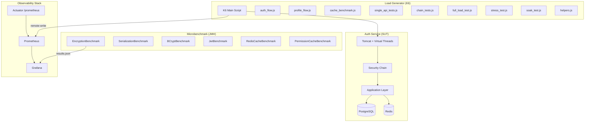
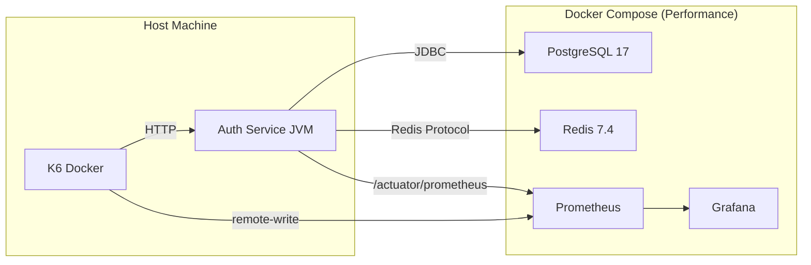
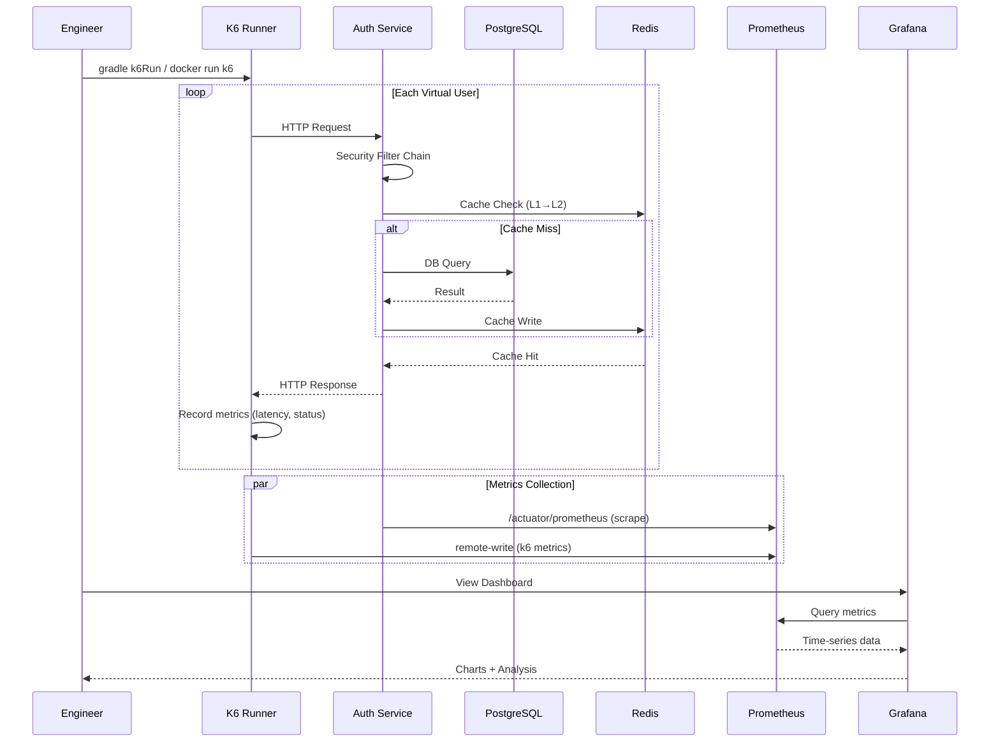
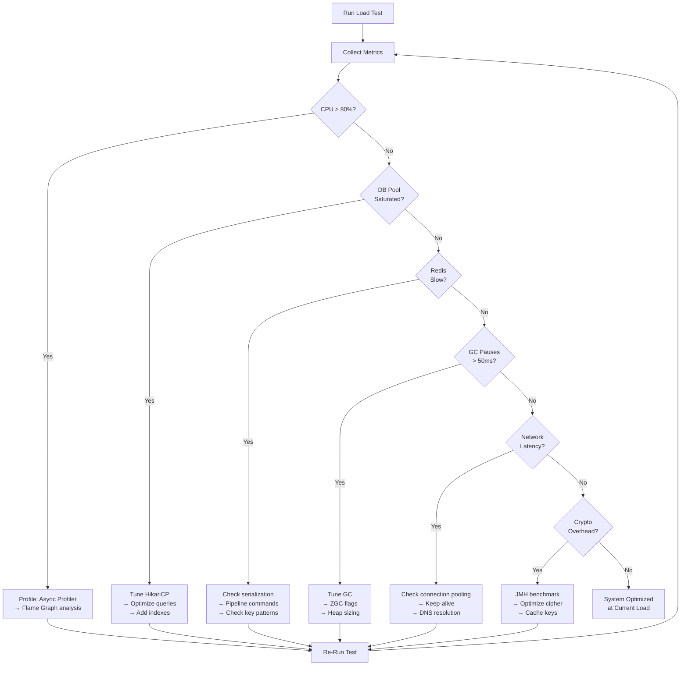
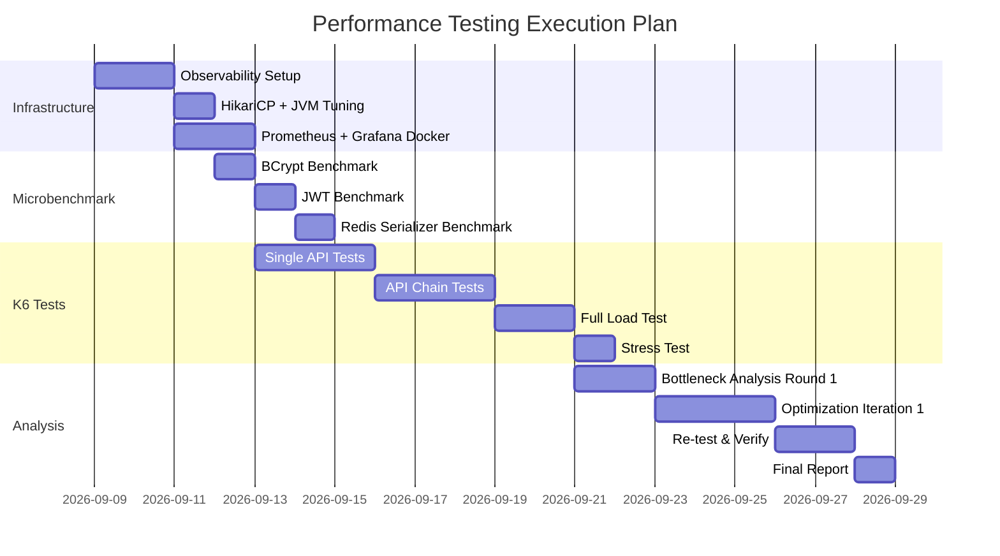

# Technical Specification — Performance Benchmark & TPS Testing

## 1. Architecture Overview

### 1.1 Performance Testing Architecture



### 1.2 Test Environment Architecture



---

## 2. Data Schema — Performance Metrics

### 2.1 K6 Custom Metrics

```javascript
// Custom metrics cho performance tracking
import { Counter, Trend, Rate, Gauge } from 'k6/metrics';

// Per-endpoint trends
const loginLatency = new Trend('login_latency', true);
const profileLatency = new Trend('profile_latency', true);
const refreshLatency = new Trend('refresh_latency', true);

// Chain-level metrics
const authChainDuration = new Trend('auth_chain_duration', true);
const chainSuccessRate = new Rate('chain_success_rate');

// Business metrics
const tpsCounter = new Counter('total_transactions');
const activeUsers = new Gauge('active_virtual_users');
```

### 2.2 Prometheus Metrics (Spring Boot Actuator)

| Metric | Type | Description |
|--------|------|-------------|
| `http_server_requests_seconds` | Histogram | Request latency per endpoint |
| `hikaricp_connections_active` | Gauge | Active DB connections |
| `hikaricp_connections_pending` | Gauge | Threads waiting for connection |
| `hikaricp_connections_timeout_total` | Counter | Connection timeout count |
| `jvm_memory_used_bytes` | Gauge | JVM memory usage |
| `jvm_gc_pause_seconds` | Summary | GC pause duration |
| `jvm_threads_live_threads` | Gauge | Active thread count |
| `process_cpu_usage` | Gauge | Process CPU usage |
| `spring_data_redis_commands_seconds` | Histogram | Redis command latency |
| `cache_gets_total` | Counter | Cache hit/miss count |

---

## 3. Data Flow — Performance Testing Pipeline

### 3.1 Single Test Run Flow



### 3.2 Bottleneck Analysis Flow



---

## 4. Screen Flow — Grafana Dashboards

### 4.1 Dashboard Layout

```
┌─────────────────────────────────────────────────────────────┐
│                    PERFORMANCE OVERVIEW                       │
│  ┌──────────────┐ ┌──────────────┐ ┌──────────────┐         │
│  │ TPS: 523     │ │ P95: 145ms   │ │ Error: 0.02% │         │
│  └──────────────┘ └──────────────┘ └──────────────┘         │
├─────────────────────────────────────────────────────────────┤
│ Row 1: Request Performance                                   │
│ ┌──────────────────────────┐ ┌──────────────────────────┐   │
│ │ TPS Over Time            │ │ Latency Percentiles      │   │
│ │ (line chart)             │ │ p50/p95/p99 (line chart) │   │
│ └──────────────────────────┘ └──────────────────────────┘   │
├─────────────────────────────────────────────────────────────┤
│ Row 2: Resource Utilization                                  │
│ ┌──────────────┐ ┌──────────────┐ ┌──────────────┐         │
│ │ CPU Usage    │ │ JVM Memory   │ │ GC Pauses    │         │
│ │ (gauge+line) │ │ (area chart) │ │ (bar chart)  │         │
│ └──────────────┘ └──────────────┘ └──────────────┘         │
├─────────────────────────────────────────────────────────────┤
│ Row 3: Infrastructure                                        │
│ ┌──────────────┐ ┌──────────────┐ ┌──────────────┐         │
│ │ HikariCP     │ │ Redis        │ │ Thread Pool  │         │
│ │ Pool Status  │ │ Commands/s   │ │ Active/Queue │         │
│ └──────────────┘ └──────────────┘ └──────────────┘         │
├─────────────────────────────────────────────────────────────┤
│ Row 4: Per-Endpoint Breakdown                                │
│ ┌──────────────────────────────────────────────────────┐    │
│ │ Endpoint Latency Heatmap (sorted by p95)             │    │
│ │ /auth/login: ████████░░ 180ms                        │    │
│ │ /profiles/me: ███░░░░░░░ 45ms                        │    │
│ │ /auth/refresh: ████░░░░░░ 85ms                       │    │
│ │ ...                                                   │    │
│ └──────────────────────────────────────────────────────┘    │
└─────────────────────────────────────────────────────────────┘
```

---

## 5. API Endpoints — Test Coverage Plan

### 5.1 All Endpoints to Benchmark

| # | Controller | Method | Endpoint | Test Type | Priority |
|---|-----------|--------|----------|-----------|----------|
| 1 | Token | POST | `/api/v1/auth/login` | Single + Chain | P0 |
| 2 | Token | POST | `/api/v1/auth/refresh` | Single + Chain | P0 |
| 3 | Token | POST | `/api/v1/auth/validate` | Single | P0 |
| 4 | Session | GET | `/api/v1/auth/sessions` | Single + Chain | P1 |
| 5 | Session | DELETE | `/api/v1/auth/sessions/{id}` | Chain | P1 |
| 6 | MFA | POST | `/api/v1/auth/mfa/setup` | Chain | P1 |
| 7 | MFA | POST | `/api/v1/auth/mfa/verify` | Chain | P0 |
| 8 | SSO | GET | `/api/v1/auth/sso/login` | Chain | P1 |
| 9 | SSO | POST | `/api/v1/auth/sso/callback` | Chain | P1 |
| 10 | Captcha | GET | `/api/v1/auth/captcha/challenge` | Single | P1 |
| 11 | KeyExchange | POST | `/api/v1/auth/keys/exchange` | Single + Chain | P1 |
| 12 | Anonymous | POST | `/api/v1/auth/anonymous/token` | Single | P1 |
| 13 | Anonymous | POST | `/api/v1/auth/anonymous/renew` | Chain | P2 |
| 14 | AccountLifecycle | POST | `/api/v1/auth/register` | Chain | P0 |
| 15 | Device | GET | `/api/v1/auth/devices` | Chain | P2 |
| 16 | AdminSession | GET | `/api/v1/admin/sessions` | Single | P2 |
| 17 | InternalAPI | POST | `/api/v1/internal/validate` | Single | P0 |
| 18 | EventStore | GET | `/api/v1/events` | Single | P2 |
| 19 | RateLimitAdmin | GET | `/api/v1/admin/rate-limits` | Single | P2 |
| 20 | RBAC | GET | `/api/v1/roles` | Single | P1 |
| 21 | RBAC | GET | `/api/v1/users` | Single | P1 |
| 22 | RolePermission | POST | `/api/v1/roles/{id}/permissions` | Chain | P1 |
| 23 | Policy | GET | `/api/v1/policies` | Single | P2 |

---

## 6. Implementation Notes

### 6.1 Docker Compose Extension for Observability

```yaml
# compose-perf.yaml — Extends compose.yaml
services:
  prometheus:
    image: prom/prometheus:v2.54.0
    container_name: auth-prometheus
    ports:
      - "9090:9090"
    volumes:
      - ./tests/perf/prometheus.yml:/etc/prometheus/prometheus.yml
    extra_hosts:
      - "host.docker.internal:host-gateway"

  grafana:
    image: grafana/grafana:11.2.0
    container_name: auth-grafana
    ports:
      - "3001:3000"
    environment:
      - GF_SECURITY_ADMIN_PASSWORD=admin
      - GF_AUTH_ANONYMOUS_ENABLED=true
    volumes:
      - ./tests/perf/grafana/provisioning:/etc/grafana/provisioning
      - grafana_data:/var/lib/grafana
    depends_on:
      - prometheus

volumes:
  grafana_data:
    driver: local
```

### 6.2 JVM Flags — Performance Profile

```properties
# gradle.properties hoặc JAVA_OPTS
JAVA_OPTS=-XX:+UseZGC \
  -XX:+ZGenerational \
  -Xms512m \
  -Xmx1024m \
  -XX:+AlwaysPreTouch \
  -Djdk.tracePinnedThreads=full \
  -XX:+HeapDumpOnOutOfMemoryError \
  -XX:HeapDumpPath=./heapdumps
```

### 6.3 Actuator Config Update

```yaml
# application-core-observability.yml — Updated
management:
  endpoints:
    web:
      exposure:
        include: health,info,metrics,prometheus
  endpoint:
    health:
      show-details: when-authorized
    prometheus:
      enabled: true
  metrics:
    tags:
      application: auth-service
    distribution:
      percentiles-histogram:
        http.server.requests: true
      percentiles:
        http.server.requests: 0.5,0.95,0.99
```

### 6.4 HikariCP Explicit Config

```yaml
# application-db.yml — Updated
spring:
  datasource:
    url: jdbc:postgresql://localhost:5432/auth_db
    username: auth_user
    password: auth_pass
    driver-class-name: org.postgresql.Driver
    hikari:
      maximum-pool-size: ${DB_POOL_MAX:10}
      minimum-idle: ${DB_POOL_MIN:10}
      connection-timeout: 30000
      idle-timeout: 600000
      max-lifetime: 1800000
      pool-name: AuthServicePool
      leak-detection-threshold: 30000
      data-source-properties:
        reWriteBatchedInserts: true
```

### 6.5 K6 Test File Structure

```
tests/
├── load/                    # Existing (keep)
│   ├── auth_flow.js
│   ├── cache_benchmark.js
│   ├── helpers.js
│   └── profile_flow.js
└── perf/                    # NEW
    ├── config/
    │   ├── thresholds.js    # Shared SLA definitions
    │   └── env.js           # Environment config
    ├── scenarios/
    │   ├── single/          # Per-API tests
    │   │   ├── login.js
    │   │   ├── refresh.js
    │   │   ├── validate.js
    │   │   ├── profile.js
    │   │   └── ...
    │   ├── chains/          # API chain tests
    │   │   ├── auth_basic.js
    │   │   ├── auth_mfa.js
    │   │   ├── registration.js
    │   │   └── sso.js
    │   └── system/          # Full system tests
    │       ├── full_load.js
    │       ├── stress.js
    │       └── soak.js
    ├── helpers/
    │   ├── auth.js          # Auth utilities
    │   ├── data.js          # Test data generators
    │   └── metrics.js       # Custom metrics
    ├── prometheus.yml       # Prometheus config
    ├── grafana/
    │   └── provisioning/
    │       ├── datasources/
    │       │   └── prometheus.yml
    │       └── dashboards/
    │           ├── perf-overview.json
    │           └── api-detail.json
    └── reports/             # Generated reports
        └── .gitkeep
```

### 6.6 JMH New Benchmarks

```kotlin
// src/jmh/kotlin/com/ntt/authservice/benchmark/

// 1. BCryptBenchmark.kt
@Benchmark
fun hashPassword(bh: Blackhole) {
    val hash = BCrypt.hashpw("password123", BCrypt.gensalt(12))
    bh.consume(hash)
}

// 2. JwtBenchmark.kt
@Benchmark
fun signJwtRS256(bh: Blackhole) {
    val token = Jwts.builder()
        .subject("user123")
        .signWith(privateKey, Jwts.SIG.RS256)
        .compact()
    bh.consume(token)
}

@Benchmark
fun verifyJwtRS256(bh: Blackhole) {
    val claims = Jwts.parser()
        .verifyWith(publicKey)
        .build()
        .parseSignedClaims(preSignedToken)
    bh.consume(claims)
}

// 3. RedisCacheBenchmark.kt — Compare serializers
@Benchmark
fun serializeWithJackson(bh: Blackhole) { ... }

@Benchmark
fun serializeWithJdk(bh: Blackhole) { ... }

@Benchmark
fun serializeWithKryo(bh: Blackhole) { ... }
```

---

## 7. Thresholds & SLA Definition

```javascript
// tests/perf/config/thresholds.js
export const SLA = {
    // Critical endpoints
    login: { p95: 200, p99: 500, errorRate: 0.01 },
    refresh: { p95: 150, p99: 300, errorRate: 0.01 },
    validate: { p95: 50, p99: 100, errorRate: 0.001 },
    profile: { p95: 100, p99: 200, errorRate: 0.01 },

    // CRUD endpoints
    crud: { p95: 500, p99: 1000, errorRate: 0.01 },

    // Chain flows
    authChain: { p95: 800, p99: 1500, errorRate: 0.01 },
    fullChain: { p95: 2000, p99: 3000, errorRate: 0.01 },

    // System-wide
    system: {
        targetTPS: 500,
        maxP99: 1000,
        maxErrorRate: 0.001,
    },
};
```

---

## 8. Execution Schedule


