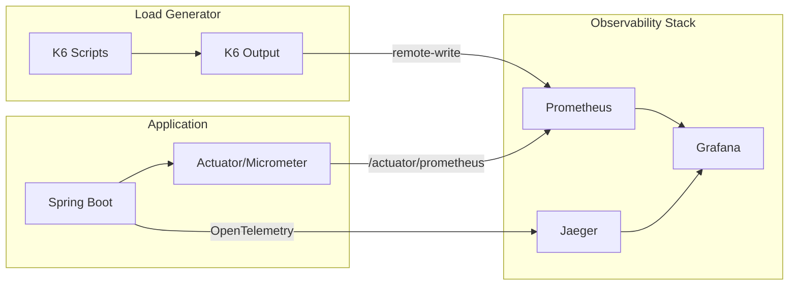

# Web Research — Performance Testing & Benchmarking

## 1. Search Iterations

### Iteration 1: "Spring Boot performance testing TPS benchmark best practices 2025"
**Kết quả chính:**
- K6 là lựa chọn tốt nhất cho CI/CD integration + JavaScript ecosystem
- Gatling cho high-concurrency với JVM teams
- Formula: `Concurrency = TPS × Latency` — quan trọng cho capacity planning
- JVM warmup cần 10-20 phút trước khi đo
- ZGC (`-XX:+UseZGC`) cho low-latency p99
- Virtual Threads giải quyết thread-per-request bottleneck

**Source:** https://k6.io/docs/, https://gatling.io/docs/

### Iteration 2: "HikariCP optimal pool size + Redis Lettuce tuning"
**Kết quả chính:**
- **HikariCP Formula:** `connections = (core_count × 2) + effective_spindle_count`
- Với SSD + 4-core DB: `maximum-pool-size = 10` thường optimal hơn 50+
- `minimum-idle = maximum-pool-size` đảm bảo instant response
- `spring.jpa.open-in-view=false` ← **CRITICAL** (đã config đúng trong project)
- **Lettuce:** Không cần connection pool cho non-blocking — share single connection
- Lettuce `executePipelined` cho batch operations
- Redis `GenericJackson2JsonRedisSerializer` có overhead lớn hơn binary serializers

**Source:** https://github.com/brettwooldridge/HikariCP/wiki/About-Pool-Sizing

### Iteration 3: "Virtual Threads + Observability + Bottleneck Methodology"
**Kết quả chính:**
- Virtual threads: `spring.threads.virtual.enabled=true` ← **đã config**
- Cảnh báo **pinning**: `synchronized` blocks pin virtual threads → dùng `ReentrantLock`
- USE Method: **Utilization → Saturation → Errors** cho systematic bottleneck identification
- **Four Golden Signals** (Google SRE): Latency, Traffic, Errors, Saturation
- OpenTelemetry + Prometheus + Grafana = standard observability stack
- K6 web dashboard built-in: `K6_WEB_DASHBOARD=true`
- K6 → Prometheus remote write: `--out experimental-prometheus-rw`

**Source:** https://docs.spring.io/spring-boot/reference/features/spring-application.html

---

## 2. Key Findings — Methodology

### 2.1 Performance Testing Layers (Bottom-Up)

```
Layer 5: Full-System Load Test (K6 multi-scenario)
         ↓ Depends on
Layer 4: API Cluster Test (K6 sequential chains)
         ↓ Depends on
Layer 3: Single API Test (K6 per-endpoint)
         ↓ Depends on
Layer 2: Component Benchmark (JMH microbenchmarks)
         ↓ Depends on
Layer 1: Infrastructure Baseline (DB pool, Redis, HTTP server, Crypto)
```

### 2.2 Bottleneck Identification — USE Method

| Resource | Utilization | Saturation | Errors |
|----------|-------------|------------|--------|
| **CPU** | `process_cpu_usage` | Thread queue length | OOM kills |
| **Memory** | JVM heap used | GC frequency/duration | OutOfMemoryError |
| **DB Pool** | Active connections | Pending threads | Connection timeouts |
| **Redis** | Connected clients | Command queue | Connection refused |
| **HTTP Server** | Active threads | Request queue | 503 responses |
| **Network** | Bandwidth usage | TCP retransmissions | Timeouts |

### 2.3 Metrics Collection Strategy



---

## 3. Key Findings — Optimization Targets

### 3.1 HikariCP Tuning (Current: Default Config)

**Vấn đề hiện tại:** `application-db.yml` không có explicit HikariCP config.

**Recommended Config:**
```yaml
spring:
  datasource:
    hikari:
      maximum-pool-size: 10      # (DB cores × 2) + spindles
      minimum-idle: 10           # Match max-pool-size
      connection-timeout: 30000  # 30s max wait
      idle-timeout: 600000       # 10 min idle before eviction
      max-lifetime: 1800000      # 30 min max connection life
      pool-name: AuthServicePool
      leak-detection-threshold: 30000  # Alert if connection held > 30s
```

### 3.2 Redis Tuning (Current: Basic Config)

**Vấn đề hiện tại:**
- `GenericJackson2JsonRedisSerializer` — JSON overhead lớn
- Không có explicit Lettuce connection config

**Optimizations:**
1. Xem xét `JdkSerializationRedisSerializer` hoặc Protobuf cho cache performance
2. Cấu hình Lettuce timeouts và command timeout
3. Pipeline batching cho rate-limit operations

### 3.3 JVM Tuning (Current: No JVM flags)

**Recommended JVM flags:**
```
-XX:+UseZGC                    # Low-latency GC
-XX:+ZGenerational             # Generational ZGC (JDK 21+)
-Xms512m -Xmx1024m           # Fixed heap size
-XX:+AlwaysPreTouch           # Pre-touch heap pages
-Djdk.tracePinnedThreads=full # Detect virtual thread pinning
```

### 3.4 Tomcat / HTTP Server (Current: Virtual Threads)

**Vấn đề hiện tại:** Virtual threads enabled nhưng chưa đo impact.

**Benchmark plan:**
1. Test với virtual threads ON vs OFF
2. Measure max concurrent connections
3. Measure thread creation/destruction overhead
4. Check for pinning issues với `synchronized` blocks

### 3.5 Encryption Overhead (Current: JMH exists)

**Đã có:** `EncryptionBenchmark.kt` (AES-GCM)

**Cần thêm:**
1. BCrypt password hashing benchmark (bcrypt-strength: 12)
2. JWT RS256 signing/verification benchmark
3. X25519 key exchange benchmark
4. TOTP generation/verification benchmark
5. Full request lifecycle with encryption vs without

---

## 4. Key Findings — Testing Strategy

### 4.1 5-Phase Progressive Testing Approach

```
Phase 1: Infrastructure Baseline
├── DB connection pool benchmark
├── Redis connection benchmark
├── HTTP server max connections
├── Crypto operations throughput (JMH)
└── Serialization throughput (JMH)

Phase 2: Single API Endpoint Testing
├── Each controller endpoint independently
├── Establish baseline latency per API
├── Identify slow endpoints
└── Error rate per endpoint

Phase 3: API Cluster Testing
├── Login → Profile → Refresh chain
├── Register → Login → MFA → Profile chain
├── SSO → Profile → Permission chain
└── Full CRUD cycle per domain

Phase 4: Full System Load Testing
├── Mixed workload simulation
├── Realistic user journey ratios
├── Ramp up → Steady state → Spike → Cool down
└── Find breaking point (TPS saturation)

Phase 5: Stress & Soak Testing
├── Stress test: Beyond expected peak
├── Soak test: 2-4 hours sustained load
├── Memory leak detection
└── Connection leak detection
```

### 4.2 K6 Test Scenarios Needed

| Scenario | Executor | VUs/Rate | Duration | Priority |
|----------|----------|----------|----------|----------|
| Health check baseline | constant-arrival-rate | 1000 req/s | 30s | P0 |
| Login (single) | ramping-vus | 0→1000 | 1min | P0 |
| Token refresh | constant-arrival-rate | 200 req/s | 30s | P0 |
| Profile access | constant-arrival-rate | 500 req/s | 30s | P0 |
| Login → Profile chain | per-vu-iterations | 100 VUs | 2min | P0 |
| Register → Login → MFA | per-vu-iterations | 50 VUs | 3min | P1 |
| RBAC CRUD | constant-arrival-rate | 100 req/s | 1min | P1 |
| SSO login flow | ramping-vus | 0→100 | 1min | P1 |
| Mixed workload | shared-iterations | 500 VUs | 5min | P0 |
| Soak test | constant-vus | 200 VUs | 1-4h | P2 |

### 4.3 JMH Benchmarks Needed

| Benchmark | Category | Priority |
|-----------|----------|----------|
| BCrypt hashing (strength 12) | Crypto | P0 |
| JWT RS256 sign + verify | Crypto | P0 |
| X25519 key exchange | Crypto | P1 |
| TOTP generation | Crypto | P1 |
| Redis serialization comparison | IO | P0 |
| Permission cache lookup | Cache | P0 |
| Rate limit Lua script | Redis | P1 |

---

## 5. Performance Report Template

### Suggested Report Structure

```
1. Executive Summary
   ├── Test objective
   ├── Environment
   ├── Key findings (pass/fail)
   └── Top recommendation

2. Test Configuration
   ├── Infrastructure specs
   ├── JVM settings
   ├── Application config
   └── Test scenarios

3. Baseline Metrics
   ├── Per-API latency (p50/p95/p99)
   ├── Throughput (TPS)
   ├── Error rates
   └── Resource utilization

4. Bottleneck Analysis
   ├── USE Method results per resource
   ├── Flame graph highlights
   ├── Query analysis
   └── Connection pool utilization

5. Optimization Results
   ├── Before/After comparison
   ├── Config changes applied
   └── TPS improvement %

6. Recommendations
   ├── Immediate (quick wins)
   ├── Short-term (1 sprint)
   └── Long-term (architecture)

7. Appendix
   ├── Raw K6 reports
   ├── JMH results JSON
   ├── Grafana dashboard screenshots
   └── Full test scripts
```

---

## 6. Sources

| # | Source | Type | Trust |
|---|--------|------|-------|
| 1 | https://k6.io/docs/ | Official docs | HIGH |
| 2 | https://gatling.io/docs/ | Official docs | HIGH |
| 3 | https://github.com/brettwooldridge/HikariCP/wiki | Official wiki | HIGH |
| 4 | https://docs.spring.io/spring-boot/reference/ | Official docs | HIGH |
| 5 | https://prometheus.io/docs/ | Official docs | HIGH |
| 6 | https://grafana.com/docs/ | Official docs | HIGH |
| 7 | https://opentelemetry.io/docs/ | Official docs | HIGH |
| 8 | https://openjdk.org/jeps/444 | JEP (Virtual Threads) | HIGH |
| 9 | https://github.com/jvm-profiling-tools/async-profiler | Official repo | HIGH |
| 10 | https://github.com/ttddyy/datasource-proxy | Official repo | HIGH |
