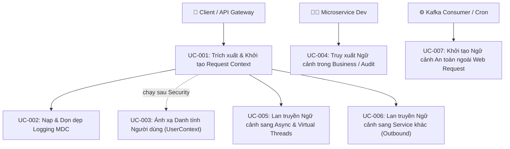

# Tài liệu phân tích nghiệp vụ: shared-request-context

> Phân tích chi tiết các ca sử dụng (Use Cases), quy tắc nghiệp vụ và luồng xử lý của hệ thống Ngữ Cảnh Yêu Cầu và Truy Vết Phân Tán trong `base-core`.

---

## 1. Tổng quan (Overview)

### 1.1 Bối cảnh nghiệp vụ (Business Context)
Trong kiến trúc Microservices phân tán (gồm Auth, Account, System Admin, Notification), mỗi thao tác của người dùng hoặc đối tác (Mobile App, Web Browser, External Partner) đều kích hoạt một chuỗi các lời gọi dịch vụ liên hoàn qua HTTP REST và Kafka Event.
Để phục vụ các yêu cầu cốt lõi về:
1. **Kiểm toán an ninh (Audit Trail & Compliance)**: Truy vết chính xác ai (UserId), từ thiết bị nào (DeviceFingerprint, ClientPlatform), từ địa chỉ IP nào (ClientIp) đã thực hiện giao dịch hoặc thay đổi cấu hình.
2. **Xử lý sự cố nhanh (MTTR - Mean Time to Resolution)**: Truy vết toàn bộ vòng đời của một request qua duy nhất một `Correlation-ID` trên hệ thống Log tập trung (ELK / Loki / Grafana).
3. **Phòng chống gian lận & Quản trị phiên (Anti-Fraud & Session Control)**: Bắt buộc xác thực nền tảng (`X-Client-Platform`) và phiên bản ứng dụng (`X-App-Version`) để phát hiện các cuộc gọi API trái phép hoặc phiên bản đã bị ngưng hỗ trợ.

### 1.2 Mục tiêu nghiệp vụ (Objectives)

| # | Mục tiêu | KPI đo lường | Độ ưu tiên |
|---|---------|-------------|-----------|
| O-01 | **100% Traceability**: Mọi request đi vào hệ thống đều sở hữu Correlation ID duy nhất và có mặt trong 100% dòng log cấu trúc. | Tỷ lệ log thiếu correlationId = 0% | P0 (Critical) |
| O-02 | **Zero Code Duplication**: Xóa bỏ hoàn toàn code bóc tách header, IP client, session thủ công tại từng microservice. | 0 duplicate code bóc tách header | P0 (Critical) |
| O-03 | **Loom & Async Safety**: Không xảy ra hiện tượng rò rỉ bộ nhớ hoặc mất mát dữ liệu context khi chạy trên Java 21 Virtual Threads hoặc `@Async`. | 0 sự cố rò rỉ carrier thread memory | P0 (Critical) |
| O-04 | **Seamless Developer Experience**: Developer tại bất kỳ microservice nào chỉ cần gọi `RequestContextHolder.require()` để lấy mọi thông tin cần thiết mà không phải quan tâm request đến từ đâu. | Giảm 90% boilerplate code trong Controller/Aspect | P1 (High) |

### 1.3 Phạm vi (Scope)
- **In Scope**: Toàn bộ luồng tiếp nhận HTTP Request, xử lý luồng bất đồng bộ, lắng nghe sự kiện Kafka, và phát lời gọi HTTP sang microservice khác.
- **Out of Scope**: Giao thức ngoài HTTP/Kafka (như raw TCP socket); cơ chế xác thực JWT nội bộ của Auth Server.

### 1.4 Stakeholders & Actors

| Actor | Loại | Mô tả | Tương tác chính |
|-------|------|--------|----------------|
| **End User / Client App** | External Primary | Ứng dụng Mobile (iOS/Android) hoặc Web Browser của người dùng. | Gửi request kèm headers định danh thiết bị và token JWT. |
| **API Gateway** | Internal System | Cổng biên bảo vệ hệ thống. | Kiểm tra sơ bộ, chuẩn hóa `X-Forwarded-For` và forward request. |
| **Microservice Developer** | Internal User | Lập trình viên xây dựng Controller, Service, AOP Audit. | Đọc `RequestContext` để lấy `userId`, `clientIp`, `locale`. |
| **SRE / DevOps Engineer** | Internal Stakeholder | Đội ngũ vận hành hệ thống. | Tìm kiếm log theo `correlationId` trên Grafana/Kibana. |
| **Background Worker / Kafka** | Internal System | Các luồng xử lý bất đồng bộ, consumer Kafka, scheduled jobs. | Kế thừa context hoặc sử dụng fallback an toàn. |

---

## 2. Use Case Diagram (Tổng Quan)

---

## 3. Danh sách Use Case (Use Case Index)

| UC-ID | Tên Use Case | Actor | Nhóm chức năng | Độ ưu tiên |
|-------|-------------|-------|----------------|-----------|
| **UC-001** | Trích xuất và Khởi tạo Request Context từ Inbound HTTP | Client / Gateway | Inbound Transport | P0 |
| **UC-002** | Nạp và Dọn dẹp Ngữ Cảnh Ghi Log Cấu Trúc (SLF4J MDC) | Hệ thống | Observability | P0 |
| **UC-003** | Ánh xạ Danh Tính Người Dùng (SecurityContextBridge) | Spring Security | Security Integration | P0 |
| **UC-004** | Truy xuất Ngữ Cảnh trong Tầng Nghiệp Vụ và Audit Aspect | Developer | Business Layer | P1 |
| **UC-005** | Lan truyền Ngữ Cảnh sang Luồng Bất Đồng Bộ và Virtual Threads | Task Executor | Concurrency | P0 |
| **UC-006** | Lan truyền Ngữ Cảnh Giao Tiếp Đa Dịch Vụ (Outbound Propagation) | HTTP Client / Kafka | Distributed Tracing | P1 |
| **UC-007** | Khởi tạo Ngữ Cảnh An Toàn Cho Tác Vụ Nền (Non-Web Fallback) | Background Worker | Reliability | P1 |

---

## 4. Chi tiết các Use Case Trọng Yếu

### 4.1. UC-001: Trích xuất và Khởi tạo Request Context từ Inbound HTTP
- **Mục tiêu**: Thu thập toàn bộ metadata transport từ HTTP headers và IP kết nối vào một cấu trúc chuẩn hóa `RequestContext`.
- **Pre-conditions**: HTTP request đi tới Servlet filter chain của microservice.
- **Main Flow**:
  1. Filter kiểm tra header `X-Correlation-ID`. Nếu không có, kiểm tra `X-Request-ID`. Nếu cả hai đều không có, sinh mới một UUID ngẫu nhiên.
  2. Filter sinh `requestId` duy nhất cho chặng gọi hiện tại.
  3. Filter gọi `IpInfoUtil.getIpAddr(request)` để bóc tách địa chỉ IP thực tế (xử lý chuỗi proxy trong `X-Forwarded-For`).
  4. Filter bóc tách `User-Agent`, `X-Device-Fingerprint`, `X-App-Version`, `X-Client-Platform`, `X-Tenant-Id`.
  5. Filter khởi tạo đối tượng `RequestContext` và lưu vào `RequestContextHolder` (ThreadLocal).
  6. Gắn `X-Correlation-ID` vào HTTP response header để client có thể theo dõi.
- **Post-conditions**: `RequestContextHolder.get()` trả về đối tượng context hợp lệ.

---

### 4.2. UC-002: Nạp và Dọn dẹp Ngữ Cảnh Ghi Log Cấu Trúc (SLF4J MDC)
- **Mục tiêu**: Đảm bảo mọi dòng log sinh ra trong quá trình xử lý request đều tự động mang theo metadata chuẩn mà không cần lập trình viên phải truyền tham số log thủ công.
- **Main Flow**:
  1. Sau khi khởi tạo `RequestContext`, filter đưa các cặp key-value vào `org.slf4j.MDC`:
     - `correlationId = ctx.correlationId`
     - `clientIp = ctx.clientIp`
     - `appVersion = ctx.appVersion`
     - `clientPlatform = ctx.clientPlatform`
  2. Cho phép request tiếp tục đi qua các filter tiếp theo và vào Controller/Service.
  3. Trong khối `finally` của filter (khi request kết thúc hoặc xảy ra exception), gọi `MDC.clear()` và `RequestContextHolder.clear()`.
- **Exception Flow / Safety Guard**:
  - Nếu xảy ra unhandled exception trong controller, khối `finally` bắt buộc vẫn được thực thi để chống rò rỉ bộ nhớ sang request kế tiếp.

---

### 4.3. UC-003: Ánh xạ Danh Tính Người Dùng (SecurityContextBridge)
- **Mục tiêu**: Tích hợp danh tính người dùng đã được xác thực (từ JWT RS256 hoặc Gateway) vào `RequestContext.user` mà không phá vỡ tính độc lập của tầng Web.
- **Main Flow**:
  1. Filter chạy ngay sau Spring Security Filter Chain (`Ordered.LOWEST_PRECEDENCE - 20`).
  2. Lấy `Authentication` từ `SecurityContextHolder.getContext().authentication`.
  3. Nếu `authentication != null && isAuthenticated && principal != "anonymousUser"`:
     - Trích xuất `userId`, `username`, `roles`, `permissions`, `jti`.
     - Tạo đối tượng `UserContext` và gán vào `RequestContextHolder.get().user`.
     - Bổ sung `userId` vào SLF4J MDC.
  4. Nếu request không có xác thực, giữ `RequestContext.user = null`.

---

### 4.4. UC-005: Lan truyền Ngữ Cảnh sang Luồng Bất Đồng Bộ và Virtual Threads
- **Mục tiêu**: Duy trì tính liên tục của `RequestContext` và MDC khi tác vụ được đẩy vào `@Async`, `CompletableFuture` hoặc `VirtualThreadExecutor`.
- **Main Flow**:
  1. Tác vụ nghiệp vụ gọi hàm `@Async` hoặc submit Runnable vào executor.
  2. `ContextTaskDecorator` can thiệp vào thời điểm submit, chụp ảnh (snapshot) `RequestContext` và `MDC.getCopyOfContextMap()`.
  3. Khi thread mới (Platform Thread hoặc Virtual Thread) bắt đầu chạy runnable, decorator nạp snapshot vào thread mới.
  4. Khi tác vụ hoàn thành, decorator tự động clear context và MDC của thread mới.

---

### 4.5. UC-006: Lan truyền Ngữ Cảnh Giao Tiếp Đa Dịch Vụ (Outbound Propagation)
- **Mục tiêu**: Khi Service A gọi sang Service B qua HTTP hoặc Kafka, mã `X-Correlation-ID` phải được tiếp nối liền mạch.
- **Main Flow**:
  - **Với HTTP Client (`RestClient` / `WebClient`)**:
    1. Interceptor tự động đọc `correlationId` từ `RequestContextHolder.get()`.
    2. Gắn header `X-Correlation-ID: <correlationId>` vào request gửi đi.
    3. Nếu có thông tin người dùng, gắn thêm `X-User-Id` (theo cấu hình tin cậy nội bộ).
  - **Với Kafka Messaging**:
    1. `KafkaTracingProducerInterceptor` đọc `correlationId` từ `RequestContextHolder.get()`.
    2. Thêm record header `correlationId` vào byte array của Kafka record.

---

## 5. Quy Tắc Nghiệp Vụ (Business Rules)

| Mã quy tắc | Tên quy tắc | Nội dung chi tiết |
|:---|:---|:---|
| **BR-001** | Ưu tiên Correlation ID | `correlationId` ưu tiên lấy theo thứ tự: Header `X-Correlation-ID` → Header `X-Request-ID` → Tự sinh UUID ngẫu nhiên. Không bao giờ được phép để trống. |
| **BR-002** | Xử lý Client IP | Client IP bắt buộc lấy địa chỉ IP đầu tiên trong chuỗi phân tách bởi dấu phẩy của `X-Forwarded-For`. Nếu không có, fallback sang `request.getRemoteAddr()`. Chuẩn hóa `0:0:0:0:0:0:0:1` thành `127.0.0.1`. |
| **BR-003** | Bắt buộc dọn dẹp (Deterministic Cleanup) | Mọi thao tác gán `ThreadLocal` và `MDC` bắt buộc phải được bọc trong cấu trúc `try { ... } finally { clear() }`. Nghiêm cấm để sót dữ liệu sang chu kỳ tiếp theo của Thread Pool. |
| **BR-004** | An toàn Virtual Threads | Nghiêm cấm sử dụng `InheritableThreadLocal` trong toàn bộ thành phần Request Context để ngăn chặn hiện tượng rò rỉ dữ liệu qua carrier threads của JVM. |
| **BR-005** | Giá trị mặc định Metadata | Nếu client không gửi `X-App-Version` hoặc `X-Client-Platform`, hệ thống gán giá trị mặc định là `"unknown"`. |
| **BR-006** | Bất biến (Immutability) | Các trường transport metadata (`correlationId`, `requestId`, `clientIp`) sau khi khởi tạo là bất biến (read-only) trong suốt vòng đời của request. |
| **BR-007** | Non-Web Fallback | Khi gọi `RequestContextHolder.require()` trong môi trường non-web (Kafka/Scheduled), nếu không có web request, hệ thống trả về một `RequestContext.systemFallback(source)` thay vì ném ngoại lệ dừng ứng dụng. |
| **BR-008** | Response Header Echo | Mọi phản hồi HTTP thành công hoặc thất bại đều phải trả về header `X-Correlation-ID` tương ứng với request đó. |

---

## 6. Ma trận truy vết (Traceability Matrix)

| Mục tiêu (Objective) | Quy tắc (Business Rule) | Ca sử dụng (Use Case) | Module triển khai dự kiến |
|:---|:---|:---|:---|
| O-01 (100% Traceability) | BR-001, BR-008 | UC-001, UC-002, UC-006 | `base-web-starter`, `base-http-client-starter` |
| O-02 (Zero Code Duplication) | BR-002, BR-005 | UC-001, UC-004 | `base-web-starter`, `common-log` |
| O-03 (Loom & Async Safety) | BR-003, BR-004 | UC-002, UC-005 | `base-core`, `common-log` |
| O-04 (Developer Experience) | BR-006, BR-007 | UC-003, UC-004, UC-007 | `base-core`, `base-security-starter` |
