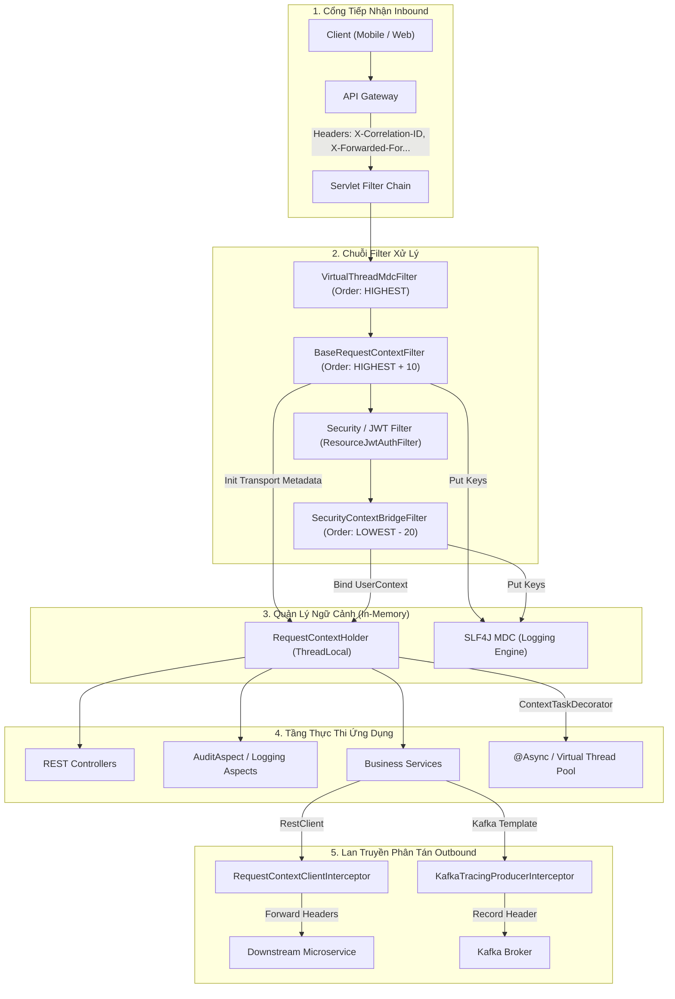
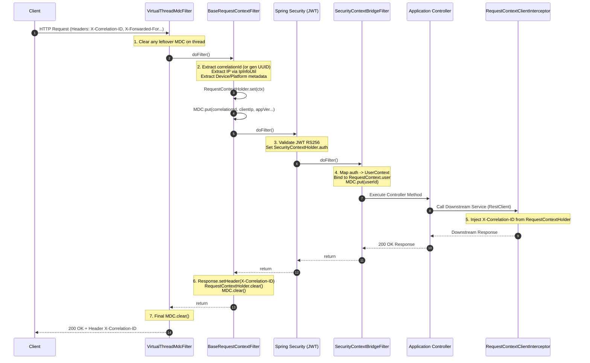

# Đặc tả kỹ thuật: shared-request-context

> Technical specification chi tiết — thiết kế chuẩn mực để các AI Agent và Developer có thể triển khai code trực tiếp vào `base-core` và refactor các microservices hạ nguồn.

---

## 1. Tổng quan hệ thống (System Overview)

### 1.1 Kiến trúc tổng thể



### 1.2 Technology Stack

| Layer | Technology | Version | Ghi chú |
|-------|-----------|---------|---------|
| Language | Kotlin | 2.1.x | Ngôn ngữ phát triển chính |
| JDK | OpenJDK | 21+ | Project Loom (Virtual Threads) |
| Framework | Spring Boot | 3.4.x | Servlet Web MVC |
| Logging | SLF4J + Logback | 2.0.x / 1.5.x | MDC structured logging |
| Build Tool | Gradle | 8.x Multi-module | Starters convention |

### 1.3 Phân chia Module trong `base-core`

```
components/base-core/
├── base-model/ (hoặc base-core root)
│   └── com.ntt.basecore.context/
│       ├── RequestContext.kt           <-- Core domain POJO
│       ├── UserContext.kt              <-- User identity model
│       └── RequestContextHolder.kt     <-- ThreadLocal loom-safe holder
│
├── common-log/
│   └── com.ntt.commonlog/
│       ├── filter/VirtualThreadMdcFilter.kt   <-- Đã có, HIGHEST_PRECEDENCE
│       └── utils/IpInfoUtil.kt                <-- Đã có, đa proxy IP parser
│
├── starters/base-web-starter/
│   └── com.ntt.basecore.autoconfigure.web.context/
│       ├── BaseRequestContextFilter.kt        <-- Inbound transport metadata filter
│       ├── ContextTaskDecorator.kt            <-- Loom/Async context propagation
│       └── RequestContextAutoConfiguration.kt  <-- Spring Boot auto-configuration
│
├── starters/base-security-starter/
│   └── com.ntt.basecore.autoconfigure.security.context/
│       └── SecurityContextBridgeFilter.kt     <-- Chuyển Authentication sang UserContext
│
└── starters/base-http-client-starter/
    └── com.ntt.basecore.autoconfigure.httpclient.interceptor/
        └── RequestContextClientInterceptor.kt <-- Outbound RestClient/RestTemplate header injector
```

---

## 2. Mô hình dữ liệu (Data Models)

### 2.1 `RequestContext` (Core Transport Metadata)
```kotlin
package com.ntt.basecore.context

import java.util.Locale
import java.util.UUID

/**
 * Immutable request metadata model holding transport, client, and user context.
 */
data class RequestContext(
    val correlationId: String,
    val requestId: String,
    val clientIp: String,
    val userAgent: String?,
    val deviceFingerprint: String?,
    val appVersion: String = VALUE_UNKNOWN,
    val clientPlatform: String = VALUE_UNKNOWN,
    val locale: Locale = Locale.getDefault(),
    val timestamp: Long = System.currentTimeMillis(),
    val tenantId: String? = null,
    var user: UserContext? = null
) {
    fun requireUserId(): Long =
        user?.userId ?: throw IllegalStateException("Current operation requires an authenticated user")

    fun requireUsername(): String =
        user?.username ?: throw IllegalStateException("Current operation requires an authenticated username")

    fun isAuthenticated(): Boolean = user != null

    fun hasRole(role: String): Boolean =
        user?.roles?.contains(role) == true

    fun hasPermission(permission: String): Boolean =
        user?.permissions?.contains(permission) == true

    companion object {
        const val VALUE_UNKNOWN = "unknown"

        fun fallback(source: String = "system"): RequestContext {
            val uuid = UUID.randomUUID().toString()
            return RequestContext(
                correlationId = uuid,
                requestId = uuid,
                clientIp = "127.0.0.1",
                userAgent = source,
                deviceFingerprint = null,
                appVersion = "system",
                clientPlatform = "INTERNAL"
            )
        }
    }
}
```

### 2.2 `UserContext` (Security Identity Model)
```kotlin
package com.ntt.basecore.context

/**
 * Clean domain model for authenticated user identity, decoupled from Spring Security.
 */
data class UserContext(
    val userId: Long,
    val username: String,
    val roles: Set<String> = emptySet(),
    val permissions: Set<String> = emptySet(),
    val jti: String? = null,
    val activeDomain: String? = null,
    val attributes: Map<String, Any> = emptyMap()
)
```

### 2.3 `RequestContextHolder` (Loom-Safe Storage)
```kotlin
package com.ntt.basecore.context

/**
 * Thread-safe context holder using standard ThreadLocal (NOT InheritableThreadLocal)
 * for safe operation with Virtual Threads (Project Loom).
 */
object RequestContextHolder {
    private val contextHolder = ThreadLocal<RequestContext?>()

    fun set(context: RequestContext?) {
        contextHolder.set(context)
    }

    fun get(): RequestContext? = contextHolder.get()

    fun require(): RequestContext =
        get() ?: RequestContext.fallback("unbound-thread")

    fun clear() {
        contextHolder.remove()
    }
}
```

---

## 3. Luồng xử lý chi tiết (Processing Flows)

### 3.1 Sequence Diagram: Inbound Request Lifecycle



---

## 4. Đặc tả Filter & TaskDecorator

### 4.1 `BaseRequestContextFilter.kt` (trong `base-web-starter`)
```kotlin
package com.ntt.basecore.autoconfigure.web.context

import com.ntt.basecore.context.RequestContext
import com.ntt.basecore.context.RequestContextHolder
import com.ntt.commonlog.utils.IpInfoUtil
import jakarta.servlet.FilterChain
import jakarta.servlet.http.HttpServletRequest
import jakarta.servlet.http.HttpServletResponse
import org.slf4j.MDC
import org.springframework.core.Ordered
import org.springframework.core.annotation.Order
import org.springframework.web.filter.OncePerRequestFilter
import java.util.Locale
import java.util.UUID

@Order(Ordered.HIGHEST_PRECEDENCE + 10)
class BaseRequestContextFilter(
    private val ipInfoUtil: IpInfoUtil
) : OncePerRequestFilter() {

    override fun doFilterInternal(
        request: HttpServletRequest,
        response: HttpServletResponse,
        filterChain: FilterChain
    ) {
        val correlationId = request.getHeader(HEADER_CORRELATION_ID)
            ?: request.getHeader(HEADER_REQUEST_ID)
            ?: UUID.randomUUID().toString()

        val requestId = UUID.randomUUID().toString()
        val clientIp = ipInfoUtil.getIpAddr(request) ?: request.remoteAddr ?: "unknown"
        val userAgent = request.getHeader(HEADER_USER_AGENT)
        val deviceFingerprint = request.getHeader(HEADER_DEVICE_FINGERPRINT)
        val appVersion = request.getHeader(HEADER_APP_VERSION) ?: RequestContext.VALUE_UNKNOWN
        val clientPlatform = request.getHeader(HEADER_CLIENT_PLATFORM) ?: RequestContext.VALUE_UNKNOWN
        val tenantId = request.getHeader(HEADER_TENANT_ID)

        val ctx = RequestContext(
            correlationId = correlationId,
            requestId = requestId,
            clientIp = clientIp,
            userAgent = userAgent,
            deviceFingerprint = deviceFingerprint,
            appVersion = appVersion,
            clientPlatform = clientPlatform,
            locale = request.locale ?: Locale.getDefault(),
            tenantId = tenantId
        )

        RequestContextHolder.set(ctx)
        setMdc(ctx)

        // Echo correlation ID back in response headers
        response.setHeader(HEADER_CORRELATION_ID, correlationId)

        try {
            filterChain.doFilter(request, response)
        } finally {
            clearMdc()
            RequestContextHolder.clear()
        }
    }

    private fun setMdc(ctx: RequestContext) {
        MDC.put(MDC_CORRELATION_ID, ctx.correlationId)
        MDC.put(MDC_CLIENT_IP, ctx.clientIp)
        MDC.put(MDC_APP_VERSION, ctx.appVersion)
        MDC.put(MDC_CLIENT_PLATFORM, ctx.clientPlatform)
    }

    private fun clearMdc() {
        MDC.remove(MDC_CORRELATION_ID)
        MDC.remove(MDC_CLIENT_IP)
        MDC.remove(MDC_APP_VERSION)
        MDC.remove(MDC_CLIENT_PLATFORM)
        MDC.remove(MDC_USER_ID)
    }

    companion object {
        const val HEADER_CORRELATION_ID = "X-Correlation-ID"
        const val HEADER_REQUEST_ID = "X-Request-ID"
        const val HEADER_USER_AGENT = "User-Agent"
        const val HEADER_DEVICE_FINGERPRINT = "X-Device-Fingerprint"
        const val HEADER_APP_VERSION = "X-App-Version"
        const val HEADER_CLIENT_PLATFORM = "X-Client-Platform"
        const val HEADER_TENANT_ID = "X-Tenant-Id"

        const val MDC_CORRELATION_ID = "correlationId"
        const val MDC_CLIENT_IP = "clientIp"
        const val MDC_APP_VERSION = "appVersion"
        const val MDC_CLIENT_PLATFORM = "clientPlatform"
        const val MDC_USER_ID = "userId"
    }
}
```

### 4.2 `SecurityContextBridgeFilter.kt` (trong `base-security-starter`)
```kotlin
package com.ntt.basecore.autoconfigure.security.context

import com.ntt.basecore.autoconfigure.web.context.BaseRequestContextFilter.Companion.MDC_USER_ID
import com.ntt.basecore.context.RequestContextHolder
import com.ntt.basecore.context.UserContext
import jakarta.servlet.FilterChain
import jakarta.servlet.http.HttpServletRequest
import jakarta.servlet.http.HttpServletResponse
import org.slf4j.MDC
import org.springframework.core.Ordered
import org.springframework.core.annotation.Order
import org.springframework.security.core.context.SecurityContextHolder
import org.springframework.web.filter.OncePerRequestFilter

@Order(Ordered.LOWEST_PRECEDENCE - 20)
class SecurityContextBridgeFilter : OncePerRequestFilter() {

    override fun doFilterInternal(
        request: HttpServletRequest,
        response: HttpServletResponse,
        filterChain: FilterChain
    ) {
        val auth = SecurityContextHolder.getContext().authentication
        val ctx = RequestContextHolder.get()

        if (auth != null && auth.isAuthenticated && auth.principal != "anonymousUser" && ctx != null) {
            val userId = (auth.principal as? String)?.toLongOrNull()
                ?: (auth.name)?.toLongOrNull()

            val roles = auth.authorities?.mapNotNull { it.authority }?.toSet() ?: emptySet()

            if (userId != null) {
                ctx.user = UserContext(
                    userId = userId,
                    username = auth.name,
                    roles = roles,
                    jti = auth.credentials as? String
                )
                MDC.put(MDC_USER_ID, userId.toString())
            }
        }

        try {
            filterChain.doFilter(request, response)
        } finally {
            MDC.remove(MDC_USER_ID)
        }
    }
}
```

### 4.3 `ContextTaskDecorator.kt` (trong `base-web-starter`)
```kotlin
package com.ntt.basecore.autoconfigure.web.context

import com.ntt.basecore.context.RequestContextHolder
import org.slf4j.MDC
import org.springframework.core.task.TaskDecorator

/**
 * Propagates RequestContext and MDC across thread boundaries (Async tasks and Virtual Threads).
 */
class ContextTaskDecorator : TaskDecorator {
    override fun decorate(runnable: Runnable): Runnable {
        val requestContext = RequestContextHolder.get()
        val mdcContext = MDC.getCopyOfContextMap()

        return Runnable {
            val previousContext = RequestContextHolder.get()
            val previousMdc = MDC.getCopyOfContextMap()

            try {
                if (requestContext != null) {
                    RequestContextHolder.set(requestContext)
                }
                if (mdcContext != null) {
                    MDC.setContextMap(mdcContext)
                }
                runnable.run()
            } finally {
                RequestContextHolder.clear()
                MDC.clear()
                if (previousContext != null) {
                    RequestContextHolder.set(previousContext)
                }
                if (previousMdc != null) {
                    MDC.setContextMap(previousMdc)
                }
            }
        }
    }
}
```

### 4.4 `RequestContextClientInterceptor.kt` (trong `base-http-client-starter`)
```kotlin
package com.ntt.basecore.autoconfigure.httpclient.interceptor

import com.ntt.basecore.autoconfigure.web.context.BaseRequestContextFilter.Companion.HEADER_CORRELATION_ID
import com.ntt.basecore.context.RequestContextHolder
import org.springframework.http.HttpRequest
import org.springframework.http.client.ClientHttpRequestExecution
import org.springframework.http.client.ClientHttpRequestInterceptor
import org.springframework.http.client.ClientHttpResponse

class RequestContextClientInterceptor : ClientHttpRequestInterceptor {
    override fun intercept(
        request: HttpRequest,
        body: ByteArray,
        execution: ClientHttpRequestExecution
    ): ClientHttpResponse {
        val ctx = RequestContextHolder.get()
        if (ctx != null) {
            if (!request.headers.containsKey(HEADER_CORRELATION_ID)) {
                request.headers.add(HEADER_CORRELATION_ID, ctx.correlationId)
            }
            ctx.tenantId?.let {
                if (!request.headers.containsKey("X-Tenant-Id")) {
                    request.headers.add("X-Tenant-Id", it)
                }
            }
        }
        return execution.execute(request, body)
    }
}
```

---

## 5. Kế hoạch Refactor các Microservice Hạ Nguồn

| Microservice | Công việc cần làm | Kết quả đạt được |
|:---|:---|:---|
| **`auth-service`** | - Xóa class `RequestContextFilter` cục bộ.<br>- Cho `RequestContext` nội bộ kế thừa hoặc alias sang `com.ntt.basecore.context.RequestContext`.<br>- Bỏ `ClientMetadataFilter` cũ. | Giảm 200 dòng boilerplate, dùng chung starter chuẩn. |
| **`system-admin-service`** | - Trong [`AuditAspect.kt`](file:///home/nguyentthai96/Desktop/bigbang/boilerplate/services/system-admin-service/src/main/kotlin/com/ntt/sysadminservice/audit/application/AuditAspect.kt), xóa các hàm `getClientIp()` và `extractUserId()`.<br>- Thay bằng `val ctx = RequestContextHolder.require()`. | Xóa 60 dòng code regex rác, audit log luôn chuẩn xác 100%. |
| **`account-service`** | - Kích hoạt `base-web-starter` và `base-security-starter`.<br>- `ResourceJwtAuthFilter` chỉ cần set `SecurityContext`, `SecurityContextBridgeFilter` sẽ tự lo phần còn lại. | Có ngay Correlation ID và MDC logging mà không tốn công cài đặt. |
| **`notification-service`** | - Đăng ký `base-web-starter`. | Tự động echo Correlation ID và ghi log có traceId đầy đủ. |

---

## 6. Kế Hoạch Kiểm Thử (Testing Plan)

1. **Unit Test**:
   - `BaseRequestContextFilterTest`: Kiểm tra trích xuất header ưu tiên (`X-Correlation-ID` vs `X-Request-ID` vs UUID).
   - `ContextTaskDecoratorTest`: Kiểm tra context được sao chép đúng sang `CompletableFuture.runAsync()`.
   - `RequestContextHolderTest`: Kiểm tra tính độc lập giữa các thread.
2. **Virtual Thread Leak Test**:
   - Chạy 10,000 Virtual Threads đồng thời qua `Executors.newVirtualThreadPerTaskExecutor()`.
   - Xác minh sau khi kết thúc request, không có carrier thread nào còn lưu giữ giá trị MDC hoặc RequestContext.
3. **Integration Test**:
   - Mock HTTP Call đến REST Controller, verify response header chứa đúng `X-Correlation-ID`.
   - Ghi log qua SLF4J, capture output log JSON và verify có đầy đủ `{"correlationId":"...", "clientIp":"...", "appVersion":"..."}`.
