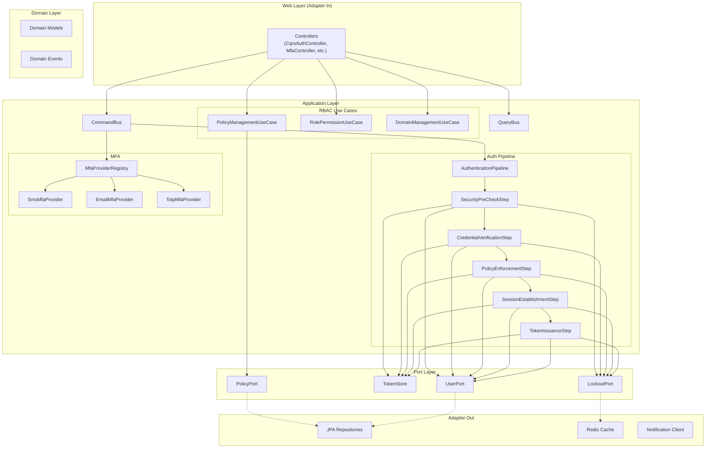
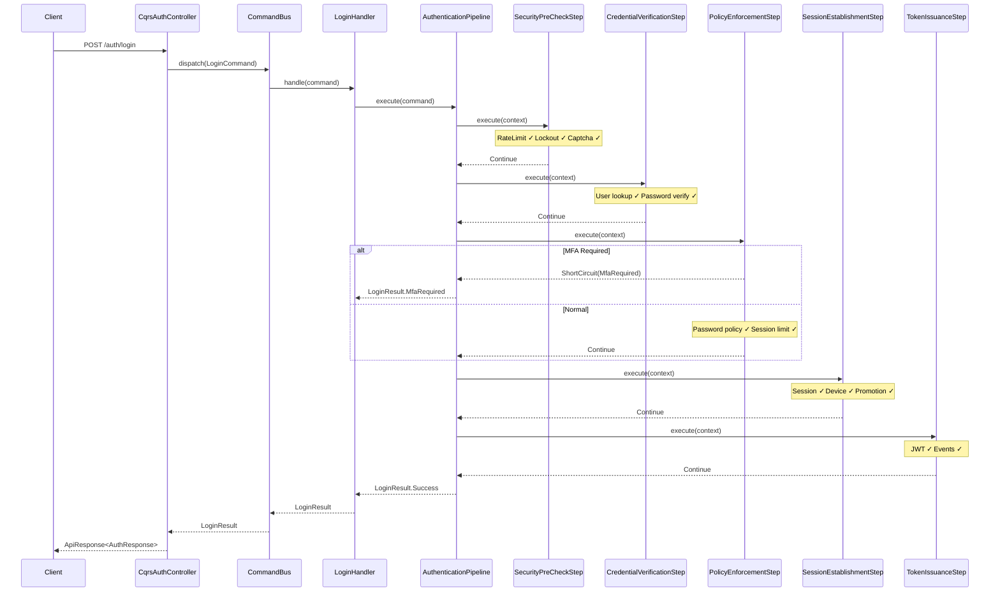

# Technical Specification: SOLID Architecture Refactoring

## 1. Architecture Overview



## 2. Component Specifications

### 2.1 Authentication Pipeline (Chain of Responsibility)

#### New Interfaces

```kotlin
// auth/application/pipeline/AuthenticationStep.kt
interface AuthenticationStep {
    val order: Int
    fun execute(context: AuthenticationContext): StepResult
}

sealed class StepResult {
    data object Continue : StepResult()
    data class ShortCircuit(val result: LoginResult) : StepResult()
}

// auth/application/pipeline/AuthenticationContext.kt
data class AuthenticationContext(
    val command: LoginCommand,
    // Mutable state accumulated through pipeline
    var user: User? = null,
    var domainCode: String? = null,
    var domain: DomainInfo? = null,
    var roles: List<Any> = emptyList(),
    var loginSession: LoginSessionInfo? = null,
    var promotionResult: PromotionResult? = null,
    var authToken: AuthToken? = null
)

// auth/application/pipeline/AuthenticationPipeline.kt
@Component
class AuthenticationPipeline(
    steps: List<AuthenticationStep>
) {
    private val orderedSteps = steps.sortedBy { it.order }
    
    fun execute(command: LoginCommand): LoginResult {
        val context = AuthenticationContext(command)
        for (step in orderedSteps) {
            when (val result = step.execute(context)) {
                is StepResult.Continue -> continue
                is StepResult.ShortCircuit -> return result.result
            }
        }
        // Final step should produce the result
        return buildFinalResult(context)
    }
}
```

#### Pipeline Steps

| Step | Class | Order | Responsibility | Dependencies |
|------|-------|-------|---------------|-------------|
| 1 | `SecurityPreCheckStep` | 100 | RateLimit + Lockout + Captcha | `LoginRateLimitService`, `AccountLockoutService`, `CaptchaStrategyRegistry`, `SecurityProperties` |
| 2 | `CredentialVerificationStep` | 200 | User lookup + Password verify + Hash upgrade | `UserPort`, `TokenGenerator`, `PasswordUpgradeService` |
| 3 | `PolicyEnforcementStep` | 300 | Password expiry + MFA check + Session limit | `PasswordPolicyService`, `DomainPort`, `GetUserRolesHandler`, `SessionPolicyService`, `SecurityProperties` |
| 4 | `SessionEstablishmentStep` | 400 | Session creation + Device + Anonymous promotion | `LoginSessionService`, `SessionPromotionService`, `FingerprintService` |
| 5 | `TokenIssuanceStep` | 500 | JWT generation + Event recording | `TokenGenerator`, `LoginEventRecorder` |

**LoginHandler after refactoring** (từ 17 → 2 dependencies):
```kotlin
@Component
class LoginHandler(
    private val pipeline: AuthenticationPipeline,
    private val loginEventRecorder: LoginEventRecorder
) : CommandHandler<LoginCommand, LoginResult> {
    override fun handle(command: LoginCommand): LoginResult {
        return try {
            pipeline.execute(command)
        } catch (e: AuthException) {
            loginEventRecorder.recordLoginFailure(...)
            throw e
        }
    }
}
```

---

### 2.2 CommandBus / Mediator

#### New Interfaces

```kotlin
// shared/cqrs/Command.kt
interface Command<R>

// shared/cqrs/CommandBus.kt
interface CommandBus {
    fun <C : Command<R>, R> dispatch(command: C): R
}

// shared/cqrs/SpringCommandBus.kt
@Component
class SpringCommandBus(
    handlers: List<CommandHandler<*, *>>
) : CommandBus {
    private val handlerMap: Map<Class<*>, CommandHandler<*, *>> = 
        handlers.associateBy { it.commandType() }
    
    @Suppress("UNCHECKED_CAST")
    override fun <C : Command<R>, R> dispatch(command: C): R {
        val handler = handlerMap[command::class.java]
            ?: throw IllegalArgumentException("No handler for ${command::class.simpleName}")
        return (handler as CommandHandler<C, R>).handle(command)
    }
}
```

**CqrsAuthController after refactoring** (từ 13 → ~5 dependencies):
```kotlin
@RestController
@RequestMapping("/auth")
class CqrsAuthController(
    private val commandBus: CommandBus,
    private val queryBus: QueryBus,
    private val jwtService: JwtService, // for token parsing only
    private val securityProperties: SecurityProperties,
    private val loginSessionService: LoginSessionService // for logout
) : BaseController() {
    
    @PostMapping("/login")
    fun login(@Valid @RequestBody request: LoginRequestDto, httpResponse: HttpServletResponse) =
        when (val result = commandBus.dispatch(request.toCommand(requestContext))) {
            is LoginResult.Success -> {
                setRefreshTokenCookie(httpResponse, result.response.refreshToken)
                okResponse(result.response.copy(refreshToken = null))
            }
            is LoginResult.MfaRequired -> okResponse(MfaRequiredResponse.from(result))
        }
}
```

---

### 2.3 MFA Provider Strategy

```kotlin
// auth/application/mfa/MfaProvider.kt
interface MfaProvider {
    val method: String  // "SMS", "EMAIL", "TOTP"
    fun initiate(userId: Long): MfaInitiateResult
    fun verify(userId: Long, code: String): Boolean
    fun isConfigured(userId: Long): Boolean
}

// auth/application/mfa/MfaProviderRegistry.kt
@Component
class MfaProviderRegistry(providers: List<MfaProvider>) {
    private val providerMap = providers.associateBy { it.method }
    
    fun getProvider(method: String): MfaProvider =
        providerMap[method] ?: throw UnsupportedMfaMethodException(method)
}

// Implementations:
// auth/application/mfa/SmsMfaProvider.kt
// auth/application/mfa/EmailMfaProvider.kt  
// auth/application/mfa/TotpMfaProvider.kt
```

---

### 2.4 RBAC/PBAC Application Layer

#### New Use Cases

```kotlin
// pbac/application/PolicyManagementUseCase.kt
@Service
class PolicyManagementUseCase(
    private val policyPort: PolicyPort  // Interface, not JPA repo
) {
    fun create(domainId: Long, request: PolicyCreateCommand): PolicyResponse { ... }
    fun activate(id: Long): PolicyResponse { ... }
    fun deactivate(id: Long): PolicyResponse { ... }
    fun delete(id: Long) { ... }
    fun list(domainId: Long): List<PolicyResponse> { ... }
}

// rbac/application/RolePermissionUseCase.kt
@Service
class RolePermissionUseCase(
    private val rolePermissionPort: RolePermissionPort
) {
    fun listPermissions(roleId: Long): List<RolePermissionResponse> { ... } // batch JOIN query
    fun assignPermission(roleId: Long, command: AssignPermissionCommand) { ... }
    fun bulkAssign(roleId: Long, command: BulkAssignCommand) { ... }
}
```

#### New Ports

```kotlin
// pbac/application/port/PolicyPort.kt
interface PolicyPort {
    fun findAllByDomainId(domainId: Long): List<PolicyEntity>
    fun findById(id: Long): PolicyEntity?
    fun save(policy: PolicyEntity): PolicyEntity
    // ...
}

// rbac/application/port/RolePermissionPort.kt
interface RolePermissionPort {
    fun findPermissionsWithDetails(roleId: Long): List<PermissionDetail> // JOIN query
    fun assignPermission(roleId: Long, resourceId: Long, actionId: Long)
    // ...
}
```

---

### 2.5 PolicyEvaluator Enum Strategy

```kotlin
// pbac/application/ConditionOperator.kt
enum class ConditionOperator(
    val code: String,
    val evaluate: (actual: Any?, expected: Any?) -> Boolean
) {
    EQ("eq", { a, e -> a?.toString() == e?.toString() }),
    NEQ("neq", { a, e -> a?.toString() != e?.toString() }),
    IN("in", { a, e ->
        val set = (e as? List<*>)?.map { it.toString() } ?: emptyList()
        a?.toString() in set
    }),
    NOT_IN("not_in", { a, e ->
        val set = (e as? List<*>)?.map { it.toString() } ?: emptyList()
        a?.toString() !in set
    }),
    GT("gt", { a, e -> compareNumbers(a, e) > 0 }),
    GTE("gte", { a, e -> compareNumbers(a, e) >= 0 }),
    LT("lt", { a, e -> compareNumbers(a, e) < 0 }),
    LTE("lte", { a, e -> compareNumbers(a, e) <= 0 }),
    CONTAINS("contains", { a, e -> a?.toString()?.contains(e?.toString() ?: "") == true }),
    STARTS_WITH("starts_with", { a, e -> a?.toString()?.startsWith(e?.toString() ?: "") == true });
    // Easy to add: MATCHES_REGEX, GEO_WITHIN, IP_IN_RANGE, etc.

    companion object {
        private val codeMap = entries.associateBy { it.code }
        fun fromCode(code: String): ConditionOperator =
            codeMap[code] ?: throw IllegalArgumentException("Unknown operator: $code")
        
        private fun compareNumbers(a: Any?, b: Any?): Int { /* ... */ }
    }
}
```

**PolicyEvaluator after refactoring**:
```kotlin
// Single-pass evaluation (loại bỏ duplicate iteration)
private fun evaluatePolicies(...): Boolean {
    val sorted = policies.sortedBy { it.priority }
    var hasAllow = false
    var anyAllowExists = false
    
    for (policy in sorted) {
        val conditionsMet = policy.conditions.all { condition ->
            val op = ConditionOperator.fromCode(condition.operator)
            val actual = resolveAttributePath(condition.attributePath, userAttributes, requestContext)
            val expected = parseJsonValue(condition.value)
            op.evaluate(actual, expected)
        }
        
        if (policy.effect == "ALLOW") anyAllowExists = true
        if (conditionsMet) {
            if (policy.effect == "DENY") return false
            if (policy.effect == "ALLOW") hasAllow = true
        }
    }
    
    return hasAllow || !anyAllowExists
}
```

---

## 3. Data Schema

Không yêu cầu database migration. Tất cả thay đổi là code-level restructuring.

---

## 4. Sequence Diagrams

### Login Flow (After Refactoring)



---

## 5. File Structure (New/Modified)

```
auth-service/src/main/kotlin/com/ntt/authservice/
├── shared/
│   └── cqrs/
│       ├── Command.kt                    [NEW]
│       ├── CommandBus.kt                 [NEW]
│       ├── SpringCommandBus.kt           [NEW]
│       ├── QueryBus.kt                   [NEW]
│       └── SpringQueryBus.kt             [NEW]
├── auth/
│   ├── application/
│   │   ├── pipeline/
│   │   │   ├── AuthenticationStep.kt     [NEW]
│   │   │   ├── AuthenticationContext.kt  [NEW]
│   │   │   ├── AuthenticationPipeline.kt [NEW]
│   │   │   ├── SecurityPreCheckStep.kt   [NEW]
│   │   │   ├── CredentialVerificationStep.kt [NEW]
│   │   │   ├── PolicyEnforcementStep.kt  [NEW]
│   │   │   ├── SessionEstablishmentStep.kt   [NEW]
│   │   │   └── TokenIssuanceStep.kt      [NEW]
│   │   ├── mfa/
│   │   │   ├── MfaProvider.kt            [NEW]
│   │   │   ├── MfaProviderRegistry.kt    [NEW]
│   │   │   ├── SmsMfaProvider.kt         [NEW]
│   │   │   ├── EmailMfaProvider.kt       [NEW]
│   │   │   └── TotpMfaProvider.kt        [NEW]
│   │   ├── command/
│   │   │   └── LoginHandler.kt           [MODIFY] — 17 deps → 2
│   │   ├── MfaService.kt                 [MODIFY] — Orchestrator only
│   │   └── AccountLockoutService.kt      [MODIFY] — Use LockoutPort
│   ├── adapter/in/web/
│   │   ├── CqrsAuthController.kt         [MODIFY] — 13 deps → 5
│   │   └── CaptchaController.kt          [MODIFY] — Use registry
├── rbac/
│   ├── application/
│   │   ├── RolePermissionUseCase.kt      [NEW]
│   │   ├── DomainManagementUseCase.kt    [NEW]
│   │   └── port/
│   │       └── RolePermissionPort.kt     [NEW]
│   ├── adapter/in/web/
│   │   ├── RolePermissionController.kt   [MODIFY] — Use UseCase
│   │   └── RbacControllers.kt            [MODIFY/SPLIT] — 1 file → 3 files
└── pbac/
    ├── application/
    │   ├── PolicyManagementUseCase.kt     [NEW]
    │   ├── ConditionOperator.kt           [NEW]
    │   ├── PolicyEvaluator.kt             [MODIFY] — Use ConditionOperator
    │   └── port/
    │       └── PolicyPort.kt             [NEW]
    └── adapter/in/web/
        └── PolicyController.kt           [MODIFY] — Use UseCase
```

---

## 6. Implementation Phases (Suggested)

| Phase | Scope | Risk | Effort | Dependencies |
|-------|-------|------|--------|-------------|
| **P1a** | Quick Wins: CaptchaController + PolicyEvaluator enum | 🟢 Low | 2-4h | None |
| **P1b** | RBAC/PBAC Application Layer | 🟡 Medium | 8-12h | None |
| **P1c** | Split RbacControllers.kt | 🟢 Low | 1-2h | None |
| **P2a** | CommandBus infrastructure | 🟡 Medium | 4-6h | None |
| **P2b** | Authentication Pipeline | 🔴 High | 12-16h | None |
| **P2c** | MFA Provider Strategy | 🟡 Medium | 6-8h | None |
| **P3** | ResponseBodyAdvice (DEFERRED) | 🟢 Low | 4h | All above done |

**Total estimated effort**: 37-52 hours (excluding P3)

---

## 7. Agent Implementation Notes

### Order of Implementation
1. Start with P1a (Quick Wins) → immediate OCP compliance, low risk
2. P1b/P1c can run parallel → Clean Architecture alignment
3. P2a (CommandBus) before P2b (Pipeline) — Pipeline uses CommandBus
4. P2b (Pipeline) is the highest-risk item — refactoring `LoginHandler`
5. P2c (MFA Strategy) after Pipeline — may interact with pipeline steps

### Key Risks
- **P2b**: `LoginHandler` has existing tests. Refactoring pipeline must preserve ALL behavior.
- **P1b**: RBAC/PBAC Application layer changes controller signatures. Update tests.
- **P2a**: CommandBus changes DI wiring. All controller tests need `CommandBus` mock.

### Testing Strategy
- Each new Step class → unit test with mock context
- Pipeline → integration test running all steps
- CommandBus → unit test with mock handlers
- Each MfaProvider → unit test independent
- RBAC/PBAC Use Cases → unit test with mock ports

### Backward Compatibility
- ✅ All HTTP endpoints remain identical
- ✅ All request/response DTOs unchanged
- ✅ No database migrations required
- ⚠️ Internal DI wiring changes → test updates required
