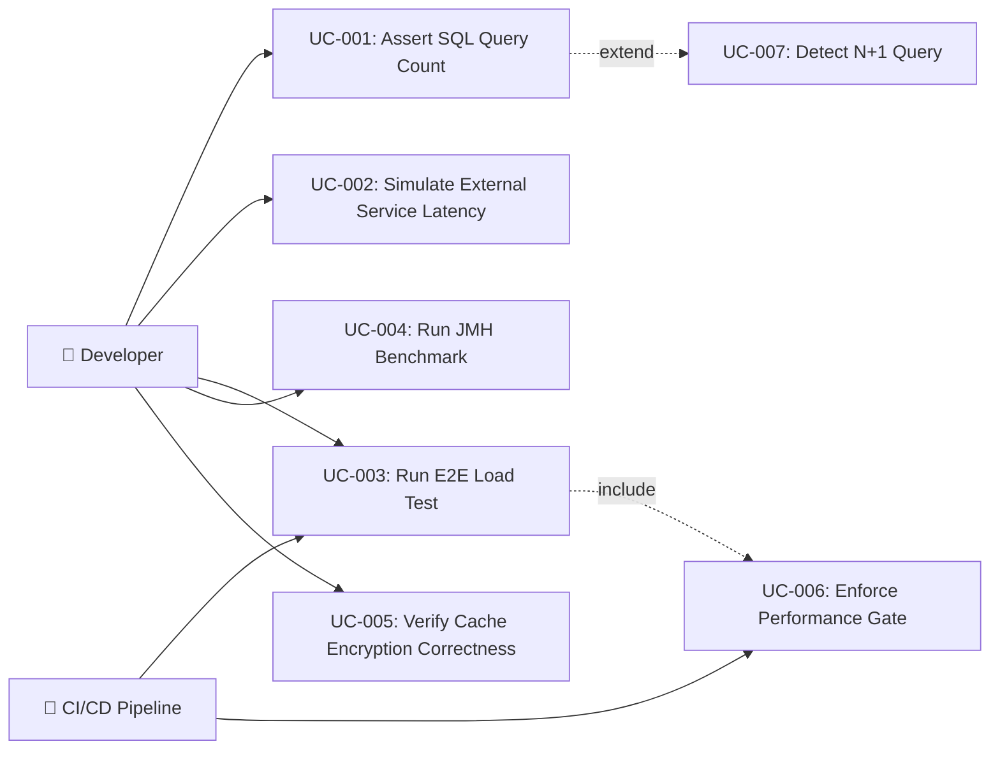

# Tài liệu phân tích nghiệp vụ: TPS Performance Testing

> Phân tích nghiệp vụ chi tiết — chia nhỏ theo use case, đặc tả ngữ nghĩa từng chức năng.

---

## 1. Tổng quan (Overview)

### 1.1 Bối cảnh nghiệp vụ (Business Context)

Auth-service là hệ thống xác thực trung tâm — bất kỳ degradation performance nào đều ảnh hưởng trực tiếp đến toàn bộ hệ sinh thái microservices. Hiện tại, team chỉ phát hiện performance regression sau khi deploy lên staging/production qua monitoring. Không có cơ chế **phát hiện sớm** (shift-left) trong CI/CD pipeline.

Bài toán cụ thể:
1. **N+1 queries** — JPA lazy loading có thể tạo hàng chục SQL queries thay vì 1. Không có automated detection.
2. **External service bottleneck** — SSO providers, notification services có thể timeout. Chưa có test cho latency tolerance.
3. **Cache encryption overhead** — base-cache-starter hỗ trợ NONE/FULL/PARTIAL encryption. Chưa đo lường TPS impact.
4. **Performance regression gate** — CI/CD pipeline không fail khi performance giảm.

### 1.2 Mục tiêu (Objectives)

| # | Mục tiêu | KPI đo lường | Độ ưu tiên |
|---|---------|-------------|-----------|
| O-01 | Phát hiện N+1 queries tự động trong integration tests | Số integration tests có `assertQueryCount` ≥ 5 | High |
| O-02 | Đo TPS baseline cho auth endpoints | TPS measurement cho login, token refresh, profile | High |
| O-03 | Fail CI/CD khi performance regression | K6 threshold breach → pipeline fail (exit code 99) | High |
| O-04 | Test cache encryption overhead | Benchmark matrix: NONE vs FULL vs PARTIAL (TPS delta) | Medium |
| O-05 | Test external service latency tolerance | WireMock latency simulation → verify timeout/circuit-breaker behavior | Medium |
| O-06 | Benchmark encryption algorithms | JMH benchmark: AES-GCM encryption/decryption throughput (ops/sec) | Low |

### 1.3 Phạm vi (Scope)

| In Scope | Out of Scope |
|----------|-------------|
| `assertQueryCount` helper (datasource-proxy) cho auth-service | Query optimization fixes |
| K6 E2E scripts (auth_flow, profile_flow, cache benchmark) | Stress/soak/spike testing |
| WireMock setup cho SSO provider mock | WireMock cho tất cả external services |
| JMH benchmark cho encryption/serialization | JMH cho toàn bộ business logic |
| Cache encryption correctness integration tests | Cache performance tuning |
| CI/CD threshold configuration | Grafana/InfluxDB visualization setup |
| Tài liệu hướng dẫn cho team | Training sessions |

### 1.4 Stakeholders & Actors

| Actor | Loại | Mô tả | Tương tác chính |
|-------|------|--------|----------------|
| Developer | Primary | Viết tests, chạy local, fix issues | Viết assertQueryCount tests, chạy K6 local |
| CI/CD Pipeline | Primary (System) | Tự động chạy tests mỗi PR/merge | Chạy K6 thresholds, fail/pass pipeline |
| DevOps Engineer | Secondary | Cấu hình CI/CD, JVM tuning | Cấu hình Gradle tasks, Docker, JVM args |
| QA Lead | Secondary | Review test coverage, performance criteria | Xác nhận thresholds, review reports |
| K6 Docker Container | External System | Execution engine cho load tests | Nhận scripts, chạy scenarios, trả exit codes |
| Redis Testcontainer | External System | Redis instance cho integration tests | Cung cấp cache storage cho correctness tests |
| PostgreSQL | External System | Database cho integration tests | Target cho SQL query counting |

---

## 2. Use Case Diagram (tổng quan)



---

## 3. Danh sách Use Case (Use Case Index)

| UC-ID | Tên Use Case | Actor | Nhóm chức năng | Độ ưu tiên | Trạng thái |
|-------|-------------|-------|----------------|-----------|-----------|
| UC-001 | Assert SQL Query Count | Developer | SQL I/O Testing | High | Draft |
| UC-002 | Simulate External Service Latency | Developer | HTTP I/O Testing | Medium | Draft |
| UC-003 | Run E2E Load Test | Developer, CI/CD | TPS Load Testing | High | Draft |
| UC-004 | Run JMH Microbenchmark | Developer | Microbenchmarking | Low | Draft |
| UC-005 | Verify Cache Encryption Correctness | Developer | Cache Testing | Medium | Draft |
| UC-006 | Enforce Performance Gate | CI/CD Pipeline | CI/CD Integration | High | Draft |
| UC-007 | Detect N+1 Query | Developer | SQL I/O Testing | High | Draft |

---

## 4. Đặc tả Use Case chi tiết

### UC-001: Assert SQL Query Count

#### 4.1 Thông tin chung

| Mục | Nội dung |
|-----|----------|
| **Mã** | UC-001 |
| **Tên** | Assert SQL Query Count |
| **Mô tả ngữ nghĩa** | Developer cần một cách đơn giản để kiểm chứng rằng một block code chỉ thực hiện đúng số lượng SQL queries mong đợi. Điều này giúp phát hiện N+1 queries ngay tại thời điểm viết code, TRƯỚC KHI performance degradation xảy ra trên production. |
| **Actor** | Developer |
| **Trigger** | Developer viết hoặc sửa code liên quan đến JPA entity, chạy integration test |
| **Độ ưu tiên** | High |
| **Tần suất** | Every PR — khi code thay đổi JPA entity |
| **Nhóm chức năng** | SQL I/O Testing |

#### 4.2 Điều kiện

| Loại | Mô tả |
|------|--------|
| **Pre-conditions** | `datasource-proxy` đã được configure trong test context. DataSource đã được wrap bởi proxy. |
| **Post-conditions (Success)** | Test PASS — số SQL queries khớp expected count. |
| **Post-conditions (Failure)** | Test FAIL với message rõ ràng: "Expected 2 SELECT queries, but got 5" |
| **Invariants** | Query count chỉ tính trong scope của block code được test, không leak sang test khác |

#### 4.3 Luồng chính (Basic Flow)

| Step | Actor Action | System Response | Data | Ghi chú |
|------|-------------|----------------|------|---------|
| 1 | Developer viết test với `assertQueryCount(select = 2)` block | - | Expected count = 2 | Kotlin DSL syntax |
| 2 | - | System reset `QueryCountHolder` cho current thread | Thread-local counter = 0 | Thread isolation |
| 3 | Developer gọi service method trong block | System intercepts qua datasource-proxy, đếm queries | Actual queries logged | Transparent proxy |
| 4 | - | System so sánh actual vs expected | actual=2, expected=2 | - |
| 5 | - | Test PASS | Green test | - |

#### 4.4 Luồng thay thế (Alternative Flows)

##### AF-001: Annotation-based assertion
- **Trigger**: Developer dùng `@AssertQueryCount(select = 2)` thay vì DSL
- **Steps**:
  1. JUnit Extension intercept test method
  2. Reset QueryCountHolder trước method execution
  3. Execute test method
  4. Assert query count sau method execution
- **Rejoin**: Kết quả tương tự Step 4-5 của Basic Flow

#### 4.5 Luồng ngoại lệ (Exception Flows)

##### EF-001: Query count mismatch
- **Trigger**: Tại Step 4 khi actual ≠ expected
- **Error**: `AssertionError: Expected 2 SELECT queries, but got 5. Queries executed: [SELECT ... FROM users, SELECT ... FROM roles, ...]`
- **Handling**:
  1. Log tất cả SQL queries đã thực thi (với parameters)
  2. Fail test với descriptive message
- **Post-condition**: Test FAIL, developer fix N+1 query

##### EF-002: datasource-proxy not configured
- **Trigger**: Tại Step 2 khi `QueryCountHolder` không available
- **Error**: `IllegalStateException: datasource-proxy not configured in test context`
- **Handling**:
  1. Log hướng dẫn cấu hình
  2. Fail test
- **Post-condition**: Developer thêm datasource-proxy config

#### 4.6 Quy tắc nghiệp vụ (Business Rules)

| BR-ID | Quy tắc | Mô tả chi tiết | Validation |
|-------|---------|----------------|-----------|
| BR-001 | Thread isolation | Query count phải thread-local, không ảnh hưởng tests chạy parallel | ThreadLocal reset before/after |
| BR-002 | All query types | Phải đếm SELECT, INSERT, UPDATE, DELETE riêng biệt | datasource-proxy QueryType enum |
| BR-003 | PR requirement | Bất kỳ PR nào thay đổi JPA Entity phải có `assertQueryCount` test | Code review policy |

#### 4.7 Yêu cầu phi chức năng (cho UC này)

| Loại | Yêu cầu | Target |
|------|---------|--------|
| Performance | assertQueryCount overhead | < 5ms per test |
| Compatibility | Spring Boot version | 3.x + JVM 25 |
| Usability | DSL clarity | One-liner assertion |

#### 4.8 Mockup / Wireframe Description

```
// Kotlin DSL Usage:
assertQueryCount(select = 2, insert = 1) {
    userService.registerAndFetchProfile(request)
}

// Annotation Usage:
@AssertQueryCount(select = 2)
@Test
fun `should fetch user with roles in 2 queries`() {
    userService.findWithRoles(userId)
}
```

---

### UC-003: Run E2E Load Test

#### 4.1 Thông tin chung

| Mục | Nội dung |
|-----|----------|
| **Mã** | UC-003 |
| **Tên** | Run E2E Load Test |
| **Mô tả ngữ nghĩa** | Developer hoặc CI/CD cần đo lường TPS (Transactions Per Second) và latency (P95) của auth-service endpoints dưới tải cao thực tế. Mục tiêu là xác nhận hệ thống đáp ứng SLA performance trước khi deploy. |
| **Actor** | Developer, CI/CD Pipeline |
| **Trigger** | Developer chạy `./gradlew k6Run` hoặc CI/CD pipeline tự động trigger |
| **Độ ưu tiên** | High |
| **Tần suất** | Every merge to main branch + manual on-demand |
| **Nhóm chức năng** | TPS Load Testing |

#### 4.2 Điều kiện

| Loại | Mô tả |
|------|--------|
| **Pre-conditions** | Auth-service running (Docker hoặc local). Docker daemon available cho K6 container. Test user data seeded. |
| **Post-conditions (Success)** | TPS ≥ baseline, P95 < 200ms, error rate < 1%. K6 exit code 0. |
| **Post-conditions (Failure)** | K6 exit code 99 (threshold breach). CI pipeline fails. |
| **Invariants** | Test không ghi dữ liệu vào production database |

#### 4.3 Luồng chính (Basic Flow)

| Step | Actor Action | System Response | Data | Ghi chú |
|------|-------------|----------------|------|---------|
| 1 | Actor chạy `./gradlew k6Run` | Gradle khởi động Docker container `grafana/k6` | K6 script path, Docker network config | `--network host` |
| 2 | - | K6 đọc script `auth_flow.js` | Scenarios config, thresholds | ES6 module |
| 3 | - | K6 ramp up Virtual Users (0 → 500 VUs) | `ramping-vus` executor | Gradual increase |
| 4 | - | K6 gửi HTTP requests song song đến auth endpoints | POST `/api/v1/auth/login`, GET `/api/v1/profiles/me` | Multiple scenarios |
| 5 | - | K6 thu thập metrics mỗi request | `http_req_duration`, `http_req_failed`, `http_reqs` | Real-time tracking |
| 6 | - | K6 evaluate thresholds sau khi hoàn thành | P95, error rate, TPS | Threshold evaluation |
| 7 | - | K6 output summary report + exit code | Exit 0 (pass) hoặc 99 (fail) | Console output |

#### 4.4 Luồng thay thế (Alternative Flows)

##### AF-001: Cache benchmark mode
- **Trigger**: Developer chạy `./gradlew k6CacheBenchmark` với `CACHE_ENCRYPTION_MODE` env var
- **Steps**:
  1. App starts with specific cache encryption mode (NONE/FULL/PARTIAL)
  2. K6 runs same scenarios
  3. Results compared across modes
- **Rejoin**: Step 7 — output includes cache mode in report

##### AF-002: Constant arrival rate mode
- **Trigger**: Developer cần đo maximum TPS capacity
- **Steps**:
  1. K6 uses `constant-arrival-rate` executor: fixed 100 req/s
  2. K6 spawns VUs as needed to maintain rate
  3. Report shows actual achieved TPS vs target TPS
- **Rejoin**: Step 6-7

#### 4.5 Luồng ngoại lệ (Exception Flows)

##### EF-001: Threshold breach
- **Trigger**: Tại Step 6 khi P95 ≥ 200ms hoặc error rate ≥ 1%
- **Error**: K6 exit code 99 — `THRESHOLDS FAILED: http_req_duration p(95)<200 ✗`
- **Handling**:
  1. K6 prints failed thresholds in red
  2. Gradle task fails with non-zero exit code
  3. CI/CD pipeline stops
- **Post-condition**: Developer investigates performance regression

##### EF-002: Auth-service not running
- **Trigger**: Tại Step 4 khi connection refused
- **Error**: `WARN[0001] Request Failed error="dial tcp: connection refused"`
- **Handling**:
  1. K6 counts as failed requests
  2. Error rate threshold breached
  3. Exit code 99
- **Post-condition**: Developer starts auth-service first

#### 4.6 Quy tắc nghiệp vụ (Business Rules)

| BR-ID | Quy tắc | Mô tả chi tiết | Validation |
|-------|---------|----------------|-----------|
| BR-004 | No production database | K6 tests KHÔNG BAO GIỜ chạy trên production DB | URL hardcoded to localhost/test |
| BR-005 | Threshold baseline | Thresholds phải dựa trên baseline measurement, không arbitrary | Document baseline in script comments |
| BR-006 | JVM config consistency | JVM args cho load test phải match production config | `-XX:+UseZGC -Xms1G -Xmx1G` documented |

#### 4.7 Yêu cầu phi chức năng (cho UC này)

| Loại | Yêu cầu | Target |
|------|---------|--------|
| Performance | P95 Latency | < 200ms |
| Performance | Error Rate | < 1% |
| Performance | Min TPS (login) | ≥ 100 req/s |
| Reliability | Test reproducibility | ≤ 5% variance between runs |

#### 4.8 Mockup / Wireframe Description

```
// K6 Console Output:
┌─────────────────────────────────────────────┐
│  K6 Load Test: auth-service                 │
├─────────────────────────────────────────────┤
│  scenarios: (100.00%) 2 scenarios           │
│    auth_login: 500 VUs, 30s duration        │
│    profile_get: 200 VUs, 30s duration       │
├─────────────────────────────────────────────┤
│  ✓ http_req_duration..........: p(95)=145ms │
│  ✓ http_req_failed............: 0.12%       │
│  ✓ http_reqs..................: 3250/s      │
│    iterations..................: 98400       │
├─────────────────────────────────────────────┤
│  ✓ All thresholds PASSED                    │
└─────────────────────────────────────────────┘
```

---

### UC-005: Verify Cache Encryption Correctness

#### 4.1 Thông tin chung

| Mục | Nội dung |
|-----|----------|
| **Mã** | UC-005 |
| **Tên** | Verify Cache Encryption Correctness |
| **Mô tả ngữ nghĩa** | Developer cần chứng minh rằng cache encryption hoạt động đúng: mode=NONE lưu clear-text, mode=FULL lưu ciphertext, mode=PARTIAL chỉ encrypt specific fields. Điều này đảm bảo compliance cho PII data protection. |
| **Actor** | Developer |
| **Trigger** | Developer thay đổi cache config hoặc encryption logic |
| **Độ ưu tiên** | Medium |
| **Tần suất** | On-demand — khi thay đổi cache/encryption config |
| **Nhóm chức năng** | Cache Testing |

#### 4.2 Điều kiện

| Loại | Mô tả |
|------|--------|
| **Pre-conditions** | Redis Testcontainer running. Cache encryption key available in test config. |
| **Post-conditions (Success)** | Raw Redis data format matches expected encryption mode. |
| **Post-conditions (Failure)** | Test FAIL — data format mismatch (e.g., clear-text when FULL encryption expected). |
| **Invariants** | Encryption key trong test context cố định (deterministic). |

#### 4.3 Luồng chính (Basic Flow)

| Step | Actor Action | System Response | Data | Ghi chú |
|------|-------------|----------------|------|---------|
| 1 | Developer chạy integration test | Spring Boot starts with Redis Testcontainer | `application-test-cache-full.yml` | Spring profile |
| 2 | - | Test gọi API (login) → data cached | Session data → Redis | Via base-cache-starter |
| 3 | - | Test connects to Redis via `StringRedisTemplate` | Raw GET on cache key | Direct Redis access |
| 4 | - | Test asserts raw data format | mode=FULL → data NOT valid JSON | Raw bytes assertion |
| 5 | - | Test PASS | Green test | Encryption verified |

#### 4.5 Luồng ngoại lệ (Exception Flows)

##### EF-001: Clear-text data found when FULL encryption expected
- **Trigger**: Tại Step 4 khi raw data là valid JSON (decryptable without key)
- **Error**: `AssertionError: Expected encrypted data for key 'session:123', but found clear-text JSON: {"userId": "abc"}`
- **Handling**: Test FAIL — security compliance violation
- **Post-condition**: Developer fixes cache encryption config

#### 4.6 Quy tắc nghiệp vụ (Business Rules)

| BR-ID | Quy tắc | Mô tả chi tiết | Validation |
|-------|---------|----------------|-----------|
| BR-007 | NONE mode verification | mode=NONE → raw data MUST be valid JSON | `objectMapper.readTree(raw)` succeeds |
| BR-008 | FULL mode verification | mode=FULL → raw data MUST NOT be valid JSON | `objectMapper.readTree(raw)` throws exception |
| BR-009 | PARTIAL mode verification | mode=PARTIAL → specified fields encrypted, others clear-text | JSON parse succeeds, encrypted fields are Base64 strings |

---

### UC-002: Simulate External Service Latency

#### 4.1 Thông tin chung

| Mục | Nội dung |
|-----|----------|
| **Mã** | UC-002 |
| **Tên** | Simulate External Service Latency |
| **Mô tả ngữ nghĩa** | Developer cần test behavior của auth-service khi external services (SSO providers, etc.) chậm hoặc fail. WireMock giả lập delay/fault để verify timeout handling và circuit breaker activation. |
| **Actor** | Developer |
| **Trigger** | Developer test integration với external HTTP services |
| **Độ ưu tiên** | Medium |
| **Tần suất** | On-demand — khi thay đổi HTTP client config hoặc resilience patterns |
| **Nhóm chức năng** | HTTP I/O Testing |

#### 4.3 Luồng chính (Basic Flow)

| Step | Actor Action | System Response | Data | Ghi chú |
|------|-------------|----------------|------|---------|
| 1 | Developer configures WireMock stub với latency | WireMock registers stub: `withFixedDelay(2000)` | 2000ms delay | - |
| 2 | Test gọi auth flow requiring external service | Auth-service calls WireMock (instead of real SSO) | HTTP request | - |
| 3 | - | WireMock responds after configured delay | Delayed response | - |
| 4 | - | Auth-service handles timeout/slow response | Circuit breaker, timeout, fallback | Resilience4j |
| 5 | - | Test asserts expected behavior | Timeout exception or fallback response | - |

#### 4.6 Quy tắc nghiệp vụ (Business Rules)

| BR-ID | Quy tắc | Mô tả chi tiết | Validation |
|-------|---------|----------------|-----------|
| BR-010 | Realistic latency | WireMock delays phải simulate realistic network conditions (50ms-5000ms) | Log-normal distribution preferred |
| BR-011 | Circuit breaker verification | Khi delay > threshold, Resilience4j circuit breaker phải activate | CircuitBreakerRegistry state check |

---

### UC-004: Run JMH Microbenchmark

#### 4.1 Thông tin chung

| Mục | Nội dung |
|-----|----------|
| **Mã** | UC-004 |
| **Tên** | Run JMH Microbenchmark |
| **Mô tả ngữ nghĩa** | Developer cần đo chính xác CPU overhead của encryption (AES-GCM) và serialization (Jackson) — isolated from I/O, network, Spring context — để quyết định cache encryption mode tối ưu. |
| **Actor** | Developer |
| **Trigger** | On-demand — khi evaluating encryption strategies hoặc optimizing serialization |
| **Độ ưu tiên** | Low |
| **Tần suất** | Quarterly hoặc khi thay đổi encryption/serialization logic |
| **Nhóm chức năng** | Microbenchmarking |

#### 4.3 Luồng chính (Basic Flow)

| Step | Actor Action | System Response | Data | Ghi chú |
|------|-------------|----------------|------|---------|
| 1 | Developer chạy `./gradlew jmh` | Gradle compiles `src/jmh/kotlin/` sources | JMH annotations | @Benchmark |
| 2 | - | JMH forks JVM, runs warmup iterations | 5 warmup, 5 measurement | Configurable |
| 3 | - | JMH measures ops/sec for each benchmark method | Throughput, average time | - |
| 4 | - | JMH generates report | `build/results/jmh/results.json` | JSON + text |
| 5 | Developer reviews results | - | ops/sec comparison table | - |

---

### UC-006: Enforce Performance Gate

#### 4.1 Thông tin chung

| Mục | Nội dung |
|-----|----------|
| **Mã** | UC-006 |
| **Tên** | Enforce Performance Gate |
| **Mô tả ngữ nghĩa** | CI/CD pipeline tự động fail khi performance metrics vi phạm thresholds đã định. Đây là cơ chế "quality gate" đảm bảo không PR nào gây performance regression được merge. |
| **Actor** | CI/CD Pipeline |
| **Trigger** | Merge request hoặc push to main branch |
| **Độ ưu tiên** | High |
| **Tần suất** | Every merge to main |
| **Nhóm chức năng** | CI/CD Integration |

#### 4.3 Luồng chính (Basic Flow)

| Step | Actor Action | System Response | Data | Ghi chú |
|------|-------------|----------------|------|---------|
| 1 | CI/CD triggers `./gradlew k6Run` | Gradle starts K6 Docker | - | After app start |
| 2 | - | K6 runs load test scenarios | All scenarios | - |
| 3 | - | K6 evaluates thresholds | P95, error rate | - |
| 4a | - (PASS) | K6 exits with code 0 | Pipeline continues | ✅ |
| 4b | - (FAIL) | K6 exits with code 99 | Pipeline fails | ❌ |
| 5 | - | CI/CD reports result | Pass/fail notification | - |

---

## 5. Ma trận truy xuất (Traceability Matrix)

| UC-ID | FR-ID | NFR-ID | BR-ID | Screen | API Endpoint | DB Entity |
|-------|-------|--------|-------|--------|-------------|-----------|
| UC-001 | FR-001 | NFR-001 | BR-001, BR-002, BR-003 | N/A (CLI) | N/A (internal) | Any JPA Entity |
| UC-002 | FR-002 | NFR-002 | BR-010, BR-011 | N/A (CLI) | External HTTP | N/A |
| UC-003 | FR-003, FR-004 | NFR-003, NFR-004 | BR-004, BR-005, BR-006 | K6 Console | POST /api/v1/auth/login, GET /api/v1/profiles/me | users, login_sessions |
| UC-004 | FR-005 | NFR-001 | N/A | JMH Console | N/A | N/A |
| UC-005 | FR-007 | NFR-005 | BR-007, BR-008, BR-009 | N/A (CLI) | POST /api/v1/auth/login | Redis cache keys |
| UC-006 | FR-006 | NFR-003 | BR-004, BR-005 | CI/CD UI | K6 endpoints | N/A |
| UC-007 | FR-001 | NFR-001 | BR-001, BR-003 | N/A (CLI) | N/A (internal) | JPA Entities with lazy loading |

---

## 6. Yêu cầu chức năng tổng hợp (Functional Requirements)

| FR-ID | Tên | Mô tả | UC liên quan | Độ ưu tiên |
|-------|-----|--------|-------------|-----------|
| FR-001 | Assert SQL Query Count | Hệ thống phải cung cấp `assertQueryCount` DSL và `@AssertQueryCount` annotation dùng datasource-proxy để đếm SQL queries trong integration tests | UC-001, UC-007 | High |
| FR-002 | WireMock HTTP Simulation | Hệ thống phải hỗ trợ WireMock setup giả lập latency/fault cho external HTTP services | UC-002 | Medium |
| FR-003 | K6 E2E Load Test Scripts | Hệ thống phải cung cấp K6 scripts cho auth_flow (login), profile_flow (get profile), cache benchmark (3 modes) | UC-003 | High |
| FR-004 | K6 Gradle Integration | Hệ thống phải có Gradle tasks chạy K6 via Docker container | UC-003 | High |
| FR-005 | JMH Microbenchmark Setup | Hệ thống phải tích hợp JMH Gradle plugin với `src/jmh/kotlin/` source set | UC-004 | Low |
| FR-006 | CI/CD Fail Fast | Hệ thống phải cấu hình K6 thresholds (P95 < 200ms, error < 1%) và fail CI khi breach | UC-006 | High |
| FR-007 | Cache Encryption Correctness Test | Hệ thống phải có integration tests verify Redis raw data format cho NONE/FULL/PARTIAL modes | UC-005 | Medium |

---

## 7. Yêu cầu phi chức năng tổng hợp (Non-Functional Requirements)

| NFR-ID | Loại | Yêu cầu | Target | Measurement |
|--------|------|---------|--------|-------------|
| NFR-001 | Performance | assertQueryCount overhead | < 5ms per test | Benchmark |
| NFR-002 | Compatibility | WireMock + Spring Boot 3 | Compatible | Integration test |
| NFR-003 | Performance | K6 threshold: P95 latency | < 200ms | K6 metrics |
| NFR-004 | Performance | K6 threshold: Error rate | < 1% | K6 metrics |
| NFR-005 | Reliability | Cache test reproducibility | Deterministic results | Fixed encryption key in tests |
| NFR-006 | Usability | Test execution time (local) | < 5 minutes for K6, < 2 minutes for integration tests | Time measurement |

---

## 8. Thuật ngữ nghiệp vụ (Glossary)

| Thuật ngữ | Định nghĩa | Context sử dụng |
|-----------|-----------|-----------------|
| TPS | Transactions Per Second — số giao dịch hoàn thành mỗi giây | K6 metric `http_reqs` |
| P95 | 95th percentile response time — 95% requests hoàn thành dưới ngưỡng này | K6 threshold `http_req_duration p(95)` |
| N+1 Query | JPA anti-pattern: 1 query cho parent + N queries cho mỗi child entity | assertQueryCount detection target |
| VU | Virtual User — concurrent user simulation trong K6 | K6 `vus` config |
| Constant Arrival Rate | K6 executor giữ fixed request rate bất kể response time | TPS measurement mode |
| AES-GCM | Authenticated encryption algorithm dùng cho cache data | JMH benchmark target |
| datasource-proxy | JDBC DataSource wrapper cho query interception | assertQueryCount infrastructure |
| WireMock | HTTP API mock server cho test | External service simulation |
| JMH | Java Microbenchmark Harness — framework benchmark chính xác | Encryption benchmarking |

---

## 9. Phụ lục (Appendix)

### 9.1 Research References
- [opensource_findings.md](./opensource_findings.md)
- [web_research.md](./web_research.md)
- [comparison_analysis.md](./comparison_analysis.md)

### 9.2 Open Questions
- [ ] OQ-001: Cụ thể SSO provider endpoint nào cần WireMock đầu tiên? (Google, Azure AD, hoặc custom?)
- [ ] OQ-002: Encryption key cho Redis Testcontainer — fixed hay random mỗi lần? (Default: fixed cho reproducibility)

### 9.3 Assumptions
- ⚠️ AS-001: `base-testing-starter` cho phép thêm dependency `datasource-proxy` — Lý do: module là shared test utility library
- ⚠️ AS-002: K6 Docker container có thể access `localhost:8080` via `--network host` — Lý do: đã proven trong existing k6Run task
- ⚠️ AS-003: JMH Gradle plugin tương thích JVM 25 — Lý do: JMH tracks latest JVM releases, JVM 21+ tested

---

> **Next step**: Technical Specification (technical_spec.md)
> **Traceability**: Research Brief → Business Analysis → Technical Spec
