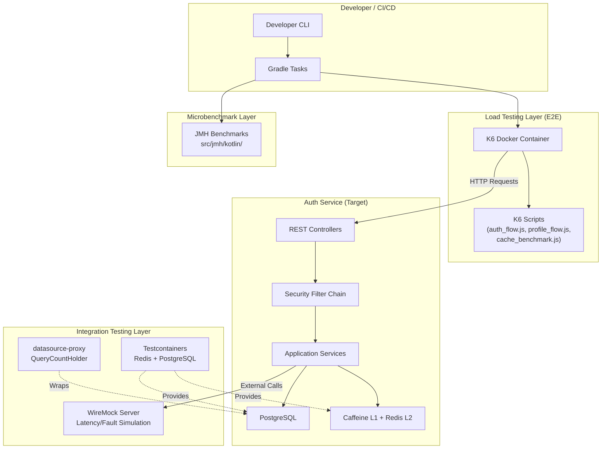
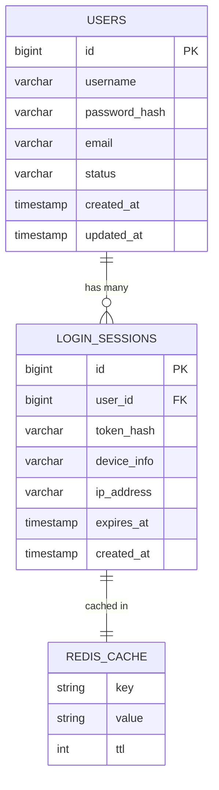
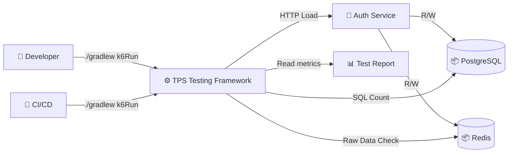
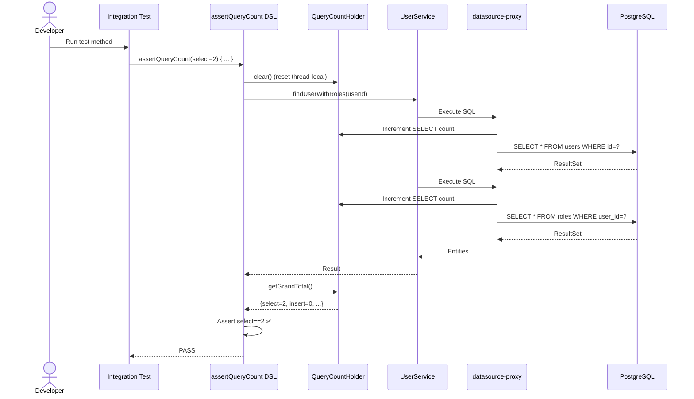
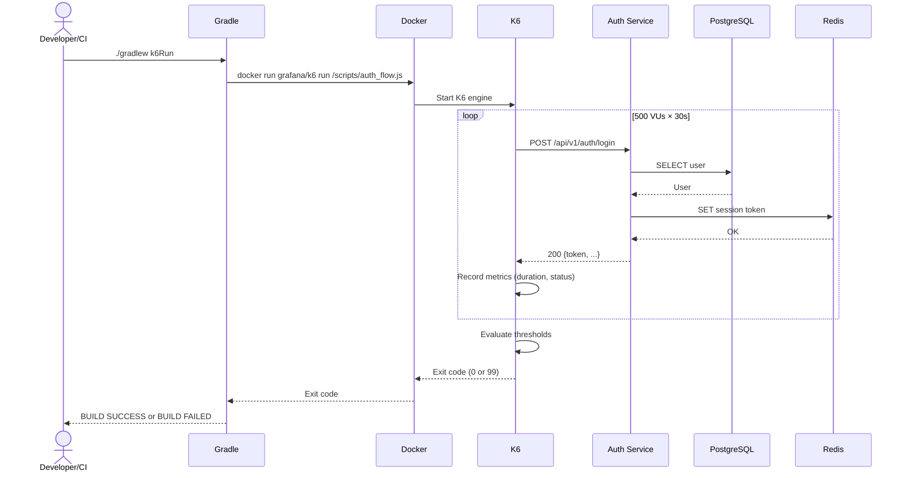
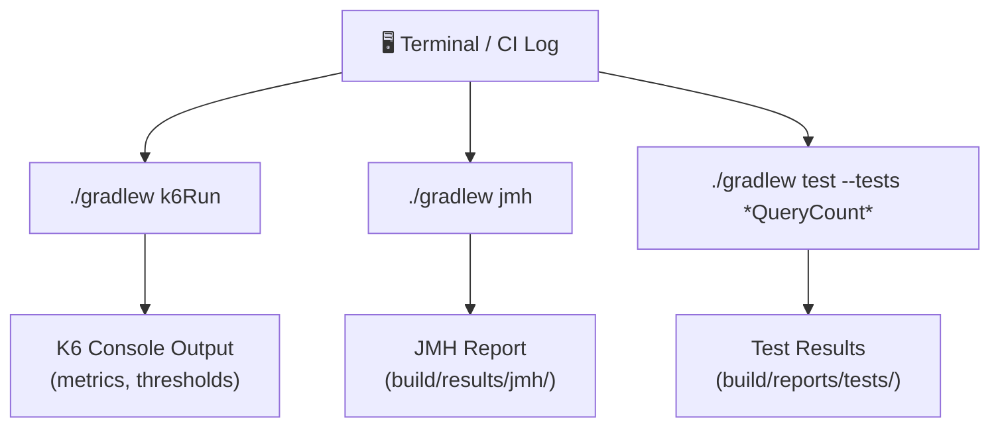

# Đặc tả kỹ thuật: TPS Performance Testing

> Technical specification chi tiết — thiết kế để agent có thể đọc và dev code trực tiếp.

---

## 1. Tổng quan hệ thống (System Overview)

### 1.1 Kiến trúc tổng thể



### 1.2 Technology Stack

| Layer | Technology | Version | Ghi chú |
|-------|-----------|---------|---------|
| Language | Kotlin | JVM 25 | Existing |
| Framework | Spring Boot | 3.x | Existing |
| Database | PostgreSQL | 17-alpine | Existing (Docker) |
| Cache | Redis 7.4 + Caffeine | 7.4-alpine | Existing |
| Load Testing | Grafana K6 | Latest (Docker) | Existing — extend |
| SQL Proxy | datasource-proxy | 1.10+ | New dependency |
| HTTP Mock | WireMock | 3.x | New dependency |
| Microbenchmark | JMH | 1.37+ | New dependency (plugin) |
| Test Containers | Testcontainers | Latest | Existing (implied) |
| Build | Gradle (Kotlin DSL) | Latest | Existing |

### 1.3 Dependencies & Integrations

| Dependency | Type | Purpose | Interface |
|-----------|------|---------|-----------|
| grafana/k6 Docker image | External Tool | E2E load testing | Docker exec + scripts |
| datasource-proxy | Library | JDBC query counting | DataSource wrapping |
| wiremock (spring-cloud-contract-wiremock) | Library | HTTP mock/fault simulation | JUnit 5 extension |
| me.champeau.jmh Gradle plugin | Plugin | JMH lifecycle management | Gradle DSL |
| base-testing-starter | Internal | Shared test utilities | Maven dependency |
| base-cache-starter | Internal | Cache abstraction | Maven dependency |

---

## 2. Lược đồ dữ liệu (Data Schema)

### 2.1 Entity-Relationship Diagram

> ⚠️ TPS Performance Testing là **testing infrastructure** — không tạo entities mới.
> Các entities dưới đây là **existing entities** sẽ được test:



### 2.2 Test Configuration Files

#### K6 Script Configuration

| Config | Value | Purpose |
|--------|-------|---------|
| `scenarios.auth_login.vus` | 500 | Virtual Users for login endpoint |
| `scenarios.auth_login.duration` | 30s | Test duration |
| `scenarios.profile_get.vus` | 200 | Virtual Users for profile endpoint |
| `thresholds.http_req_duration` | p(95)<200 | P95 latency threshold |
| `thresholds.http_req_failed` | rate<0.01 | Error rate threshold |

#### datasource-proxy Configuration

| Config | Value | Purpose |
|--------|-------|---------|
| `datasource.proxy.enabled` | true (test profile only) | Enable query counting |
| `datasource.proxy.log-queries` | false (default) | Disable verbose logging |
| `datasource.proxy.slow-query.threshold` | 100ms | Slow query threshold |

---

## 3. Luồng dữ liệu (Data Flow)

### 3.1 Data Flow Diagram — Level 0 (Context)



### 3.2 Data Flow Diagram — Level 1 (chi tiết)

```mermaid
graph TB
    subgraph "K6 E2E Load Test Flow"
        K6Start["Start K6 Container"] --> K6Exec["Execute Scenarios"]
        K6Exec --> K6Metrics["Collect Metrics<br/>TPS, P95, Errors"]
        K6Metrics --> K6Threshold["Evaluate Thresholds"]
        K6Threshold -->|"Pass"| K6Exit0["Exit 0 ✅"]
        K6Threshold -->|"Fail"| K6Exit99["Exit 99 ❌"]
    end

    subgraph "assertQueryCount Flow"
        AQReset["Reset QueryCountHolder"] --> AQExec["Execute Code Block"]
        AQExec --> AQCount["Read Query Counts"]
        AQCount --> AQAssert["Assert Expected vs Actual"]
        AQAssert -->|"Match"| AQPass["Test PASS ✅"]
        AQAssert -->|"Mismatch"| AQFail["Test FAIL ❌"]
    end

    subgraph "Cache Encryption Test Flow"
        CETSetup["Start Redis Testcontainer<br/>Configure Encryption Mode"] --> CETExec["Call API → Data Cached"]
        CETExec --> CETRead["Read Raw Redis Data<br/>via StringRedisTemplate"]
        CETRead --> CETAssert["Assert Data Format<br/>(JSON vs Ciphertext)"]
        CETAssert -->|"Match"| CETPass["Test PASS ✅"]
        CETAssert -->|"Mismatch"| CETFail["Test FAIL ❌"]
    end
```



### 3.3 Data Transformation Rules

| # | Input | Process | Output | Validation Rules |
|---|-------|---------|--------|-----------------|
| 1 | K6 HTTP response | Extract `http_req_duration` | P95 latency (ms) | P95 < 200ms |
| 2 | K6 HTTP response | Count failed requests | Error rate (%) | Rate < 1% |
| 3 | datasource-proxy intercept | Increment QueryCountHolder | Query counts (select, insert, update, delete) | Match expected |
| 4 | Redis raw GET | Check if parseable as JSON | Encryption mode determination | NONE→JSON, FULL→not JSON |
| 5 | JMH benchmark iteration | Measure ops/sec | Throughput report | No threshold (informational) |

---

## 4. Luồng xử lý (Processing Steps)

### 4.1 Sequence Diagram — UC-001 (assertQueryCount)



### 4.2 Sequence Diagram — UC-003 (K6 E2E Load Test)



### 4.3 Bảng Step xử lý chi tiết

#### UC-001: Assert SQL Query Count

| Step | Component | Action | Input | Output | Error Handling | Ghi chú |
|------|-----------|--------|-------|--------|---------------|---------|
| 1 | assertQueryCount DSL | Clear thread-local counter | - | Counter = 0 | - | `QueryCountHolder.clear()` |
| 2 | Code block | Execute business logic | Service call | DB queries executed | - | Transparent |
| 3 | datasource-proxy | Intercept JDBC calls, count | SQL statements | Incremented counts | - | Proxy pattern |
| 4 | assertQueryCount DSL | Read counts, compare | Expected vs Actual | Pass/Fail | `AssertionError` with details | Thread-local read |

#### UC-003: K6 E2E Load Test

| Step | Component | Action | Input | Output | Error Handling | Ghi chú |
|------|-----------|--------|-------|--------|---------------|---------|
| 1 | Gradle Exec task | Start Docker K6 | Script path | K6 process | Docker not found → fail | `--network host` |
| 2 | K6 Engine | Parse script | JS file | Scenario config | Parse error → exit 1 | ES6 modules |
| 3 | K6 Engine | Execute scenarios | VU config | HTTP requests | - | Parallel VUs |
| 4 | K6 Engine | Collect metrics | Response data | Aggregated stats | - | Real-time |
| 5 | K6 Engine | Evaluate thresholds | Metric values | Pass/Fail | Exit 99 on fail | Auto |
| 6 | Gradle | Check exit code | Process result | Build pass/fail | Non-zero → BUILD FAILED | - |

---

## 5. Luồng màn hình (Screen Flow)

### 5.1 Screen Map (CLI-based)

> TPS Performance Testing là CLI/terminal-based — không có web UI screens.



### 5.2 Chi tiết từng Screen

| Screen ID | Tên | Mục đích | Data hiển thị | User Actions | Navigation |
|-----------|-----|----------|--------------|-------------|-----------|
| CLI-001 | K6 Test Output | Show load test results | TPS, P95, error rate, thresholds pass/fail | Review metrics | Terminal |
| CLI-002 | JMH Report | Show benchmark results | ops/sec per benchmark method | Review performance | `build/results/jmh/` |
| CLI-003 | Integration Test Report | Show test pass/fail | Green/red test results, query count details | Review failures | `build/reports/tests/` |

---

## 6. API Specification

### 6.1 Endpoint List (Tested by K6)

> Đây là các endpoints HIỆN CÓ mà K6 sẽ test — KHÔNG tạo endpoint mới.

| # | Method | Path | Description | Auth | K6 Scenario |
|---|--------|------|------------|------|------------|
| 1 | `POST` | `/api/v1/auth/login` | User login | None | auth_login |
| 2 | `GET` | `/api/v1/profiles/me` | Get current user profile | JWT | profile_get |
| 3 | `POST` | `/api/v1/auth/token/refresh` | Refresh JWT token | Refresh Token | token_refresh |
| 4 | `POST` | `/api/v1/auth/logout` | User logout | JWT | auth_logout |

### 6.2 K6 Script API

#### auth_flow.js (Enhanced)

```javascript
// scenarios configuration
export const options = {
    scenarios: {
        auth_login: {
            executor: 'ramping-vus',
            startVUs: 0,
            stages: [
                { duration: '10s', target: 100 },
                { duration: '20s', target: 500 },
                { duration: '10s', target: 0 },
            ],
            exec: 'loginFlow',
        },
        profile_get: {
            executor: 'constant-arrival-rate',
            rate: 100,
            timeUnit: '1s',
            duration: '30s',
            preAllocatedVUs: 200,
            exec: 'profileFlow',
        },
    },
    thresholds: {
        'http_req_duration{scenario:auth_login}': ['p(95)<200'],
        'http_req_duration{scenario:profile_get}': ['p(95)<150'],
        'http_req_failed': ['rate<0.01'],
    },
};
```

### 6.3 Error Response Format (RFC 7807)

| HTTP Status | Error Type | Khi nào |
|-------------|-----------|---------|
| N/A | K6 Exit Code 99 | Threshold breach — performance regression |
| N/A | K6 Exit Code 1 | Script error — parse failure |
| N/A | AssertionError | SQL query count mismatch |
| N/A | Gradle BUILD FAILED | Any non-zero exit code from tools |

---

## 7. Security Considerations

### 7.1 Test Data Security
- K6 scripts sử dụng test user credentials — KHÔNG BAO GIỜ dùng production credentials
- Test data isolated trong Docker containers (compose.yaml)
- WireMock stubs KHÔNG chứa real API keys

### 7.2 Test Environment Isolation

| Concern | Mitigation |
|---------|-----------|
| Production database access | K6 scripts hardcode localhost URL. No production DNS. |
| Redis data leakage | Testcontainers Redis — destroyed after test |
| Encryption key exposure | Fixed test key in `application-test.yml` — NOT production key |

---

## 8. Performance Requirements

| Metric | Target | Measurement Method |
|--------|--------|-------------------|
| Login P95 latency | < 200ms | K6 `http_req_duration{scenario:auth_login}` |
| Profile P95 latency | < 150ms | K6 `http_req_duration{scenario:profile_get}` |
| Error rate | < 1% | K6 `http_req_failed` |
| Login TPS (minimum) | ≥ 100 req/s | K6 `http_reqs{scenario:auth_login}` |
| assertQueryCount overhead | < 5ms per test | Benchmark |
| Integration test suite time | < 2 minutes | CI timing |
| K6 full suite time | < 2 minutes | CI timing |

---

## 9. Agent Implementation Notes

> **Section này dành cho AI agent** — chỉ rõ code cần tạo để agent dev trực tiếp.

### 9.1 Classes to Create

| # | Class | Package | Type | Extends/Implements | Mô tả |
|---|-------|---------|------|-------------------|--------|
| 1 | `DataSourceProxyConfig` | `com.ntt.basetesting.config` | @TestConfiguration | - | Configure datasource-proxy wrapping for test context |
| 2 | `AssertQueryCount` | `com.ntt.basetesting.assertion` | Annotation | - | JUnit 5 annotation for query count assertion |
| 3 | `AssertQueryCountExtension` | `com.ntt.basetesting.assertion` | Class | BeforeEachCallback, AfterEachCallback | JUnit 5 extension processing @AssertQueryCount |
| 4 | `QueryCountAssertions` | `com.ntt.basetesting.assertion` | Object (Kotlin) | - | Kotlin DSL: `assertQueryCount(select=N) { block }` |
| 5 | `WireMockExternalServiceTest` | `com.ntt.authservice.auth.integration` | @SpringBootTest | - | Integration test with WireMock latency simulation |
| 6 | `CacheEncryptionCorrectnessTest` | `com.ntt.authservice.auth.integration` | @SpringBootTest | - | Redis raw data verification for encryption modes |
| 7 | `EncryptionBenchmark` | `com.ntt.authservice.benchmark` | Class (@State) | - | JMH benchmark for AES-GCM encryption |
| 8 | `SerializationBenchmark` | `com.ntt.authservice.benchmark` | Class (@State) | - | JMH benchmark for Jackson serialization |

### 9.2 Files to Create/Modify

| # | File | Action | Mô tả |
|---|------|--------|--------|
| 1 | `tests/load/auth_flow.js` | MODIFY | Expand: 500 VUs, ramping-vus + constant-arrival-rate, multi-scenario |
| 2 | `tests/load/profile_flow.js` | MODIFY | Expand: constant-arrival-rate, dynamic token acquisition |
| 3 | `tests/load/cache_benchmark.js` | CREATE | New: K6 script for cache encryption mode benchmarking |
| 4 | `build.gradle.kts` | MODIFY | Add: JMH plugin, WireMock dependency, datasource-proxy (test) |
| 5 | `src/test/resources/application-test-datasource-proxy.yml` | CREATE | datasource-proxy config for test profile |
| 6 | `src/jmh/kotlin/com/ntt/authservice/benchmark/EncryptionBenchmark.kt` | CREATE | JMH encryption benchmark |
| 7 | `src/jmh/kotlin/com/ntt/authservice/benchmark/SerializationBenchmark.kt` | CREATE | JMH serialization benchmark |

### 9.3 Pattern References

| Pattern | Reference | Ghi chú |
|---------|----------|---------|
| datasource-proxy setup | Vlad Mihalcea's SQLStatementCountValidator pattern | DataSourceProxyBeanPostProcessor wraps DataSource after init |
| K6 scenario modeling | K6 docs: constant-arrival-rate executor | Fixed TPS measurement |
| JMH source set | me.champeau.jmh plugin convention: `src/jmh/kotlin/` | Separate from main/test |
| WireMock integration | spring-cloud-contract-wiremock: `@AutoConfigureWireMock` | Auto port binding |
| Cache encryption test | Spring Data Redis `StringRedisTemplate` raw access | Direct key GET |

### 9.4 Integration Points

| Integration | Type | Protocol | Endpoint | Data Format |
|------------|------|----------|----------|------------|
| Auth Service (K6 target) | Sync | HTTP | `localhost:8080/api/v1/auth/*` | JSON |
| PostgreSQL (datasource-proxy) | Sync | JDBC | Wrapped DataSource | SQL |
| Redis (Testcontainer) | Sync | Redis Protocol | Dynamic port | String/Bytes |
| WireMock (SSO mock) | Sync | HTTP | Dynamic port | JSON |
| JMH (benchmark) | Local | JVM | In-process | Objects |

### 9.5 Dependency Additions (build.gradle.kts)

```kotlin
// New dependencies to add:
plugins {
    id("me.champeau.jmh") version "0.7.2"
}

dependencies {
    // datasource-proxy for SQL query counting
    testImplementation("net.ttddyy:datasource-proxy:1.10")
    
    // WireMock for HTTP mock/fault simulation
    testImplementation("org.springframework.cloud:spring-cloud-contract-wiremock")
    
    // JMH for microbenchmarks (managed by plugin)
    jmh("org.openjdk.jmh:jmh-core:1.37")
    jmh("org.openjdk.jmh:jmh-generator-annprocess:1.37")
}

// JMH configuration
jmh {
    fork = 2
    warmupIterations = 5
    iterations = 5
    benchmarkMode = listOf("thrpt", "avgt")
    resultFormat = "JSON"
}
```

### 9.6 Gradle Task Additions

```kotlin
// New/modified Gradle tasks:
tasks.register<Exec>("k6CacheBenchmark") {
    group = "Verification"
    description = "Run K6 Cache Encryption Benchmark"
    workingDir = file("tests/load")
    commandLine("docker", "run", "--rm", "-i",
        "-v", "${workingDir}:/scripts",
        "--network", "host",
        "grafana/k6", "run", "/scripts/cache_benchmark.js")
}
```

### 9.7 Test Cases (high-level)

| # | Test | Type | Scenario | Expected |
|---|------|------|----------|----------|
| 1 | Login query count | Integration | assertQueryCount(select=2) for login | 2 SELECTs (user + roles) |
| 2 | N+1 detection | Integration | Load user with lazy roles without fetch join | FAIL: expected 2, got N+1 |
| 3 | WireMock 2s delay | Integration | SSO callback with 2000ms delay | Timeout or circuit breaker activation |
| 4 | WireMock connection reset | Integration | SSO callback with fault injection | Resilience4j fallback triggered |
| 5 | K6 login 500 VUs | Load (E2E) | 500 VUs, 30s, ramping | P95 < 200ms, error < 1% |
| 6 | K6 profile constant rate | Load (E2E) | 100 req/s, 30s | P95 < 150ms |
| 7 | Cache NONE correctness | Integration | mode=NONE, check Redis raw data | Raw data is valid JSON |
| 8 | Cache FULL correctness | Integration | mode=FULL, check Redis raw data | Raw data is NOT valid JSON |
| 9 | Cache PARTIAL correctness | Integration | mode=PARTIAL, check Redis raw data | JSON with encrypted field values |
| 10 | AES-GCM benchmark | JMH | Encrypt 1KB payload | ops/sec reported |
| 11 | Jackson serialization benchmark | JMH | Serialize UserResponse | ops/sec reported |
| 12 | K6 threshold fail | Load (E2E) | Artificially slow endpoint | Exit code 99 |

---

> **Traceability**: Research Brief → Business Analysis → **Technical Spec** → Implementation
> **Ready for**: `/wf_pre_openspec` hoặc `/wf_openspec` hoặc direct coding
