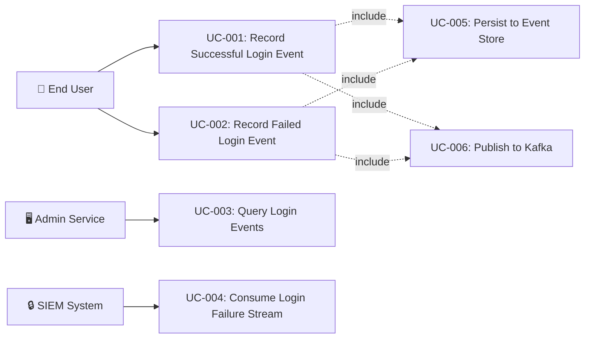

# Tài liệu phân tích nghiệp vụ: User Login Event

> Phân tích nghiệp vụ chi tiết — chia nhỏ theo use case, đặc tả ngữ nghĩa từng chức năng.

---

## 1. Tổng quan (Overview)

### 1.1 Bối cảnh nghiệp vụ (Business Context)

The auth-service handles all authentication for the platform. Currently, successful and failed login attempts are tracked in `login_sessions` table and audit logs but are **not** captured as domain events in the event store or published to Kafka. This creates a gap in:
- **Audit trail completeness** — login events are not queryable from the event store API (`/api/internal/events/{aggregateType}/{aggregateId}`)
- **Cross-service observability** — downstream services (admin-service, analytics, SIEM) cannot react to login events in real-time
- **Security monitoring** — no structured event stream for anomaly detection (impossible travel, brute force patterns, new device alerts)
- **Compliance** — SOC2 and ISO 27001 require comprehensive authentication event logging with structured audit trails

The feature creates two domain events (`UserLoggedInEvent`, `UserLoginFailedEvent`) that integrate with the existing EventService → event store → outbox → Kafka pipeline, closing this observability gap.

### 1.2 Mục tiêu (Objectives)

| # | Mục tiêu | KPI đo lường | Độ ưu tiên |
|---|---------|-------------|-----------|
| O-01 | Record all successful logins as domain events in event store | 100% login events recorded (verified by event store query) | High |
| O-02 | Record all failed login attempts as domain events in event store | 100% failure events recorded (verified by event store query) | High |
| O-03 | Publish login events to Kafka for downstream consumption | Events available on `iam.user.logged_in` and `iam.user.login_failed` topics | High |
| O-04 | Provide enriched context in event payload for security analytics | Event contains IP, device, user-agent, MFA status, login method | Medium |
| O-05 | Ensure event recording never blocks authentication flow | Login P95 latency increase < 5ms after event recording integration | High |

### 1.3 Phạm vi (Scope)

| In Scope | Out of Scope |
|----------|-------------|
| `UserLoggedInEvent` domain event class with enriched payload | GeoIP lookup service implementation |
| `UserLoginFailedEvent` domain event class with failure reason | Real-time anomaly detection algorithms |
| `LoginEventRecorder` helper service | Downstream consumer implementations |
| LoginHandler integration for success/failure events | SSO/OAuth2 login events (SsoAdapter — separate scope) |
| Correlation ID threading from request to event | UI dashboard for login analytics |
| Kafka topic design (`iam.user.logged_in`, `iam.user.login_failed`) | Login event retention policy configuration |

### 1.4 Stakeholders & Actors

| Actor | Loại | Mô tả | Tương tác chính |
|-------|------|--------|----------------|
| End User | Primary | Person performing login action | Triggers login via `/api/auth/login` |
| LoginHandler | System (Internal) | CQRS command handler | Processes login command, invokes LoginEventRecorder |
| EventService | System (Internal) | Event recording pipeline | Persists event to event store + outbox |
| OutboxPoller | System (Internal) | Async Kafka relay | Publishes outbox events to Kafka topics |
| Admin Service | External System | Downstream consumer | Consumes login events for admin dashboard / audit |
| SIEM System | External System | Security monitoring | Consumes login failure events for threat detection |
| Analytics Service | External System | Business analytics | Consumes login events for usage metrics |

---

## 2. Use Case Diagram (tổng quan)



---

## 3. Danh sách Use Case (Use Case Index)

| UC-ID | Tên Use Case | Actor | Nhóm chức năng | Độ ưu tiên | Trạng thái |
|-------|-------------|-------|----------------|-----------|-----------|
| UC-001 | Record Successful Login Event | LoginHandler (system) | Event Recording | High | Draft |
| UC-002 | Record Failed Login Event | LoginHandler (system) | Event Recording | High | Draft |
| UC-003 | Query Login Events from Event Store | Admin Service | Event Query | Medium | Draft |
| UC-004 | Consume Login Events from Kafka | SIEM / Analytics | Event Consumption | Medium | Draft |

---

## 4. Đặc tả Use Case chi tiết

### UC-001: Record Successful Login Event

#### 4.1 Thông tin chung

| Mục | Nội dung |
|-----|----------|
| **Mã** | UC-001 |
| **Tên** | Record Successful Login Event |
| **Mô tả ngữ nghĩa** | Khi user đăng nhập thành công, hệ thống ghi nhận một `UserLoggedInEvent` vào event store và outbox. Event này chứa đầy đủ ngữ cảnh xác thực (device, IP, MFA status, session info) để phục vụ audit trail, anomaly detection, và cross-service observability. Giá trị: đảm bảo mọi lần login thành công đều được truy vết — đáp ứng yêu cầu compliance SOC2/ISO 27001 và cung cấp dữ liệu cho security analytics. |
| **Actor** | LoginHandler (system — triggered by End User login action) |
| **Trigger** | User passes all authentication checks (credentials, account status, CAPTCHA, MFA) in LoginHandler.handle() |
| **Độ ưu tiên** | High |
| **Tần suất** | On every successful login — high frequency (hundreds to thousands per day) |
| **Nhóm chức năng** | Event Recording |

#### 4.2 Điều kiện

| Loại | Mô tả |
|------|--------|
| **Pre-conditions** | User authentication successful (credentials valid, account not locked, MFA passed if required). LoginHandler is about to return `LoginResult.Success`. |
| **Post-conditions (Success)** | `UserLoggedInEvent` persisted to `event_store` table with correct aggregateType=User, aggregateId=userId. Outbox entry created with topic=`iam.user.logged_in`, partitionKey=userId. Login flow completes normally. |
| **Post-conditions (Failure)** | If event recording fails: exception is caught and logged (warn level). Login flow completes normally — event recording failure NEVER blocks authentication. |
| **Invariants** | Authentication result is not affected by event recording success/failure. Event store and outbox are in the same database transaction as the caller. |

#### 4.3 Luồng chính (Basic Flow)

| Step | Actor Action | System Response | Data | Ghi chú |
|------|-------------|----------------|------|---------|
| 1 | LoginHandler completes authentication successfully | LoginHandler invokes `LoginEventRecorder.recordLoginSuccess()` | userId, username, domainCode, ipAddress, userAgent, deviceFingerprint, mfaBypassed, sessionPromotionStatus | After token generation, before returning LoginResult.Success |
| 2 | - | LoginEventRecorder creates `UserLoggedInEvent` data class with enriched payload | UserLoggedInEvent instance | Includes all available context from LoginCommand + User entity |
| 3 | - | LoginEventRecorder delegates to `EventService.record()` | aggregateType="User", aggregateId=userId, topic="iam.user.logged_in", partitionKey=userId.toString() | Same @Transactional boundary as LoginHandler |
| 4 | - | EventService creates EventEnvelope with correlation ID and schema version | EventEnvelope wrapping UserLoggedInEvent | CloudEvents-inspi| UserLoggedInEvent persistence (event store + outbox) MUST be in the same @Transactional boundary as LoginHandler to ensure atomicity. | Verify no separate transaction annotation on LoginEventRecorder |
| BR-003 | One event per successful login | Exactly one `UserLoggedInEvent` per successful LoginHandler.handle() invocation. No duplicates. | Unit test: verify record() called exactly once |
| BR-004 | Complementary to TokenIssuedEvent | UserLoggedInEvent covers auth context (who, where, how). TokenIssuedEvent covers token context (JTI, roles, expiry). They are complementary, not redundant. | Code review: verify no overlapping responsibility |
| BR-005 | Event type follows naming convention | `eventType` must be `"iam.user.logged_in"` following existing `iam.{aggregate}.{action}` pattern | Unit test: verify eventType value |

#### 4.7 Yêu cầu phi chức năng (cho UC này)

| Loại | Yêu cầu | Target |
|------|---------|--------|
| Performance | Event recording latency | < 5ms additional to login P95 |
| Reliability | Event recording failure isolation | 100% login success rate regardless of event store status |
| Throughput | Event recording throughput | Match login TPS (target: 100+ req/s) |
| Durability | Event persistence | Events durable after transaction commit |

#### 4.8 Mockup / Wireframe Description

N/A — UC-001 is a backend system event. No UI screens involved. The event is visible via:
```
GET /api/internal/events/User/{userId}
→ Returns list including UserLoggedInEvent entries
```

---

### UC-002: Record Failed Login Event

#### 4.1 Thông tin chung

| Mục | Nội dung |
|-----|----------|
| **Mã** | UC-002 |
| **Tên** | Record Failed Login Event |
| **Mô tả ngữ nghĩa** | Khi user đăng nhập thất bại, hệ thống ghi nhận một `UserLoginFailedEvent` vào event store. Event chứa lý do thất bại (invalid credentials, account locked, CAPTCHA failed, password expired, rate limited) cùng ngữ cảnh request (IP, device, user-agent). Giá trị: cung cấp dữ liệu cho security monitoring — phát hiện brute force, credential stuffing, và account takeover attempts. |
| **Actor** | LoginHandler (system — triggered by login failure) |
| **Trigger** | Authentication fails at any checkpoint in LoginHandler.handle() (throws exception) |
| **Độ ưu tiên** | High |
| **Tần suất** | On every failed login — can be very high during attacks |
| **Nhóm chức năng** | Event Recording |

#### 4.2 Điều kiện

| Loại | Mô tả |
|------|--------|
| **Pre-conditions** | Login attempt initiated via LoginHandler.handle(). Authentication fails at some checkpoint. |
| **Post-conditions (Success)** | `UserLoginFailedEvent` persisted to event store with aggregateType="User" (or "LoginAttempt" if user unknown), failureReason set. Outbox entry created for Kafka relay. |
| **Post-conditions (Failure)** | If event recording fails: exception caught, logged at WARN. Original authentication exception still propagated to caller. |
| **Invariants** | The original authentication exception is always propagated regardless of event recording outcome. |

#### 4.3 Luồng chính (Basic Flow)

| Step | Actor Action | System Response | Data | Ghi chú |
|------|-------------|----------------|------|---------|
| 1 | LoginHandler authentication check fails | LoginHandler catches the authentication exception before rethrowing | Exception type, username, ipAddress, userAgent, deviceFingerprint | Must catch → record → rethrow |
| 2 | - | LoginHandler invokes `LoginEventRecorder.recordLoginFailure()` | username, failureReason (enum), ipAddress, userAgent, deviceFingerprint | Before rethrowing the exception |
| 3 | - | LoginEventRecorder creates `UserLoginFailedEvent` with failure context | UserLoginFailedEvent instance | Maps exception type to LoginFailureReason enum |
| 4 | - | LoginEventRecorder delegates to `EventService.record()` | aggregateType="User", aggregateId=userId (or 0L if unknown), topic="iam.user.login_failed" | Same transaction if possible |
| 5 | - | EventService persists event + outbox entry | EventStoreEntity + EventOutboxEntity | Atomic persist |
| 6 | - | LoginHandler rethrows the original authentication exception | InvalidCredentialsException, AccountLockedException, etc. | Normal error flow continues |

#### 4.4 Luồng thay thế (Alternative Flows)

##### AF-001: User not found (username unknown)
- **Trigger**: At Step 1 when `userPort.findByUsernameAndActive()` returns null
- **Steps**:
  1. Set `aggregateId = 0L` (no known user), `failureReason = INVALID_CREDENTIALS`
  2. Set `usernameAttempted = command.username` (for audit — NOT sensitive if username is email, mask partially)
- **Rejoin**: Step 3 of Basic Flow

#### 4.5 Luồng ngoại lệ (Exception Flows)

##### EF-001: Event recording fails during failure flow
- **Trigger**: At Step 4 when EventService.record() throws exception
- **Error**: Runtime exception
- **Handling**:
  1. LoginEventRecorder catches exception
  2. Logs warning: `"Failed to record login failure event: username={}, reason={}, error={}"`
  3. Original authentication exception is still rethrown
- **Post-condition**: Authentication failure response returned to client. Failed login event NOT in event store. Gap logged at WARN level.

#### 4.6 Quy tắc nghiệp vụ (Business Rules)

| BR-ID | Quy tắc | Mô tả chi tiết | Validation |
|-------|---------|----------------|-----------|
| BR-006 | Failure reason must be classified | Every `UserLoginFailedEvent` must have a `failureReason` from the `LoginFailureReason` enum. No free-text reasons. | Unit test: verify enum usage |
| BR-007 | No sensitive data in failure event | Password attempt MUST NOT be included in event payload. Username may be included. | Code review: verify no password field |
| BR-008 | Aggregate ID for unknown users | When user is not found, use `aggregateId = 0L` to distinguish from known-user failures | Unit test: verify aggregateId when user null |
| BR-009 | Failure event complementary to rate limiting | UserLoginFailedEvent provides structured data for security analytics. LoginRateLimitService handles real-time blocking. They work together but serve different purposes. | Architecture review |

#### 4.7 Yêu cầu phi chức năng (cho UC này)

| Loại | Yêu cầu | Target |
|------|---------|--------|
| Performance | Event recording latency | < 3ms additional to failure response |
| Reliability | Failure event isolation | Original error always returned to client |
| Security | No sensitive data leakage | Password never in event payload |
| Throughput | Handle attack-level traffic | Support 1000+ failures/min during brute force |

#### 4.8 Mockup / Wireframe Description

N/A — backend system event.

---

### UC-003: Query Login Events from Event Store

#### 4.1 Thông tin chung

| Mục | Nội dung |
|-----|----------|
| **Mã** | UC-003 |
| **Tên** | Query Login Events from Event Store |
| **Mô tả ngữ nghĩa** | Admin service queries login events for a specific user via the existing EventStoreController API. Enables audit trail review, compliance reporting, and investigation of suspicious login patterns. |
| **Actor** | Admin Service (external system via service JWT) |
| **Trigger** | Admin queries `/api/internal/events/User/{userId}` |
| **Độ ưu tiên** | Medium |
| **Tần suất** | On-demand — during audits or investigations |
| **Nhóm chức năng** | Event Query |

#### 4.2 Điều kiện

| Loại | Mô tả |
|------|--------|
| **Pre-conditions** | Admin service has valid service JWT. User ID is known. |
| **Post-conditions (Success)** | List of events returned including `UserLoggedInEvent` and `UserLoginFailedEvent` entries, ordered by sequence number. |
| **Post-conditions (Failure)** | 404 if no events found. 401/403 if unauthorized. |
| **Invariants** | Event store is append-only — events are never modified or deleted. |

#### 4.3 Luồng chính (Basic Flow)

| Step | Actor Action | System Response | Data | Ghi chú |
|------|-------------|----------------|------|---------|
| 1 | Admin Service calls `GET /api/internal/events/User/{userId}` with service JWT | EventStoreController receives request | aggregateType="User", aggregateId=userId | Existing API — no changes needed |
| 2 | - | EventStorePort queries event_store table | List of EventStoreEntity | Ordered by sequence_number ASC |
| 3 | - | Returns JSON response with all events including login events | JSON array of event entries | Login events mixed with other User aggregate events |

#### 4.5 Luồng ngoại lệ (Exception Flows)

##### EF-001: No events found
- **Trigger**: At Step 2 when no events exist for the given user
- **Error**: EventNotFoundException
- **Handling**: Return 404 with error message
- **Post-condition**: No data returned

#### 4.6 Quy tắc nghiệp vụ (Business Rules)

| BR-ID | Quy tắc | Mô tả chi tiết | Validation |
|-------|---------|----------------|-----------|
| BR-010 | Login events are queryable by aggregate | Login events for user X are returned when querying `User/{userId}` | Integration test |
| BR-011 | Events include both success and failure | Query returns all event types for the aggregate — consumer filters by eventType | Verify eventType field |

#### 4.7 Yêu cầu phi chức năng (cho UC này)

| Loại | Yêu cầu | Target |
|------|---------|--------|
| Performance | Query response time | < 200ms for typical user (< 1000 events) |
| Security | Authorization | Service JWT required (ServiceAuthFilter) |

---

### UC-004: Consume Login Events from Kafka

#### 4.1 Thông tin chung

| Mục | Nội dung |
|-----|----------|
| **Mã** | UC-004 |
| **Tên** | Consume Login Events from Kafka |
| **Mô tả ngữ nghĩa** | Downstream services (SIEM, analytics) consume login events from Kafka topics for real-time processing. |
| **Actor** | SIEM System / Analytics Service (external consumers) |
| **Trigger** | OutboxPoller publishes event to Kafka topic |
| **Độ ưu tiên** | Medium |
| **Tần suất** | Continuous — every login event |
| **Nhóm chức năng** | Event Consumption |

#### 4.2 Điều kiện

| Loại | Mô tả |
|------|--------|
| **Pre-conditions** | Kafka cluster available. Consumer subscribed to `iam.user.logged_in` and/or `iam.user.login_failed` topics. |
| **Post-conditions (Success)** | Consumer receives EventEnvelope-wrapped login event and processes it. |
| **Post-conditions (Failure)** | If Kafka unavailable: event remains in outbox as PENDING, retried by OutboxPoller. |
| **Invariants** | At-least-once delivery semantics (OutboxPoller retry). Consumers must be idempotent. |

#### 4.3 Luồng chính (Basic Flow)

| Step | Actor Action | System Response | Data | Ghi chú |
|------|-------------|----------------|------|---------|
| 1 | - | OutboxPoller picks up PENDING entry for login event topic | EventOutboxEntity | Scheduled polling (100ms interval) |
| 2 | - | OutboxPoller sends to Kafka | Kafka message with EventEnvelope JSON | Partitioned by userId |
| 3 | SIEM/Analytics | Consumer receives message from topic | EventEnvelope with UserLoggedInEvent/UserLoginFailedEvent payload | Consumer deserializes and processes |

#### 4.6 Quy tắc nghiệp vụ (Business Rules)

| BR-ID | Quy tắc | Mô tả chi tiết | Validation |
|-------|---------|----------------|-----------|
| BR-012 | Kafka partitioning by userId | All events for the same user go to the same partition for ordering | Verify partitionKey = userId.toString() |
| BR-013 | At-least-once delivery | Consumers must handle duplicate events (OutboxPoller retry semantics) | Consumer design requirement |

---

## 5. Ma trận truy xuất (Traceability Matrix)

| UC-ID | FR-ID | NFR-ID | BR-ID | Screen | API Endpoint | DB Entity |
|-------|-------|--------|-------|--------|-------------|-----------|
| UC-001 | FR-001, FR-003 | NFR-001, NFR-002 | BR-001, BR-002, BR-003, BR-004, BR-005 | N/A | POST /api/auth/login (trigger) | event_store, event_outbox |
| UC-002 | FR-002, FR-004 | NFR-003, NFR-004 | BR-006, BR-007, BR-008, BR-009 | N/A | POST /api/auth/login (trigger) | event_store, event_outbox |
| UC-003 | FR-005 | NFR-005 | BR-010, BR-011 | N/A | GET /api/internal/events/User/{id} | event_store |
| UC-004 | FR-006 | NFR-006 | BR-012, BR-013 | N/A | Kafka topics | event_outbox |

---

## 6. Yêu cầu chức năng tổng hợp (Functional Requirements)

| FR-ID | Tên | Mô tả | UC liên quan | Độ ưu tiên |
|-------|-----|--------|-------------|-----------|
| FR-001 | Record successful login event | Hệ thống phải ghi nhận `UserLoggedInEvent` vào event store khi login thành công | UC-001 | High |
| FR-002 | Record failed login event | Hệ thống phải ghi nhận `UserLoginFailedEvent` vào event store khi login thất bại | UC-002 | High |
| FR-003 | Enriched login success payload | `UserLoggedInEvent` phải chứa: userId, username, domainCode, ipAddress, userAgent, deviceFingerprint, loginMethod, mfaBypassed, isNewDevice, sessionPromotionStatus | UC-001 | High |
| FR-004 | Classified failure reason | `UserLoginFailedEvent` phải chứa `failureReason` enum (INVALID_CREDENTIALS, ACCOUNT_LOCKED, CAPTCHA_FAILED, CAPTCHA_REQUIRED, PASSWORD_EXPIRED, RATE_LIMITED) | UC-002 | High |
| FR-005 | Login events queresearch.md) — OCSF schema, Auth0 events, Microsoft Entra sign-in logs
- [comparison_analysis.md](./comparison_analysis.md) — Build from scratch recommendation

### 9.2 Open Questions
- [ ] OQ-001: Should SSO login events (via SsoAdapter) also record UserLoggedInEvent? Decision: deferred to separate scope.
- [ ] OQ-002: Should anonymous session login (AnonymousAuthController) record a lightweight login event? Decision: not in initial scope — anonymous tokens are not user authentication.

### 9.3 Assumptions
- ⚠️ AS-001: LoginHandler is the single entry point for password-based login — Lý do: verified in codebase scan (CqrsAuthController dispatches to LoginHandler)
- ⚠️ AS-002: EventService.record() handles event store + outbox atomically in caller's transaction — Lý do: verified in EventService.kt (DD-003 pattern)
- ⚠️ AS-003: GeoIP data is not required in initial implementation — Lý do: LoginSessionEntity has geoCountry as placeholder; GeoIP lookup is a separate concern

---

> **Next step**: Technical Specification (technical_spec.md)
> **Traceability**: Research Brief → Business Analysis → Technical Spec
