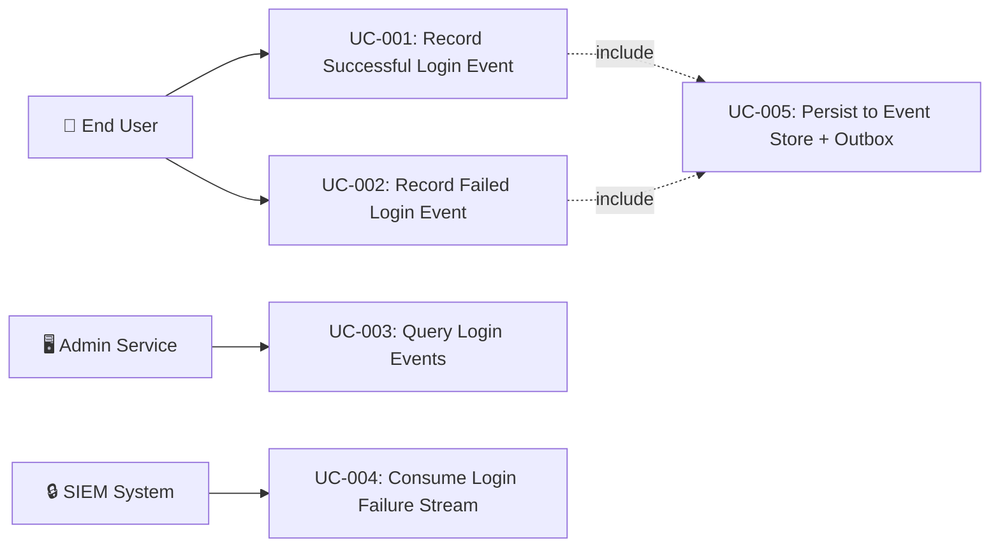

# Tài liệu phân tích nghiệp vụ: User Login Event

> Phân tích nghiệp vụ chi tiết — chia nhỏ theo use case, đặc tả ngữ nghĩa từng chức năng.

---

## 1. Tổng quan (Overview)

### 1.1 Bối cảnh nghiệp vụ (Business Context)

The auth-service handles all authentication for the platform. Currently, successful and failed login attempts are tracked in `login_sessions` table and audit logs but are **not** captured as domain events in the event store or published to Kafka. This creates gaps in audit trail completeness, cross-service observability, security monitoring, and compliance (SOC2/ISO 27001).

This feature creates two domain events (`UserLoggedInEvent`, `UserLoginFailedEvent`) that integrate with the existing EventService → event store → outbox → Kafka pipeline, closing this observability gap.

### 1.2 Mục tiêu (Objectives)

| # | Mục tiêu | KPI đo lường | Độ ưu tiên |
|---|---------|-------------|-----------|
| O-01 | Record all successful logins as domain events | 100% login events recorded | High |
| O-02 | Record all failed login attempts as domain events | 100% failure events recorded | High |
| O-03 | Publish login events to Kafka for downstream consumption | Events on `iam.user.logged_in` / `iam.user.login_failed` topics | High |
| O-04 | Provide enriched context for security analytics | Event contains IP, device, user-agent, MFA status, login method | Medium |
| O-05 | Ensure event recording never blocks authentication flow | Login P95 latency increase < 5ms | High |

### 1.3 Phạm vi (Scope)

| In Scope | Out of Scope |
|----------|-------------|
| `UserLoggedInEvent` domain event with enriched payload | GeoIP lookup service implementation |
| `UserLoginFailedEvent` domain event with failure reason | Real-time anomaly detection algorithms |
| `LoginEventRecorder` helper service | Downstream consumer implementations |
| LoginHandler integration for success/failure events | SSO/OAuth2 login events (SsoAdapter scope) |
| Correlation ID threading from request to event | UI dashboard for login analytics |
| Kafka topic design | Login event retention policy |

### 1.4 Stakeholders & Actors

| Actor | Loại | Mô tả | Tương tác chính |
|-------|------|--------|----------------|
| End User | Primary | Person performing login action | Triggers login via `/api/auth/login` |
| LoginHandler | System (Internal) | CQRS command handler | Processes login, invokes LoginEventRecorder |
| EventService | System (Internal) | Event recording pipeline | Persists event to event store + outbox |
| OutboxPoller | System (Internal) | Async Kafka relay | Publishes outbox events to Kafka |
| Admin Service | External System | Downstream consumer | Consumes login events for audit |
| SIEM System | External System | Security monitoring | Consumes failure events for threat detection |

---

## 2. Use Case Diagram (tổng quan)

---

## 3. Danh sách Use Case (Use Case Index)

| UC-ID | Tên Use Case | Actor | Nhóm chức năng | Độ ưu tiên | Trạng thái |
|-------|-------------|-------|----------------|-----------|-----------|
| UC-001 | Record Successful Login Event | LoginHandler (system) | Event Recording | High | Draft |
| UC-002 | Record Failed Login Event | LoginHandler (system) | Event Recording | High | Draft |
| UC-003 | Query Login Events from Event Store | Admin Service | Event Query | Medium | Draft |
| UC-004 | Consume Login Events from Kafka | SIEM / Analytics | Event Consumption | Medium | Draft |

---

## 4. Đặc tả Use Case chi tiết

### UC-001: Record Successful Login Event

#### 4.1 Thông tin chung

| Mục | Nội dung |
|-----|----------|
| **Mã** | UC-001 |
| **Tên** | Record Successful Login Event |
| **Mô tả ngữ nghĩa** | Khi user đăng nhập thành công, hệ thống ghi nhận `UserLoggedInEvent` vào event store và outbox chứa đầy đủ ngữ cảnh xác thực (device, IP, MFA status, session info) để phục vụ audit trail, anomaly detection, compliance SOC2/ISO 27001. |
| **Actor** | LoginHandler (system) |
| **Trigger** | User passes all authentication checks in LoginHandler.handle() |
| **Độ ưu tiên** | High |
| **Tần suất** | On every successful login — high frequency |
| **Nhóm chức năng** | Event Recording |

#### 4.2 Điều kiện

| Loại | Mô tả |
|------|--------|
| **Pre-conditions** | User authentication successful. LoginHandler about to return LoginResult.Success. |
| **Post-conditions (Success)** | UserLoggedInEvent in event_store + event_outbox. Login flow completes normally. |
| **Post-conditions (Failure)** | Exception caught and logged (WARN). Login flow completes normally — never blocks auth. |
| **Invariants** | Authentication result not affected by event recording success/failure. |

#### 4.3 Luồng chính (Basic Flow)

| Step | Actor Action | System Response | Data | Ghi chú |
|------|-------------|----------------|------|---------|
| 1 | LoginHandler completes auth | Invokes LoginEventRecorder.recordLoginSuccess() | userId, username, domainCode, ipAddress, userAgent, deviceFingerprint, mfaBypassed, sessionPromotionStatus | After token generation |
| 2 | - | Creates UserLoggedInEvent data class | Event instance with enriched payload | All context from LoginCommand + User |
| 3 | - | Delegates to EventService.record() | aggregateType="User", topic="iam.user.logged_in", partitionKey=userId | Same @Transactional |
| 4 | - | EventService persists to event_store + event_outbox | EventStoreEntity + EventOutboxEntity | Atomic |
| 5 | - | LoginHandler returns LoginResult.Success | AuthResponse | Event recording transparent to caller |

#### 4.4 Luồng thay thế (Alternative Flows)

##### AF-001: Login with anonymous session promotion
- **Trigger**: At Step 1 when `command.anonymousSessionId` is not blank
- **Steps**: Set `sessionPromotionStatus` field to promotion result (SUCCESS/FAILED/null)
- **Rejoin**: Step 2 of Basic Flow

#### 4.5 Luồng ngoại lệ (Exception Flows)

##### EF-001: Event recording failure
- **Trigger**: At Step 3/4 when EventService.record() throws exception
- **Error**: RuntimeException (DB failure, serialization error)
- **Handling**: LoginEventRecorder catches, logs WARN: "Failed to record login event"
- **Post-condition**: Login succeeds. Event NOT in store. Gap logged.

#### 4.6 Quy tắc nghiệp vụ (Business Rules)

| BR-ID | Quy tắc | Mô tả chi tiết | Validation |
|-------|---------|----------------|-----------|
| BR-001 | Fire-and-forget recording | Event recording failure MUST NOT throw exception to caller | Unit test: verify no exception propagation |
| BR-002 | Same-transaction persistence | Event store + outbox in caller's @Transactional | Verify no separate @Transactional on recorder |
| BR-003 | One event per login | Exactly one UserLoggedInEvent per successful login | Unit test: verify record() called once |
| BR-004 | Complementary to TokenIssuedEvent | UserLoggedInEvent = auth context. TokenIssuedEvent = token context. Not redundant. | Code review |
| BR-005 | Event type naming convention | eventType = "iam.user.logged_in" following iam.{aggregate}.{action} pattern | Unit test |

#### 4.7 Yêu cầu phi chức năng (cho UC này)

| Loại | Yêu cầu | Target |
|------|---------|--------|
| Performance | Event recording latency | < 5ms additional to login P95 |
| Reliability | Failure isolation | 100% login success regardless of event store |
| Throughput | Match login TPS | 100+ req/s |

#### 4.8 Mockup / Wireframe Description

N/A — backend system event. Visible via `GET /api/internal/events/User/{userId}`.

---

### UC-002: Record Failed Login Event

#### 4.1 Thông tin chung

| Mục | Nội dung |
|-----|----------|
| **Mã** | UC-002 |
| **Tên** | Record Failed Login Event |
| **Mô tả ngữ nghĩa** | Khi login thất bại, hệ thống ghi `UserLoginFailedEvent` với failure reason classification (INVALID_CREDENTIALS, ACCOUNT_LOCKED, CAPTCHA_FAILED, PASSWORD_EXPIRED, RATE_LIMITED) cùng request context (IP, device) cho security monitoring — phát hiện brute force, credential stuffing. |
| **Actor** | LoginHandler (system) |
| **Trigger** | Authentication fails at any checkpoint in LoginHandler |
| **Độ ưu tiên** | High |
| **Tần suất** | On every failed login — can spike during attacks |
| **Nhóm chức năng** | Event Recording |

#### 4.2 Điều kiện

| Loại | Mô tả |
|------|--------|
| **Pre-conditions** | Login attempt initiated. Authentication fails. |
| **Post-conditions (Success)** | UserLoginFailedEvent in event_store + event_outbox. Original exception rethrown. |
| **Post-conditions (Failure)** | Recording fails → caught, WARN logged. Original exception still rethrown. |
| **Invariants** | Original authentication exception always propagnal via service JWT) |
| **Trigger** | GET /api/internal/events/User/{userId} |
| **Độ ưu tiên** | Medium |
| **Tần suất** | On-demand |
| **Nhóm chức năng** | Event Query |

#### 4.3 Luồng chính (Basic Flow)

| Step | Actor Action | System Response | Data | Ghi chú |
|------|-------------|----------------|------|---------|
| 1 | Admin calls GET /api/internal/events/User/{userId} | EventStoreController receives | aggregateType, aggregateId | Existing API |
| 2 | - | EventStorePort queries event_store | List of EventStoreEntity | Ordered by sequence_number |
| 3 | - | Returns JSON with all events incl. login events | JSON array | Consumer filters by eventType |

#### 4.6 Quy tắc nghiệp vụ (Business Rules)

| BR-ID | Quy tắc | Mô tả chi tiết | Validation |
|-------|---------|----------------|-----------|
| BR-010 | Login events queryable by aggregate | Events returned when querying User/{userId} | Integration test |
| BR-011 | Both success and failure returned | Consumer filters by eventType field | Verify eventType |

---

### UC-004: Consume Login Events from Kafka

#### 4.1 Thông tin chung

| Mục | Nội dung |
|-----|----------|
| **Mã** | UC-004 |
| **Tên** | Consume Login Events from Kafka |
| **Mô tả ngữ nghĩa** | Downstream services consume login events from Kafka for real-time processing. |
| **Actor** | SIEM / Analytics (external consumers) |
| **Trigger** | OutboxPoller publishes to Kafka |
| **Độ ưu tiên** | Medium |
| **Tần suất** | Continuous |
| **Nhóm chức năng** | Event Consumption |

#### 4.3 Luồng chính (Basic Flow)

| Step | Actor Action | System Response | Data | Ghi chú |
|------|-------------|----------------|------|---------|
| 1 | - | OutboxPoller picks PENDING entry | EventOutboxEntity | 100ms polling |
| 2 | - | Sends to Kafka | EventEnvelope JSON | Partitioned by userId |
| 3 | Consumer | Receives message | UserLoggedInEvent/UserLoginFailedEvent | Deserialize and process |

#### 4.6 Quy tắc nghiệp vụ (Business Rules)

| BR-ID | Quy tắc | Mô tả chi tiết | Validation |
|-------|---------|----------------|-----------|
| BR-012 | Partitioning by userId | Same user → same partition for ordering | Verify partitionKey |
| BR-013 | At-least-once delivery | Consumers must be idempotent | Consumer design |

---

## 5. Ma trận truy xuất (Traceability Matrix)

| UC-ID | FR-ID | NFR-ID | BR-ID | Screen | API Endpoint | DB Entity |
|-------|-------|--------|-------|--------|-------------|-----------|
| UC-001 | FR-001, FR-003 | NFR-001, NFR-002 | BR-001~005 | N/A | POST /api/auth/login | event_store, event_outbox |
| UC-002 | FR-002, FR-004 | NFR-003, NFR-004 | BR-006~009 | N/A | POST /api/auth/login | event_store, event_outbox |
| UC-003 | FR-005 | NFR-005 | BR-010~011 | N/A | GET /api/internal/events/User/{id} | event_store |
| UC-004 | FR-006 | NFR-006 | BR-012~013 | N/A | Kafka topics | event_outbox |

---

## 6. Yêu cầu chức năng tổng hợp (Functional Requirements)

| FR-ID | Tên | Mô tả | UC liên quan | Độ ưu tiên |
|-------|-----|--------|-------------|-----------|
| FR-001 | Record successful login event | Ghi UserLoggedInEvent vào event store khi login thành công | UC-001 | High |
| FR-002 | Record failed login event | Ghi UserLoginFailedEvent vào event store khi login thất bại | UC-002 | High |
| FR-003 | Enriched login success payload | UserLoggedInEvent chứa userId, username, domainCode, ipAddress, userAgent, deviceFingerprint, loginMethod, mfaBypassed, isNewDevice, sessionPromotionStatus | UC-001 | High |
| FR-004 | Classified failure reason | UserLoginFailedEvent chứa failureReason enum | UC-002 | High |
| FR-005 | Login events queryable via event store API | Events returned by GET /api/internal/events/User/{userId} | UC-003 | Medium |
| FR-006 | Login events published to Kafka | Events on iam.user.logged_in and iam.user.login_failed topics | UC-004 | Medium |

---

## 7. Yêu cầu phi chức năng tổng hợp (Non-Functional Requirements)

| NFR-ID | Loại | Yêu cầu | Target | Measurement |
|--------|------|---------|--------|-------------|
| NFR-001 | Performance | Event recording latency | < 5ms additional to login P95 | APM monitoring |
| NFR-002 | Reliability | Failure isolation | 100% login success regardless of event store | Integration test |
| NFR-003 | Security | No sensitive data in events | Password never in payload | Code review |
| NFR-004 | Throughput | Handle attack traffic | 1000+ failures/min | Load test |
| NFR-005 | Performance | Event query response | < 200ms for < 1000 events | API test |
| NFR-006 | Reliability | At-least-once Kafka delivery | Events retried until published | OutboxPoller monitoring |

---

## 8. Thuật ngữ nghiệp vụ (Glossary)

| Thuật ngữ | Định nghĩa | Context sử dụng |
|-----------|-----------|-----------------|
| UserLoggedInEvent | Domain event emitted on successful password-based login | Event store, Kafka topic |
| UserLoginFailedEvent | Domain event emitted on failed login attempt | Event store, Kafka topic |
| LoginEventRecorder | Helper service wrapping EventService calls for login events | Application layer |
| LoginFailureReason | Enum classifying login failure types | UserLoginFailedEvent payload |
| EventEnvelope | CloudEvents-inspired wrapper with correlation ID | All domain events |
| Transactional Outbox | Pattern for reliable event publishing via DB + async relay | EventService + OutboxPoller |
| Fire-and-forget | Event recording that never blocks the primary flow | LoginEventRecorder error handling |

---

## 9. Phụ lục (Appendix)

### 9.1 Research References
- [opensource_findings.md](./opensource_findings.md) — Keycloak, Axon, ORY Kratos event models
- [web_research.md](./web_research.md) — OCSF schema, Auth0, Microsoft Entra sign-in logs
- [comparison_analysis.md](./comparison_analysis.md) — Build from scratch recommendation

### 9.2 Open Questions
- [ ] OQ-001: Should SSO login events (SsoAdapter) also record UserLoggedInEvent? Decision: deferred to separate scope.
- [ ] OQ-002: Should anonymous session login record a lightweight event? Decision: not in initial scope.

### 9.3 Assumptions
- ⚠️ AS-001: LoginHandler is the single entry point for password-based login — Lý do: verified in codebase
- ⚠️ AS-002: EventService.record() handles event store + outbox atomically — Lý do: verified (DD-003)
- ⚠️ AS-003: GeoIP not required initially — Lý do: LoginSessionEntity has geoCountry placeholder

---

> **Next step**: Technical Specification (technical_spec.md)
> **Traceability**: Research Brief → Business Analysis → Technical Spec
