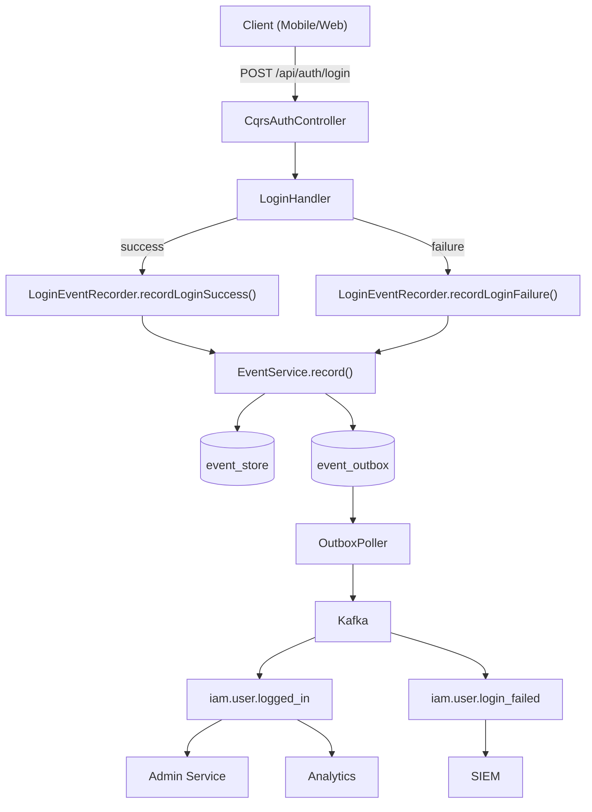
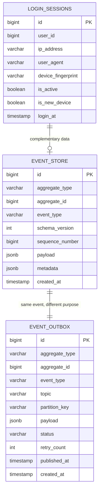
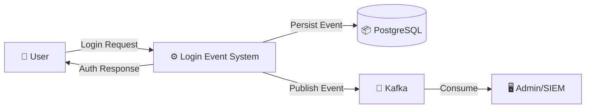
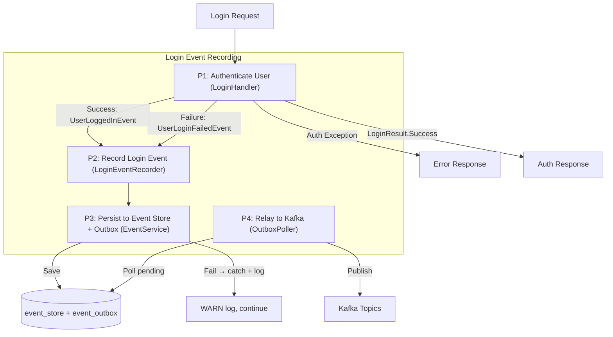
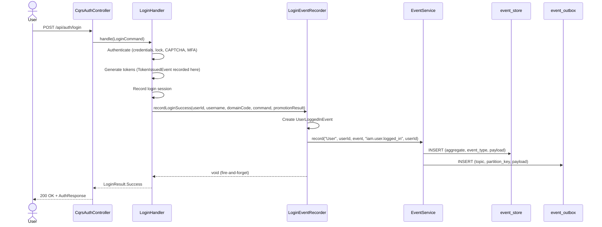
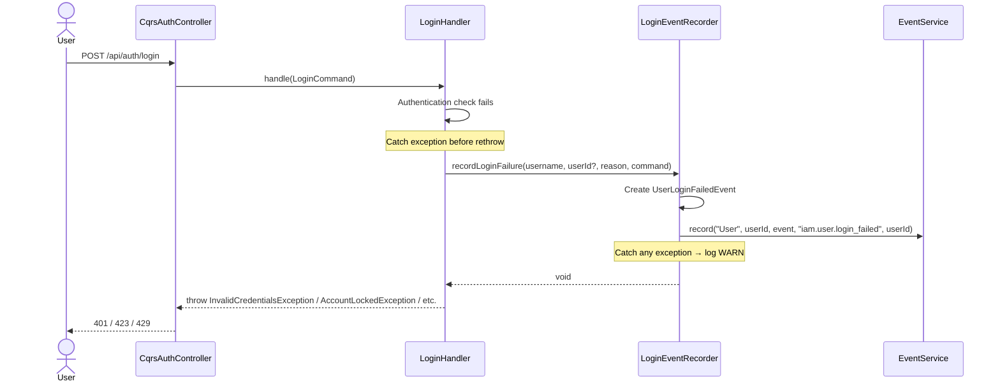

# Đặc tả kỹ thuật: User Login Event

> Technical specification chi tiết — thiết kế để agent có thể đọc và dev code trực tiếp.

---

## 1. Tổng quan hệ thống (System Overview)

### 1.1 Kiến trúc tổng thể



### 1.2 Technology Stack

| Layer | Technology | Version | Ghi chú |
|-------|-----------|---------|---------|
| Language | Kotlin | 1.9+ | Data classes for domain events |
| Framework | Spring Boot | 3.x | @Component, @Service, @Transactional |
| Database | PostgreSQL | 15+ | event_store, event_outbox tables (existing) |
| Cache | Redis | 7.x | Not directly used by this feature |
| Message Queue | Kafka | 3.x | iam.user.logged_in, iam.user.login_failed topics |
| Serialization | Jackson | 2.17+ | JSON with Kotlin module + JSR310 |
| CQRS | eventsourcing-utils | 0.0.1-SNAPSHOT | CommandHandler interface |
| Base entity | base-core | 0.0.1-SNAPSHOT | SnowflakePersistentAuditableEntity |

### 1.3 Dependencies & Integrations

| Dependency | Type | Purpose | Interface |
|-----------|------|---------|-----------|
| EventService | Internal | Event store + outbox persistence | EventService.record() |
| LoginHandler | Internal | Integration point for recording | LoginEventRecorder called from handler |
| LoginSessionService | Internal | Source of device/session metadata | Already called by LoginHandler |
| OutboxPoller | Internal | Async Kafka relay | Reads event_outbox table |
| Kafka | Infrastructure | Event streaming | Topics: iam.user.logged_in, iam.user.login_failed |

---

## 2. Lược đồ dữ liệu (Data Schema)

### 2.1 Entity-Relationship Diagram



### 2.2 No New Tables Required

This feature uses existing tables:
- **`event_store`** — append-only event log (existing, via EventStorePort)
- **`event_outbox`** — transactional outbox (existing, via OutboxPort)
- **`login_sessions`** — login session tracking (existing, via LoginSessionService)

No database migration required. The new domain events are persisted as JSON payloads in the existing event_store and event_outbox tables.

### 2.3 Event Payload Schemas

#### UserLoggedInEvent Payload (stored in event_store.payload as EventEnvelope)

```json
{
  "id": "uuid-v4",
  "type": "iam.user.logged_in",
  "source": "auth-service",
  "specversion": "1.0",
  "time": "2025-08-22T10:30:00Z",
  "correlationId": "req-correlation-id",
  "schemaVersion": 1,
  "data": {
    "userId": 12345,
    "username": "john.doe",
    "domainCode": "DEFAULT",
    "domainId": 1,
    "loginMethod": "PASSWORD",
    "mfaBypassed": true,
    "mfaMethod": null,
    "isNewDevice": false,
    "ipAddress": "192.168.1.100",
    "userAgent": "Mozilla/5.0...",
    "deviceFingerprint": "abc123hash",
    "sessionPromotionStatus": "SUCCESS",
    "loggedInAt": "2025-08-22T10:30:00Z"
  }
}
```

#### UserLoginFailedEvent Payload

```json
{
  "id": "uuid-v4",
  "type": "iam.user.login_failed",
  "source": "auth-service",
  "specversion": "1.0",
  "time": "2025-08-22T10:30:05Z",
  "correlationId": "req-correlation-id",
  "schemaVersion": 1,
  "data": {
    "usernameAttempted": "john.doe",
    "userId": 12345,
    "failureReason": "INVALID_CREDENTIALS",
    "ipAddress": "192.168.1.100",
    "userAgent": "Mozilla/5.0...",
    "deviceFingerprint": "abc123hash",
    "failedAt": "2025-08-22T10:30:05Z"
  }
}
```

---

## 3. Luồng dữ liệu (Data Flow)

### 3.1 Data Flow Diagram — Level 0



### 3.2 Data Flow Diagram — Level 1



### 3.3 Data Transformation Rules

| # | Input | Process | Output | Validation Rules |
|---|-------|---------|--------|-----------------|
| 1 | LoginCommand.ipAddress | Direct mapping | UserLoggedInEvent.ipAddress | Nullable, max 45 chars |
| 2 | LoginCommand.userAgent | Direct mapping | UserLoggedInEvent.userAgent | Nullable, max 500 chars |
| 3 | LoginCommand.deviceFingerprint | Direct mapping | UserLoggedInEvent.deviceFingerprint | Nullable, max 64 chars |
| 4 | User.id.value | Direct mapping | UserLoggedInEvent.userId | NOT NULL, Long |
| 5 | LoginCommand.anonymousSessionId | Map to promotion status | UserLoggedInEvent.sessionPromotionStatus | Nullable, from PromotionResult.Status |
| 6 | Exception type | Map to LoginFailureReason enum | UserLoginFailedEvent.failureReason | NOT NULL, enum value |

---

## 4. Luồng xử lý (Processing Steps)

### 4.1 Sequence Diagram — UC-001: Record Successful Login Event



### 4.2 Sequence Diagram — UC-002: Record Failed Login Event



### 4.3 Bảng Step xử lý chi tiết

#### LoginHandler Integration (modified flow)

| Step | Component | Action | Input | Output | Error Handling | Ghi chú |
|------|-----------|--------|-------|--------|---------------|---------|
| 1-11 | LoginHandler | Existing authentication flow | LoginCommand | Auth result | Existing exceptions | No changes to existing steps |
| 12 | LoginEventRecorder | Record success event | User, command, promotionResult | void | Catch + log WARN | NEW — after token generation |
| 13 | LoginHandler | Return LoginResult.Success | AuthResponse | LoginResult.Success | - | Existing |
| F1 | LoginHandler | Catch auth exception | Exception | - | - | NEW — wrap existing throws |
| F2 | LoginEventRecorder | Record failure event | username, reason, command | void | Catch + log WARN | NEW — before rethrow |
| F3 | LoginHandler | Rethrow original exception | Exception | - | Propagates to controller | Existing behavior preserved |

---

## 5. Luồng màn hình (Screen Flow)

N/A — This feature is entirely backend. No UI screens.

Login events are visible via:
- `GET /api/internal/events/User/{userId}` — existing EventStoreController (no changes needed)
- Kafka topics `iam.user.logged_in` / `iam.user.login_failed` — consumed by downstream services

---

## 6. API Specification

### 6.1 No New Endpoints

This feature does not introduce new API endpoints. It integrates with:

| # | Method | Path | Description | Change |
|---|--------|------|------------|--------|
| 1 | `POST` | `/api/auth/login` | Existing login endpoint | Internal: LoginHandler now records events (invisible to caller) |
| 2 | `GET` | `/api/internal/events/User/{id}` | Existing event store query | Returns login events alongside other User events (no change needed) |

### 6.2 Kafka Message Format

#### Topic: `iam.user.logged_in`

```json
{
  "id": "550e8400-e29b-41d4-a716-446655440000",
  "type": "iam.user.logged_in",
  "source": "auth-service",
  "specversion": "1.0",
  "time": "2025-08-22T10:30:00Z",
  "correlationId": "corr-123-abc",
  "schemaVersion": 1,
  "data": {
    "userId": 12345,
    "username": "john.doe",
    "domainCode": "DEFAULT",
    "domainId": 1,
    "loginMethod": "PASSWORD",
    "mfaBypassed": true,
    "mfaMethod": null,
    "isNewDevice": false,
    "ipAddress": "192.168.1.100",
    "userAgent": "Mozilla/5.0 (Windows NT 10.0; Win64; x64) Chrome/120.0.0.0",
    "deviceFingerprint": "sha256-device-hash",
    "sessionPromotionStatus": null,
    "loggedInAt": "2025-08-22T10:30:00Z"
  }
}
```

#### Topic: `iam.user.login_failed`

```json
{
  "id": "550e8400-e29b-41d4-a716-446655440001",
  "type": "iam.user.login_failed",
  "source": "auth-service",
  "specversion": "1.0",
  "time": "2025-08-22T10:30:05Z",
  "correlationId": "corr-456-def",
  "schemaVersion": 1,
  "data": {
    "usernameAttempted": "john.doe",
    "userId": null,
    "failureReason": "INVALID_CREDENTIALS",
    "ipAddress": "10.0.0.1",
    "userAgent": "curl/7.88.1",
    "deviceFingerprint": null,
    "failedAt": "2025-08-22T10:30:05Z"
  }
}
```

---

## 7. Security Considerations

### 7.1 Data Protection

| Concern | Mitigation |
|---------|-----------|
| Password in event payload | **NEVER** include password or password hash in login events |
| Username exposure | Username is acceptable in events (not PII in most contexts) — mask if required by policy |
| IP address logging | Compliant with legitimate interest (security monitoring) under GDPR |
| Event store access | Protected by ServiceAuthFilter — service JWT required |

### 7.2 Authorization Matrix

| Role | Record Login Event | Query Event Store | Consume Kafka |
|------|:---:|:---:|:---:|
| End User | ❌ (system-triggered) | ❌ | ❌ |
| LoginHandler (system) | ✅ (automatic) | ❌ | ❌ |
| Admin Service (service JWT) | ❌ | ✅ | ✅ |
| SIEM (Kafka consumer) | ❌ | ❌ | ✅ |

---

## 8. Performance Requirements

| Metric | Target | Measurement Method |
|--------|--------|-------------------|
| Event recording latency (P95) | < 5ms additional | APM tracing on LoginEventRecorder |
| Login endpoint P95 (with events) | < 200ms total | K6 load test |
| Event store write throughput | > 200 events/sec | DB monitoring |
| Outbox relay latency (P95) | < 500ms from persist to Kafka | OutboxPoller metrics |
| Kafka message size | < 1KB per event | Message size monitoring |

---

## 9. Agent Implementation Notes

> **Section này dành cho AI agent** — chỉ rõ code cần tạo để agent dev trực tiếp.

### 9.1 Classes to Create

| # | Class | Package | Type | Extends/Implements | Mô tả |
|---|-------|---------|------|-------------------|--------|
| 1 | `UserLoggedInEvent` | `auth.domain.event` | data class | DomainEvent | Domain event for successful login with enriched context |
| 2 | `UserLoginFailedEvent` | `auth.domain.event` | data class | DomainEvent | Domain event for failed login with failure reason |
| 3 | `LoginFailureReason` | `auth.domain.event` | enum class | - | Enum classifying failure types |
| 4 | `LoginEventRecorder` | `auth.application.event` | @Component | - | Helper service for login event recording (mirrors TokenEventRecorder) |

### 9.2 Classes to Modify

| # | Class | Package | Change Description |
|---|-------|---------|-------------------|
| 1 | `LoginHandler` | `auth.application.command` | Add LoginEventRecorder dependency. Call recordLoginSuccess() after successful auth. Wrap failure paths to call recordLoginFailure() before rethrowing. |
| 2 | `LoginCommand` | `auth.application.command` | Add optional `correlationId: String?` field (if not already present) |

### 9.3 Detailed Class Specifications

#### UserLoggedInEvent

```kotlin
// File: src/main/kotlin/com/ntt/authservice/auth/domain/event/UserLoggedInEvent.kt
package com.ntt.authservice.auth.domain.event

import com.ntt.authservice.auth.application.port.out.DomainEvent
import java.time.Instant

data class UserLoggedInEvent(
    val userId: Long,
    val username: String,
    val domainCode: String,
    val domainId: Long?,
    val loginMethod: String,         // "PASSWORD", "SSO", "MFA_COMPLETION"
    val mfaBypassed: Boolean,        // true if MFA was required but bypassed (trusted device)
    val mfaMethod: String?,          // "TOTP", "OTP_EMAIL", null if no MFA
    val isNewDevice: Boolean,
    val ipAddress: String?,
    val userAgent: String?,
    val deviceFingerprint: String?,
    val sessionPromotionStatus: String?, // "SUCCESS", "FAILED", null if no promotion
    val loggedInAt: Instant = Instant.now()
) : DomainEvent {
    override val eventType: String = "iam.user.logged_in"
}
```

#### UserLoginFailedEvent

```kotlin
// File: src/main/kotlin/com/ntt/authservice/auth/domain/event/UserLoginFailedEvent.kt
package com.ntt.authservice.auth.domain.event

import com.ntt.authservice.auth.application.port.out.DomainEvent
import java.time.Instant

data class UserLoginFailedEvent(
    val usernameAttempted: String,
    val userId: Long?,               // null if user not found
    val failureReason: LoginFailureReason,
    val ipAddress: String?,
    val userAgent: String?,
    val deviceFingerprint: String?,
    val failedAt: Instant = Instant.now()
) : DomainEvent {
    override val eventType: String = "iam.user.login_failed"
}
```

#### LoginFailureReason

```kotlin
// File: src/main/kotlin/com/ntt/authservice/auth/domain/event/LoginFailureReason.kt
package com.ntt.authservice.auth.domain.event

enum class LoginFailureReason {
    INVALID_CREDENTIALS,    // Wrong username or password
    ACCOUNT_LOCKED,         // Account locked due to failed attempts
    ACCOUNT_DISABLED,       // Account deactivated
    CAPTCHA_REQUIRED,       // CAPTCHA needed but not provided
    CAPTCHA_FAILED,         // CAPTCHA verification failed
    PASSWORD_EXPIRED,       // Password policy expired
    RATE_LIMITED,           // Login rate limit exceeded
    MFA_REQUIRED,           // MFA needed (not a failure per se, but blocks login)
    UNKNOWN                 // Unexpected failure
}
```

#### LoginEventRecorder

```kotlin
// File: src/main/kotlin/com/ntt/authservice/auth/application/event/LoginEventRecorder.kt
package com.ntt.authservice.auth.application.event

// Follows TokenEventRecorder pattern exactly:
// - Delegates to EventService.record()
// - Catches all exceptions (fire-and-forget)
// - Logs at DEBUG on success, WARN on failure
@Component
class LoginEventRecorder(
    private val eventService: EventService
) {
    fun recordLoginSuccess(event: UserLoggedInEvent, userId: Long, correlationId: String?) {
        try {
            eventService.record(
                aggregateType = "User",
                aggregateId = userId,
                event = event,
                topic = "iam.user.logged_in",
                partitionKey = userId.toString(),
                correlationId = correlationId
            )
        } catch (e: Exception) {
            log.warn("Failed to record login success event: userId={}, error={}", userId, e.message, e)
        }
    }

    fun recordLoginFailure(event: UserLoginFailedEvent, correlationId: String?) {
        try {
            eventService.record(
                aggregateType = "User",
                aggregateId = event.userId ?: 0L,
                event = event,
                topic = "iam.user.login_failed",
                partitionKey = (event.userId ?: 0L).toString(),
                correlationId = correlationId
            )
        } catch (e: Exception) {
            log.warn("Failed to record login failure event: username={}, reason={}, error={}",
                event.usernameAttempted, event.failureReason, e.message, e)
        }
    }
}
```

### 9.4 LoginHandler Integration Strategy

The LoginHandler.handle() method needs modification to record events. Key integration points:

**Success path** (after line ~160, before returning LoginResult.Success):
```kotlin
// Record login event (fire-and-forget)
loginEventRecorder.recordLoginSuccess(
    event = UserLoggedInEvent(
        userId = user.id.value,
        username = user.username,
        domainCode = domainCode,
        domainId = domain?.id,
        loginMethod = "PASSWORD",
        mfaBypassed = !user.requiresMfa(...), // was MFA check passed via trusted device?
        mfaMethod = user.mfaMethod?.name,
        isNewDevice = false, // from LoginSessionService detection
        ipAddress = command.ipAddress,
        userAgent = command.userAgent,
        deviceFingerprint = command.deviceFingerprint,
        sessionPromotionStatus = promotionResult?.status?.name
    ),
    userId = user.id.value,
    correlationId = command.correlationId
)
```

**Failure paths** — each exception throw site needs a preceding event recording call. Map exceptions:
- `InvalidCredentialsException` → `LoginFailureReason.INVALID_CREDENTIALS`
- `AccountLockedException` → `LoginFailureReason.ACCOUNT_LOCKED`
- `CaptchaRequiredException` → `LoginFailureReason.CAPTCHA_REQUIRED`
- `CaptchaFailedException` → `LoginFailureReason.CAPTCHA_FAILED`
- `PasswordExpiredException` → `LoginFailureReason.PASSWORD_EXPIRED`

### 9.5 Pattern References

| Pattern | Reference | Ghi chú |
|---------|----------|---------|
| Event recording | `TokenEventRecorder.kt` → recordIssuance() | Same fire-and-forget pattern |
| Domain event | `TokenIssuedEvent.kt`, `UserRegisteredEvent.kt` | Same DomainEvent interface + eventType field |
| Event persistence | `EventService.kt` → record() | Same record() API with aggregateType, topic, partitionKey |
| Error handling | `TokenEventRecorder.kt` → try/catch with log.warn | Same resilience pattern |
| Failure reason enum | `ValidationFailureReason.kt` | Same enum discriminator pattern |

### 9.6 Integration Points

| Integration | Type | Protocol | Endpoint | Data Format |
|------------|------|----------|----------|------------|
| EventService | Sync (in-process) | Method call | EventService.record() | Domain event object |
| event_store table | Sync (DB) | JPA | EventStorePort.append() | JSON payload |
| event_outbox table | Sync (DB) | JPA | OutboxPort.insert() | JSON payload |
| Kafka | Async | OutboxPoller | iam.user.logged_in, iam.user.login_failed | EventEnvelope JSON |

### 9.7 Test Cases (high-level)

| # | Test | Type | Scenario | Expected |
|---|------|------|----------|----------|
| 1 | Login success records event | Unit | Successful login with all fields | LoginEventRecorder.recordLoginSuccess() called once with correct UserLoggedInEvent |
| 2 | Login failure records event | Unit | Invalid credentials | LoginEventRecorder.recordLoginFailure() called with INVALID_CREDENTIALS |
| 3 | Account locked records event | Unit | Locked account login attempt | LoginEventRecorder.recordLoginFailure() called with ACCOUNT_LOCKED |
| 4 | CAPTCHA required records event | Unit | Failed login threshold exceeded | LoginEventRecorder.recordLoginFailure() called with CAPTCHA_REQUIRED |
| 5 | CAPTCHA failed records event | Unit | Invalid CAPTCHA token | LoginEventRecorder.recordLoginFailure() called with CAPTCHA_FAILED |
| 6 | Password expired records event | Unit | Expired password login | LoginEventRecorder.recordLoginFailure() called with PASSWORD_EXPIRED |
| 7 | Event recording failure is swallowed | Unit | EventService.record() throws RuntimeException | Login still succeeds, no exception propagated |
| 8 | Failure event recording failure is swallowed | Unit | EventService.record() throws on failure path | Original auth exception still thrown to caller |
| 9 | UserLoggedInEvent eventType | Unit | Verify eventType constant | eventType == "iam.user.logged_in" |
| 10 | UserLoginFailedEvent eventType | Unit | Verify eventType constant | eventType == "iam.user.login_failed" |
| 11 | No password in events | Unit | Verify event fields | No password field in UserLoggedInEvent or UserLoginFailedEvent |
| 12 | Session promotion status captured | Unit | Login with anonymous session | sessionPromotionStatus field populated |
| 13 | New device flag captured | Unit | Login from new device | isNewDevice = true in event |
| 14 | MFA bypass flag | Unit | Login with trusted device | mfaBypassed = true |
| 15 | Aggregate ID for unknown user | Unit | User not found | aggregateId = 0L in failure event |

---

> **Traceability**: Research Brief → Business Analysis → **Technical Spec** → Implementation
> **Ready for**: `/wf_pre_openspec` hoặc `/wf_openspec` hoặc direct coding
