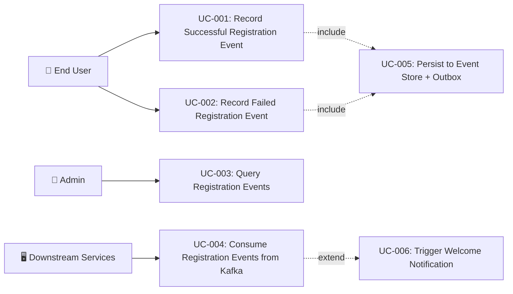

# Tài liệu phân tích nghiệp vụ: User Registration Event

> Phân tích nghiệp vụ chi tiết — chia nhỏ theo use case, đặc tả ngữ nghĩa từng chức năng.

---

## 1. Tổng quan (Overview)

### 1.1 Bối cảnh nghiệp vụ (Business Context)

Hệ thống auth-service đã triển khai `UserRegisteredEvent` domain event để ghi nhận sự kiện đăng ký người dùng mới. Event này được persist vào event store và relay qua Kafka outbox tới downstream services. Tuy nhiên, cần cải tiến:

1. **Thiếu RegistrationEventRecorder** — RegisterHandler gọi trực tiếp `EventService.record()` mà không có fire-and-forget protection, nghĩa là nếu event recording thất bại, toàn bộ registration transaction sẽ rollback.
2. **Thiếu UserRegistrationFailedEvent** — Không có sự kiện structured cho registration failures (duplicate username, invalid domain), gây khó khăn cho security monitoring.
3. **Thiếu consumer documentation** — Chưa document rõ downstream services nào consume `iam.user.registered` topic.

### 1.2 Mục tiêu (Objectives)

| # | Mục tiêu | KPI đo lường | Độ ưu tiên |
|---|---------|-------------|-----------|
| O-01 | Đảm bảo mọi đăng ký người dùng thành công đều được ghi nhận vào event store + outbox | 100% registration events persisted | High |
| O-02 | Cung cấp structured failure events cho security monitoring | RegistrationFailureReason enum coverage ≥ 5 failure types | High |
| O-03 | Đảm bảo registration event recording không block main flow | Event recording failure does not rollback user creation | Medium |
| O-04 | Document downstream consumers cho iam.user.registered topic | Consumer list documented with expected reactions | Medium |

### 1.3 Phạm vi (Scope)

| In Scope | Out of Scope |
|----------|-------------|
| RegistrationEventRecorder helper service | Email verification flow |
| UserRegistrationFailedEvent domain event | OAuth2/SSO registration events |
| RegistrationFailureReason enum | User profile enrichment service |
| Fire-and-forget event recording pattern | GDPR data subject request handling |
| Kafka topic consumer documentation | Cross-service saga orchestration |
| Schema versioning strategy documentation | Database migration changes |

### 1.4 Stakeholders & Actors

| Actor | Loại | Mô tả | Tương tác chính |
|-------|------|--------|----------------|
| End User | Primary | Người dùng đăng ký tài khoản mới | Trigger registration via API |
| RegisterHandler | System (Internal) | CQRS command handler xử lý registration | Creates user + records events |
| EventService | System (Internal) | Central event recording service | Persists events to store + outbox |
| OutboxPoller | System (Internal) | Async Kafka relay | Publishes events from outbox to Kafka |
| Downstream Services | External System | account-service, notification-service, analytics | Consume iam.user.registered from Kafka |
| Security Monitor | External System | SIEM/monitoring system | Consume iam.user.registration_failed from Kafka |
| Admin | Secondary | System administrator | Queries event store via admin API |

---

## 2. Use Case Diagram (tổng quan)



---

## 3. Danh sách Use Case (Use Case Index)

| UC-ID | Tên Use Case | Actor | Nhóm chức năng | Độ ưu tiên | Trạng thái |
|-------|-------------|-------|----------------|-----------|-----------|
| UC-001 | Record Successful Registration Event | End User (trigger) / RegisterHandler (system) | Event Recording | High | Draft |
| UC-002 | Record Failed Registration Event | End User (trigger) / RegisterHandler (system) | Event Recording | High | Draft |
| UC-003 | Query Registration Events from Event Store | Admin | Event Query | Medium | Draft |
| UC-004 | Consume Registration Events from Kafka | Downstream Services | Event Consumption | Medium | Draft |

---

## 4. Đặc tả Use Case chi tiết

### UC-001: Record Successful Registration Event

#### 4.1 Thông tin chung

| Mục | Nội dung |
|-----|----------|
| **Mã** | UC-001 |
| **Tên** | Record Successful Registration Event |
| **Mô tả ngữ nghĩa** | Khi người dùng đăng ký thành công, hệ thống ghi nhận domain event `UserRegisteredEvent` vào event store và outbox. Event này là nguồn duy nhất (single source of truth) cho downstream services biết có user mới, triggering welcome email, profile provisioning, và analytics tracking. Nếu không có event này, downstream services sẽ không bao giờ biết user mới đã được tạo. |
| **Actor** | End User (trigger) → RegisterHandler (system executor) |
| **Trigger** | Người dùng gửi POST /api/auth/register với thông tin hợp lệ |
| **Độ ưu tiên** | High |
| **Tần suất** | On-demand — mỗi khi có user đăng ký mới |
| **Nhóm chức năng** | Event Recording |

#### 4.2 Điều kiện

| Loại | Mô tả |
|------|--------|
| **Pre-conditions** | User entity đã được persist thành công vào DB (userPort.save() completed); RegisterCommand chứa đầy đủ thông tin (username, email, password, fullName, domainCode) |
| **Post-conditions (Success)** | EventStoreEntity appended (aggregate_type=User, event_type=iam.user.registered); EventOutboxEntity inserted (topic=iam.user.registered, status=PENDING); Log entry: "REGISTER_EVENT_RECORDED" |
| **Post-conditions (Failure)** | Nếu fire-and-forget: log.warn event recording failure, user creation vẫn thành công; Nếu transactional: toàn bộ transaction rollback (user + event) |
| **Invariants** | Event envelope luôn có correlation ID (auto-generated nếu không provided); schemaVersion = 1 |

#### 4.3 Luồng chính (Basic Flow)

| Step | Actor Action | System Response | Data | Ghi chú |
|------|-------------|----------------|------|---------|
| 1 | User submits registration form | CqrsAuthController receives POST /api/auth/register | RegisterRequest DTO | Validated via @Valid |
| 2 | - | RegisterHandler.handle() creates User entity and persists | User entity saved to DB | @Transactional boundary |
| 3 | - | RegistrationEventRecorder.recordRegistrationSuccess() called | UserRegisteredEvent with 11 enriched fields | Fire-and-forget wrapper |
| 4 | - | EventService.record() wraps event in EventEnvelope | EventEnvelope with UUID id, correlationId, schemaVersion=1 | Same TX as caller |
| 5 | - | EventStorePort.append() persists to event_store table | EventStoreEntity with aggregate_type=User, sequence_number | Append-only log |
| 6 | - | OutboxPort.insert() inserts into event_outbox table | EventOutboxEntity with topic=iam.user.registered, status=PENDING | Same TX — atomic |
| 7 | - | Transaction commits — user + event store + outbox all persisted | - | ACID guarantee |
| 8 | - | OutboxPoller picks up PENDING entry and publishes to Kafka | Kafka message to topic iam.user.registered | Async, with retry |

#### 4.4 Luồng thay thế (Alternative Flows)

##### AF-001: Registration with Anonymous Session Promotion
- **Trigger**: Tại Step 2 khi `command.anonymousSessionId` is not null
- **Steps**:
  1. RegisterHandler creates user and persists
  2. SessionPromotionService.promoteSession() transfers anonymous session data
  3. UserRegisteredEvent.registrationSource set to "ANONYMOUS_PROMOTION"
  4. Continue from Step 3 of Basic Flow
- **Rejoin**: Quay lại Step 3 của Basic Flow

##### AF-002: Registration with Externally Provided Correlation ID
- **Trigger**: Tại Step 1 khi X-Correlation-ID header is present
- **Steps**:
  1. CqrsAuthController extracts X-Correlation-ID from request header
  2. RegisterCommand.correlationId set to header value
  3. EventService.record() uses provided correlationId instead of generating UUID
- **Rejoin**: Quay lại Step 4 của Basic Flow

#### 4.5 Luồng ngoại lệ (Exception Flows)

##### EF-001: Event Recording Failure (fire-and-forget)
- **Trigger**: Tại Step 4 khi EventService.record() throws exception (DB connection failure, JSON serialization error)
- **Error**: Event recording infrastructure error
- **Handling**:
  1. RegistrationEventRecorder catches exception
  2. log.warn("Failed to record registration success event: userId={}, error={}", ...)
  3. Return — user creation still committed
- **Post-condition**: User entity persisted, event NOT persisted. Reconciliation job can detect and re-record.

##### EF-002: Outbox Kafka Publish Failure
- **Trigger**: Tại Step 8 khi OutboxPoller fails to publish to Kafka
- **Error**: Kafka broker unavailable or timeout
- **Handling**:
  1. OutboxPoller increments retry_count on EventOutboxEntity
  2. Retries up to maxRetries (default: 3) with next poll cycle
  3. If max retries exceeded, marks entry as FAILED
  4. log.error("OUTBOX_MAX_RETRIES_EXCEEDED")
- **Post-condition**: Event in event_store (persisted), outbox entry in FAILED state. Manual intervention needed.

#### 4.6 Quy tắc nghiệp vụ (Business Rules)

| BR-ID | Quy tắc | Mô tả chi tiết | Validation |
|-------|---------|----------------|-----------|
| BR-001 | Event immutability | Once written to event store, events MUST NOT be modified or deleted | Append-only table constraint |
| BR-002 | Event ordering | Events for same aggregate MUST have monotonically increasing sequence_number | EventStorePort.getNextSequenceNumber() |
| BR-003 | Registration source classification | registrationSource MUST be "DIRECT" or "ANONYMOUS_PROMOTION" | RegisterHandler.determineRegistrationSource() |
| BR-004 | Correlation ID presence | Every event MUST have a correlationId (auto-generated UUID if not provided) | EventService.record() default |
| BR-005 | Event envelope compliance | All events MUST be wrapped in EventEnvelope with specversion=1.0, source=auth-service | EventService.record() enforces |

#### 4.7 Yêu cầu phi chức năng (cho UC này)

| Loại | Yêu cầu | Target |
|------|---------|--------|
| Performance | Event recording overhead | < 20ms added to registration latency |
| Reliability | Event delivery guarantee | At-least-once via outbox pattern |
| Availability | Registration not blocked by event infra | Fire-and-forget — 0% impact on registration availability |
| Throughput | Event store write throughput | Matches registration throughput (100+ events/sec) |

#### 4.8 Mockup / Wireframe Description

```
N/A — Backend-only feature. No UI screens.
Event flow is observable via:
- GET /api/internal/events/User/{id} — Event Store query API
- Kafka consumer on topic: iam.user.registered
- Application logs: REGISTER_EVENT_RECORDED
```

---

### UC-002: Record Failed Registration Event

#### 4.1 Thông tin chung

| Mục | Nội dung |
|-----|----------|
| **Mã** | UC-002 |
| **Tên** | Record Failed Registration Event |
| **Mô tả ngữ nghĩa** | Khi đăng ký thất bại (duplicate username, invalid domain, weak password, etc.), hệ thống ghi nhận `UserRegistrationFailedEvent` với failure reason classification. Event này phục vụ security monitoring — phát hiện brute-force registration attacks, detect mass automated registration attempts, và cung cấp audit trail cho compliance. |
| **Actor** | End User (trigger) → RegisterHandler (system executor) |
| **Trigger** | Người dùng gửi POST /api/auth/register với thông tin không hợp lệ hoặc bị reject |
| **Độ ưu tiên** | High |
| **Tần suất** | On-demand — mỗi khi có registration attempt thất bại |
| **Nhóm chức năng** | Event Recording |

#### 4.2 Điều kiện

| Loại | Mô tả |
|------|--------|
| **Pre-conditions** | RegisterHandler.handle() received valid RegisterCommand; Validation or business rule check failed |
| **Post-conditions (Success)** | EventStoreEntity appended (aggregate_type=User, event_type=iam.user.registration_failed); EventOutboxEntity inserted (topic=iam.user.registration_failed, status=PENDING) |
| **Post-conditions (Failure)** | log.warn event recording failure; Original exception still thrown to caller |
| **Invariants** | Failure event recording MUST NOT affect the original exception flow — always fire-and-forget |

#### 4.3 Luồng chính (Basic Flow)

| Step | Actor Action | System Response | Data | Ghi chú |
|------|-------------|----------------|------|---------|
| 1 | User submits registration form | RegisterHandler.handle() begins processing | RegisterCommand | @Transactional |
| 2 | - | Validation fails (e.g., duplicate username) | DuplicateResourceException | Business rule violation |
| 3 | - | Catch block: RegistrationEventRecorder.recordRegistrationFailure() called | UserRegistrationFailedEvent with failure reason | Fire-and-forget |
| 4 | - | EventService.record() wraps event in EventEnvelope | EventEnvelope | Separate transaction or fire-and-forget |
| 5 | - | EventStorePort.append() + OutboxPort.insert() | Event persisted | Best-effort |
| 6 | - | Original exception rethrown to CqrsAuthController | 409 Conflict / 404 Not Found / 400 Bad Request | Normal error handling |

#### 4.4 Luồng thay thế (Alternative Flows)

##### AF-001: Unknown Failure Reason
- **Trigger**: Tại Step 2 khi unexpected exception type
- **Steps**:
  1. Failure reason classified as RegistrationFailureReason.UNKNOWN
  2. Exception message captured in UserRegistrationFailedEvent.errorMessage
- **Rejoin**: Quay lại Step 3 của Basic Flow

#### 4.5 Luồng ngoại lệ (Exception Flows)

##### EF-001: Failure Event Recording Failure
- **Trigger**: Tại Step 4 khi EventService.record() throws
- **Error**: Infrastructure error during failure event recording
- **Handling**:
  1. log.warn("Failed to record registration failure event: username={}, reason={}, error={}", ...)
  2. Original exception still rethrown — event recording failure is swallowed
- **Post-condition**: Registration failure properly returned to user, failure event NOT recorded

#### 4.6 Quy tắc nghiệp vụ (Business Rules)

| BR-ID | Quy tắc | Mô tả chi tiết | Validation |
|-------|---------|----------------|-----------|
| BR-006 | Failure reason classification | Every failed registration MUST have a classified RegistrationFailureReason | Enum covers all known failure types |
| BR-007 | Fire-and-forget mandatory | Failure event recording MUST NOT block or modify the original error response | try/catch wrapper mandatory |
| BR-008 | Aggregate ID for unknown user | When user doesn't exist (duplicate check), aggregateId = 0L | Convention from TokenEventRecorder |

#### 4.7 Yêu cầu phi chức năng (cho UC này)

| Loại | Yêu cầu | Target |
|------|---------|--------|
| Performance | Failure event recording overhead | < 10ms (fire-and-forget, no blocking) |
| Reliability | Best-effort delivery | Failure event loss acceptable — monitoring, not business-critical |
| Security | Sensitive data exclusion | Password MUST NOT appear in failure event payload |

#### 4.8 Mockup / Wireframe Description

```
N/A — Backend-only feature. Observable via:
- Kafka consumer on topic: iam.user.registration_failed
- Application logs: log.warn "Failed registration..."
- SIEM dashboard: RegistrationFailureReason breakdown
```

---

### UC-003: Query Registration Events from Event Store

#### 4.1 Thông tin chung

| Mục | Nội dung |
|-----|----------|
| **Mã** | UC-003 |
| **Tên** | Query Registration Events from Event Store |
| **Mô tả ngữ nghĩa** | Admin truy vấn event store để xem lịch sử registration events cho một user cụ thể. Hỗ trợ audit trail và troubleshooting. |
| **Actor** | Admin |
| **Trigger** | Admin calls GET /api/internal/events/User/{id} |
| **Độ ưu tiên** | Medium |
| **Tần suất** | On-demand — troubleshooting and audit purposes |
| **Nhóm chức năng** | Event Query |

#### 4.2 Điều kiện

| Loại | Mô tả |
|------|--------|
| **Pre-conditions** | Admin is authenticated with admin role; User ID is known |
| **Post-conditions (Success)** | List of EventStoreEntity returned, filtered by aggregate_type=User and aggregate_id |
| **Post-conditions (Failure)** | 401 Unauthorized or 403 Forbidden |
| **Invariants** | Event store data is read-only — no modification allowed |

#### 4.3 Luồng chính (Basic Flow)

| Step | Actor Action | System Response | Data | Ghi chú |
|------|-------------|----------------|------|---------|
| 1 | Admin calls GET /api/internal/events/User/{id} | EventStoreController handles request | userId path variable | Existing API |
| 2 | - | EventStorePort queries event_store table | WHERE aggregate_type='User' AND aggregate_id={id} | Ordered by sequence_number |
| 3 | - | Return list of events including iam.user.registered entries | List of EventStoreEntity | JSON response |

#### 4.5 Luồng ngoại lệ (Exception Flows)

##### EF-001: No Events Found
- **Trigger**: Tại Step 2 khi no events exist for user
- **Error**: N/A (empty list is valid)
- **Handling**: Return empty list with 200 OK
- **Post-condition**: Admin sees empty event history

#### 4.6 Quy tắc nghiệp vụ (Business Rules)

| BR-ID | Quy tắc | Mô tả chi tiết | Validation |
|-------|---------|----------------|-----------|
| BR-009 | Read-only access | Event store queries MUST NOT modify data | SELECT-only, no UPDATE/DELETE |
| BR-010 | Admin-only access | Only users with admin role can query event store | @PreAuthorize on EventStoreController |

#### 4.7 Yêu cầu phi chức năng (cho UC này)

| Loại | Yêu cầu | Target |
|------|---------|--------|
| Performance | Query response time | < 200ms for typical user (< 100 events) |
| Security | Authorization | Admin role required |

---

### UC-004: Consume Registration Events from Kafka

#### 4.1 Thông tin chung

| Mục | Nội dung |
|-----|----------|
| **Mã** | UC-004 |
| **Tên** | Consume Registration Events from Kafka |
| **Mô tả ngữ nghĩa** | Downstream services (account-service, notification-service, analytics-service, admin-service) consume `iam.user.registered` events from Kafka để trigger downstream actions: profile provisioning, welcome email, user analytics, audit log. Đây là event-driven architecture foundation cho user onboarding flow. |
| **Actor** | Downstream Services (consumers) |
| **Trigger** | OutboxPoller publishes UserRegisteredEvent to Kafka topic iam.user.registered |
| **Độ ưu tiên** | Medium |
| **Tần suất** | Event-driven — triggered by each successful registration |
| **Nhóm chức năng** | Event Consumption |

#### 4.2 Điều kiện

| Loại | Mô tả |
|------|--------|
| **Pre-conditions** | Kafka cluster available; Consumer group subscribed to iam.user.registered; EventEnvelope message published by OutboxPoller |
| **Post-conditions (Success)** | Consumer processes event and performs downstream action (profile creation, notification send, etc.) |
| **Post-conditions (Failure)** | Consumer retries or DLQ; No data loss due to Kafka retention |
| **Invariants** | At-least-once delivery — consumers MUST be idempotent |

#### 4.3 Luồng chính (Basic Flow)

| Step | Actor Action | System Response | Data | Ghi chú |
|------|-------------|----------------|------|---------|
| 1 | - | OutboxPoller publishes EventEnvelope to iam.user.registered | Kafka message with JSON payload | Partition key = userId |
| 2 | Consumer polls Kafka | Message received | EventEnvelope<UserRegisteredEvent> | Deserialized from JSON |
| 3 | Consumer extracts event data | Process event: userId, username, email, fullName, domainCode | UserRegisteredEvent fields | Event-specific logic |
| 4 | Consumer performs downstream action | e.g., Create user profile, send welcome email, track analytics | Domain-specific data | Idempotent operation |
| 5 | Consumer commits offset | Kafka offset acknowledged | Consumer offset | At-least-once |

#### 4.6 Quy tắc nghiệp vụ (Business Rules)

| BR-ID | Quy tắc | Mô tả chi tiết | Validation |
|-------|---------|----------------|-----------|
| BR-011 | Idempotent consumption | Consumers MUST handle duplicate events (at-least-once delivery) | userId-based dedup |
| BR-012 | Schema backward compatibility | Producer MUST NOT remove or rename existing fields in UserRegisteredEvent | Code review, schema documentation |

#### 4.7 Yêu cầu phi chức năng (cho UC này)

| Loại | Yêu cầu | Target |
|------|---------|--------|
| Latency | Event delivery to consumer | < 5 seconds (outbox poll interval + Kafka latency) |
| Reliability | At-least-once delivery | Guaranteed by Kafka + outbox pattern |
| Durability | Kafka message retention | 7 days default |

---

## 5. Ma trận truy xuất (Traceability Matrix)

| UC-ID | FR-ID | NFR-ID | BR-ID | Screen | API Endpoint | DB Entity |
|-------|-------|--------|-------|--------|-------------|-----------|
| UC-001 | FR-001, FR-002, FR-003 | NFR-001, NFR-002 | BR-001, BR-002, BR-003, BR-004, BR-005 | N/A | POST /api/auth/register | event_store, event_outbox |
| UC-002 | FR-004, FR-005 | NFR-003 | BR-006, BR-007, BR-008 | N/A | POST /api/auth/register | event_store, event_outbox |
| UC-003 | FR-006 | NFR-004 | BR-009, BR-010 | N/A | GET /api/internal/events/User/{id} | event_store |
| UC-004 | FR-007 | NFR-005, NFR-006 | BR-011, BR-012 | N/A | Kafka topic: iam.user.registered | N/A (Kafka) |

---

## 6. Yêu cầu chức năng tổng hợp (Functional Requirements)

| FR-ID | Tên | Mô tả | UC liên quan | Độ ưu tiên |
|-------|-----|--------|-------------|-----------|
| FR-001 | Registration Success Event Recording | Hệ thống phải ghi nhận UserRegisteredEvent vào event store + outbox khi user đăng ký thành công | UC-001 | High |
| FR-002 | RegistrationEventRecorder Helper | Hệ thống phải có RegistrationEventRecorder helper service với fire-and-forget error handling | UC-001, UC-002 | High |
| FR-003 | Enriched Event Payload | UserRegisteredEvent phải chứa full context: userId, username, email, fullName, phone, domainCode, domainId, status, registrationSource, ipAddress, userAgent | UC-001 | High |
| FR-004 | Registration Failure Event | Hệ thống phải ghi nhận UserRegistrationFailedEvent khi registration thất bại | UC-002 | High |
| FR-005 | Failure Reason Classification | UserRegistrationFailedEvent phải có RegistrationFailureReason enum (DUPLICATE_USERNAME, DUPLICATE_EMAIL, INVALID_DOMAIN, WEAK_PASSWORD, UNKNOWN) | UC-002 | High |
| FR-006 | Event Store Query Support | Registration events phải queryable qua existing GET /api/internal/events/User/{id} | UC-003 | Medium |
| FR-007 | Kafka Topic Publishing | Registration events phải được publish tới iam.user.registered và iam.user.registration_failed topics | UC-004 | Medium |

---

## 7. Yêu cầu phi chức năng tổng hợp (Non-Functional Requirements)

| NFR-ID | Loại | Yêu cầu | Target | Measurement |
|--------|------|---------|--------|-------------|
| NFR-001 | Performance | Event recording latency overhead | < 20ms | P95 latency delta measurement |
| NFR-002 | Reliability | Event delivery guarantee | At-least-once via outbox pattern | Outbox FAILED count monitoring |
| NFR-003 | Resilience | Registration not blocked by event infra | Fire-and-forget — 0% registration failure rate due to events | Error rate monitoring |
| NFR-004 | Performance | Event store query response | < 200ms | P95 latency |
| NFR-005 | Latency | End-to-end event delivery | < 5 seconds | Consumer lag monitoring |
| NFR-006 | Durability | Kafka message retention | 7 days | Kafka broker config |

---

## 8. Thuật ngữ nghiệp vụ (Glossary)

| Thuật ngữ | Định nghĩa | Context sử dụng |
|-----------|-----------|-----------------|
| UserRegisteredEvent | Domain event published when a user successfully registers. Contains enriched payload with identity, domain, source, and device context. | Event store, Kafka topic iam.user.registered |
| UserRegistrationFailedEvent | Domain event published when a registration attempt fails. Contains failure reason classification and attempt context. | Event store, Kafka topic iam.user.registration_failed |
| RegistrationEventRecorder | Helper service encapsulating event recording logic with fire-and-forget error handling. Follows LoginEventRecorder/TokenEventRecorder pattern. | RegisterHandler integration |
| RegistrationFailureReason | Enum classifying reasons for registration failure (DUPLICATE_USERNAME, DUPLICATE_EMAIL, INVALID_DOMAIN, WEAK_PASSWORD, UNKNOWN). | UserRegistrationFailedEvent payload |
| Fire-and-Forget | Pattern where event recording failure is caught and logged but does not affect the main business flow. | RegistrationEventRecorder error handling |
| Transactional Outbox | Pattern where event outbox entry is inserted in the same DB transaction as the business entity, ensuring atomic consistency. | EventService.record() |
| Event Envelope | CloudEvents-inspired wrapper containing metadata (id, type, source, specversion, time, correlationId, schemaVersion) and event data. | EventService wrapping all domain events |

---

## 9. Phụ lục (Appendix)

### 9.1 Research References
- [opensource_findings.md](./opensource_findings.md)
- [web_research.md](./web_research.md)
- [comparison_analysis.md](./comparison_analysis.md)

### 9.2 Open Questions
- [ ] OQ-001: Should geo-location data (country, city) be added to UserRegisteredEvent in the future? (Currently not available — would require geo-IP service)
- [ ] OQ-002: Should registration events be partitioned by domainCode instead of userId for domain-specific consumers?

### 9.3 Assumptions
- ⚠️ AS-001: Registration success event uses the SAME transaction as user creation (current behavior via EventService.record() in RegisterHandler's @Transactional) — Lý do: ensures atomic consistency between user creation and event recording
- ⚠️ AS-002: The RegistrationEventRecorder will use fire-and-forget pattern (wrapping EventService.record() in try/catch) — Lý do: follows established LoginEventRecorder/TokenEventRecorder pattern for consistency
- ⚠️ AS-003: RegistrationFailureReason enum will cover at least 5 failure types — Lý do: based on current exception types thrown by RegisterHandler (DuplicateResourceException, ResourceNotFoundException, password validation)

---

> **Next step**: Technical Specification (technical_spec.md)
> **Traceability**: Research Brief → Business Analysis → Technical Spec
