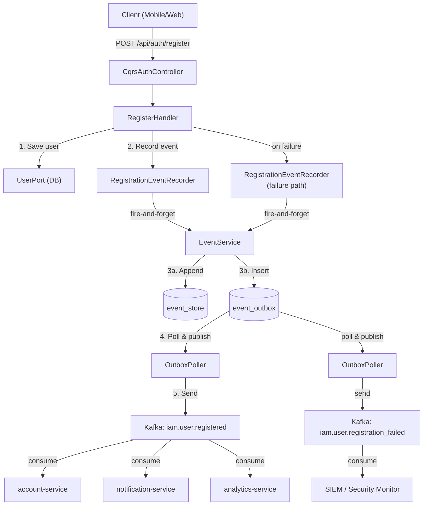
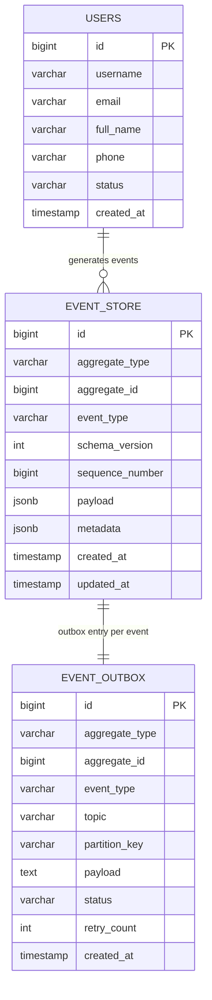
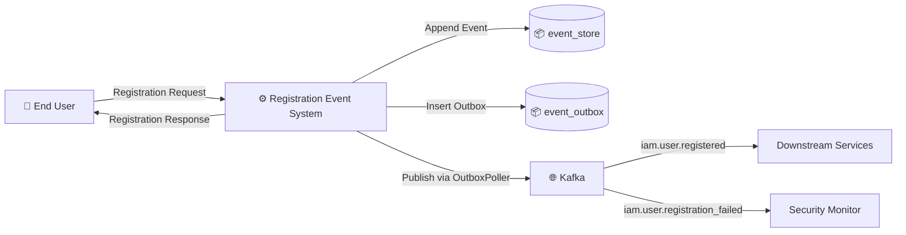
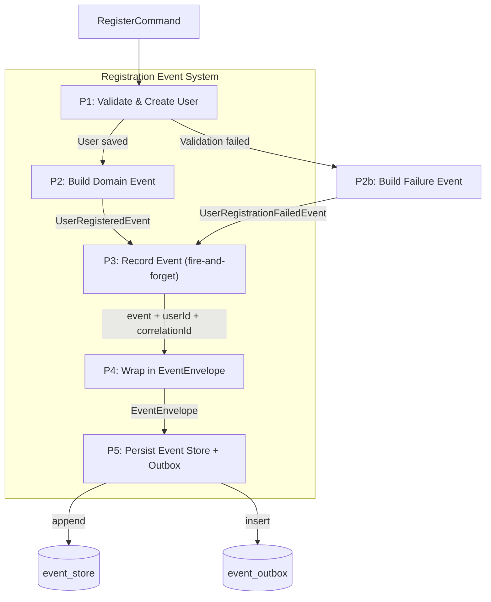
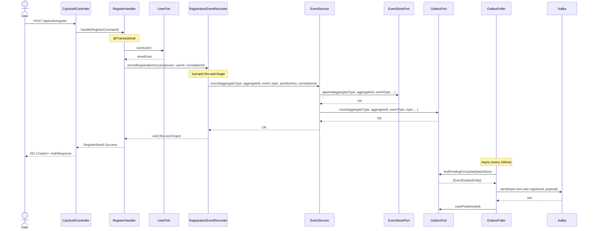
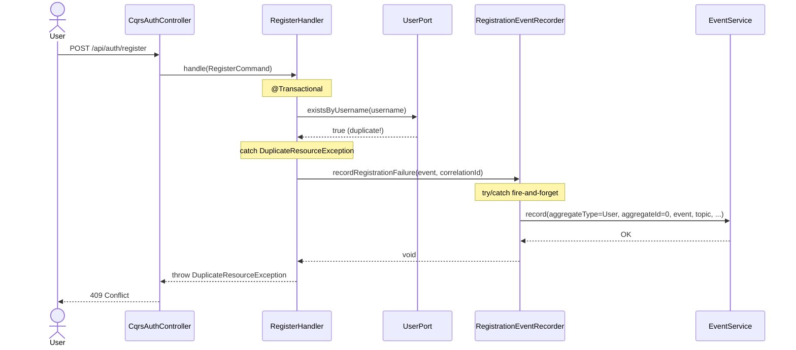

# Đặc tả kỹ thuật: User Registration Event

> Technical specification chi tiết — thiết kế để agent có thể đọc và dev code trực tiếp.

---

## 1. Tổng quan hệ thống (System Overview)

### 1.1 Kiến trúc tổng thể



### 1.2 Technology Stack

| Layer | Technology | Version | Ghi chú |
|-------|-----------|---------|---------|
| Language | Kotlin | 1.9+ | JVM 21 |
| Framework | Spring Boot | 4.x | Spring Framework 6.x |
| Database | PostgreSQL | 15+ | event_store, event_outbox tables |
| Cache | Redis | 7.x | Not used for events |
| Message Queue | Apache Kafka | 3.x | iam.user.registered, iam.user.registration_failed topics |
| CQRS | eventsourcing-utils | 0.0.1-SNAPSHOT | Custom Command/CommandHandler interfaces |

### 1.3 Dependencies & Integrations

| Dependency | Type | Purpose | Interface |
|-----------|------|---------|-----------|
| EventService | Internal | Event store + outbox recording | `EventService.record()` method |
| EventStorePort | Internal | Event store append | Outbound port interface |
| OutboxPort | Internal | Outbox insert | Outbound port interface |
| OutboxPoller | Internal | Async Kafka relay | @Scheduled polling |
| DomainEvent interface | Internal | Event type marker | Interface with eventType property |
| RegisterHandler | Internal | Caller of event recording | CQRS command handler |

---

## 2. Lược đồ dữ liệu (Data Schema)

### 2.1 Entity-Relationship Diagram



### 2.2 Domain Event Classes

#### UserRegisteredEvent (EXISTING — no changes needed)

| Field | Type | Constraint | Default | Mô tả |
|-------|------|-----------|---------|--------|
| `userId` | `Long` | NOT NULL | - | ID of newly created user |
| `username` | `String` | NOT NULL | - | Username chosen by user |
| `email` | `String` | NOT NULL | - | Email address |
| `fullName` | `String` | NOT NULL | - | Full name |
| `phone` | `String?` | NULLABLE | null | Phone number |
| `domainCode` | `String` | NOT NULL | - | Domain code (multi-tenancy) |
| `domainId` | `Long?` | NULLABLE | null | Domain entity ID |
| `status` | `String` | NOT NULL | "ACTIVE" | User status after registration |
| `registrationSource` | `String` | NOT NULL | - | "DIRECT" or "ANONYMOUS_PROMOTION" |
| `ipAddress` | `String?` | NULLABLE | null | Client IP address |
| `userAgent` | `String?` | NULLABLE | null | Client user agent string |
| **eventType** | `String` | NOT NULL | "iam.user.registered" | DomainEvent type identifier |

#### UserRegistrationFailedEvent (NEW)

| Field | Type | Constraint | Default | Mô tả |
|-------|------|-----------|---------|--------|
| `usernameAttempted` | `String` | NOT NULL | - | Username that was attempted |
| `emailAttempted` | `String` | NOT NULL | - | Email that was attempted |
| `domainCode` | `String` | NOT NULL | - | Domain code attempted |
| `failureReason` | `RegistrationFailureReason` | NOT NULL | - | Classified failure reason |
| `errorMessage` | `String?` | NULLABLE | null | Human-readable error detail |
| `ipAddress` | `String?` | NULLABLE | null | Client IP address |
| `userAgent` | `String?` | NULLABLE | null | Client user agent string |
| **eventType** | `String` | NOT NULL | "iam.user.registration_failed" | DomainEvent type identifier |

#### RegistrationFailureReason (NEW enum)

| Value | Mô tả |
|-------|--------|
| `DUPLICATE_USERNAME` | Username already exists |
| `DUPLICATE_EMAIL` | Email already exists |
| `INVALID_DOMAIN` | Domain code not found or inactive |
| `WEAK_PASSWORD` | Password does not meet policy requirements |
| `VALIDATION_ERROR` | Input validation failure (other) |
| `UNKNOWN` | Unexpected error during registration |

### 2.3 Database — No Migration Needed

No new database tables or columns required. The existing `event_store` and `event_outbox` tables handle all event types generically via JSON payload.

```sql
-- event_store table already exists (V6__create_event_store_table.sql)
-- event_outbox table already exists (V7__create_event_outbox_table.sql)
-- No migration needed — new event types stored as JSON in payload column
```

---

## 3. Luồng dữ liệu (Data Flow)

### 3.1 Data Flow Diagram — Level 0 (Context)



### 3.2 Data Flow Diagram — Level 1 (chi tiết)



### 3.3 Data Transformation Rules

| # | Input | Process | Output | Validation Rules |
|---|-------|---------|--------|-----------------|
| 1 | `RegisterCommand.username` | Direct mapping | `UserRegisteredEvent.username` | NOT NULL |
| 2 | `RegisterCommand.email` | Direct mapping | `UserRegisteredEvent.email` | NOT NULL, valid email format |
| 3 | `RegisterCommand.anonymousSessionId` | Classification | `UserRegisteredEvent.registrationSource` | "ANONYMOUS_PROMOTION" if present, else "DIRECT" |
| 4 | `DuplicateResourceException("User", "username", ...)` | Classification | `RegistrationFailureReason.DUPLICATE_USERNAME` | Exception type matching |
| 5 | `DuplicateResourceException("User", "email", ...)` | Classification | `RegistrationFailureReason.DUPLICATE_EMAIL` | Field name matching |
| 6 | `ResourceNotFoundException("Domain", ...)` | Classification | `RegistrationFailureReason.INVALID_DOMAIN` | Exception type matching |

---

## 4. Luồng xử lý (Processing Steps)

### 4.1 Sequence Diagram — UC-001: Record Successful Registration Event



### 4.2 Sequence Diagram — UC-002: Record Failed Registration Event



### 4.3 Bảng Step xử lý chi tiết

#### UC-001: Record Successful Registration Event

| Step | Component | Action | Input | Output | Error Handling | Ghi chú |
|------|-----------|--------|-------|--------|---------------|---------|
| 1 | RegisterHandler | Validate uniqueness | RegisterCommand | Unique check passed | DuplicateResourceException → UC-002 | Existing logic |
| 2 | RegisterHandler | Create and save user | RegisterCommand | Saved User entity | DB error → rollback | Existing logic |
| 3 | RegisterHandler | Build UserRegisteredEvent | User + Command data | UserRegisteredEvent instance | - | 11 fields mapped |
| 4 | RegisterHandler | Call RegistrationEventRecorder | event, userId, correlationId | void | - | Fire-and-forget delegation |
| 5 | RegistrationEventRecorder | Call EventService.record() | event, aggregateType, topic, etc. | Event persisted | try/catch → log.warn | Fire-and-forget |
| 6 | EventService | Wrap in EventEnvelope | event | EventEnvelope | - | UUID id, correlationId |
| 7 | EventService | Append to event store | EventEnvelope JSON | EventStoreEntity | Exception propagated | Same TX |
| 8 | EventService | Insert into outbox | EventEnvelope JSON | EventOutboxEntity | Exception propagated | Same TX |

#### UC-002: Record Failed Registration Event

| Step | Component | Action | Input | Output | Error Handling | Ghi chú |
|------|-----------|--------|-------|--------|---------------|---------|
| 1 | RegisterHandler | Detect registration failure | Exception | Exception type identified | - | catch block |
| 2 | RegisterHandler | Classify failure reason | Exception type + message | RegistrationFailureReason enum | UNKNOWN for unrecognized | New logic |
| 3 | RegisterHandler | Build UserRegistrationFailedEvent | Command + failure reason | Event instance | - | 7 fields |
| 4 | RegisterHandler | Call RegistrationEventRecorder | event, correlationId | void | - | Fire-and-forget |
| 5 | RegistrationEventRecorder | Call EventService.record() | event, aggregateType=User, aggregateId=0L | Event persisted | try/catch → log.warn | Fire-and-forget |
| 6 | RegisterHandler | Rethrow original exception | Exception | - | Normal exception flow | Unchanged behavior |

---

## 5. Luồng màn hình (Screen Flow)

### 5.1 Screen Map

```
N/A — Backend-only feature.
No new screens or UI components needed.
Registration events are observable via:
- GET /api/internal/events/User/{id} (existing admin API)
- Kafka consumer applications
- Application log search (REGISTER_EVENT_RECORDED / log.warn patterns)
```

### 5.2 Chi tiết từng Screen

| Screen ID | Tên | Mục đích | Data hiển thị | User Actions | Navigation |
|-----------|-----|----------|--------------|-------------|-----------|
| N/A | N/A | N/A — backend event infrastructure only | N/A | N/A | N/A |

---

## 6. API Specification

### 6.1 Endpoint List

| # | Method | Path | Description | Auth | Request Body | Response |
|---|--------|------|------------|------|-------------|----------|
| 1 | `POST` | `/api/auth/register` | User registration (existing — triggers event recording) | None (public) | RegisterRequest | AuthResponse (201) |
| 2 | `GET` | `/api/internal/events/User/{id}` | Query events for user (existing) | Admin JWT | - | List<EventStoreEntity> |

**No new API endpoints needed.** Events are published to Kafka topics:
- `iam.user.registered` — successful registration events
- `iam.user.registration_failed` — failed registration events

### 6.2 Kafka Event Payloads

#### Topic: iam.user.registered

**Payload (EventEnvelope<UserRegisteredEvent>):**
```json
{
  "id": "550e8400-e29b-41d4-a716-446655440000",
  "type": "iam.user.registered",
  "source": "auth-service",
  "specversion": "1.0",
  "time": "2025-08-22T10:30:00Z",
  "correlationId": "req-abc-123",
  "schemaVersion": 1,
  "data": {
    "userId": 12345,
    "username": "john.doe",
    "email": "john@example.com",
    "fullName": "John Doe",
    "phone": "+84123456789",
    "domainCode": "default",
    "domainId": 1,
    "status": "ACTIVE",
    "registrationSource": "DIRECT",
    "ipAddress": "192.168.1.1",
    "userAgent": "Mozilla/5.0 ..."
  }
}
```

#### Topic: iam.user.registration_failed

**Payload (EventEnvelope<UserRegistrationFailedEvent>):**
```json
{
  "id": "660e8400-e29b-41d4-a716-446655440001",
  "type": "iam.user.registration_failed",
  "source": "auth-service",
  "specversion": "1.0",
  "time": "2025-08-22T10:31:00Z",
  "correlationId": "req-def-456",
  "schemaVersion": 1,
  "data": {
    "usernameAttempted": "john.doe",
    "emailAttempted": "john@example.com",
    "domainCode": "default",
    "failureReason": "DUPLICATE_USERNAME",
    "errorMessage": "User with username 'john.doe' already exists",
    "ipAddress": "192.168.1.1",
    "userAgent": "Mozilla/5.0 ..."
  }
}
```

### 6.3 Error Response Format (RFC 7807)

| HTTP Status | Error Type | Khi nào |
|-------------|-----------|---------|
| 400 | Validation Error | Input không hợp lệ (missing fields, bad format) |
| 409 | Conflict | Duplicate username or email |
| 404 | Not Found | Domain code not found |
| 422 | Unprocessable Entity | Weak password (policy violation) |
| 500 | Internal Server Error | Event recording infrastructure error (should not reach client due to fire-and-forget) |

---

## 7. Security Considerations

### 7.1 Sensitive Data Exclusion

**CRITICAL**: UserRegistrationFailedEvent MUST NOT contain password data. The `password` field from RegisterCommand is NEVER included in any event payload.

Fields included in failure events:
- ✅ `usernameAttempted` — needed for monitoring
- ✅ `emailAttempted` — needed for monitoring
- ✅ `failureReason` — needed for classification
- ❌ `password` — NEVER included
- ❌ `passwordHash` — NEVER included

### 7.2 Authorization Matrix

| Role | Register (POST /api/auth/register) | Query Events (GET /api/internal/events) | Consume Kafka |
|------|:---:|:---:|:---:|
| Public | ✅ | ❌ | ❌ |
| User | ✅ | ❌ | ❌ |
| Admin | ✅ | ✅ | ❌ |
| Service Account | ❌ | ❌ | ✅ |

### 7.3 Data Protection

- Event payloads in event_store are stored as JSONB in PostgreSQL — follow existing encryption-at-rest policies
- Kafka messages are transmitted via configured Kafka security settings (SASL/TLS if configured)
- PII data (email, phone, IP) in event payloads follows same retention policy as event_store table

---

## 8. Performance Requirements

| Metric | Target | Measurement Method |
|--------|--------|-------------------|
| Event recording overhead | < 20ms added to registration latency | APM tracing on EventService.record() |
| Outbox polling throughput | Matches registration rate (100+ events/sec) | OutboxPoller metrics |
| End-to-end event delivery | < 5 seconds from registration to Kafka | Consumer lag monitoring |
| Event store query time | < 200ms for user with < 100 events | Slow query log |

---

## 9. Agent Implementation Notes

> **Section này dành cho AI agent** — chỉ rõ code cần tạo để agent dev trực tiếp.

### 9.1 Classes to Create

| # | Class | Package | Type | Extends/Implements | Mô tả |
|---|-------|---------|------|-------------------|--------|
| 1 | `RegistrationEventRecorder` | `auth.application.event` | @Component | - | Fire-and-forget helper for registration event recording |
| 2 | `UserRegistrationFailedEvent` | `auth.domain.event` | data class | DomainEvent | Domain event for failed registration attempts |
| 3 | `RegistrationFailureReason` | `auth.domain.event` | enum class | - | Classification of registration failure reasons |

### 9.2 Classes to Modify

| # | Class | Package | Change | Mô tả |
|---|-------|---------|--------|--------|
| 1 | `RegisterHandler` | `auth.application.command` | Modify | Replace direct EventService.record() call with RegistrationEventRecorder.recordRegistrationSuccess(); Add catch blocks to call RegistrationEventRecorder.recordRegistrationFailure() |

### 9.3 Pattern References

| Pattern | Reference | Ghi chú |
|---------|----------|---------|
| Event Recorder pattern | `auth.application.event.LoginEventRecorder` | Follow EXACTLY: @Component, inject EventService, try/catch, log.debug/log.warn |
| Domain Event pattern | `auth.domain.event.UserLoggedInEvent` | Follow: data class, implements DomainEvent, override eventType with dot-notation |
| Failure Event pattern | `auth.domain.event.UserLoginFailedEvent` | Follow: nullable userId (aggregateId=0L for unknown users), failure reason enum |
| Failure Reason Enum | `auth.domain.event.LoginFailureReason` | Follow: descriptive enum values with KDoc documentation |
| Fire-and-forget | `auth.application.event.TokenEventRecorder` | try/catch all EventService.record() calls, log.warn on failure |

### 9.4 Detailed Class Specifications

#### RegistrationEventRecorder

```kotlin
// File: auth/application/event/RegistrationEventRecorder.kt
// Pattern: EXACTLY like LoginEventRecorder
@Component
class RegistrationEventRecorder(
    private val eventService: EventService
) {
    private val log = LoggerFactory.getLogger(RegistrationEventRecorder::class.java)

    fun recordRegistrationSuccess(event: UserRegisteredEvent, userId: Long, correlationId: String?) {
        try {
            eventService.record(
                aggregateType = "User",
                aggregateId = userId,
                event = event,
                topic = "iam.user.registered",
                partitionKey = userId.toString(),
                correlationId = correlationId
            )
            log.debug("Registration success event recorded: userId={}, domain={}, source={}, correlationId={}",
                userId, event.domainCode, event.registrationSource, correlationId)
        } catch (e: Exception) {
            log.warn("Failed to record registration success event: userId={}, error={}",
                userId, e.message, e)
        }
    }

    fun recordRegistrationFailure(event: UserRegistrationFailedEvent, correlationId: String?) {
        try {
            eventService.record(
                aggregateType = "User",
                aggregateId = 0L,
                event = event,
                topic = "iam.user.registration_failed",
                partitionKey = event.usernameAttempted,
                correlationId = correlationId
            )
            log.debug("Registration failure event recorded: username={}, reason={}, correlationId={}",
                event.usernameAttempted, event.failureReason, correlationId)
        } catch (e: Exception) {
            log.warn("Failed to record registration failure event: username={}, reason={}, error={}",
                event.usernameAttempted, event.failureReason, e.message, e)
        }
    }
}
```

#### UserRegistrationFailedEvent

```kotlin
// File: auth/domain/event/UserRegistrationFailedEvent.kt
// Pattern: EXACTLY like UserLoginFailedEvent
data class UserRegistrationFailedEvent(
    val usernameAttempted: String,
    val emailAttempted: String,
    val domainCode: String,
    val failureReason: RegistrationFailureReason,
    val errorMessage: String?,
    val ipAddress: String?,
    val userAgent: String?
) : DomainEvent {
    override val eventType: String = "iam.user.registration_failed"
}
```

#### RegistrationFailureReason

```kotlin
// File: auth/domain/event/RegistrationFailureReason.kt
// Pattern: Similar to LoginFailureReason
enum class RegistrationFailureReason {
    DUPLICATE_USERNAME,
    DUPLICATE_EMAIL,
    INVALID_DOMAIN,
    WEAK_PASSWORD,
    VALIDATION_ERROR,
    UNKNOWN
}
```

### 9.5 RegisterHandler Modification

```kotlin
// CURRENT code to REPLACE in RegisterHandler.handle():
// eventService.record(
//     aggregateType = "User",
//     aggregateId = savedUser.id.value,
//     event = UserRegisteredEvent(...),
//     ...
// )

// REPLACE WITH:
// registrationEventRecorder.recordRegistrationSuccess(
//     event = UserRegisteredEvent(...),
//     userId = savedUser.id.value,
//     correlationId = command.correlationId
// )

// ADD catch blocks:
// } catch (e: DuplicateResourceException) {
//     registrationEventRecorder.recordRegistrationFailure(
//         event = UserRegistrationFailedEvent(
//             usernameAttempted = command.username,
//             emailAttempted = command.email,
//             domainCode = command.domainCode,
//             failureReason = classifyFailureReason(e),
//             errorMessage = e.message,
//             ipAddress = command.ipAddress,
//             userAgent = command.userAgent
//         ),
//         correlationId = command.correlationId
//     )
//     throw e // rethrow original exception
// }
```

### 9.6 Integration Points

| Integration | Type | Protocol | Endpoint | Data Format |
|------------|------|----------|----------|------------|
| EventService.record() | Sync (same TX) | Method call | `EventService.record()` | DomainEvent → EventEnvelope JSON |
| Kafka (iam.user.registered) | Async | Kafka | Topic: `iam.user.registered` | EventEnvelope JSON |
| Kafka (iam.user.registration_failed) | Async | Kafka | Topic: `iam.user.registration_failed` | EventEnvelope JSON |
| Event Store Query | Sync | REST | GET `/api/internal/events/User/{id}` | JSON |

### 9.7 Test Cases (high-level)

| # | Test | Type | Scenario | Expected |
|---|------|------|----------|----------|
| 1 | Registration success event recorded | Integration | Valid registration → event in event_store | event_store has entry with event_type=iam.user.registered |
| 2 | Registration success event in outbox | Integration | Valid registration → outbox entry | event_outbox has PENDING entry with topic=iam.user.registered |
| 3 | Event payload enriched | Unit | Build UserRegisteredEvent from RegisterCommand + User | All 11 fields populated correctly |
| 4 | Fire-and-forget on EventService failure | Unit | EventService.record() throws → registration still succeeds | User created, log.warn emitted, no exception to caller |
| 5 | Failure event for duplicate username | Integration | Register with existing username | event_store has entry with event_type=iam.user.registration_failed, failureReason=DUPLICATE_USERNAME |
| 6 | Failure event for duplicate email | Integration | Register with existing email | RegistrationFailureReason.DUPLICATE_EMAIL in event |
| 7 | Failure event for invalid domain | Integration | Register with non-existent domain | RegistrationFailureReason.INVALID_DOMAIN in event |
| 8 | Correlation ID threading | Integration | Register with X-Correlation-ID header | Same correlationId in event envelope |
| 9 | EventEnvelope compliance | Unit | Record event → check envelope | Has UUID id, type, source=auth-service, specversion=1.0, schemaVersion=1 |
| 10 | Password excluded from events | Unit | All event payloads | Neither success nor failure events contain password/passwordHash |

---

## 10. Downstream Consumer Documentation

### 10.1 Expected Consumers for `iam.user.registered`

| Consumer | Service | Reaction | Priority |
|----------|---------|----------|----------|
| User Profile Provisioning | account-service | Create default user profile with name, email, avatar placeholder | Must |
| Welcome Notification | notification-service | Send welcome email / push notification | Should |
| Analytics Tracking | analytics-service | Track new user registration (source, domain, device) | Nice |
| Audit Log | admin-service / SIEM | Persist registration event in compliance audit log | Should |
| Permission Bootstrap | rbac-service | Assign default role/permissions for new user in domain | Must |

### 10.2 Expected Consumers for `iam.user.registration_failed`

| Consumer | Service | Reaction | Priority |
|----------|---------|----------|----------|
| Security Monitoring | SIEM | Alert on high failure rate (potential brute-force registration attack) | Must |
| Rate Limiting | auth-service (internal) | Track failure rate per IP for rate limiting | Should |
| Analytics | analytics-service | Track registration funnel drop-offs | Nice |

### 10.3 Schema Versioning Strategy

1. **Current schema version**: 1 (set in EventEnvelope.schemaVersion)
2. **Backward-compatible changes only**: New optional fields can be added (consumers ignore unknown fields)
3. **Breaking changes**: Require new event type (e.g., `iam.user.registered.v2`) or event upcaster
4. **Consumer contract**: Consumers MUST handle missing optional fields gracefully (null/default values)

---

> **Traceability**: Research Brief → Business Analysis → **Technical Spec** → Implementation
> **Ready for**: `/wf_pre_openspec` hoặc `/wf_openspec` hoặc direct coding
